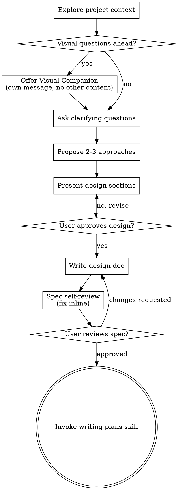
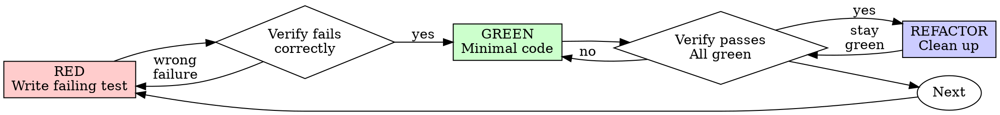
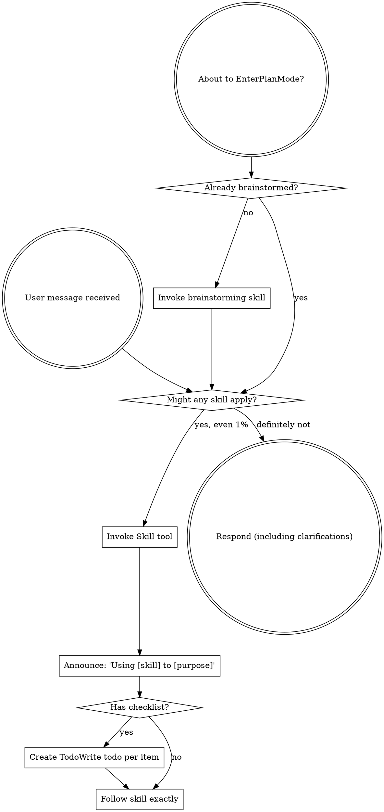

# Codex Exec Transcript

- Command: codex exec --model gpt-5.4 --config model_reasoning_effort="medium" --sandbox danger-full-access --config approval_policy="never" --cd c:\Users\ben.jones\Repos\toolbAX --output-last-message c:\Users\ben.jones\Repos\toolbAX\.ralph\runs\[redacted] -
- Workspace root: c:\Users\ben.jones\Repos\toolbAX
- Execution root: c:\Users\ben.jones\Repos\toolbAX
- Prompt path: c:\Users\ben.jones\Repos\toolbAX\.ralph\artifacts\iteration-002\prompt.md
- Prompt hash: sha256:73a58e9be26255a0d5b2ee9bfdf0911ae967bb19bda6bdf9e0b0069a8b20a022
- Prompt bytes: 8978
- Reasoning effort: medium
- Stdin hash: sha256:73a58e9be26255a0d5b2ee9bfdf0911ae967bb19bda6bdf9e0b0069a8b20a022
- Payload matched prompt artifact: yes
- Last message path: c:\Users\ben.jones\Repos\toolbAX\.ralph\runs\[redacted]
- Exit code: 0

## Stdout

**Changed Files**
- [DualWriteMapBrowserViewModel.cs](c:/Users/ben.jones/Repos/toolbAX/plugins/DualWriteMapBrowser/DualWriteMapBrowserViewModel.cs:78): added an internal constructor overload so the Testify settings flow can be exercised against an injected `TestifyConfigurationStore` in tests.
- [[redacted]](c:/Users/ben.jones/Repos/toolbAX/plugins/DualWriteMapBrowser/[redacted]:30): moved `_testifyConfigStore` initialization to the constructor-backed seam.
- [[redacted]](c:/Users/ben.jones/Repos/toolbAX/plugins/DualWriteMapBrowser/[redacted]:155): removed `ConfigureAwait(false)` from the WPF view-model settings load/save path so property updates stay on the captured context.
- [[redacted]](c:/Users/ben.jones/Repos/toolbAX/tests/FoToolbox.Tests/[redacted]:13): added a regression test covering selected-map load, switching to a second map, save, and reload through a fresh view-model instance.

**Validation Results**
- `dotnet test .\tests\FoToolbox.Tests\FoToolbox.Tests.csproj -c Release --no-restore --filter [redacted]`
  Result: build/test discovery succeeded, but execution aborted because this machine is missing the x64 `Microsoft.AspNetCore.App 8.0` runtime for `testhost.exe`.
- `dotnet build .\FoToolbox.sln -c Release`
  Result: passed with 0 warnings and 0 errors.

**Assumptions / Blockers**
- The repo already contained the Testify settings UI work from the prior Ralph iteration; this slice focused on the missing test seam and runtime-safe async behavior.
- Full test execution is still blocked locally by the missing x64 ASP.NET Core 8 runtime.
- I did not touch `.ralph/tasks.json` or `.ralph/progress.md`.

**Known Limitations / Follow-up**
- After installing the x64 `Microsoft.AspNetCore.App 8.0` runtime, rerun the new targeted test and then the broader `dotnet test` suite.
- Manual WPF smoke verification is still pending for the toolbar-to-panel path in the running app.

```json
{
  "selectedTaskId": "T1",
  "requestedStatus": "in_progress",
  "progressNote": "Added a testable TestifyConfigurationStore injection seam for DualWriteMapBrowserViewModel, removed ConfigureAwait(false) from the WPF Testify settings load/save path, and added a regression test covering per-map settings load, map switching, save, and reload across a fresh view-model instance. Release solution build passed.",
  "blocker": "Targeted test execution is blocked on this machine because testhost.exe requires the x64 Microsoft.AspNetCore.App 8.0 runtime, which is not installed.",
  "validationRan": "dotnet test .\\tests\\FoToolbox.Tests\\FoToolbox.Tests.csproj -c Release --no-restore --filter [redacted]; dotnet build .\\FoToolbox.sln -c Release"
}
```


## Stderr

ot while storing Ralph artifacts under .ralph there.
- Manifests: global.json, FoToolbox.sln
- Package managers: dotnet
- Package manager indicators: global.json, FoToolbox.sln
- Test roots: tests
- Validation commands: dotnet test, dotnet test .\FoToolbox.sln -c Release --no-build --collect:"XPlat Code Coverage"
- Test signals: dotnet test is likely available., README.md may define the canonical build/test commands., Detected test roots: tests.

## Ralph Runtime Context
- Prompt target: cliExec
- Current iteration number: 2
- Next iteration recorded in state: 2
- Last prompt kind: bootstrap
- Last prompt path: .ralph/prompts/bootstrap-001.prompt.md
- Last run: succeeded at iteration 1
- Last iteration outcome: partial_progress at iteration 1
- Last iteration summary: Selected T1: Testify configuration settings panel | Execution: succeeded | Verification: passed | Outcome: partial_progress | Backlog remaining: 6

## Task Plan
- Reasoning: This task matters because it removes a manual JSON-edit workflow from Testify and makes per-map configuration a first-class part of the DualWriteMapBrowser UI, which improves usability and reduces configuration errors. The key challenge is wiring a new WPF settings surface into the existing toolbar and map-selection flow while keeping edits correctly bound to the currently selected map and persisted through the existing TestifyConfigurationStore without introducing schema or reload regressions.
- Approach: Add a toolbar entry that opens a WPF per-map settings panel bound to the selected map’s Testify configuration model, then save and reload those values through the existing configuration store path.
- Steps: Inspect DualWriteMapBrowser, the existing Testify toolbar commands, and TestifyConfigurationStore to find the current entry points for toolbar actions, selected-map context, and config load/save. → Identify the in-memory model that represents per-map settings and confirm where omitCreateFields, preferredCreateValues, cePollTimeoutMinutes, and allowPartialEnumCoverage are currently read from configuration. → Design and add a WPF panel or dialog within DualWriteMapBrowser that exposes editable controls for those four per-map settings and binds them to the currently selected map. → Wire the panel launch into the existing Testify toolbar so users can reach it directly from the browser without opening the JSON file. → Implement save/update logic so panel edits write back to the selected map configuration and persist through TestifyConfigurationStore using the same serialization path as normal configuration saves.
- Risks: The selected-map context may not be cleanly exposed to the toolbar command, making it easy to save settings against the wrong map.; Existing configuration serialization may treat missing versus empty values differently, especially for omitCreateFields and preferredCreateValues.; If the current UI layer is not MVVM-friendly, adding a panel quickly can lead to brittle code-behind and harder-to-test persistence behavior.
- Suggested validation: dotnet test

## Task Focus
- Backlog counts: todo 5, in_progress 1, blocked 0, done 0
- Next actionable task: T1 (in_progress)
- Selected task id: T1
- Title: Testify configuration settings panel
- Status: in_progress
- Parent task: none
- Dependencies: none
- Direct children: none
- Remaining descendants: none
- Task validation hint: dotnet build .\FoToolbox.sln -c Release
- Effective validation command: dotnet build .\FoToolbox.sln -c Release
- Validation command normalized from: none
- Notes: none
- Blocker: none
- Acceptance criteria: (1) Per-map settings (omitCreateFields, preferredCreateValues, cePollTimeoutMinutes, allowPartialEnumCoverage) are editable in a WPF panel inside DualWriteMapBrowser (2) Changes persist to TestifyConfigurationStore and reload correctly on next launch (3) Panel is reachable from the existing Testify toolbar without opening the JSON file
- Constraints: none
- Relevant files: plugins/DualWriteMapBrowser/TestifyConfigurationStore.cs, plugins/DualWriteMapBrowser/[redacted]
- Task-local code context: plugins/DualWriteMapBrowser/TestifyConfigurationStore.cs, plugins/DualWriteMapBrowser/[redacted]

## Recent Progress
# Progress
- Ralph workspace initialized.
- Use this file for durable progress notes between fresh Codex runs.

## Prior Iteration Evidence
- Prior iteration: 1
- Prior outcome classification: partial_progress
- Prior execution / verification: succeeded / passed
- Prior summary: Selected T1: Testify configuration settings panel | Execution: succeeded | Verification: passed | Outcome: partial_progress | Backlog remaining: 6
- Additional prior-context signals omitted: 3.

codex
I’m reading `AGENTS.md`, the Ralph state files, and the required workflow skills first so I can resume `T1` from the existing implementation instead of rediscovering settled context.
exec
"C:\\Program Files\\PowerShell\\7\\pwsh.exe" -Command "Get-Content -Raw C:\\Users\\ben.jones\\.codex\\superpowers\\skills\\verification-before-completion\\SKILL.md" in c:\Users\ben.jones\Repos\toolbAX
exec
"C:\\Program Files\\PowerShell\\7\\pwsh.exe" -Command "Get-Content -Raw C:\\Users\\ben.jones\\.codex\\superpowers\\skills\\test-driven-development\\SKILL.md" in c:\Users\ben.jones\Repos\toolbAX
exec
"C:\\Program Files\\PowerShell\\7\\pwsh.exe" -Command 'Get-ChildItem -Path . -Filter AGENTS.md -Recurse | Select-Object -ExpandProperty FullName' in c:\Users\ben.jones\Repos\toolbAX
exec
"C:\\Program Files\\PowerShell\\7\\pwsh.exe" -Command "Get-Content -Raw C:\\Users\\ben.jones\\.codex\\superpowers\\skills\\brainstorming\\SKILL.md" in c:\Users\ben.jones\Repos\toolbAX
exec
"C:\\Program Files\\PowerShell\\7\\pwsh.exe" -Command "Get-Content -Raw C:\\Users\\ben.jones\\.codex\\superpowers\\skills\\using-superpowers\\SKILL.md" in c:\Users\ben.jones\Repos\toolbAX
 succeeded in 2129ms:
---
name: brainstorming
description: "You MUST use this before any creative work - creating features, building components, adding functionality, or modifying behavior. Explores user intent, requirements and design before implementation."
---

# Brainstorming Ideas Into Designs

Help turn ideas into fully formed designs and specs through natural collaborative dialogue.

Start by understanding the current project context, then ask questions one at a time to refine the idea. Once you understand what you're building, present the design and get user approval.

<HARD-GATE>
Do NOT invoke any implementation skill, write any code, scaffold any project, or take any implementation action until you have presented a design and the user has approved it. This applies to EVERY project regardless of perceived simplicity.
</HARD-GATE>

## Anti-Pattern: "This Is Too Simple To Need A Design"

Every project goes through this process. A todo list, a single-function utility, a config change — all of them. "Simple" projects are where unexamined assumptions cause the most wasted work. The design can be short (a few sentences for truly simple projects), but you MUST present it and get approval.

## Checklist

You MUST create a task for each of these items and complete them in order:

1. **Explore project context** — check files, docs, recent commits
2. **Offer visual companion** (if topic will involve visual questions) — this is its own message, not combined with a clarifying question. See the Visual Companion section below.
3. **Ask clarifying questions** — one at a time, understand purpose/constraints/success criteria
4. **Propose 2-3 approaches** — with trade-offs and your recommendation
5. **Present design** — in sections scaled to their complexity, get user approval after each section
6. **Write design doc** — save to `docs/superpowers/specs/YYYY-MM-DD-<topic>-design.md` and commit
7. **Spec self-review** — quick inline check for placeholders, contradictions, ambiguity, scope (see below)
8. **User reviews written spec** — ask user to review the spec file before proceeding
9. **Transition to implementation** — invoke writing-plans skill to create implementation plan

## Process Flow



**The terminal state is invoking writing-plans.** Do NOT invoke frontend-design, mcp-builder, or any other implementation skill. The ONLY skill you invoke after brainstorming is writing-plans.

## The Process

**Understanding the idea:**

- Check out the current project state first (files, docs, recent commits)
- Before asking detailed questions, assess scope: if the request describes multiple independent subsystems (e.g., "build a platform with chat, file storage, billing, and analytics"), flag this immediately. Don't spend questions refining details of a project that needs to be decomposed first.
- If the project is too large for a single spec, help the user decompose into sub-projects: what are the independent pieces, how do they relate, what order should they be built? Then brainstorm the first sub-project through the normal design flow. Each sub-project gets its own spec → plan → implementation cycle.
- For appropriately-scoped projects, ask questions one at a time to refine the idea
- Prefer multiple choice questions when possible, but open-ended is fine too
- Only one question per message - if a topic needs more exploration, break it into multiple questions
- Focus on understanding: purpose, constraints, success criteria

**Exploring approaches:**

- Propose 2-3 different approaches with trade-offs
- Present options conversationally with your recommendation and reasoning
- Lead with your recommended option and explain why

**Presenting the design:**

- Once you believe you understand what you're building, present the design
- Scale each section to its complexity: a few sentences if straightforward, up to 200-300 words if nuanced
- Ask after each section whether it looks right so far
- Cover: architecture, components, data flow, error handling, testing
- Be ready to go back and clarify if something doesn't make sense

**Design for isolation and clarity:**

- Break the system into smaller units that each have one clear purpose, communicate through well-defined interfaces, and can be understood and tested independently
- For each unit, you should be able to answer: what does it do, how do you use it, and what does it depend on?
- Can someone understand what a unit does without reading its internals? Can you change the internals without breaking consumers? If not, the boundaries need work.
- Smaller, well-bounded units are also easier for you to work with - you reason better about code you can hold in context at once, and your edits are more reliable when files are focused. When a file grows large, that's often a signal that it's doing too much.

**Working in existing codebases:**

- Explore the current structure before proposing changes. Follow existing patterns.
- Where existing code has problems that affect the work (e.g., a file that's grown too large, unclear boundaries, tangled responsibilities), include targeted improvements as part of the design - the way a good developer improves code they're working in.
- Don't propose unrelated refactoring. Stay focused on what serves the current goal.

## After the Design

**Documentation:**

- Write the validated design (spec) to `docs/superpowers/specs/YYYY-MM-DD-<topic>-design.md`
  - (User preferences for spec location override this default)
- Use elements-of-style:writing-clearly-and-concisely skill if available
- Commit the design document to git

**Spec Self-Review:**
After writing the spec document, look at it with fresh eyes:

1. **Placeholder scan:** Any "TBD", "TODO", incomplete sections, or vague requirements? Fix them.
2. **Internal consistency:** Do any sections contradict each other? Does the architecture match the feature descriptions?
3. **Scope check:** Is this focused enough for a single implementation plan, or does it need decomposition?
4. **Ambiguity check:** Could any requirement be interpreted two different ways? If so, pick one and make it explicit.

Fix any issues inline. No need to re-review — just fix and move on.

**User Review Gate:**
After the spec review loop passes, ask the user to review the written spec before proceeding:

> "Spec written and committed to `<path>`. Please review it and let me know if you want to make any changes before we start writing out the implementation plan."

Wait for the user's response. If they request changes, make them and re-run the spec review loop. Only proceed once the user approves.

**Implementation:**

- Invoke the writing-plans skill to create a detailed implementation plan
- Do NOT invoke any other skill. writing-plans is the next step.

## Key Principles

- **One question at a time** - Don't overwhelm with multiple questions
- **Multiple choice preferred** - Easier to answer than open-ended when possible
- **YAGNI ruthlessly** - Remove unnecessary features from all designs
- **Explore alternatives** - Always propose 2-3 approaches before settling
- **Incremental validation** - Present design, get approval before moving on
- **Be flexible** - Go back and clarify when something doesn't make sense

## Visual Companion

A browser-based companion for showing mockups, diagrams, and visual options during brainstorming. Available as a tool — not a mode. Accepting the companion means it's available for questions that benefit from visual treatment; it does NOT mean every question goes through the browser.

**Offering the companion:** When you anticipate that upcoming questions will involve visual content (mockups, layouts, diagrams), offer it once for consent:
> "Some of what we're working on might be easier to explain if I can show it to you in a web browser. I can put together mockups, diagrams, comparisons, and other visuals as we go. This feature is still new and can be token-intensive. Want to try it? (Requires opening a local URL)"

**This offer MUST be its own message.** Do not combine it with clarifying questions, context summaries, or any other content. The message should contain ONLY the offer above and nothing else. Wait for the user's response before continuing. If they decline, proceed with text-only brainstorming.

**Per-question decision:** Even after the user accepts, decide FOR EACH QUESTION whether to use the browser or the terminal. The test: **would the user understand this better by seeing it than reading it?**

- **Use the browser** for content that IS visual — mockups, wireframes, layout comparisons, architecture diagrams, side-by-side visual designs
- **Use the terminal** for content that is text — requirements questions, conceptual choices, tradeoff lists, A/B/C/D text options, scope decisions

A question about a UI topic is not automatically a visual question. "What does personality mean in this context?" is a conceptual question — use the terminal. "Which wizard layout works better?" is a visual question — use the browser.

If they agree to the companion, read the detailed guide before proceeding:
`skills/brainstorming/visual-companion.md`


 succeeded in 2408ms:
 succeeded in 2746ms:
---
name: test-driven-development
description: Use when implementing any feature or bugfix, before writing implementation code
---

# Test-Driven Development (TDD)

## Overview

Write the test first. Watch it fail. Write minimal code to pass.

**Core principle:** If you didn't watch the test fail, you don't know if it tests the right thing.

**Violating the letter of the rules is violating the spirit of the rules.**

## When to Use

**Always:**
- New features
- Bug fixes
- Refactoring
- Behavior changes

**Exceptions (ask your human partner):**
- Throwaway prototypes
- Generated code
- Configuration files

Thinking "skip TDD just this once"? Stop. That's rationalization.

## The Iron Law

```
NO PRODUCTION CODE WITHOUT A FAILING TEST FIRST
```

Write code before the test? Delete it. Start over.

**No exceptions:**
- Don't keep it as "reference"
- Don't "adapt" it while writing tests
- Don't look at it
- Delete means delete

Implement fresh from tests. Period.

## Red-Green-Refactor



### RED - Write Failing Test

Write one minimal test showing what should happen.

<Good>
```typescript
test('retries failed operations 3 times', async () => {
  let attempts = 0;
  const operation = () => {
    attempts++;
    if (attempts < 3) throw new Error('fail');
    return 'success';
  };

  const result = await retryOperation(operation);

  expect(result).toBe('success');
  expect(attempts).toBe(3);
});
```
Clear name, tests real behavior, one thing
</Good>

<Bad>
```typescript
test('retry works', async () => {
  const mock = jest.fn()
    .mockRejectedValueOnce(new Error())
    .mockRejectedValueOnce(new Error())
    .mockResolvedValueOnce('success');
  await retryOperation(mock);
  expect(mock).toHaveBeenCalledTimes(3);
});
```
Vague name, tests mock not code
</Bad>

**Requirements:**
- One behavior
- Clear name
- Real code (no mocks unless unavoidable)

### Verify RED - Watch It Fail

**MANDATORY. Never skip.**

```bash
npm test path/to/test.test.ts
```

Confirm:
- Test fails (not errors)
- Failure message is expected
- Fails because feature missing (not typos)

**Test passes?** You're testing existing behavior. Fix test.

**Test errors?** Fix error, re-run until it fails correctly.

### GREEN - Minimal Code

Write simplest code to pass the test.

<Good>
```typescript
async function retryOperation<T>(fn: () => Promise<T>): Promise<T> {
  for (let i = 0; i < 3; i++) {
    try {
      return await fn();
    } catch (e) {
      if (i === 2) throw e;
    }
  }
  throw new Error('unreachable');
}
```
Just enough to pass
</Good>

<Bad>
```typescript
async function retryOperation<T>(
  fn: () => Promise<T>,
  options?: {
    maxRetries?: number;
    backoff?: 'linear' | 'exponential';
    onRetry?: (attempt: number) => void;
  }
): Promise<T> {
  // YAGNI
}
```
Over-engineered
</Bad>

Don't add features, refactor other code, or "improve" beyond the test.

### Verify GREEN - Watch It Pass

**MANDATORY.**

```bash
npm test path/to/test.test.ts
```

Confirm:
- Test passes
- Other tests still pass
- Output pristine (no errors, warnings)

**Test fails?** Fix code, not test.

**Other tests fail?** Fix now.

### REFACTOR - Clean Up

After green only:
- Remove duplication
- Improve names
- Extract helpers

Keep tests green. Don't add behavior.

### Repeat

Next failing test for next feature.

## Good Tests

| Quality | Good | Bad |
|---------|------|-----|
| **Minimal** | One thing. "and" in name? Split it. | `test('validates email and domain and whitespace')` |
| **Clear** | Name describes behavior | `test('test1')` |
| **Shows intent** | Demonstrates desired API | Obscures what code should do |

## Why Order Matters

**"I'll write tests after to verify it works"**

Tests written after code pass immediately. Passing immediately proves nothing:
- Might test wrong thing
- Might test implementation, not behavior
- Might miss edge cases you forgot
- You never saw it catch the bug

Test-first forces you to see the test fail, proving it actually tests something.

**"I already manually tested all the edge cases"**

Manual testing is ad-hoc. You think you tested everything but:
- No record of what you tested
- Can't re-run when code changes
- Easy to forget cases under pressure
- "It worked when I tried it" ≠ comprehensive

Automated tests are systematic. They run the same way every time.

**"Deleting X hours of work is wasteful"**

Sunk cost fallacy. The time is already gone. Your choice now:
- Delete and rewrite with TDD (X more hours, high confidence)
- Keep it and add tests after (30 min, low confidence, likely bugs)

The "waste" is keeping code you can't trust. Working code without real tests is technical debt.

**"TDD is dogmatic, being pragmatic means adapting"**

TDD IS pragmatic:
- Finds bugs before commit (faster than debugging after)
- Prevents regressions (tests catch breaks immediately)
- Documents behavior (tests show how to use code)
- Enables refactoring (change freely, tests catch breaks)

"Pragmatic" shortcuts = debugging in production = slower.

**"Tests after achieve the same goals - it's spirit not ritual"**

No. Tests-after answer "What does this do?" Tests-first answer "What should this do?"

Tests-after are biased by your implementation. You test what you built, not what's required. You verify remembered edge cases, not discovered ones.

Tests-first force edge case discovery before implementing. Tests-after verify you remembered everything (you didn't).

30 minutes of tests after ≠ TDD. You get coverage, lose proof tests work.

## Common Rationalizations

| Excuse | Reality |
|--------|---------|
| "Too simple to test" | Simple code breaks. Test takes 30 seconds. |
| "I'll test after" | Tests passing immediately prove nothing. |
| "Tests after achieve same goals" | Tests-after = "what does this do?" Tests-first = "what should this do?" |
| "Already manually tested" | Ad-hoc ≠ systematic. No record, can't re-run. |
| "Deleting X hours is wasteful" | Sunk cost fallacy. Keeping unverified code is technical debt. |
| "Keep as reference, write tests first" | You'll adapt it. That's testing after. Delete means delete. |
| "Need to explore first" | Fine. Throw away exploration, start with TDD. |
| "Test hard = design unclear" | Listen to test. Hard to test = hard to use. |
| "TDD will slow me down" | TDD faster than debugging. Pragmatic = test-first. |
| "Manual test faster" | Manual doesn't prove edge cases. You'll re-test every change. |
| "Existing code has no tests" | You're improving it. Add tests for existing code. |

## Red Flags - STOP and Start Over

- Code before test
- Test after implementation
- Test passes immediately
- Can't explain why test failed
- Tests added "later"
- Rationalizing "just this once"
- "I already manually tested it"
- "Tests after achieve the same purpose"
- "It's about spirit not ritual"
- "Keep as reference" or "adapt existing code"
- "Already spent X hours, deleting is wasteful"
- "TDD is dogmatic, I'm being pragmatic"
- "This is different because..."

**All of these mean: Delete code. Start over with TDD.**

## Example: Bug Fix

**Bug:** Empty email accepted

**RED**
```typescript
test('rejects empty email', async () => {
  const result = await submitForm({ email: '' });
  expect(result.error).toBe('Email required');
});
```

**Verify RED**
```bash
$ npm test
FAIL: expected 'Email required', got undefined
```

**GREEN**
```typescript
function submitForm(data: FormData) {
  if (!data.email?.trim()) {
    return { error: 'Email required' };
  }
  // ...
}
```

**Verify GREEN**
```bash
$ npm test
PASS
```

**REFACTOR**
Extract validation for multiple fields if needed.

## Verification Checklist

Before marking work complete:

- [ ] Every new function/method has a test
- [ ] Watched each test fail before implementing
- [ ] Each test failed for expected reason (feature missing, not typo)
- [ ] Wrote minimal code to pass each test
- [ ] All tests pass
- [ ] Output pristine (no errors, warnings)
- [ ] Tests use real code (mocks only if unavoidable)
- [ ] Edge cases and errors covered

Can't check all boxes? You skipped TDD. Start over.

## When Stuck

| Problem | Solution |
|---------|----------|
| Don't know how to test | Write wished-for API. Write assertion first. Ask your human partner. |
| Test too complicated | Design too complicated. Simplify interface. |
| Must mock everything | Code too coupled. Use dependency injection. |
| Test setup huge | Extract helpers. Still complex? Simplify design. |

## Debugging Integration

Bug found? Write failing test reproducing it. Follow TDD cycle. Test proves fix and prevents regression.

Never fix bugs without a test.

## Testing Anti-Patterns

When adding mocks or test utilities, read @testing-anti-patterns.md to avoid common pitfalls:
- Testing mock behavior instead of real behavior
- Adding test-only methods to production classes
- Mocking without understanding dependencies

## Final Rule

```
Production code → test exists and failed first
Otherwise → not TDD
```

No exceptions without your human partner's permission.


 succeeded in 3007ms:
---
name: verification-before-completion
description: Use when about to claim work is complete, fixed, or passing, before committing or creating PRs - requires running verification commands and confirming output before making any success claims; evidence before assertions always
---

# Verification Before Completion

## Overview

Claiming work is complete without verification is dishonesty, not efficiency.

**Core principle:** Evidence before claims, always.

**Violating the letter of this rule is violating the spirit of this rule.**

## The Iron Law

```
NO COMPLETION CLAIMS WITHOUT FRESH VERIFICATION EVIDENCE
```

If you haven't run the verification command in this message, you cannot claim it passes.

## The Gate Function

```
BEFORE claiming any status or expressing satisfaction:

1. IDENTIFY: What command proves this claim?
2. RUN: Execute the FULL command (fresh, complete)
3. READ: Full output, check exit code, count failures
4. VERIFY: Does output confirm the claim?
   - If NO: State actual status with evidence
   - If YES: State claim WITH evidence
5. ONLY THEN: Make the claim

Skip any step = lying, not verifying
```

## Common Failures

| Claim | Requires | Not Sufficient |
|-------|----------|----------------|
| Tests pass | Test command output: 0 failures | Previous run, "should pass" |
| Linter clean | Linter output: 0 errors | Partial check, extrapolation |
| Build succeeds | Build command: exit 0 | Linter passing, logs look good |
| Bug fixed | Test original symptom: passes | Code changed, assumed fixed |
| Regression test works | Red-green cycle verified | Test passes once |
| Agent completed | VCS diff shows changes | Agent reports "success" |
| Requirements met | Line-by-line checklist | Tests passing |

## Red Flags - STOP

- Using "should", "probably", "seems to"
- Expressing satisfaction before verification ("Great!", "Perfect!", "Done!", etc.)
- About to commit/push/PR without verification
- Trusting agent success reports
- Relying on partial verification
- Thinking "just this once"
- Tired and wanting work over
- **ANY wording implying success without having run verification**

## Rationalization Prevention

| Excuse | Reality |
|--------|---------|
| "Should work now" | RUN the verification |
| "I'm confident" | Confidence ≠ evidence |
| "Just this once" | No exceptions |
| "Linter passed" | Linter ≠ compiler |
| "Agent said success" | Verify independently |
| "I'm tired" | Exhaustion ≠ excuse |
| "Partial check is enough" | Partial proves nothing |
| "Different words so rule doesn't apply" | Spirit over letter |

## Key Patterns

**Tests:**
```
✅ [Run test command] [See: 34/34 pass] "All tests pass"
❌ "Should pass now" / "Looks correct"
```

**Regression tests (TDD Red-Green):**
```
✅ Write → Run (pass) → Revert fix → Run (MUST FAIL) → Restore → Run (pass)
❌ "I've written a regression test" (without red-green verification)
```

**Build:**
```
✅ [Run build] [See: exit 0] "Build passes"
❌ "Linter passed" (linter doesn't check compilation)
```

**Requirements:**
```
✅ Re-read plan → Create checklist → Verify each → Report gaps or completion
❌ "Tests pass, phase complete"
```

**Agent delegation:**
```
✅ Agent reports success → Check VCS diff → Verify changes → Report actual state
❌ Trust agent report
```

## Why This Matters

From 24 failure memories:
- your human partner said "I don't believe you" - trust broken
- Undefined functions shipped - would crash
- Missing requirements shipped - incomplete features
- Time wasted on false completion → redirect → rework
- Violates: "Honesty is a core value. If you lie, you'll be replaced."

## When To Apply

**ALWAYS before:**
- ANY variation of success/completion claims
- ANY expression of satisfaction
- ANY positive statement about work state
- Committing, PR creation, task completion
- Moving to next task
- Delegating to agents

**Rule applies to:**
- Exact phrases
- Paraphrases and synonyms
- Implications of success
- ANY communication suggesting completion/correctness

## The Bottom Line

**No shortcuts for verification.**

Run the command. Read the output. THEN claim the result.

This is non-negotiable.


 succeeded in 3208ms:
---
name: using-superpowers
description: Use when starting any conversation - establishes how to find and use skills, requiring Skill tool invocation before ANY response including clarifying questions
---

<SUBAGENT-STOP>
If you were dispatched as a subagent to execute a specific task, skip this skill.
</SUBAGENT-STOP>

<EXTREMELY-IMPORTANT>
If you think there is even a 1% chance a skill might apply to what you are doing, you ABSOLUTELY MUST invoke the skill.

IF A SKILL APPLIES TO YOUR TASK, YOU DO NOT HAVE A CHOICE. YOU MUST USE IT.

This is not negotiable. This is not optional. You cannot rationalize your way out of this.
</EXTREMELY-IMPORTANT>

## Instruction Priority

Superpowers skills override default system prompt behavior, but **user instructions always take precedence**:

1. **User's explicit instructions** (CLAUDE.md, GEMINI.md, AGENTS.md, direct requests) — highest priority
2. **Superpowers skills** — override default system behavior where they conflict
3. **Default system prompt** — lowest priority

If CLAUDE.md, GEMINI.md, or AGENTS.md says "don't use TDD" and a skill says "always use TDD," follow the user's instructions. The user is in control.

## How to Access Skills

**In Claude Code:** Use the `Skill` tool. When you invoke a skill, its content is loaded and presented to you—follow it directly. Never use the Read tool on skill files.

**In Copilot CLI:** Use the `skill` tool. Skills are auto-discovered from installed plugins. The `skill` tool works the same as Claude Code's `Skill` tool.

**In Gemini CLI:** Skills activate via the `activate_skill` tool. Gemini loads skill metadata at session start and activates the full content on demand.

**In other environments:** Check your platform's documentation for how skills are loaded.

## Platform Adaptation

Skills use Claude Code tool names. Non-CC platforms: see `references/copilot-tools.md` (Copilot CLI), `references/codex-tools.md` (Codex) for tool equivalents. Gemini CLI users get the tool mapping loaded automatically via GEMINI.md.

# Using Skills

## The Rule

**Invoke relevant or requested skills BEFORE any response or action.** Even a 1% chance a skill might apply means that you should invoke the skill to check. If an invoked skill turns out to be wrong for the situation, you don't need to use it.



## Red Flags

These thoughts mean STOP—you're rationalizing:

| Thought | Reality |
|---------|---------|
| "This is just a simple question" | Questions are tasks. Check for skills. |
| "I need more context first" | Skill check comes BEFORE clarifying questions. |
| "Let me explore the codebase first" | Skills tell you HOW to explore. Check first. |
| "I can check git/files quickly" | Files lack conversation context. Check for skills. |
| "Let me gather information first" | Skills tell you HOW to gather information. |
| "This doesn't need a formal skill" | If a skill exists, use it. |
| "I remember this skill" | Skills evolve. Read current version. |
| "This doesn't count as a task" | Action = task. Check for skills. |
| "The skill is overkill" | Simple things become complex. Use it. |
| "I'll just do this one thing first" | Check BEFORE doing anything. |
| "This feels productive" | Undisciplined action wastes time. Skills prevent this. |
| "I know what that means" | Knowing the concept ≠ using the skill. Invoke it. |

## Skill Priority

When multiple skills could apply, use this order:

1. **Process skills first** (brainstorming, debugging) - these determine HOW to approach the task
2. **Implementation skills second** (frontend-design, mcp-builder) - these guide execution

"Let's build X" → brainstorming first, then implementation skills.
"Fix this bug" → debugging first, then domain-specific skills.

## Skill Types

**Rigid** (TDD, debugging): Follow exactly. Don't adapt away discipline.

**Flexible** (patterns): Adapt principles to context.

The skill itself tells you which.

## User Instructions

Instructions say WHAT, not HOW. "Add X" or "Fix Y" doesn't mean skip workflows.


codex
Using `brainstorming` to confirm the existing design boundary from the repo and Ralph state, then `test-driven-development` for the next slice. I’m checking whether a partial implementation already covers the UI shell so I only add the missing persistence and wiring.
exec
"C:\\Program Files\\PowerShell\\7\\pwsh.exe" -Command '$p = Get-ChildItem -Path . -Filter AGENTS.md -Recurse | Select-Object -First 1 -ExpandProperty FullName; if ($p) { Get-Content -Raw $p } else { '"'NO_AGENTS' }" in c:\Users\ben.jones\Repos\toolbAX
exec
"C:\\Program Files\\PowerShell\\7\\pwsh.exe" -Command 'Get-ChildItem .ralph -Recurse | Select-Object FullName' in c:\Users\ben.jones\Repos\toolbAX
exec
"C:\\Program Files\\PowerShell\\7\\pwsh.exe" -Command "Get-Content -Raw .ralph\\progress.md" in c:\Users\ben.jones\Repos\toolbAX
exec
"C:\\Program Files\\PowerShell\\7\\pwsh.exe" -Command "Get-Content -Raw .ralph\\tasks.json" in c:\Users\ben.jones\Repos\toolbAX
 succeeded in 2096ms:
{
  "version": 2,
  "tasks": [
    {
      "id": "T1",
      "title": "Testify configuration settings panel",
      "status": "in_progress",
      "validation": "dotnet build .\\FoToolbox.sln -c Release",
      "tier": "medium",
      "acceptance": [
        "Per-map settings (omitCreateFields, preferredCreateValues, cePollTimeoutMinutes, allowPartialEnumCoverage) are editable in a WPF panel inside DualWriteMapBrowser",
        "Changes persist to TestifyConfigurationStore and reload correctly on next launch",
        "Panel is reachable from the existing Testify toolbar without opening the JSON file"
      ],
      "context": [
        "plugins/DualWriteMapBrowser/TestifyConfigurationStore.cs",
        "plugins/DualWriteMapBrowser/[redacted]"
      ]
    },
    {
      "id": "T2",
      "title": "Testify automatic rollback on failure",
      "status": "todo",
      "dependsOn": [
        "T1"
      ],
      "validation": "dotnet test .\\FoToolbox.sln -c Release --filter Category=Testify",
      "tier": "medium",
      "acceptance": [
        "If PATCH or CE-verification fails after a successful POST, the created record is deleted automatically",
        "lastEntityInstanceUrl is cleared from TestifyConfigurationStore after rollback",
        "Cleanup phase returns success (no error) when a cached URL references a record already deleted externally"
      ],
      "context": [
        "plugins/DualWriteMapBrowser/TestifyRunner.cs",
        "plugins/DualWriteMapBrowser/[redacted]",
        "plugins/DualWriteMapBrowser/TestifyConfigurationStore.cs"
      ]
    },
    {
      "id": "T3",
      "title": "Testify enum coverage gap reporting",
      "status": "todo",
      "validation": "dotnet test .\\FoToolbox.sln -c Release --filter Category=Testify",
      "tier": "medium",
      "acceptance": [
        "Prepare phase output lists each unmapped enum member by field name and enum value",
        "Result grid distinguishes 'Blocked: incomplete coverage' from 'Blocked: missing entity'",
        "TestifyResultRow carries per-field coverage gap detail accessible to the UI"
      ],
      "context": [
        "plugins/DualWriteMapBrowser/TestifyPlanner.cs",
        "plugins/DualWriteMapBrowser/TestifyModels.cs",
        "plugins/DualWriteMapBrowser/TestifyValueMapParser.cs"
      ]
    },
    {
      "id": "T4",
      "title": "Testify integration test coverage",
      "status": "todo",
      "dependsOn": [
        "T2",
        "T3"
      ],
      "validation": "dotnet test .\\FoToolbox.sln -c Release --filter Category=Testify",
      "tier": "medium",
      "acceptance": [
        "Idempotent rerun with a stale cached entity URL is covered and passes",
        "Automatic rollback on mid-run failure is covered by at least one test",
        "CE poll timeout expiry scenario is covered",
        "All new tests pass under dotnet test with no parallelism failures"
      ],
      "context": [
        "tests/FoToolbox.Tests/[redacted]",
        "tests/FoToolbox.Tests/FakeODataServer.cs"
      ]
    },
    {
      "id": "T5",
      "title": "Auth silent-failure recovery and interactive fallback",
      "status": "todo",
      "validation": "dotnet test .\\FoToolbox.sln -c Release --filter Category=Auth",
      "tier": "medium",
      "acceptance": [
        "Silent token acquisition failure (invalid_grant, expired refresh) triggers an interactive re-auth prompt in the host UI",
        "Plugin operations receive a clear re-authentication message rather than an unhandled HTTP 401",
        "Per-environment TenantId is used for authority resolution, validated at profile save time"
      ],
      "context": [
        "src/FoToolbox.Core/Auth/",
        "src/FoToolbox.Host/ViewModels/MainWindowViewModel.cs"
      ]
    },
    {
      "id": "T6",
      "title": "Installer GUID lock, code signing, and runtime bundle",
      "status": "todo",
      "notes": "Requires a code-signing certificate; signtool must be available on the build machine. GUID values must be generated once and committed — do not regenerate on each build.",
      "validation": ".\\install\\build.ps1 -Configuration Release",
      "tier": "complex",
      "acceptance": [
        "ProductCode, UpgradeCode, and Bundle GUID are hardcoded (non-generated) in WiX sources",
        "install/build.ps1 calls signtool to sign MSI and Burn bundle outputs",
        ".NET Desktop Runtime 8.0 installer is chained correctly in the Burn bundle and installs silently on a machine without the runtime"
      ],
      "context": [
        "install/build.ps1",
        "install/README.md"
      ]
    }
  ],
  "mutationCount": 1
}


 succeeded in 2422ms:
# Progress

- Ralph workspace initialized.
- Use this file for durable progress notes between fresh Codex runs.


 succeeded in 2790ms:

FullName
--------
C:\Users\ben.jones\Repos\toolbAX\.ralph\agents
C:\Users\ben.jones\Repos\toolbAX\.ralph\artifacts
C:\Users\ben.jones\Repos\toolbAX\.ralph\handoff
C:\Users\ben.jones\Repos\toolbAX\.ralph\logs
C:\Users\ben.jones\Repos\toolbAX\.ralph\prompts
C:\Users\ben.jones\Repos\toolbAX\.ralph\runs
C:\Users\ben.jones\Repos\toolbAX\.ralph\claims.json
C:\Users\ben.jones\Repos\toolbAX\.ralph\prd.md
C:\Users\ben.jones\Repos\toolbAX\.ralph\progress.md
C:\Users\ben.jones\Repos\toolbAX\.ralph\state.json
C:\Users\ben.jones\Repos\toolbAX\.ralph\tasks.json
C:\Users\ben.jones\Repos\toolbAX\.ralph\agents\default.json
C:\Users\ben.jones\Repos\toolbAX\.ralph\artifacts\iteration-001
C:\Users\ben.jones\Repos\toolbAX\.ralph\artifacts\iteration-002
C:\Users\ben.jones\Repos\toolbAX\.ralph\artifacts\runs
C:\Users\ben.jones\Repos\toolbAX\.ralph\artifacts\T1
C:\Users\ben.jones\Repos\toolbAX\.ralph\artifacts\latest-cli-invocation.json
C:\Users\ben.jones\Repos\toolbAX\.ralph\artifacts\latest-execution-plan.json
C:\Users\ben.jones\Repos\toolbAX\.ralph\artifacts\latest-preflight-report.json
C:\Users\ben.jones\Repos\toolbAX\.ralph\artifacts\latest-preflight-summary.md
C:\Users\ben.jones\Repos\toolbAX\.ralph\artifacts\latest-prompt-evidence.json
C:\Users\ben.jones\Repos\toolbAX\.ralph\artifacts\latest-prompt.md
C:\Users\ben.jones\Repos\toolbAX\.ralph\artifacts\latest-provenance-bundle.json
C:\Users\ben.jones\Repos\toolbAX\.ralph\artifacts\latest-provenance-summary.md
C:\Users\ben.jones\Repos\toolbAX\.ralph\artifacts\latest-result.json
C:\Users\ben.jones\Repos\toolbAX\.ralph\artifacts\latest-summary.md
C:\Users\ben.jones\Repos\toolbAX\.ralph\artifacts\iteration-001\cli-invocation.json
C:\Users\ben.jones\Repos\toolbAX\.ralph\artifacts\iteration-001\completion-report.json
C:\Users\ben.jones\Repos\toolbAX\.ralph\artifacts\iteration-001\context-envelope.json
C:\Users\ben.jones\Repos\toolbAX\.ralph\artifacts\iteration-001\diff-summary.json
C:\Users\ben.jones\Repos\toolbAX\.ralph\artifacts\iteration-001\execution-plan.json
C:\Users\ben.jones\Repos\toolbAX\.ralph\artifacts\iteration-001\execution-summary.json
C:\Users\ben.jones\Repos\toolbAX\.ralph\artifacts\iteration-001\git-diff.json
C:\Users\ben.jones\Repos\toolbAX\.ralph\artifacts\iteration-001\git-status-after.txt
C:\Users\ben.jones\Repos\toolbAX\.ralph\artifacts\iteration-001\git-status-before.txt
C:\Users\ben.jones\Repos\toolbAX\.ralph\artifacts\iteration-001\iteration-result.json
C:\Users\ben.jones\Repos\toolbAX\.ralph\artifacts\iteration-001\preflight-report.json
C:\Users\ben.jones\Repos\toolbAX\.ralph\artifacts\iteration-001\preflight-summary.md
C:\Users\ben.jones\Repos\toolbAX\.ralph\artifacts\iteration-001\prompt-evidence.json
C:\Users\ben.jones\Repos\toolbAX\.ralph\artifacts\iteration-001\prompt.md
C:\Users\ben.jones\Repos\toolbAX\.ralph\artifacts\iteration-001\stderr.log
C:\Users\ben.jones\Repos\toolbAX\.ralph\artifacts\iteration-001\stdout.log
C:\Users\ben.jones\Repos\toolbAX\.ralph\artifacts\iteration-001\summary.md
C:\Users\ben.jones\Repos\toolbAX\.ralph\artifacts\iteration-001\task-state.json
C:\Users\ben.jones\Repos\toolbAX\.ralph\artifacts\iteration-001\validation-command.json
C:\Users\ben.jones\Repos\toolbAX\.ralph\artifacts\iteration-001\validation-command.stderr.log
C:\Users\ben.jones\Repos\toolbAX\.ralph\artifacts\iteration-001\validation-command.stdout.log
C:\Users\ben.jones\Repos\toolbAX\.ralph\artifacts\iteration-001\verifier-summary.json
C:\Users\ben.jones\Repos\toolbAX\.ralph\artifacts\iteration-002\context-envelope.json
C:\Users\ben.jones\Repos\toolbAX\.ralph\artifacts\iteration-002\execution-plan.json
C:\Users\ben.jones\Repos\toolbAX\.ralph\artifacts\iteration-002\preflight-report.json
C:\Users\ben.jones\Repos\toolbAX\.ralph\artifacts\iteration-002\preflight-summary.md
C:\Users\ben.jones\Repos\toolbAX\.ralph\artifacts\iteration-002\prompt-evidence.json
C:\Users\ben.jones\Repos\toolbAX\.ralph\artifacts\iteration-002\prompt.md
C:\Users\ben.jones\Repos\toolbAX\.ralph\artifacts\runs\run-i001-cli-20260424T180055Z
C:\Users\ben.jones\Repos\toolbAX\.ralph\artifacts\runs\run-i002-cli-20260424T180650Z
C:\Users\ben.jones\Repos\toolbAX\.ralph\artifacts\runs\run-i001-cli-20260424T180055Z\cli-invocation.json
C:\Users\ben.jones\Repos\toolbAX\.ralph\artifacts\runs\run-i001-cli-20260424T180055Z\execution-plan.json
C:\Users\ben.jones\Repos\toolbAX\.ralph\artifacts\runs\run-i001-cli-20260424T180055Z\iteration-result.json
C:\Users\ben.jones\Repos\toolbAX\.ralph\artifacts\runs\run-i001-cli-20260424T180055Z\preflight-report.json
C:\Users\ben.jones\Repos\toolbAX\.ralph\artifacts\runs\run-i001-cli-20260424T180055Z\preflight-summary.md
C:\Users\ben.jones\Repos\toolbAX\.ralph\artifacts\runs\run-i001-cli-20260424T180055Z\prompt-evidence.json
C:\Users\ben.jones\Repos\toolbAX\.ralph\artifacts\runs\run-i001-cli-20260424T180055Z\prompt.md
C:\Users\ben.jones\Repos\toolbAX\.ralph\artifacts\runs\run-i001-cli-20260424T180055Z\provenance-bundle.json
C:\Users\ben.jones\Repos\toolbAX\.ralph\artifacts\runs\run-i001-cli-20260424T180055Z\summary.md
C:\Users\ben.jones\Repos\toolbAX\.ralph\artifacts\runs\run-i002-cli-20260424T180650Z\execution-plan.json
C:\Users\ben.jones\Repos\toolbAX\.ralph\artifacts\runs\run-i002-cli-20260424T180650Z\preflight-report.json
C:\Users\ben.jones\Repos\toolbAX\.ralph\artifacts\runs\run-i002-cli-20260424T180650Z\preflight-summary.md
C:\Users\ben.jones\Repos\toolbAX\.ralph\artifacts\runs\run-i002-cli-20260424T180650Z\prompt-evidence.json
C:\Users\ben.jones\Repos\toolbAX\.ralph\artifacts\runs\run-i002-cli-20260424T180650Z\prompt.md
C:\Users\ben.jones\Repos\toolbAX\.ralph\artifacts\runs\run-i002-cli-20260424T180650Z\provenance-bundle.json
C:\Users\ben.jones\Repos\toolbAX\.ralph\artifacts\runs\run-i002-cli-20260424T180650Z\summary.md
C:\Users\ben.jones\Repos\toolbAX\.ralph\artifacts\T1\task-plan-last-message.txt
C:\Users\ben.jones\Repos\toolbAX\.ralph\artifacts\T1\task-plan-prompt.md
C:\Users\ben.jones\Repos\toolbAX\.ralph\artifacts\T1\task-plan-transcript.json
C:\Users\ben.jones\Repos\toolbAX\.ralph\artifacts\T1\task-plan.json
C:\Users\ben.jones\Repos\toolbAX\.ralph\logs\extension.log
C:\Users\ben.jones\Repos\toolbAX\.ralph\prompts\bootstrap-001.prompt.md
C:\Users\ben.jones\Repos\toolbAX\.ralph\prompts\continue-progress-002.prompt.md
C:\Users\ben.jones\Repos\toolbAX\.ralph\runs\bootstrap-001.last-message.md
C:\Users\ben.jones\Repos\toolbAX\.ralph\runs\bootstrap-001.transcript.md


 succeeded in 3052ms:
NO_AGENTS

codex
I have the selected task and no repo-specific `AGENTS.md`. Next I’m reading the `DualWriteMapBrowser`/Testify files and current tests to see what iteration 1 already added, then I’ll write a failing test for the missing behavior instead of editing blind.
exec
"C:\\Program Files\\PowerShell\\7\\pwsh.exe" -Command 'git status --short' in c:\Users\ben.jones\Repos\toolbAX
exec
"C:\\Program Files\\PowerShell\\7\\pwsh.exe" -Command "Get-Content -Raw plugins\\DualWriteMapBrowser\\[redacted]" in c:\Users\ben.jones\Repos\toolbAX
exec
"C:\\Program Files\\PowerShell\\7\\pwsh.exe" -Command "Get-Content -Raw plugins\\DualWriteMapBrowser\\TestifyConfigurationStore.cs" in c:\Users\ben.jones\Repos\toolbAX
exec
"C:\\Program Files\\PowerShell\\7\\pwsh.exe" -Command "Get-Content -Raw tests\\FoToolbox.Tests\\[redacted]" in c:\Users\ben.jones\Repos\toolbAX
exec
"C:\\Program Files\\PowerShell\\7\\pwsh.exe" -Command "Get-Content -Raw .ralph\\artifacts\\iteration-001\\summary.md" in c:\Users\ben.jones\Repos\toolbAX
 succeeded in 2541ms:
 M .ralph/logs/extension.log
 M .ralph/tasks.json
 M .vscode/settings.json
 M plugins/DualWriteMapBrowser/DualWriteMapBrowserView.xaml
 M plugins/DualWriteMapBrowser/DualWriteMapBrowserViewModel.cs
?? .ralph/agents/
?? .ralph/claims.json
?? .ralph/progress.md
?? .ralph/prompts/
?? .ralph/runs/
?? .ralph/state.json
?? plugins/DualWriteMapBrowser/AssemblyInfo.cs
?? plugins/DualWriteMapBrowser/[redacted]
?? plugins/DualWriteMapBrowser/[redacted]
?? tests/FoToolbox.Tests/[redacted]

 succeeded in 2987ms:
using FoToolbox.Core.Auth;
using FoToolbox.Core.OData;
using FoToolbox.SDK.Commands;
using FoToolbox.SDK.Plugins;
using Microsoft.Extensions.Logging;
using System;
using System.Collections.Generic;
using System.Collections.ObjectModel;
using System.Globalization;
using System.Linq;
using System.Net.Http;
using System.Text.Json;
using System.Text.RegularExpressions;
using System.Threading;
using System.Threading.Tasks;
using System.Windows;

namespace DualWriteMapBrowserPlugin;

public sealed partial class DualWriteMapBrowserViewModel
{
    private readonly IPluginContextWrite? _write;
    private readonly ObservableCollection<TestifyPreflightRow> _testifyPreflightRows = new();
    private readonly ObservableCollection<TestifyExecutionLogRow> _testifyLogRows = new();
    private readonly ObservableCollection<TestifyResultRow> _testifyResultRows = new();
    private readonly ReadOnlyObservableCollection<TestifyPreflightRow> _testifyPreflightRowsReadOnly;
    private readonly ReadOnlyObservableCollection<TestifyExecutionLogRow> _testifyLogRowsReadOnly;
    private readonly ReadOnlyObservableCollection<TestifyResultRow> _testifyResultRowsReadOnly;
    private readonly Dictionary<string, TestifyMapPlan> _testifyPlans = new([redacted]);
    private readonly TestifyConfigurationStore _testifyConfigStore = new();

    private bool _isPreparingTestify;
    private bool _isRunningTestify;
    private string _testifySummary = "No Testify run yet.";

    public AsyncRelayCommand PrepareTestifyCommand { get; }
    public AsyncRelayCommand RunTestifyCommand { get; }
    public AsyncRelayCommand CleanupTestifyCommand { get; }

    public ReadOnlyObservableCollection<TestifyPreflightRow> TestifyPreflightRows => _testifyPreflightRowsReadOnly;
    public ReadOnlyObservableCollection<TestifyExecutionLogRow> TestifyLogRows => _testifyLogRowsReadOnly;
    public ReadOnlyObservableCollection<TestifyResultRow> TestifyResultRows => _testifyResultRowsReadOnly;

    public string TestifySummary
    {
        get => _testifySummary;
        private set
        {
            if (string.Equals(_testifySummary, value, StringComparison.Ordinal))
            {
                return;
            }

            _testifySummary = value;
            OnPropertyChanged();
        }
    }

    private bool IsPreparingTestify
    {
        get => _isPreparingTestify;
        set
        {
            if (_isPreparingTestify == value)
            {
                return;
            }

            _isPreparingTestify = value;
            OnPropertyChanged(nameof(IsBusy));
            OnPropertyChanged(nameof(IsNotLoading));
        }
    }

    private bool IsRunningTestify
    {
        get => _isRunningTestify;
        set
        {
            if (_isRunningTestify == value)
            {
                return;
            }

            _isRunningTestify = value;
            OnPropertyChanged(nameof(IsBusy));
            OnPropertyChanged(nameof(IsNotLoading));
        }
    }

    private async Task PrepareTestifyAsync(CancellationToken cancellationToken)
    {
        if (_write?.ODataWrite is null)
        {
            StatusMessage = "Testify requires OData.Write capability, but it is not available in this host context.";
            return;
        }

        var selectedMaps = GetMapsForCounting();
        if (selectedMaps.Count == 0)
        {
            StatusMessage = "Select one or more maps (checkbox), or select a current map.";
            return;
        }

        IsPreparingTestify = true;
        _testifyPreflightRows.Clear();
        _testifyLogRows.Clear();
        _testifyResultRows.Clear();
        _testifyPlans.Clear();
        TestifySummary = "Preparing Testify preflight...";

        try
        {
            await EnsureFoEntityLookupAsync(cancellationToken);

            var totalPlannedUpdates = 0;
            var runnable = 0;

            foreach (var map in selectedMaps)
            {
                [redacted]();
                var plan = await BuildTestifyMapPlanAsync(map, cancellationToken);
                _testifyPlans[map.Id] = plan;

                var blockingIssue = plan.BlockingIssues.Count == 0
                    ? string.Empty
                    : string.Join(" ", plan.BlockingIssues);
                var rowStatus = plan.CanRun
                    ? (plan.Warnings.Count > 0 ? "Ready (with warnings)" : "Ready")
                    : "Blocked";
                var row = new TestifyPreflightRow(
                    mapDisplayName: plan.MapDisplayName,
                    mapId: plan.MapId,
                    foEntity: plan.FoEntity,
                    enumFields: plan.EnumFields.Count,
                    plannedUpdates: plan.PatchSteps.Count,
                    isReady: plan.CanRun,
                    status: rowStatus,
                    blockingIssue: blockingIssue);
                _testifyPreflightRows.Add(row);

                if (plan.CanRun)
                {
                    runnable++;
                    totalPlannedUpdates += plan.PatchSteps.Count;
                }
            }

            var blocked = _testifyPreflightRows.Count - runnable;
            TestifySummary = $"Preflight complete. Maps: {_testifyPreflightRows.Count}. Ready: {runnable}. Blocked: {blocked}. Planned PATCH updates: {totalPlannedUpdates}.";
            StatusMessage = "Testify preflight complete.";
        }
        catch (OperationCanceledException) when ([redacted])
        {
            TestifySummary = "Testify preflight cancelled.";
            StatusMessage = "Testify preflight cancelled.";
        }
        catch (Exception ex)
        {
            _ctx.Logger.LogError(ex, "Testify preflight failed.");
            TestifySummary = "Testify preflight failed.";
            StatusMessage = $"Testify preflight failed: {ex.Message}";
        }
        finally
        {
            IsPreparingTestify = false;
        }
    }

    private async Task RunTestifyAsync(CancellationToken cancellationToken)
    {
        if (_write?.ODataWrite is null)
        {
            StatusMessage = "Testify requires OData.Write capability, but it is not available in this host context.";
            return;
        }

        if (!HasDataverseConnection)
        {
            StatusMessage = "Dataverse profile is not configured for this environment.";
            return;
        }

        if (_testifyPlans.Count == 0)
        {
            await PrepareTestifyAsync(cancellationToken);
            if (_testifyPlans.Count == 0)
            {
                return;
            }
        }

        var runnablePlans = _testifyPlans.Values.Where(p => p.CanRun).ToList();
        if (runnablePlans.Count == 0)
        {
            StatusMessage = "No Testify-ready maps. Run 'Prepare Testify' and resolve blocking issues.";
            return;
        }

        var totalUpdates = runnablePlans.Sum(p => p.PatchSteps.Count);
        var perMapBreakdown = string.Join(
            Environment.NewLine,
            runnablePlans
                .OrderBy(p => p.MapDisplayName, [redacted])
                .Select(p => $"- {p.MapDisplayName}: {p.PatchSteps.Count} PATCH"));
        var confirmation = MessageBox.Show(
            $"Run Testify for {runnablePlans.Count} map(s)?\n\nPer-map PATCH totals:\n{perMapBreakdown}\n\nTotal planned PATCH updates: {totalUpdates}.\n\nThis will create and update FO records and validate CE visibility.",
            "Confirm Testify",
            MessageBoxButton.YesNo,
            MessageBoxImage.Warning);

        if (confirmation != MessageBoxResult.Yes)
        {
            StatusMessage = "Testify run cancelled.";
            return;
        }

        IsRunningTestify = true;
        _testifyLogRows.Clear();
        _testifyResultRows.Clear();
        TestifySummary = "Running Testify...";

        try
        {
            var allPlans = _testifyPlans.Values
                .OrderBy(p => p.MapDisplayName, [redacted])
                .ToList();

            foreach (var plan in allPlans)
            {
                [redacted]();

                if (!plan.CanRun)
                {
                    var blockedStatus = plan.BlockingIssues.Count == 0
                        ? "Map blocked during preflight."
                        : string.Join(" ", plan.BlockingIssues);
                    AddTestifyLog(plan.MapDisplayName, "Preflight", "Blocked", blockedStatus);
                    _testifyResultRows.Add(new TestifyResultRow(
                        plan.MapDisplayName,
                        plan.MapId,
                        valid: false,
                        createSucceeded: false,
                        patchesPlanned: plan.PatchSteps.Count,
                        patchesSucceeded: 0,
                        ceVerificationSucceeded: false,
                        status: blockedStatus));
                    continue;
                }

                var createSucceeded = false;
                var patchesSucceeded = 0;
                var ceSucceeded = false;
                var valid = false;
                var status = "Unknown error.";

                try
                {
                    var runtimeCreateValues = new Dictionary<string, string>(plan.CreateValues, [redacted]);
                    string entityInstanceUrl;

                    // Idempotency: reuse the record from the last run if it still exists.
                    var reusingExisting = false;
                    if (!string.IsNullOrWhiteSpace([redacted]))
                    {
                        var existingUrl = [redacted]!;
                        var recordExists = await CheckFoRecordExistsAsync(existingUrl, cancellationToken);
                        if (recordExists)
                        {
                            entityInstanceUrl = existingUrl;
                            reusingExisting = true;
                            createSucceeded = true;
                            ceSucceeded = true;
                            AddTestifyLog(plan.MapDisplayName, "Create", "Skipped", $"Reusing existing test record from last run: {existingUrl}");
                        }
                        else
                        {
                            AddTestifyLog(plan.MapDisplayName, "Create", "Info", "Previous test record no longer exists; creating fresh record.");
                            [redacted] = null;
                            plan.Configuration.LastRunToken = null;
                            await _testifyConfigStore.SaveAsync(plan.Configuration, cancellationToken);
                        }
                    }

                    if (!reusingExisting)
                    {
                        AddTestifyLog(plan.MapDisplayName, "Create", "Started", "Creating FO test record.");
                        var preCreateBaselines = await GetCeBaselinesAsync(plan, cancellationToken);

                        var createResponse = await SendCreateWithRetryAsync(plan, runtimeCreateValues, plan.Configuration, cancellationToken);
                        if (!IsSuccessfulStatusCode(createResponse.StatusCode))
                        {
                            throw new InvalidOperationException($"FO create failed: HTTP {createResponse.StatusCode}. {TrimForStatus(createResponse.Body ?? string.Empty)}");
                        }

                        MergeKeyValuesFromCreateResponse(plan.FoEntityDetails!, createResponse.Body, runtimeCreateValues);

                        createSucceeded = true;
                        AddTestifyLog(plan.MapDisplayName, "Create", "Succeeded", $"FO create returned HTTP {createResponse.StatusCode}.");

                        await WaitForCeDeltaAsync(plan, preCreateBaselines, cancellationToken, "after create");
                        ceSucceeded = true;
                        AddTestifyLog(plan.MapDisplayName, "CE Verify", "Succeeded", "CE baseline delta reached after create.");

                        var collectionUrl = [redacted](_ctx.CurrentEnv, plan.FoEntity);
                        if ()
                        {
                            throw new InvalidOperationException(keyError);
                        }

                        // Persist the instance URL for idempotency on future runs.
                        plan.Configuration.LastRunToken = runtimeCreateValues.TryGetValue("FOTBTestifyRunId", out var tok) ? tok
                            : runtimeCreateValues.TryGetValue("Name", out tok) ? tok
                            : runtimeCreateValues.TryGetValue("Description", out tok) ? tok
                            : null;
                        [redacted] = entityInstanceUrl;
                        await _testifyConfigStore.SaveAsync(plan.Configuration, cancellationToken);
                    }
                    else
                    {
                        entityInstanceUrl = [redacted]!;
                    }

                    // Get fresh baselines before patch steps (needed for both new and reused records).
                    var baselines = await GetCeBaselinesAsync(plan, cancellationToken);

                    foreach (var step in plan.PatchSteps)
                    {
                        [redacted]();

                        if (!TryBuildPatchPayload(plan, step, out var patchJson, out var patchError))
                        {
                            throw new InvalidOperationException(patchError);
                        }

                        AddTestifyLog(plan.MapDisplayName, "Patch", "Started", $"PATCH step {step.StepNumber} of {plan.PatchSteps.Count}.");
                        var headers = new Dictionary<string, string>([redacted])
                        {
                            ["If-Match"] = "*"
                        };

                        var patchResponse = await _write.ODataWrite.SendAsync(
                            new ODataWriteRequest(new HttpMethod("PATCH"), entityInstanceUrl, patchJson, headers),
                            cancellationToken);

                        if (!IsSuccessfulStatusCode(patchResponse.StatusCode))
                        {
                            throw new InvalidOperationException($"FO PATCH step {step.StepNumber} failed: HTTP {patchResponse.StatusCode}. {TrimForStatus(patchResponse.Body ?? string.Empty)}");
                        }

                        patchesSucceeded++;
                        AddTestifyLog(plan.MapDisplayName, "Patch", "Succeeded", $"PATCH step {step.StepNumber} returned HTTP {patchResponse.StatusCode}.");

                        await WaitForCeDeltaAsync(plan, baselines, cancellationToken, $"after patch {step.StepNumber}");
                        AddTestifyLog(plan.MapDisplayName, "CE Verify", "Succeeded", $"CE baseline delta reached after patch {step.StepNumber}.");
                    }

                    valid = true;
                    status = "Valid map.";
                    AddTestifyLog(plan.MapDisplayName, "Result", "Valid", status);
                }
                catch (Exception ex)
                {
                    status = ex.Message;
                    AddTestifyLog(plan.MapDisplayName, "Result", "Failed", status);
                    _ctx.Logger.LogError(ex, "Testify failed for map {MapId} ({MapDisplayName})", plan.MapId, plan.MapDisplayName);
                }

                _testifyResultRows.Add(new TestifyResultRow(
                    plan.MapDisplayName,
                    plan.MapId,
                    valid,
                    createSucceeded,
                    plan.PatchSteps.Count,
                    patchesSucceeded,
                    ceSucceeded,
                    status));
            }

            var validCount = _testifyResultRows.Count(r => r.Valid);
            var invalidCount = _testifyResultRows.Count - validCount;
            var createFailures = _testifyResultRows.Count(r => !r.CreateSucceeded);
            var ceFailures = _testifyResultRows.Count(r => !r.CeVerificationSucceeded && r.CreateSucceeded);
            TestifySummary = $"Testify complete. Maps: {_testifyResultRows.Count}. Valid: {validCount}. Invalid: {invalidCount}. Create failures: {createFailures}. CE verification failures: {ceFailures}.";
            StatusMessage = "Testify run complete.";
        }
        catch (OperationCanceledException) when ([redacted])
        {
            TestifySummary = "Testify run cancelled.";
            StatusMessage = "Testify run cancelled.";
        }
        finally
        {
            IsRunningTestify = false;
        }
    }

    private async Task<TestifyMapPlan> BuildTestifyMapPlanAsync(DualWriteMapRecord map, CancellationToken cancellationToken)
    {
        var warnings = new List<string>();
        var blockingIssues = new List<string>();
        var configuration = await [redacted](_ctx.CurrentEnv.Id, map.Id, cancellationToken);

        var axToCrmLegs = map.MappingLegRows
            .Where(leg =>
                string.Equals(leg.SourceEnvironmentType, "AX", [redacted]) &&
                string.Equals(leg.DestinationEnvironmentType, "CRM", [redacted]))
            .ToList();

        if (axToCrmLegs.Count == 0)
        {
            blockingIssues.Add("No AX->CRM legs found in map.");
        }

        var ceLegs = axToCrmLegs
            .Where(leg => !string.IsNullOrWhiteSpace(leg.DestinationSchema))
            .Select(leg => new TestifyLegPlan(leg.LegId, leg.DestinationSchema, leg.ReversedSourceFilter?.Trim() ?? string.Empty))
            .ToList();

        var foEntityCandidates = new HashSet<string>([redacted]);
        foreach (var leg in axToCrmLegs)
        {
            var resolved = ResolveFoEntityName(leg.SourceSchemaDistinctName, leg.SourceSchema);
            if (!string.IsNullOrWhiteSpace(resolved))
            {
                foEntityCandidates.Add(resolved);
            }
        }

        if (foEntityCandidates.Count == 0)
        {
            blockingIssues.Add("Unable to resolve FO entity from AX->CRM legs.");
        }

        if (foEntityCandidates.Count > 1)
        {
            blockingIssues.Add($"Map resolves to multiple FO entities: {string.Join(", ", foEntityCandidates.OrderBy(v => v, [redacted]))}.");
        }

        var foEntity = [redacted]() ?? string.Empty;
        var foFilter = string.Empty;

        if (!string.IsNullOrWhiteSpace(foEntity) && axToCrmLegs.Count > 0)
        {
            var converted = await ConvertSourceFilterToODataAsync(foEntity, axToCrmLegs[0].SourceFilter, cancellationToken);
            foFilter = converted.Filter;
            if (!string.IsNullOrWhiteSpace(converted.Note))
            {
                warnings.Add(converted.Note);
            }
        }

        ODataEntity? foEntityDetails = null;
        if (!string.IsNullOrWhiteSpace(foEntity))
        {
            foEntityDetails = await GetFoEntityDetailsCachedAsync(foEntity, cancellationToken);
            if (foEntityDetails is null)
            {
                blockingIssues.Add($"FO metadata details not found for entity '{foEntity}'.");
            }
        }

        var enumMembersByType = [redacted](_foEnumLookup);
        var rawMapProperties = [redacted](map.MappingRaw, map.PropertiesRaw);

        var createValues = new Dictionary<string, string>([redacted]);
        var enumFieldPlans = new Dictionary<string, TestifyEnumFieldPlan>([redacted]);
        var patchSteps = Array.Empty<TestifyPatchStep>();
        var createPayloadJson = string.Empty;

        if (foEntityDetails is not null)
        {
            var normalizedMapProperties = [redacted](rawMapProperties, foEntityDetails.Properties, out var normalizeWarnings);
            warnings.AddRange(normalizeWarnings);

            foreach (var pair in normalizedMapProperties)
            {
                createValues[pair.Key] = pair.Value;
            }

            ApplyLearnedConfigToCreateValues(foEntityDetails, configuration, createValues, warnings);

            var fieldNameLookup = foEntityDetails.Properties
                .GroupBy(p => TestifyPlanner.NormalizeKey(p.Name), [redacted])
                .ToDictionary(g => g.Key, g => g.First().Name, [redacted]);

            var equalityConstraintsRaw = [redacted](foFilter);
            var equalityConstraints = new Dictionary<string, string>([redacted]);
            foreach (var pair in equalityConstraintsRaw)
            {
                var normalized = TestifyPlanner.NormalizeKey(pair.Key);
                if (fieldNameLookup.TryGetValue(normalized, out var actualField))
                {
                    equalityConstraints[actualField] = pair.Value;
                }
            }

            foreach (var pair in equalityConstraints)
            {
                createValues[pair.Key] = pair.Value;
            }

            var axLegIds = new HashSet<string>(axToCrmLegs.Select(l => l.LegId), [redacted]);
            var transformsByLegAndSource = map.MappingValueTransformRows
                .Where(t => axLegIds.Contains(t.LegId))
                .GroupBy(t => BuildLegFieldKey(t.LegId, t.SourceField), [redacted])
                .ToDictionary(g => g.Key, g => g.ToList(), [redacted]);

            var enumFieldAggregates = new Dictionary<string, (ODataEnumType EnumType, HashSet<string> Keys, List<string> ParseErrors, string? FixedValue)>([redacted]);

            foreach (var fieldMapping in map.MappingFieldRows)
            {
                if (!axLegIds.Contains(fieldMapping.LegId) || fieldMapping.ValueTransforms <= 0)
                {
                    continue;
                }

                var normalizedSource = TestifyPlanner.NormalizeKey(fieldMapping.SourceField);
                if (!fieldNameLookup.TryGetValue(normalizedSource, out var actualFoField))
                {
                    warnings.Add($"Could not resolve FO source field '{fieldMapping.SourceField}' for transform coverage.");
                    continue;
                }

                var foProperty = [redacted](p => string.Equals(p.Name, actualFoField, [redacted]));
                if (foProperty is null)
                {
                    continue;
                }

                var enumType = ResolveEnumType(_foEnumLookup, foProperty.Type);
                if (enumType is null)
                {
                    continue;
                }

                var transformLookupKey = BuildLegFieldKey(fieldMapping.LegId, fieldMapping.SourceField);
                if ( || transforms.Count == 0)
                {
                    blockingIssues.Add($"Enum field '{actualFoField}' has transform count but no valueMap definition.");
                    continue;
                }

                if (!enumFieldAggregates.TryGetValue(actualFoField, out var aggregate))
                {
                    aggregate = (enumType, new HashSet<string>([redacted]), new List<string>(), equalityConstraints.TryGetValue(actualFoField, out var fixedValue) ? fixedValue : null);
                }

                foreach (var transform in transforms)
                {
                    if ()
                    {
                        aggregate.ParseErrors.Add($"Field '{actualFoField}': {parseError}");
                        continue;
                    }

                    aggregate.Keys.UnionWith(keys);
                }

                enumFieldAggregates[actualFoField] = aggregate;
            }

            foreach (var aggregate in enumFieldAggregates.OrderBy(p => p.Key, [redacted]))
            {
                var missingMembers = [redacted]
                    .Where(member => !aggregate.Value.Keys.Contains(member))
                    .ToList();

                var parseFailed = [redacted] > 0;
                var parseError = parseFailed ? string.Join(" ", aggregate.Value.ParseErrors) : string.Empty;
                var plan = new TestifyEnumFieldPlan(
                    fieldName: aggregate.Key,
                    enumType: aggregate.Value.EnumType.Name,
                    enumMembers: [redacted],
                    transformKeys: aggregate.Value.Keys,
                    missingMembers: missingMembers,
                    fixedValue: aggregate.Value.FixedValue,
                    parseFailed: parseFailed,
                    parseError: parseError);

                enumFieldPlans[aggregate.Key] = plan;

                if (parseFailed)
                {
                    blockingIssues.Add(parseError);
                }

                if (missingMembers.Count > 0)
                {
                    if ([redacted])
                        warnings.Add($"Enum coverage partial for field '{aggregate.Key}': {string.Join(", ", missingMembers)} not mapped. Running with mapped values only.");
                    else
                        blockingIssues.Add($"Enum coverage missing for field '{aggregate.Key}': {string.Join(", ", missingMembers)}.");
                }
            }

            foreach (var enumField in enumFieldPlans.Values)
            {
                var initialValue = !string.IsNullOrWhiteSpace(enumField.FixedValue)
                    ? enumField.FixedValue!
                    : [redacted]() ?? string.Empty;

                if (!string.IsNullOrWhiteSpace(initialValue))
                {
                    createValues[enumField.FieldName] = initialValue;
                }
            }

            var runToken = $"TESTIFY{DateTime.UtcNow:yyyyMMddHHmmss}";
            foreach (var property in foEntityDetails.Properties)
            {
                if ([redacted](property.Name))
                {
                    createValues.Remove(property.Name);
                    continue;
                }

                if (createValues.TryGetValue(property.Name, out var existing) && !string.IsNullOrWhiteSpace(existing))
                {
                    createValues[property.Name] = TestifyPlanner.TrimToMaxLength(property, existing.Trim());
                    continue;
                }

                if (!property.Mandatory)
                {
                    continue;
                }

                var generated = [redacted](property, runToken, enumMembersByType, _ctx.CurrentEnv.DefaultCompany);
                if (string.IsNullOrWhiteSpace(generated))
                {
                    if (string.Equals(property.Name, "dataAreaId", [redacted]))
                    {
                        blockingIssues.Add("Cannot determine legal entity for 'dataAreaId'. Set the FO Default Company in Profiles, or ensure the map/source filter provides company.");
                    }
                    else
                    {
                        blockingIssues.Add($"Unable to generate mandatory value for '{property.Name}'.");
                    }
                    continue;
                }

                createValues[property.Name] = TestifyPlanner.TrimToMaxLength(property, generated);
            }

            ApplyBestEffortRunTag(foEntityDetails, createValues, runToken);

            foreach (var keyProp in [redacted](p => p.IsKey))
            {
                if (!createValues.TryGetValue(keyProp.Name, out var keyValue) || string.IsNullOrWhiteSpace(keyValue))
                {
                    if ([redacted](keyProp.Name))
                    {
                        warnings.Add($"Create key '{keyProp.Name}' is configured to omit. Testify expects FO to assign it and return it in create response.");
                    }
                    else
                    {
                        blockingIssues.Add($"Missing key value '{keyProp.Name}' for create/update flow.");
                    }
                }
            }

            var enumMembersByField = enumFieldPlans.ToDictionary(
                p => p.Key,
                p => (IReadOnlyList<string>)p.Value.EnumMembers,
                [redacted]);
            var fixedValues = enumFieldPlans
                .Where(p => !string.IsNullOrWhiteSpace(p.Value.FixedValue))
                .ToDictionary(p => p.Key, p => p.Value.FixedValue!, [redacted]);

            foreach (var issue in [redacted](enumMembersByField, fixedValues))
            {
                blockingIssues.Add(issue);
            }

            patchSteps = [redacted](enumMembersByField, fixedValues).ToArray();

            if (!TestifyRunner.TryBuildPayload(foEntityDetails, createValues, enumMembersByType, enforceMandatory: true, out createPayloadJson, out var payloadIssues))
            {
                foreach (var issue in payloadIssues)
                {
                    blockingIssues.Add($"Payload: {issue}");
                }
            }
        }

        return new TestifyMapPlan(
            mapId: map.Id,
            mapDisplayName: map.DisplayName,
            foEntity: foEntity,
            foEntityDetails: foEntityDetails,
            configuration: configuration,
            foFilter: foFilter,
            ceLegs: ceLegs,
            createValues: createValues,
            createPayloadJson: createPayloadJson,
            enumFields: enumFieldPlans,
            patchSteps: patchSteps,
            warnings: warnings,
            blockingIssues: blockingIssues);
    }

    private async Task<Dictionary<string, long>> GetCeBaselinesAsync(TestifyMapPlan plan, CancellationToken cancellationToken)
    {
        var baselines = new Dictionary<string, long>([redacted]);
        var dataverseHttp = _dataverse!.DataverseHttp!;
        var apiBase = [redacted](_dataverse.CurrentDataverseEnv!.BaseUrl);

        foreach (var leg in plan.CeLegs)
        {
            if (string.IsNullOrWhiteSpace(leg.CeEntity))
            {
                throw new InvalidOperationException($"Missing CE entity for leg '{leg.LegId}'.");
            }

            var baseline = await GetDataverseExactCountAsync(dataverseHttp, apiBase, leg.CeEntity, leg.CeFilter, cancellationToken);
            if (!baseline.HasValue)
            {
                throw new InvalidOperationException($"Unable to retrieve CE baseline for leg '{leg.LegId}' ({leg.CeEntity}).");
            }

            baselines[leg.LegId] = baseline.Value;
            AddTestifyLog(plan.MapDisplayName, "CE Baseline", "Captured", $"Leg {leg.LegId} baseline count: {baseline.Value}.");
        }

        return baselines;
    }

    private async Task WaitForCeDeltaAsync(
        TestifyMapPlan plan,
        IReadOnlyDictionary<string, long> baselines,
        CancellationToken cancellationToken,
        string phase)
    {
        var dataverseHttp = _dataverse!.DataverseHttp!;
        var apiBase = [redacted](_dataverse.CurrentDataverseEnv!.BaseUrl);
        var timeoutMinutes = [redacted] > 0 ? [redacted] : 5;
        var deadline = [redacted](timeoutMinutes);

        while (DateTimeOffset.UtcNow <= deadline)
        {
            [redacted]();

            var allReached = true;
            foreach (var leg in plan.CeLegs)
            {
                var current = await GetDataverseExactCountAsync(dataverseHttp, apiBase, leg.CeEntity, leg.CeFilter, cancellationToken);
                if (!current.HasValue)
                {
                    allReached = false;
                    break;
                }

                var target = baselines[leg.LegId] + 1;
                if (current.Value < target)
                {
                    allReached = false;
                    break;
                }
            }

            if (allReached)
            {
                return;
            }

            await Task.Delay(TimeSpan.FromSeconds(5), cancellationToken);
        }

        throw new InvalidOperationException($"CE verification timed out ({phase}) after {timeoutMinutes} minute(s). Increase CePollTimeoutMinutes in Testify configuration if sync is slow.");
    }

    private async Task<ODataWriteResponse> SendCreateWithRetryAsync(
        TestifyMapPlan plan,
        Dictionary<string, string> runtimeCreateValues,
        TestifyMapConfiguration configuration,
        CancellationToken cancellationToken)
    {
        var createUrl = [redacted](_ctx.CurrentEnv, plan.FoEntity) + "?cross-company=true";
        var configurationChanged = false;
        var currentResponse = await _write!.ODataWrite.SendAsync(
            new ODataWriteRequest(HttpMethod.Post, createUrl, plan.CreatePayloadJson),
            cancellationToken);

        if (IsSuccessfulStatusCode(currentResponse.StatusCode))
        {
            LearnFromSuccessfulCreate(plan, configuration, runtimeCreateValues, null);
            await _testifyConfigStore.SaveAsync(configuration, cancellationToken);
            return currentResponse;
        }

        if (TryBuildRetryCreatePayload(plan, runtimeCreateValues, currentResponse, out var retryPayload, out var removedFields, out var retryReason))
        {
            foreach (var field in removedFields)
            {
                runtimeCreateValues.Remove(field);
            }
            configurationChanged |= LearnOmittedFields(configuration, removedFields);

            AddTestifyLog(
                plan.MapDisplayName,
                "Create Retry",
                "Started",
                $"Retrying FO create without field(s): {string.Join(", ", removedFields)}. Reason: {retryReason}");

            currentResponse = await _write.ODataWrite.SendAsync(
                new ODataWriteRequest(HttpMethod.Post, createUrl, retryPayload),
                cancellationToken);

            if (IsSuccessfulStatusCode(currentResponse.StatusCode))
            {
                AddTestifyLog(plan.MapDisplayName, "Create Retry", "Succeeded", $"FO create retry returned HTTP {currentResponse.StatusCode}.");
                LearnFromSuccessfulCreate(plan, configuration, runtimeCreateValues, ResolveEffectiveCompany(runtimeCreateValues));
                await _testifyConfigStore.SaveAsync(configuration, cancellationToken);
                return currentResponse;
            }
        }

        if (TryBuildMandatoryFieldRetryPayload(plan, runtimeCreateValues, currentResponse, out var mandatoryRetryPayload, out var addedFields, out var mandatoryRetryReason))
        {
            foreach (var added in addedFields)
            {
                runtimeCreateValues[added.Key] = added.Value;
            }
            configurationChanged |= LearnPreferredValues(configuration, addedFields, ResolveEffectiveCompany(runtimeCreateValues), companyScoped: false);

            AddTestifyLog(
                plan.MapDisplayName,
                "Create Retry",
                "Started",
                $"Retrying FO create with inferred mandatory field(s): {string.Join(", ", addedFields.Keys)}. Reason: {mandatoryRetryReason}");

            currentResponse = await _write.ODataWrite.SendAsync(
                new ODataWriteRequest(HttpMethod.Post, createUrl, mandatoryRetryPayload),
                cancellationToken);

            if (IsSuccessfulStatusCode(currentResponse.StatusCode))
            {
                AddTestifyLog(plan.MapDisplayName, "Create Retry", "Succeeded", $"FO create mandatory retry returned HTTP {currentResponse.StatusCode}.");
                LearnFromSuccessfulCreate(plan, configuration, runtimeCreateValues, ResolveEffectiveCompany(runtimeCreateValues));
                await _testifyConfigStore.SaveAsync(configuration, cancellationToken);
                return currentResponse;
            }
        }

        var lookupRetry = await TryBuildLookupRetryCreatePayloadAsync(plan, runtimeCreateValues, currentResponse, cancellationToken);
        if (lookupRetry.CanRetry)
        {
            foreach (var added in lookupRetry.AddedFields)
            {
                runtimeCreateValues[added.Key] = added.Value;
            }
            configurationChanged |= LearnPreferredValues(configuration, lookupRetry.AddedFields, ResolveEffectiveCompany(runtimeCreateValues), companyScoped: true);

            AddTestifyLog(
                plan.MapDisplayName,
                "Create Retry",
                "Started",
                $"Retrying FO create with resolved lookup field(s): {string.Join(", ", lookupRetry.AddedFields.Select(p => $"{p.Key}={p.Value}"))}. Reason: {lookupRetry.Reason}");

            currentResponse = await _write.ODataWrite.SendAsync(
                new ODataWriteRequest(HttpMethod.Post, createUrl, lookupRetry.PayloadJson),
                cancellationToken);

            if (IsSuccessfulStatusCode(currentResponse.StatusCode))
            {
                AddTestifyLog(plan.MapDisplayName, "Create Retry", "Succeeded", $"FO create lookup retry returned HTTP {currentResponse.StatusCode}.");
                LearnFromSuccessfulCreate(plan, configuration, runtimeCreateValues, ResolveEffectiveCompany(runtimeCreateValues));
                await _testifyConfigStore.SaveAsync(configuration, cancellationToken);
                return currentResponse;
            }
        }

        if (configurationChanged)
        {
            await _testifyConfigStore.SaveAsync(configuration, cancellationToken);
        }

        return currentResponse;
    }

    private bool TryBuildRetryCreatePayload(
        TestifyMapPlan plan,
        IReadOnlyDictionary<string, string> runtimeCreateValues,
        ODataWriteResponse failedCreateResponse,
        out string retryPayload,
        out List<string> removedFields,
        out string reason)
    {
        retryPayload = string.Empty;
        removedFields = new List<string>();
        reason = string.Empty;
        var fieldsToRemove = new List<string>();

        if (failedCreateResponse.StatusCode != 400 || plan.FoEntityDetails is null)
        {
            return false;
        }

        var body = failedCreateResponse.Body ?? string.Empty;
        if (!body.Contains("does not match format", [redacted]))
        {
            return false;
        }

        var candidateFields = ExtractCreateRetryFieldCandidates(body);
        if (candidateFields.Count == 0)
        {
            return false;
        }

        var keyLookup = plan.FoEntityDetails.Properties
            .GroupBy(p => TestifyPlanner.NormalizeKey(p.Name), [redacted])
            .ToDictionary(g => g.Key, g => g.First(), [redacted]);

        foreach (var candidate in candidateFields)
        {
            var normalized = TestifyPlanner.NormalizeKey(candidate);
            if (!keyLookup.TryGetValue(normalized, out var property))
            {
                continue;
            }

            if (!string.Equals(property.Type, "Edm.String", [redacted]))
            {
                continue;
            }

            if (!runtimeCreateValues.TryGetValue(property.Name, out var value) || string.IsNullOrWhiteSpace(value))
            {
                continue;
            }

            // Retry only for synthetic Testify values so we do not silently discard user/map-provided values.
            if (!value.StartsWith("TESTIFY", [redacted]))
            {
                continue;
            }

            fieldsToRemove.Add(property.Name);
        }

        if (fieldsToRemove.Count == 0)
        {
            return false;
        }

        var reducedValues = runtimeCreateValues
            .Where(p => !fieldsToRemove.Contains(p.Key, [redacted]))
            .ToDictionary(p => p.Key, p => p.Value, [redacted]);

        var enumMembersByType = [redacted](_foEnumLookup);
        if (!TestifyRunner.TryBuildPayload(plan.FoEntityDetails, reducedValues, enumMembersByType, enforceMandatory: false, out retryPayload, out var issues))
        {
            reason = issues.Count == 0 ? "Could not build retry payload." : string.Join(" ", issues);
            return false;
        }

        removedFields = fieldsToRemove;
        reason = "Field format validation failed for synthetic value(s); retrying to let FO number sequence/defaulting populate values.";
        return true;
    }

    private bool TryBuildMandatoryFieldRetryPayload(
        TestifyMapPlan plan,
        IReadOnlyDictionary<string, string> runtimeCreateValues,
        ODataWriteResponse failedCreateResponse,
        out string retryPayload,
        out Dictionary<string, string> addedFields,
        out string reason)
    {
        retryPayload = string.Empty;
        addedFields = new Dictionary<string, string>([redacted]);
        reason = string.Empty;

        if (failedCreateResponse.StatusCode != 400 || plan.FoEntityDetails is null)
        {
            return false;
        }

        var labels = [redacted](failedCreateResponse.Body ?? string.Empty);
        if (labels.Count == 0)
        {
            return false;
        }

        var enumMembersByType = [redacted](_foEnumLookup);
        var runToken = $"TESTIFY{DateTime.UtcNow:yyyyMMddHHmmss}";

        foreach (var label in labels)
        {
            var resolvedField = [redacted](label, plan.FoEntityDetails.Properties, runtimeCreateValues);
            if (string.IsNullOrWhiteSpace(resolvedField))
            {
                continue;
            }

            if (runtimeCreateValues.TryGetValue(resolvedField, out var existingValue) && !string.IsNullOrWhiteSpace(existingValue))
            {
                continue;
            }

            var property = [redacted](p => string.Equals(p.Name, resolvedField, [redacted]));
            if (property is null)
            {
                continue;
            }

            var generated = [redacted](property, runToken, enumMembersByType, _ctx.CurrentEnv.DefaultCompany);
            if (string.IsNullOrWhiteSpace(generated) && string.Equals(property.Type, "Edm.String", [redacted]))
            {
                generated = $"{runToken}_{resolvedField}";
            }

            if (string.IsNullOrWhiteSpace(generated))
            {
                continue;
            }

            addedFields[resolvedField] = TestifyPlanner.TrimToMaxLength(property, generated);
        }

        if (addedFields.Count == 0)
        {
            reason = $"Mandatory labels could not be mapped to writable FO fields: {string.Join(", ", labels)}.";
            return false;
        }

        var merged = runtimeCreateValues
            .ToDictionary(p => p.Key, p => p.Value, [redacted]);
        foreach (var added in addedFields)
        {
            merged[added.Key] = added.Value;
        }

        if (!TestifyRunner.TryBuildPayload(plan.FoEntityDetails, merged, enumMembersByType, enforceMandatory: false, out retryPayload, out var issues))
        {
            reason = issues.Count == 0 ? "Could not build mandatory retry payload." : string.Join(" ", issues);
            return false;
        }

        reason = $"FO reported missing mandatory field(s): {string.Join(", ", labels)}.";
        return true;
    }

    private async Task<(bool CanRetry, string PayloadJson, Dictionary<string, string> AddedFields, string Reason)> TryBuildLookupRetryCreatePayloadAsync(
        TestifyMapPlan plan,
        IReadOnlyDictionary<string, string> runtimeCreateValues,
        ODataWriteResponse failedCreateResponse,
        CancellationToken cancellationToken)
    {
        var retryPayload = string.Empty;
        var addedFields = new Dictionary<string, string>([redacted]);
        var reason = string.Empty;

        if (failedCreateResponse.StatusCode != 400 || plan.FoEntityDetails is null)
        {
            return (false, retryPayload, addedFields, reason);
        }

        var issues = [redacted](failedCreateResponse.Body ?? string.Empty);
        if (issues.Count == 0)
        {
            return (false, retryPayload, addedFields, reason);
        }

        foreach (var issue in issues)
        {
            var resolvedField = [redacted](issue.FieldLabel, plan.FoEntityDetails.Properties, runtimeCreateValues);
            if (string.IsNullOrWhiteSpace(resolvedField))
            {
                continue;
            }

            var lookupEntity = await ResolveLookupEntityFromNavigationAsync(plan, issue, cancellationToken);
            if (string.IsNullOrWhiteSpace(lookupEntity))
            {
                continue;
            }

            var lookupValue = await ResolveLookupValueAsync(lookupEntity, runtimeCreateValues, cancellationToken);
            if (string.IsNullOrWhiteSpace(lookupValue))
            {
                continue;
            }

            addedFields[resolvedField] = lookupValue;
        }

        if (addedFields.Count == 0)
        {
            return (false, retryPayload, addedFields, reason);
        }

        var merged = [redacted](p => p.Key, p => p.Value, [redacted]);
        foreach (var pair in addedFields)
        {
            merged[pair.Key] = pair.Value;
        }

        var enumMembersByType = [redacted](_foEnumLookup);
        if (!TestifyRunner.TryBuildPayload(plan.FoEntityDetails, merged, enumMembersByType, enforceMandatory: false, out retryPayload, out var payloadIssues))
        {
            reason = payloadIssues.Count == 0 ? "Could not build lookup retry payload." : string.Join(" ", payloadIssues);
            return (false, retryPayload, addedFields, reason);
        }

        reason = "FO lookup validation failed; retried with top(1) lookup key values from related FO entity.";
        return (true, retryPayload, addedFields, reason);
    }

    private async Task<string?> ResolveLookupEntityFromNavigationAsync(
        TestifyMapPlan plan,
        [redacted] issue,
        CancellationToken cancellationToken)
    {
        if (plan.FoEntityDetails is null)
        {
            return null;
        }

        await EnsureFoEntityLookupAsync(cancellationToken);

        var fieldTokens = TokenizeName(issue.FieldLabel).ToHashSet([redacted]);
        var tableTokens = TokenizeName(issue.RelatedTable).ToHashSet([redacted]);

        string? bestEntity = null;
        var bestScore = int.MinValue;

        foreach (var nav in [redacted])
        {
            var navTypeShort = ExtractNavTypeShortName(nav.Type);
            var navTokens = TokenizeName($"{nav.Name} {navTypeShort}").ToHashSet([redacted]);
            var score = navTokens.Intersect(tableTokens, [redacted]).Count() * 20 +
                        navTokens.Intersect(fieldTokens, [redacted]).Count() * 10;

            if (score <= 0)
            {
                continue;
            }

            var resolved = ResolveFoEntityName(nav.Name, navTypeShort, issue.RelatedTable, issue.FieldLabel);
            if (string.IsNullOrWhiteSpace(resolved))
            {
                continue;
            }

            if (string.Equals(resolved, plan.FoEntity, [redacted]))
            {
                score -= 100;
            }

            if (score > bestScore)
            {
                bestScore = score;
                bestEntity = resolved;
            }
        }

        if (!string.IsNullOrWhiteSpace(bestEntity))
        {
            return bestEntity;
        }

        return ResolveFoEntityName(issue.RelatedTable, issue.FieldLabel);
    }

    private async Task<string?> ResolveLookupValueAsync(
        string lookupEntity,
        IReadOnlyDictionary<string, string> runtimeCreateValues,
        CancellationToken cancellationToken)
    {
        var details = await GetFoEntityDetailsCachedAsync(lookupEntity, cancellationToken);
        if (details is null)
        {
            return null;
        }

        var keyProperties = details.Properties.Where(p => p.IsKey).ToList();
        if (keyProperties.Count == 0)
        {
            return null;
        }

        var keyProperty = keyProperties.FirstOrDefault(p => !string.Equals(p.Name, "dataAreaId", [redacted]))
                          ?? keyProperties.First();

        var hasDataAreaId = details.Properties.Any(p => string.Equals(p.Name, "dataAreaId", [redacted]));
        runtimeCreateValues.TryGetValue("dataAreaId", out var company);
        company ??= string.Empty;

        var select = new List<string> { keyProperty.Name };
        if (hasDataAreaId && !select.Contains("dataAreaId", [redacted]))
        {
            select.Add("dataAreaId");
        }

        var filter = hasDataAreaId && !string.IsNullOrWhiteSpace(company)
            ? $"dataAreaId eq '{EscapeSingleQuoted(company)}'"
            : null;

        var value = await GetFirstValueFromEntityAsync(lookupEntity, keyProperty.Name, select, filter, cancellationToken);
        if (!string.IsNullOrWhiteSpace(value))
        {
            return value;
        }

        if (!string.IsNullOrWhiteSpace(filter))
        {
            // Fallback for global/shared lookup tables.
            return await GetFirstValueFromEntityAsync(lookupEntity, keyProperty.Name, select, null, cancellationToken);
        }

        return null;
    }

    private async Task<string?> GetFirstValueFromEntityAsync(
        string entityName,
        string valueField,
        IReadOnlyList<string> select,
        string? filter,
        CancellationToken cancellationToken)
    {
        var spec = new QuerySpec(
            Entity: entityName,
            CrossCompany: true,
            Select: select,
            Top: 1,
            Filter: string.IsNullOrWhiteSpace(filter) ? null : filter);

        var request = QueryBuilder.Build(_ctx.CurrentEnv.BaseUrl, spec);
        await foreach (var page in _ctx.OData.StreamAsync(request, cancellationToken))
        {
            var row = page.Rows.FirstOrDefault();
            if (row is null)
            {
                return null;
            }

            if (TryGetRowValueIgnoreCase(row, valueField, out var value) && !string.IsNullOrWhiteSpace(value))
            {
                return value;
            }

            return null;
        }

        return null;
    }

    private static bool TryGetRowValueIgnoreCase(IReadOnlyDictionary<string, object?> row, string fieldName, out string value)
    {
        foreach (var pair in row)
        {
            if (!string.Equals(pair.Key, fieldName, [redacted]))
            {
                continue;
            }

            if (pair.Value is null)
            {
                value = string.Empty;
                return true;
            }

            value = pair.Value switch
            {
                string s => s,
                bool b => b ? "true" : "false",
                _ => Convert.ToString(pair.Value, CultureInfo.InvariantCulture) ?? pair.Value.ToString() ?? string.Empty
            };

            return true;
        }

        value = string.Empty;
        return false;
    }

    private static string ExtractNavTypeShortName(string navType)
    {
        if (string.IsNullOrWhiteSpace(navType))
        {
            return string.Empty;
        }

        var type = navType.Trim();
        if (type.StartsWith("Collection(", [redacted]) && type.EndsWith(")", StringComparison.Ordinal))
        {
            type = type.Substring("Collection(".Length, type.Length - "Collection(".Length - 1);
        }

        var shortName = type.Split('.').LastOrDefault();
        return shortName ?? type;
    }

    private static List<string> ExtractCreateRetryFieldCandidates(string body)
    {
        var fields = new List<string>();
        if (string.IsNullOrWhiteSpace(body))
        {
            return fields;
        }

        var match = Regex.Match(
            body,
            @"fields:\s*(?<fields>.+?)(?:\.\s*Infolog:|\.)",
            RegexOptions.IgnoreCase | RegexOptions.Singleline);
        if (!match.Success)
        {
            return fields;
        }

        var fieldText = match.Groups["fields"].Value;
        foreach (var token in fieldText.Split(new[] { ",", " and " }, [redacted]))
        {
            var trimmed = token.Trim();
            if (!string.IsNullOrWhiteSpace(trimmed))
            {
                fields.Add(trimmed);
            }
        }

        return fields;
    }

    private static void MergeKeyValuesFromCreateResponse(ODataEntity entity, string? responseBody, Dictionary<string, string> values)
    {
        if (string.IsNullOrWhiteSpace(responseBody))
        {
            return;
        }

        try
        {
            using var document = JsonDocument.Parse(responseBody);
            var root = document.RootElement;
            if (root.ValueKind != JsonValueKind.Object)
            {
                return;
            }

            foreach (var keyProp in entity.Properties.Where(p => p.IsKey))
            {
                if (!TryGetPropertyIgnoreCase(root, keyProp.Name, out var keyValueElement))
                {
                    continue;
                }

                var keyValue = JsonElementToString(keyValueElement);
                if (!string.IsNullOrWhiteSpace(keyValue))
                {
                    values[keyProp.Name] = keyValue;
                }
            }
        }
        catch (JsonException)
        {
            // Ignore response parsing failures; downstream key-url generation will report missing keys if needed.
        }
    }

    private static bool TryGetPropertyIgnoreCase(JsonElement obj, string propertyName, out JsonElement value)
    {
        foreach (var property in obj.EnumerateObject())
        {
            if (string.Equals(property.Name, propertyName, [redacted]))
            {
                value = property.Value;
                return true;
            }
        }

        value = default;
        return false;
    }

    private static string JsonElementToString(JsonElement element)
    {
        return element.ValueKind switch
        {
            JsonValueKind.Null => string.Empty,
            JsonValueKind.String => element.GetString() ?? string.Empty,
            JsonValueKind.True => [redacted](),
            JsonValueKind.False => [redacted](),
            _ => element.ToString()
        };
    }

    private void ApplyLearnedConfigToCreateValues(
        ODataEntity entity,
        TestifyMapConfiguration configuration,
        Dictionary<string, string> createValues,
        List<string> warnings)
    {
        if ([redacted] > 0)
        {
            var removed = 0;
            foreach (var field in configuration.OmitCreateFields)
            {
                if (createValues.Remove(field))
                {
                    removed++;
                }
            }

            if (removed > 0)
            {
                warnings.Add($"Applied Testify config: omitted {removed} create field(s) learned from previous runs.");
            }
        }

        var propertyNames = entity.Properties
            .Select(p => p.Name)
            .ToHashSet([redacted]);

        var appliedGlobal = 0;
        foreach (var pair in [redacted])
        {
            if (!propertyNames.Contains(pair.Key) || string.IsNullOrWhiteSpace(pair.Value))
            {
                continue;
            }

            if (!createValues.TryGetValue(pair.Key, out var existing) || string.IsNullOrWhiteSpace(existing))
            {
                createValues[pair.Key] = pair.Value;
                appliedGlobal++;
            }
        }

        var company = ResolveEffectiveCompany(createValues);
        var appliedCompany = 0;
        if (!string.IsNullOrWhiteSpace(company) &&
            [redacted](company, out var companyValues))
        {
            foreach (var pair in companyValues)
            {
                if (!propertyNames.Contains(pair.Key) || string.IsNullOrWhiteSpace(pair.Value))
                {
                    continue;
                }

                if (!createValues.TryGetValue(pair.Key, out var existing) || string.IsNullOrWhiteSpace(existing))
                {
                    createValues[pair.Key] = pair.Value;
                    appliedCompany++;
                }
            }
        }

        if (appliedGlobal > 0 || appliedCompany > 0)
        {
            warnings.Add($"Applied Testify config: reused {appliedGlobal} global and {appliedCompany} company-specific learned value(s).");
        }
    }

    private bool LearnOmittedFields(TestifyMapConfiguration configuration, IEnumerable<string> fields)
    {
        var changed = false;
        foreach (var field in fields.Where(f => !string.IsNullOrWhiteSpace(f)))
        {
            if ([redacted](field))
            {
                changed = true;
            }

            if ([redacted](field))
            {
                changed = true;
            }

            foreach (var companyValues in [redacted])
            {
                if (companyValues.Remove(field))
                {
                    changed = true;
                }
            }
        }

        return changed;
    }

    private bool LearnPreferredValues(
        TestifyMapConfiguration configuration,
        IReadOnlyDictionary<string, string> values,
        string? company,
        bool companyScoped)
    {
        var changed = false;
        foreach (var pair in values)
        {
            if (string.IsNullOrWhiteSpace(pair.Key) || string.IsNullOrWhiteSpace(pair.Value) || IsSyntheticValue(pair.Value))
            {
                continue;
            }

            if ([redacted](pair.Key))
            {
                changed = true;
            }

            if (companyScoped && !string.IsNullOrWhiteSpace(company))
            {
                if ()
                {
                    companyValues = new Dictionary<string, string>([redacted]);
                    [redacted][company] = companyValues;
                    changed = true;
                }

                if (!companyValues.TryGetValue(pair.Key, out var existing) || !string.Equals(existing, pair.Value, StringComparison.Ordinal))
                {
                    companyValues[pair.Key] = pair.Value;
                    changed = true;
                }
            }
            else
            {
                if ( || !string.Equals(existing, pair.Value, StringComparison.Ordinal))
                {
                    [redacted][pair.Key] = pair.Value;
                    changed = true;
                }
            }
        }

        return changed;
    }

    private void LearnFromSuccessfulCreate(
        TestifyMapPlan plan,
        TestifyMapConfiguration configuration,
        IReadOnlyDictionary<string, string> runtimeCreateValues,
        string? company)
    {
        if (plan.FoEntityDetails is null)
        {
            return;
        }

        var nonKeyFields = plan.FoEntityDetails.Properties
            .Where(p => !p.IsKey)
            .Select(p => p.Name)
            .ToHashSet([redacted]);
        var stableValues = runtimeCreateValues
            .Where(p => nonKeyFields.Contains(p.Key))
            .ToDictionary(p => p.Key, p => p.Value, [redacted]);

        LearnPreferredValues(configuration, stableValues, company, companyScoped: !string.IsNullOrWhiteSpace(company));
    }

    private string? ResolveEffectiveCompany(IReadOnlyDictionary<string, string> values)
    {
        if (values.TryGetValue("dataAreaId", out var company) && !string.IsNullOrWhiteSpace(company))
        {
            return company.Trim();
        }

        return string.IsNullOrWhiteSpace(_ctx.CurrentEnv.DefaultCompany) ? null : _ctx.CurrentEnv.DefaultCompany!.Trim();
    }

    private static bool IsSyntheticValue(string value)
    {
        return value.StartsWith("TESTIFY", [redacted]);
    }

    private bool TryBuildPatchPayload(TestifyMapPlan plan, TestifyPatchStep step, out string patchJson, out string error)
    {
        patchJson = string.Empty;
        error = string.Empty;

        if (plan.FoEntityDetails is null)
        {
            error = "Missing FO entity metadata for PATCH payload generation.";
            return false;
        }

        var enumMembersByType = [redacted](_foEnumLookup);
        var values = new Dictionary<string, string>([redacted]);
        foreach (var pair in step.EnumValues)
        {
            var property = [redacted](p => string.Equals(p.Name, pair.Key, [redacted]));
            if (property is null)
            {
                continue;
            }

            values[property.Name] = TestifyPlanner.TrimToMaxLength(property, pair.Value);
        }

        if (!TestifyRunner.TryBuildPayload(plan.FoEntityDetails, values, enumMembersByType, enforceMandatory: false, out patchJson, out var issues))
        {
            error = issues.Count == 0
                ? "Could not build PATCH payload."
                : string.Join(" ", issues);
            return false;
        }

        return true;
    }

    private static bool IsSuccessfulStatusCode(int statusCode) => statusCode >= 200 && statusCode <= 299;

    private static string BuildLegFieldKey(string legId, string field) =>
        $"{legId}|{TestifyPlanner.NormalizeKey(field)}";

    private void AddTestifyLog(string mapDisplayName, string phase, string status, string detail)
    {
        var row = new TestifyExecutionLogRow(DateTimeOffset.UtcNow, mapDisplayName, phase, status, detail);
        _testifyLogRows.Add(row);
    }

    private async Task CleanupTestifyAsync(CancellationToken cancellationToken)
    {
        if (_write?.ODataWrite is null)
        {
            StatusMessage = "Testify cleanup requires OData.Write capability, but it is not available in this host context.";
            return;
        }

        if (_testifyPlans.Count == 0)
        {
            await PrepareTestifyAsync(cancellationToken);
            if (_testifyPlans.Count == 0)
            {
                StatusMessage = "No Testify plans available for cleanup. Run 'Prepare Testify' first.";
                return;
            }
        }

        // Collect cleanup targets: stored instance URLs + live query results.
        var deleteUrls = new List<(string MapName, string Url)>();

        foreach (var plan in _testifyPlans.Values.Where(p => p.FoEntityDetails is not null))
        {
            // Include stored URL from last run.
            if (!string.IsNullOrWhiteSpace([redacted]))
            {
                deleteUrls.Add((plan.MapDisplayName, [redacted]!));
            }

            // Live query: find records tagged with TESTIFY prefix.
            var tagField = FindTagField(plan.FoEntityDetails!);
            if (tagField is not null)
            {
                try
                {
                    var collectionUrl = [redacted](_ctx.CurrentEnv, plan.FoEntity);
                    var keyNames = plan.FoEntityDetails!.Properties
                        .Where(p => p.IsKey)
                        .Select(p => p.Name)
                        .ToList();
                    var selectFields = keyNames.Concat(new[] { tagField }).Distinct([redacted]).ToList();
                    var filterExpr = $"startswith({tagField},'TESTIFY-')";
                    var queryUrl = $"{collectionUrl}?$filter={Uri.EscapeDataString(filterExpr)}&$select={string.Join(",", selectFields)}&$top=100&cross-company=true";

                    await foreach (var page in _ctx.OData.StreamAsync(new QueryRequest(queryUrl), cancellationToken))
                    {
                        foreach (var row in page.Rows)
                        {
                            var stringRow = new Dictionary<string, string>([redacted]);
                            foreach (var pair in row)
                            {
                                if (TryGetRowValueIgnoreCase(row, pair.Key, out var sv))
                                {
                                    stringRow[pair.Key] = sv;
                                }
                            }

                            if ([redacted](collectionUrl, plan.FoEntityDetails!, stringRow, out var instanceUrl, out _))
                            {
                                if (!deleteUrls.Any(d => string.Equals(d.Url, instanceUrl, [redacted])))
                                {
                                    deleteUrls.Add((plan.MapDisplayName, instanceUrl));
                                }
                            }
                        }
                    }
                }
                catch (Exception ex)
                {
                    _ctx.Logger.LogWarning(ex, "Testify cleanup query failed for {Entity}", plan.FoEntity);
                }
            }
        }

        if (deleteUrls.Count == 0)
        {
            StatusMessage = "No Testify test records found to clean up.";
            TestifySummary = "Cleanup: no records found.";
            return;
        }

        var breakdown = string.Join(Environment.NewLine,
            deleteUrls.GroupBy(d => d.MapName)
                .Select(g => $"- {g.Key}: {g.Count()} record(s)"));

        var confirmation = MessageBox.Show(
            $"Delete {deleteUrls.Count} Testify test record(s)?\n\n{breakdown}\n\nThis will permanently delete FO records.",
            "Confirm Testify Cleanup",
            MessageBoxButton.YesNo,
            MessageBoxImage.Warning);

        if (confirmation != MessageBoxResult.Yes)
        {
            StatusMessage = "Testify cleanup cancelled.";
            return;
        }

        var deleted = 0;
        var failed = 0;
        foreach (var (mapName, url) in deleteUrls)
        {
            [redacted]();
            try
            {
                var deleteResponse = await _write.ODataWrite.SendAsync(
                    new ODataWriteRequest(HttpMethod.Delete, url),
                    cancellationToken);

                if (IsSuccessfulStatusCode(deleteResponse.StatusCode) || deleteResponse.StatusCode == 404)
                {
                    deleted++;
                    AddTestifyLog(mapName, "Cleanup", "Deleted", $"DELETE {url} → HTTP {deleteResponse.StatusCode}.");
                }
                else
                {
                    failed++;
                    AddTestifyLog(mapName, "Cleanup", "Failed", $"DELETE {url} → HTTP {deleteResponse.StatusCode}. {TrimForStatus(deleteResponse.Body ?? string.Empty)}");
                }
            }
            catch (Exception ex)
            {
                failed++;
                _ctx.Logger.LogError(ex, "Testify cleanup DELETE failed for {Url}", url);
                AddTestifyLog(mapName, "Cleanup", "Error", $"DELETE {url}: {ex.Message}");
            }
        }

        // Clear stored instance URLs from configuration for all cleaned-up plans.
        foreach (var plan in _testifyPlans.Values)
        {
            if (!string.IsNullOrWhiteSpace([redacted]))
            {
                [redacted] = null;
                plan.Configuration.LastRunToken = null;
                try { await _testifyConfigStore.SaveAsync(plan.Configuration, cancellationToken); }
                catch (Exception ex) { _ctx.Logger.LogWarning(ex, "Failed to clear LastEntityInstanceUrl for map {MapId}", plan.MapId); }
            }
        }

        TestifySummary = $"Cleanup complete. Deleted: {deleted}. Failed: {failed}.";
        StatusMessage = $"Testify cleanup complete. Deleted {deleted} record(s).";
    }

    private async Task<bool> CheckFoRecordExistsAsync(string instanceUrl, CancellationToken cancellationToken)
    {
        try
        {
            await foreach (var _ in _ctx.OData.StreamAsync(new QueryRequest(instanceUrl), cancellationToken))
            {
                return true;
            }
        }
        catch (OperationCanceledException) when ([redacted])
        {
            throw;
        }
        catch
        {
            // Any error (404, network issue) means we can't confirm existence.
        }

        return false;
    }

    private static string? FindTagField(ODataEntity entity)
    {
        var candidates = new[] { "FOTBTestifyRunId", "TestifyRunId", "Description", "Name" };
        foreach (var candidate in candidates)
        {
            var property = [redacted](p =>
                string.Equals(p.Name, candidate, [redacted]) &&
                string.Equals(p.Type, "Edm.String", [redacted]) &&
                !p.IsKey);

            if (property is not null)
            {
                return property.Name;
            }
        }

        return null;
    }

    private void ClearTestifyState()
    {
        _testifyPlans.Clear();
        _testifyPreflightRows.Clear();
        _testifyLogRows.Clear();
        _testifyResultRows.Clear();
        TestifySummary = "No Testify run yet.";
    }

    private static void ApplyBestEffortRunTag(ODataEntity entity, Dictionary<string, string> values, string runToken)
    {
        var tag = $"TESTIFY-{runToken}";
        var candidates = new[]
        {
            "FOTBTestifyRunId",
            "TestifyRunId",
            "Description",
            "Name"
        };

        foreach (var candidate in candidates)
        {
            var property = [redacted](p =>
                string.Equals(p.Name, candidate, [redacted]) &&
                string.Equals(p.Type, "Edm.String", [redacted]) &&
                !p.IsKey);

            if (property is null)
            {
                continue;
            }

            if (values.ContainsKey(property.Name) && !string.IsNullOrWhiteSpace(values[property.Name]))
            {
                return;
            }

            values[property.Name] = TestifyPlanner.TrimToMaxLength(property, tag);
            return;
        }
    }
}


 succeeded in 3263ms:
# Ralph Iteration 1

## Outcome
- Agent ID: default
- Provenance ID: run-i001-cli-20260424T180055Z
- Selected task: T1 - Testify configuration settings panel
- Prompt kind: bootstrap
- Target mode: cliExec
- Template: c:\Users\ben.jones\.vscode\extensions\s0l0m0n8und9.ralphdex-1.0.0\prompt-templates\bootstrap.md
- Reasoning effort: medium
- Execution: succeeded
- Execution message: none
- Verification: passed
- Classification: partial_progress (selected task)
- Backlog remaining: 6
- Next actionable task available: yes
- Follow-up action: continue_same_task
- Stop reason: none
- Remediation: none
- Summary: Selected T1: Testify configuration settings panel | Execution: succeeded | Verification: passed | Outcome: partial_progress | Backlog remaining: 6

## Execution Integrity
- Plan: c:\Users\ben.jones\Repos\toolbAX\.ralph\artifacts\iteration-001\execution-plan.json
- Plan hash: sha256:c60e1d9edafdf62c6239ba05e3d93a8a906adc04ece76a40f7c2c3f56f55c8eb
- Prompt artifact: c:\Users\ben.jones\Repos\toolbAX\.ralph\artifacts\iteration-001\prompt.md
- Prompt hash: sha256:fe7d6f05a981029de296a08160d156f791b53b1f70bbf141cd27db3722b1aee0
- Workspace root: c:\Users\ben.jones\Repos\toolbAX
- Execution root: c:\Users\ben.jones\Repos\toolbAX
- Verifier root: c:\Users\ben.jones\Repos\toolbAX
- Payload matched rendered artifact: yes
- CLI invocation: c:\Users\ben.jones\Repos\toolbAX\.ralph\artifacts\iteration-001\cli-invocation.json
- Integrity issue: none

## Validation
- Task validation hint: dotnet build .\FoToolbox.sln -c Release
- Effective validation command: dotnet build .\FoToolbox.sln -c Release
- Validation command normalized from: none
- Primary command: dotnet build .\FoToolbox.sln -c Release
- Failure signature: none
- validationCommand: passed - Validation command passed: dotnet build .\FoToolbox.sln -c Release (c:\Users\ben.jones\Repos\toolbAX\.ralph\artifacts\iteration-001\validation-command.json)
- gitDiff: passed - Detected 6 relevant changed file(s) out of 8 total changes. (c:\Users\ben.jones\Repos\toolbAX\.ralph\artifacts\iteration-001\git-diff.json)
- taskState: skipped - No task-state progress was detected. (c:\Users\ben.jones\Repos\toolbAX\.ralph\artifacts\iteration-001\task-state.json)

## Diff
- Summary: Detected 6 relevant changed file(s) out of 8 total changes.
- Git available: yes
- Changed files: 8
- Relevant changed files: 6
- Suggested checkpoint ref: ralph/iter-iteration-001

## Artifact Paths
- Prompt: c:\Users\ben.jones\Repos\toolbAX\.ralph\artifacts\iteration-001\prompt.md
- Prompt evidence: c:\Users\ben.jones\Repos\toolbAX\.ralph\artifacts\iteration-001\prompt-evidence.json
- Execution plan: c:\Users\ben.jones\Repos\toolbAX\.ralph\artifacts\iteration-001\execution-plan.json
- Completion report: c:\Users\ben.jones\Repos\toolbAX\.ralph\artifacts\iteration-001\completion-report.json
- Execution summary: c:\Users\ben.jones\Repos\toolbAX\.ralph\artifacts\iteration-001\execution-summary.json
- Verifier summary: c:\Users\ben.jones\Repos\toolbAX\.ralph\artifacts\iteration-001\verifier-summary.json
- Iteration result: c:\Users\ben.jones\Repos\toolbAX\.ralph\artifacts\iteration-001\iteration-result.json
- Remediation proposal: c:\Users\ben.jones\Repos\toolbAX\.ralph\artifacts\iteration-001\task-remediation.json
- Stdout: c:\Users\ben.jones\Repos\toolbAX\.ralph\artifacts\iteration-001\stdout.log
- Stderr: c:\Users\ben.jones\Repos\toolbAX\.ralph\artifacts\iteration-001\stderr.log
- CLI invocation: c:\Users\ben.jones\Repos\toolbAX\.ralph\artifacts\iteration-001\cli-invocation.json
- Diff summary: c:\Users\ben.jones\Repos\toolbAX\.ralph\artifacts\iteration-001\diff-summary.json
- Git status before: c:\Users\ben.jones\Repos\toolbAX\.ralph\artifacts\iteration-001\git-status-before.txt
- Git status after: c:\Users\ben.jones\Repos\toolbAX\.ralph\artifacts\iteration-001\git-status-after.txt

## Signals
- No-progress signals: [redacted]
- Remediation action: none
- Remediation evidence: none
- Remediation proposal artifact: none
- Completion report status: rejected
- Reconciliation warnings: Completion report requested done while also declaring needsHumanReview.
- Warnings: Completion report requested done while also declaring needsHumanReview. | Task and progress files were unchanged during the iteration.
- Errors: none


 succeeded in 3611ms:
using DualWriteMapBrowserPlugin;
using FoToolbox.Core.OData;
using Xunit;

namespace FoToolbox.Tests;

public sealed class DualWriteMapBrowserTestifyTests
{
    [Fact]
    public void [redacted]()
    {
        var entity = new ODataEntity(
            "CustomersV3",
            new[]
            {
                new ODataProperty("AccountNumber", "Edm.String", Nullable: false, IsKey: true, IsMandatory: true, MaxLength: "20"),
                new ODataProperty("dataAreaId", "Edm.String", Nullable: false, IsKey: true, IsMandatory: true, MaxLength: "4"),
                new ODataProperty("CustomerType", "Default.CustomerType", Nullable: false, IsMandatory: false),
            },
            Array.Empty<ODataNavigationProperty>());

        var rawValues = new Dictionary<string, string>([redacted])
        {
            ["ACCOUNTNUMBER"] = "CUST-0001",
            ["DATAAREAID"] = "USMF"
        };

        var normalized = [redacted](rawValues, entity.Properties, out var warnings);
        Assert.Empty(warnings);

        var enumFields = new Dictionary<string, IReadOnlyList<string>>([redacted])
        {
            ["CustomerType"] = new[] { "Retail", "Wholesale", "Online" }
        };

        var steps = [redacted](enumFields);
        Assert.Equal(2, steps.Count);

        normalized["CustomerType"] = "Retail";

        var enumByType = new Dictionary<string, IReadOnlyList<string>>([redacted])
        {
            ["Default.CustomerType"] = new[] { "Retail", "Wholesale", "Online" }
        };

        var okPayload = TestifyRunner.TryBuildPayload(entity, normalized, enumByType, enforceMandatory: true, out var createJson, out var issues);
        Assert.True(okPayload, string.Join(" | ", issues));
        Assert.Contains("CustomerType", createJson);

        var okUrl = [redacted](
            "https://contoso.operations.dynamics.com/data/CustomersV3",
            entity,
            normalized,
            out var instanceUrl,
            out var urlError);

        Assert.True(okUrl, urlError);
        Assert.Contains("AccountNumber='CUST-0001'", instanceUrl);
        Assert.Contains("dataAreaId='USMF'", instanceUrl);
        Assert.Contains("cross-company=true", instanceUrl);
    }
}


 succeeded in 3872ms:
using FoToolbox.Core.Profiles;
using System;
using System.Collections.Generic;
using System.IO;
using System.Linq;
using System.Text.Json;
using System.Text.Json.Serialization;
using System.Threading;
using System.Threading.Tasks;

namespace DualWriteMapBrowserPlugin;

internal sealed class TestifyConfigurationStore
{
    private static readonly JsonSerializerOptions SerializerOptions = new()
    {
        PropertyNameCaseInsensitive = true,
        DefaultIgnoreCondition = [redacted],
        WriteIndented = true
    };

    private readonly string _path;
    private readonly SemaphoreSlim _gate = new(1, 1);
    private bool _loaded;
    private Dictionary<string, TestifyMapConfiguration> _items = new([redacted]);

    public TestifyConfigurationStore(string? path = null)
    {
        _path = string.IsNullOrWhiteSpace(path)
            ? ProfilePaths.ResolveAppDataPath("testify-configurations.json")
            : path!;
    }

    public async Task<TestifyMapConfiguration> GetOrCreateAsync(string envId, string mapId, CancellationToken ct)
    {
        await _gate.WaitAsync(ct).ConfigureAwait(false);
        try
        {
            await EnsureLoadedAsync(ct).ConfigureAwait(false);
            var key = BuildKey(envId, mapId);
            if (_items.TryGetValue(key, out var existing))
            {
                return existing;
            }

            var created = new TestifyMapConfiguration
            {
                EnvId = envId,
                MapId = mapId,
                UpdatedUtc = DateTime.UtcNow.ToString("o")
            };
            _items[key] = created;
            await SaveUnlockedAsync(ct).ConfigureAwait(false);
            return created;
        }
        finally
        {
            _gate.Release();
        }
    }

    public async Task SaveAsync(TestifyMapConfiguration config, CancellationToken ct)
    {
        await _gate.WaitAsync(ct).ConfigureAwait(false);
        try
        {
            await EnsureLoadedAsync(ct).ConfigureAwait(false);
            config.UpdatedUtc = DateTime.UtcNow.ToString("o");
            _items[BuildKey(config.EnvId, config.MapId)] = config;
            await SaveUnlockedAsync(ct).ConfigureAwait(false);
        }
        finally
        {
            _gate.Release();
        }
    }

    private async Task EnsureLoadedAsync(CancellationToken ct)
    {
        if (_loaded)
        {
            return;
        }

        _loaded = true;
        if (!File.Exists(_path))
        {
            _items = new Dictionary<string, TestifyMapConfiguration>([redacted]);
            return;
        }

        try
        {
            var json = await File.ReadAllTextAsync(_path, ct).ConfigureAwait(false);
            if (string.IsNullOrWhiteSpace(json))
            {
                _items = new Dictionary<string, TestifyMapConfiguration>([redacted]);
                return;
            }

            var doc = JsonSerializer.Deserialize<TestifyConfigDocument>(json, SerializerOptions);
            var loaded = (doc?.Configurations ?? new List<TestifyMapConfiguration>())
                .Select(NormalizeConfiguration)
                .ToList();
            _items = loaded
                .Where(c => !string.IsNullOrWhiteSpace(c.EnvId) && !string.IsNullOrWhiteSpace(c.MapId))
                .ToDictionary(c => BuildKey(c.EnvId, c.MapId), c => c, [redacted]);
        }
        catch
        {
            _items = new Dictionary<string, TestifyMapConfiguration>([redacted]);
        }
    }

    private async Task SaveUnlockedAsync(CancellationToken ct)
    {
        var doc = new TestifyConfigDocument
        {
            Configurations = _items.Values
                .OrderBy(v => v.EnvId, [redacted])
                .ThenBy(v => v.MapId, [redacted])
                .ToList()
        };

        var json = JsonSerializer.Serialize(doc, SerializerOptions);
        var dir = Path.GetDirectoryName(_path);
        if (!string.IsNullOrWhiteSpace(dir))
        {
            Directory.CreateDirectory(dir);
        }

        await File.WriteAllTextAsync(_path, json, ct).ConfigureAwait(false);
    }

    private static string BuildKey(string envId, string mapId) => $"{envId}|{mapId}";

    private static TestifyMapConfiguration NormalizeConfiguration(TestifyMapConfiguration cfg)
    {
        cfg.OmitCreateFields = cfg.OmitCreateFields is null
            ? new HashSet<string>([redacted])
            : new HashSet<string>(cfg.OmitCreateFields, [redacted]);

        cfg.PreferredCreateValues = cfg.PreferredCreateValues is null
            ? new Dictionary<string, string>([redacted])
            : new Dictionary<string, string>(cfg.PreferredCreateValues, [redacted]);

        var byCompany = new Dictionary<string, Dictionary<string, string>>([redacted]);
        if ([redacted] is not null)
        {
            foreach (var pair in [redacted])
            {
                byCompany[pair.Key] = pair.Value is null
                    ? new Dictionary<string, string>([redacted])
                    : new Dictionary<string, string>(pair.Value, [redacted]);
            }
        }

        [redacted] = byCompany;

        if (cfg.CePollTimeoutMinutes <= 0)
        {
            cfg.CePollTimeoutMinutes = 5;
        }

        return cfg;
    }
}

internal sealed class TestifyConfigDocument
{
    public List<TestifyMapConfiguration> Configurations { get; set; } = new();
}

public sealed class TestifyMapConfiguration
{
    public string EnvId { get; set; } = string.Empty;
    public string MapId { get; set; } = string.Empty;
    public string UpdatedUtc { get; set; } = string.Empty;
    public HashSet<string> OmitCreateFields { get; set; } = new([redacted]);
    public Dictionary<string, string> PreferredCreateValues { get; set; } = new([redacted]);
    public Dictionary<string, Dictionary<string, string>> PreferredCreateValuesByCompany { get; set; } = new([redacted]);

    /// <summary>
    /// How long to wait for a CE record count delta before timing out. Defaults to 5 minutes.
    /// </summary>
    public int CePollTimeoutMinutes { get; set; } = 5;

    /// <summary>
    /// When true, incomplete enum value-map coverage is treated as a warning rather than a blocking
    /// issue. Patch steps are generated only for the enum values that are mapped.
    /// </summary>
    public bool AllowPartialEnumCoverage { get; set; } = false;

    /// <summary>
    /// The run token (e.g. "TESTIFY20240101120000") from the last successful CREATE.
    /// Used to detect whether the test record still exists and can be reused.
    /// </summary>
    public string? LastRunToken { get; set; }

    /// <summary>
    /// The OData instance URL (e.g. ".../MyEntitys(key='value')") of the record created
    /// during the last Testify run. Null if no record has been created or if the record was cleaned up.
    /// </summary>
    public string? LastEntityInstanceUrl { get; set; }
}


codex
Iteration 1 already changed the view, main viewmodel, and added a settings-specific partial plus store tests. I’m inspecting those exact files now to identify the missing acceptance gap before I touch production code.
exec
"C:\\Program Files\\PowerShell\\7\\pwsh.exe" -Command "Get-Content -Raw plugins\\DualWriteMapBrowser\\[redacted]" in c:\Users\ben.jones\Repos\toolbAX
exec
"C:\\Program Files\\PowerShell\\7\\pwsh.exe" -Command "Get-Content -Raw plugins\\DualWriteMapBrowser\\DualWriteMapBrowserView.xaml" in c:\Users\ben.jones\Repos\toolbAX
exec
"C:\\Program Files\\PowerShell\\7\\pwsh.exe" -Command "Get-Content -Raw plugins\\DualWriteMapBrowser\\DualWriteMapBrowserViewModel.cs" in c:\Users\ben.jones\Repos\toolbAX
exec
"C:\\Program Files\\PowerShell\\7\\pwsh.exe" -Command "Get-Content -Raw plugins\\DualWriteMapBrowser\\[redacted]" in c:\Users\ben.jones\Repos\toolbAX
exec
"C:\\Program Files\\PowerShell\\7\\pwsh.exe" -Command "Get-Content -Raw tests\\FoToolbox.Tests\\[redacted]" in c:\Users\ben.jones\Repos\toolbAX
 succeeded in 3360ms:
using FoToolbox.SDK.Commands;
using Microsoft.Extensions.Logging;
using System;
using System.Globalization;
using System.Threading;
using System.Threading.Tasks;

namespace DualWriteMapBrowserPlugin;

public sealed partial class DualWriteMapBrowserViewModel
{
    private bool _isTestifySettingsVisible;
    private bool _isLoadingTestifySettings;
    private bool _isSavingTestifySettings;
    private string _testifyOmitCreateFieldsText = string.Empty;
    private string [redacted] = string.Empty;
    private string [redacted] = "5";
    private bool [redacted];

    public RelayCommand OpenTestifySettingsCommand { get; private set; } = null!;
    public AsyncRelayCommand SaveTestifySettingsCommand { get; private set; } = null!;

    public bool IsTestifySettingsVisible
    {
        get => _isTestifySettingsVisible;
        set
        {
            if (_isTestifySettingsVisible == value)
            {
                return;
            }

            _isTestifySettingsVisible = value;
            OnPropertyChanged();
        }
    }

    public bool IsLoadingTestifySettings
    {
        get => _isLoadingTestifySettings;
        private set
        {
            if (_isLoadingTestifySettings == value)
            {
                return;
            }

            _isLoadingTestifySettings = value;
            OnPropertyChanged();
            OnPropertyChanged(nameof(IsBusy));
            OnPropertyChanged(nameof(IsNotLoading));
        }
    }

    public bool IsSavingTestifySettings
    {
        get => _isSavingTestifySettings;
        private set
        {
            if (_isSavingTestifySettings == value)
            {
                return;
            }

            _isSavingTestifySettings = value;
            OnPropertyChanged();
            OnPropertyChanged(nameof(IsBusy));
            OnPropertyChanged(nameof(IsNotLoading));
        }
    }

    public string TestifyOmitCreateFieldsText
    {
        get => _testifyOmitCreateFieldsText;
        set
        {
            if (string.Equals(_testifyOmitCreateFieldsText, value, StringComparison.Ordinal))
            {
                return;
            }

            _testifyOmitCreateFieldsText = value;
            OnPropertyChanged();
        }
    }

    public string TestifyPreferredCreateValuesText
    {
        get => [redacted];
        set
        {
            if (string.Equals([redacted], value, StringComparison.Ordinal))
            {
                return;
            }

            [redacted] = value;
            OnPropertyChanged();
        }
    }

    public string TestifyCePollTimeoutMinutesText
    {
        get => [redacted];
        set
        {
            if (string.Equals([redacted], value, StringComparison.Ordinal))
            {
                return;
            }

            [redacted] = value;
            OnPropertyChanged();
        }
    }

    public bool TestifyAllowPartialEnumCoverage
    {
        get => [redacted];
        set
        {
            if ([redacted] == value)
            {
                return;
            }

            [redacted] = value;
            OnPropertyChanged();
        }
    }

    private void InitializeTestifySettingsCommands(Action<Exception> onError)
    {
        OpenTestifySettingsCommand = new RelayCommand(_ => OpenTestifySettings());
        SaveTestifySettingsCommand = new AsyncRelayCommand(SaveTestifySettingsAsync, onError);
    }

    private void OnSelectedRecordChanged()
    {
        _ = LoadSelectedTestifyConfigurationAsync(CancellationToken.None);
    }

    private void OpenTestifySettings()
    {
        if (SelectedRecord is null)
        {
            StatusMessage = "Select a dual-write map before opening Testify settings.";
            return;
        }

        IsTestifySettingsVisible = true;
        _ = LoadSelectedTestifyConfigurationAsync(CancellationToken.None);
    }

    private async Task LoadSelectedTestifyConfigurationAsync(CancellationToken cancellationToken)
    {
        var record = SelectedRecord;
        if (record is null)
        {
            TestifyOmitCreateFieldsText = string.Empty;
            TestifyPreferredCreateValuesText = string.Empty;
            TestifyCePollTimeoutMinutesText = "5";
            TestifyAllowPartialEnumCoverage = false;
            return;
        }

        IsLoadingTestifySettings = true;
        try
        {
            var config = await [redacted](_ctx.CurrentEnv.Id, record.Id, cancellationToken).ConfigureAwait(false);
            if (!string.Equals(SelectedRecord?.Id, record.Id, [redacted]))
            {
                return;
            }

            TestifyOmitCreateFieldsText = [redacted](config.OmitCreateFields);
            TestifyPreferredCreateValuesText = [redacted](config.PreferredCreateValues);
            TestifyCePollTimeoutMinutesText = [redacted](CultureInfo.InvariantCulture);
            TestifyAllowPartialEnumCoverage = config.AllowPartialEnumCoverage;
        }
        catch (OperationCanceledException) when ([redacted])
        {
        }
        catch (Exception ex)
        {
            _ctx.Logger.LogWarning(ex, "Failed to load Testify configuration for map {MapId}", record.Id);
            StatusMessage = $"Failed to load Testify settings: {ex.Message}";
        }
        finally
        {
            IsLoadingTestifySettings = false;
        }
    }

    private async Task SaveTestifySettingsAsync(CancellationToken cancellationToken)
    {
        var record = SelectedRecord;
        if (record is null)
        {
            StatusMessage = "Select a dual-write map before saving Testify settings.";
            return;
        }

        if (!int.TryParse(TestifyCePollTimeoutMinutesText, NumberStyles.Integer, CultureInfo.InvariantCulture, out var timeoutMinutes) ||
            timeoutMinutes <= 0)
        {
            StatusMessage = "CE poll timeout must be a positive whole number of minutes.";
            return;
        }

        var omitCreateFields = [redacted](TestifyOmitCreateFieldsText);
        Dictionary<string, string> preferredCreateValues;
        try
        {
            preferredCreateValues = [redacted](TestifyPreferredCreateValuesText);
        }
        catch (FormatException ex)
        {
            StatusMessage = ex.Message;
            return;
        }

        IsSavingTestifySettings = true;
        try
        {
            var config = await [redacted](_ctx.CurrentEnv.Id, record.Id, cancellationToken).ConfigureAwait(false);
            config.OmitCreateFields = omitCreateFields;
            config.PreferredCreateValues = preferredCreateValues;
            config.CePollTimeoutMinutes = timeoutMinutes;
            config.AllowPartialEnumCoverage = TestifyAllowPartialEnumCoverage;
            await _testifyConfigStore.SaveAsync(config, cancellationToken).ConfigureAwait(false);

            if (_testifyPlans.TryGetValue(record.Id, out var plan))
            {
                [redacted] = new HashSet<string>(omitCreateFields, [redacted]);
                [redacted] = new Dictionary<string, string>(preferredCreateValues, [redacted]);
                [redacted] = timeoutMinutes;
                [redacted] = TestifyAllowPartialEnumCoverage;
            }

            StatusMessage = $"Saved Testify settings for '{record.DisplayName}'. Run 'Prepare Testify' again to refresh any existing preflight state.";
        }
        finally
        {
            IsSavingTestifySettings = false;
        }
    }
}


 succeeded in 3907ms:
<UserControl x:Class="[redacted]"
             xmlns="http://schemas.microsoft.com/winfx/2006/xaml/presentation"
             xmlns:x="http://schemas.microsoft.com/winfx/2006/xaml"
             xmlns:d="http://schemas.microsoft.com/expression/blend/2008"
             xmlns:mc="http://schemas.openxmlformats.org/markup-compatibility/2006"
             mc:Ignorable="d"
             d:DesignHeight="700"
             d:DesignWidth="1100">
    <UserControl.Resources>
        <BooleanToVisibilityConverter x:Key="BoolToVisibility" />
    </UserControl.Resources>

    <Grid>
        <Grid.RowDefinitions>
            <RowDefinition Height="Auto" />
            <RowDefinition Height="*" />
            <RowDefinition Height="Auto" />
        </Grid.RowDefinitions>

        <Border Grid.Row="0"
                Margin="8"
                Padding="10"
                Background="{DynamicResource Fo.SurfaceAltBrush}"
                BorderBrush="{DynamicResource Fo.BorderBrush}"
                BorderThickness="1"
                CornerRadius="6">
            <StackPanel>
                <DockPanel>
                    <WrapPanel DockPanel.Dock="Left">
                        <Button Content="Load Dual-write Maps"
                                Command="{Binding LoadMapsCommand}"
                                Padding="10,4"
                                MinWidth="150"
                                IsEnabled="{Binding IsNotLoading}" />
                        <Button Content="Refresh Count Setup"
                                Command="{Binding RefreshCountSetupCommand}"
                                Padding="10,4"
                                MinWidth="140"
                                Margin="6,0,0,0"
                                IsEnabled="{Binding IsNotLoading}" />
                        <Button Content="Validate Counts"
                                Command="{Binding ValidateCountsCommand}"
                                Padding="10,4"
                                MinWidth="120"
                                Margin="6,0,0,0"
                                IsEnabled="{Binding IsNotLoading}" />
                        <Button Content="Prepare Testify"
                                Command="{Binding PrepareTestifyCommand}"
                                Padding="10,4"
                                MinWidth="120"
                                Margin="6,0,0,0"
                                IsEnabled="{Binding IsNotLoading}" />
                        <Button Content="Run Testify"
                                Command="{Binding RunTestifyCommand}"
                                Padding="10,4"
                                MinWidth="100"
                                Margin="6,0,0,0"
                                IsEnabled="{Binding IsNotLoading}" />
                        <Button Content="Testify Settings"
                                Command="{Binding OpenTestifySettingsCommand}"
                                Padding="10,4"
                                MinWidth="120"
                                Margin="6,0,0,0"
                                IsEnabled="{Binding IsNotLoading}" />
                        <CheckBox Content="Exact CE Count (slower)"
                                  IsChecked="{Binding UseExactCeCount, Mode=TwoWay}"
                                  VerticalAlignment="Center"
                                  Margin="10,2,0,0" />
                        <Button Content="Clear"
                                Command="{Binding ClearCommand}"
                                Padding="10,4"
                                MinWidth="90"
                                Margin="6,0,0,0"
                                IsEnabled="{Binding IsNotLoading}" />
                    </WrapPanel>

                    <StackPanel DockPanel.Dock="Right"
                                Orientation="Horizontal"
                                VerticalAlignment="Center">
                        <TextBlock Text="Working..."
                                   Margin="0,0,8,0"
                                   Foreground="{DynamicResource Fo.SubtleTextBrush}"
                                   Visibility="{Binding IsBusy, Converter={StaticResource BoolToVisibility}}" />
                        <ProgressBar Width="140"
                                     Height="10"
                                     IsIndeterminate="True"
                                     Visibility="{Binding IsBusy, Converter={StaticResource BoolToVisibility}}" />
                    </StackPanel>

                    <TextBlock Text="{Binding DataverseEndpoint}"
                               Margin="12,0,0,0"
                               VerticalAlignment="Center"
                               TextTrimming="CharacterEllipsis"
                               Foreground="{DynamicResource Fo.SubtleTextBrush}" />
                </DockPanel>

                <WrapPanel Margin="0,10,0,0">
                    <CheckBox Content="Filter by solution"
                              IsChecked="{Binding FilterBySolution, Mode=TwoWay}"
                              VerticalAlignment="Center" />
                    <TextBlock Text="Publisher"
                               Margin="10,2,0,0"
                               VerticalAlignment="Center"
                               Foreground="{DynamicResource Fo.SubtleTextBrush}" />
                    <ComboBox ItemsSource="{Binding Publishers}"
                              SelectedItem="{Binding SelectedPublisher, Mode=TwoWay}"
                              DisplayMemberPath="DisplayName"
                              Width="240"
                              Margin="6,0,0,0"
                              IsEnabled="{Binding FilterBySolution}" />
                    <Button Content="Load Solutions"
                            Command="{Binding LoadSolutionsCommand}"
                            Padding="10,4"
                            MinWidth="110"
                            Margin="10,0,0,0" />
                    <ComboBox ItemsSource="{Binding SolutionsView}"
                              SelectedItem="{Binding SelectedSolution, Mode=TwoWay}"
                              DisplayMemberPath="DisplayName"
                              Width="420"
                              Margin="10,0,0,0"
                              IsEnabled="{Binding FilterBySolution}" />
                    <TextBlock Text="{Binding SolutionSummary}"
                               Margin="10,2,0,0"
                               Foreground="{DynamicResource Fo.SubtleTextBrush}"
                               VerticalAlignment="Center" />
                </WrapPanel>
            </StackPanel>
        </Border>

        <Grid Grid.Row="1" Margin="8">
            <Grid.ColumnDefinitions>
                <ColumnDefinition Width="1.3*" MinWidth="420" />
                <ColumnDefinition Width="6" />
                <ColumnDefinition Width="1.7*" MinWidth="520" />
            </Grid.ColumnDefinitions>

            <Border Grid.Column="0"
                    Padding="10"
                    Background="{DynamicResource Fo.SurfaceBrush}"
                    BorderBrush="{DynamicResource Fo.BorderBrush}"
                    BorderThickness="1"
                    CornerRadius="6">
                <DockPanel>
                    <StackPanel DockPanel.Dock="Top">
                        <TextBlock Text="Dual-write Entity Maps"
                                   FontWeight="SemiBold"
                                   FontSize="14" />
                        <TextBlock Text="Search"
                                   Margin="0,10,0,2"
                                   FontSize="11"
                                   Foreground="{DynamicResource Fo.SubtleTextBrush}" />
                        <TextBox Text="{Binding SearchText, UpdateSourceTrigger=PropertyChanged}" />
                    </StackPanel>

                    <DataGrid ItemsSource="{Binding RecordsView}"
                              SelectedItem="{Binding SelectedRecord, Mode=TwoWay}"
                              Margin="0,10,0,0"
                              AutoGenerateColumns="False"
                              CanUserAddRows="False"
                              CanUserDeleteRows="False"
                              CanUserResizeColumns="True"
                              IsReadOnly="False"
                              HeadersVisibility="Column"
                              GridLinesVisibility="Horizontal"
                              RowHeaderWidth="0"
                              [redacted]="Auto"
                              BorderThickness="0"
                              EnableRowVirtualization="True"
                              EnableColumnVirtualization="True">
                        <DataGrid.Columns>
                            <DataGridCheckBoxColumn Header="Sel" Binding="{Binding IsSelected, Mode=TwoWay}" Width="50" />
                            <DataGridTextColumn Header="Display Name" Binding="{Binding DisplayName, Mode=OneWay}" IsReadOnly="True" Width="250" MinWidth="180" />
                            <DataGridTextColumn Header="Name" Binding="{Binding Name, Mode=OneWay}" IsReadOnly="True" Width="240" MinWidth="170" />
                            <DataGridTextColumn Header="Version" Binding="{Binding Version, Mode=OneWay}" IsReadOnly="True" Width="90" MinWidth="80" />
                            <DataGridTextColumn Header="State" Binding="{Binding State, Mode=OneWay}" IsReadOnly="True" Width="90" MinWidth="80" />
                            <DataGridTextColumn Header="Status" Binding="{Binding Status, Mode=OneWay}" IsReadOnly="True" Width="90" MinWidth="80" />
                            <DataGridTextColumn Header="Modified" Binding="{Binding ModifiedOnDisplay, Mode=OneWay}" IsReadOnly="True" Width="170" MinWidth="140" />
                        </DataGrid.Columns>
                    </DataGrid>

                    <TextBlock DockPanel.Dock="Bottom"
                               Margin="0,10,0,0"
                               Text="{Binding RecordSummary}"
                               FontSize="11"
                               Foreground="{DynamicResource Fo.SubtleTextBrush}" />
                </DockPanel>
            </Border>

            <GridSplitter Grid.Column="1"
                          HorizontalAlignment="Stretch"
                          VerticalAlignment="Stretch"
                          Background="{DynamicResource Fo.BorderBrush}"
                          ShowsPreview="True" />

            <Border Grid.Column="2"
                    Padding="10"
                    Background="{DynamicResource Fo.SurfaceAltBrush}"
                    BorderBrush="{DynamicResource Fo.BorderBrush}"
                    BorderThickness="1"
                    CornerRadius="6">
                <ScrollViewer VerticalScrollBarVisibility="Auto">
                    <StackPanel>
                        <TextBlock Text="Selected Map Details"
                                   FontWeight="SemiBold"
                                   FontSize="14" />

                        <Grid Margin="0,10,0,0">
                            <Grid.ColumnDefinitions>
                                <ColumnDefinition Width="130" />
                                <ColumnDefinition Width="*" />
                            </Grid.ColumnDefinitions>
                            <Grid.RowDefinitions>
                                <RowDefinition Height="Auto" />
                                <RowDefinition Height="Auto" />
                                <RowDefinition Height="Auto" />
                                <RowDefinition Height="Auto" />
                                <RowDefinition Height="Auto" />
                                <RowDefinition Height="Auto" />
                                <RowDefinition Height="Auto" />
                                <RowDefinition Height="Auto" />
                            </Grid.RowDefinitions>

                            <TextBlock Grid.Row="0" Grid.Column="0" Text="Display Name" FontWeight="SemiBold" />
                            <TextBlock Grid.Row="0" Grid.Column="1" Text="{Binding SelectedRecord.DisplayName}" TextWrapping="Wrap" />
                            <TextBlock Grid.Row="1" Grid.Column="0" Text="Name" FontWeight="SemiBold" Margin="0,4,0,0" />
                            <TextBlock Grid.Row="1" Grid.Column="1" Text="{Binding SelectedRecord.Name}" TextWrapping="Wrap" Margin="0,4,0,0" />
                            <TextBlock Grid.Row="2" Grid.Column="0" Text="Map ID" FontWeight="SemiBold" Margin="0,4,0,0" />
                            <TextBlock Grid.Row="2" Grid.Column="1" Text="{Binding SelectedRecord.Id}" TextWrapping="Wrap" Margin="0,4,0,0" />
                            <TextBlock Grid.Row="3" Grid.Column="0" Text="Version" FontWeight="SemiBold" Margin="0,4,0,0" />
                            <TextBlock Grid.Row="3" Grid.Column="1" Text="{Binding SelectedRecord.Version}" Margin="0,4,0,0" />
                            <TextBlock Grid.Row="4" Grid.Column="0" Text="Owner" FontWeight="SemiBold" Margin="0,4,0,0" />
                            <TextBlock Grid.Row="4" Grid.Column="1" Text="{Binding SelectedRecord.Owner}" TextWrapping="Wrap" Margin="0,4,0,0" />
                            <TextBlock Grid.Row="5" Grid.Column="0" Text="Created" FontWeight="SemiBold" Margin="0,4,0,0" />
                            <TextBlock Grid.Row="5" Grid.Column="1" Text="{Binding SelectedRecord.CreatedOnDisplay}" Margin="0,4,0,0" />
                            <TextBlock Grid.Row="6" Grid.Column="0" Text="Modified" FontWeight="SemiBold" Margin="0,4,0,0" />
                            <TextBlock Grid.Row="6" Grid.Column="1" Text="{Binding [redacted]}" Margin="0,4,0,0" />
                            <TextBlock Grid.Row="7" Grid.Column="0" Text="Solution ID" FontWeight="SemiBold" Margin="0,4,0,0" />
                            <TextBlock Grid.Row="7" Grid.Column="1" Text="{Binding SelectedRecord.SolutionId}" TextWrapping="Wrap" Margin="0,4,0,0" />
                        </Grid>

                        <Expander Header="Testify Map Settings"
                                  Margin="0,12,0,0"
                                  IsExpanded="{Binding IsTestifySettingsVisible, Mode=TwoWay}">
                            <StackPanel Margin="0,8,0,0">
                                <TextBlock Text="Edit the Testify settings for the selected map without opening the JSON file."
                                           TextWrapping="Wrap"
                                           Foreground="{DynamicResource Fo.SubtleTextBrush}" />
                                <TextBlock Text="Omit Create Fields"
                                           Margin="0,10,0,2"
                                           FontWeight="SemiBold" />
                                <TextBlock Text="One field name per line."
                                           Foreground="{DynamicResource Fo.SubtleTextBrush}" />
                                <TextBox Text="{Binding TestifyOmitCreateFieldsText, Mode=TwoWay, UpdateSourceTrigger=PropertyChanged}"
                                         MinHeight="72"
                                         AcceptsReturn="True"
                                         VerticalScrollBarVisibility="Auto"
                                         TextWrapping="Wrap" />

                                <TextBlock Text="Preferred Create Values"
                                           Margin="0,10,0,2"
                                           FontWeight="SemiBold" />
                                <TextBlock Text="Use one `Field=Value` entry per line."
                                           Foreground="{DynamicResource Fo.SubtleTextBrush}" />
                                <TextBox Text="{Binding TestifyPreferredCreateValuesText, Mode=TwoWay, UpdateSourceTrigger=PropertyChanged}"
                                         MinHeight="96"
                                         AcceptsReturn="True"
                                         VerticalScrollBarVisibility="Auto"
                                         TextWrapping="Wrap" />

                                <TextBlock Text="CE Poll Timeout (minutes)"
                                           Margin="0,10,0,2"
                                           FontWeight="SemiBold" />
                                <TextBox Text="{Binding TestifyCePollTimeoutMinutesText, Mode=TwoWay, UpdateSourceTrigger=PropertyChanged}"
                                         Width="120" />

                                <CheckBox Content="Allow partial enum coverage"
                                          IsChecked="{Binding TestifyAllowPartialEnumCoverage, Mode=TwoWay}"
                                          Margin="0,10,0,0" />

                                <StackPanel Orientation="Horizontal" Margin="0,10,0,0">
                                    <Button Content="Save Testify Settings"
                                            Command="{Binding SaveTestifySettingsCommand}"
                                            Padding="10,4"
                                            MinWidth="160"
                                            IsEnabled="{Binding IsNotLoading}" />
                                    <TextBlock Text="Loading..."
                                               Margin="10,4,0,0"
                                               Foreground="{DynamicResource Fo.SubtleTextBrush}"
                                               Visibility="{Binding IsLoadingTestifySettings, Converter={StaticResource BoolToVisibility}}" />
                                </StackPanel>
                            </StackPanel>
                        </Expander>

                        <TextBlock Text="msdyn_mapping"
                                   Margin="0,12,0,4"
                                   FontWeight="SemiBold" />
                        <TabControl MinHeight="260">
                            <TabItem Header="Summary">
                                <DataGrid ItemsSource="{Binding [redacted]}"
                                          AutoGenerateColumns="False"
                                          CanUserAddRows="False"
                                          CanUserDeleteRows="False"
                                          CanUserResizeColumns="True"
                                          IsReadOnly="True"
                                          HeadersVisibility="Column"
                                          GridLinesVisibility="Horizontal"
                                          RowHeaderWidth="0"
                                          [redacted]="Auto"
                                          EnableRowVirtualization="True"
                                          EnableColumnVirtualization="True">
                                    <DataGrid.Columns>
                                        <DataGridTextColumn Header="Key" Binding="{Binding Key, Mode=OneWay}" Width="240" MinWidth="170" />
                                        <DataGridTextColumn Header="Value" Binding="{Binding Value, Mode=OneWay}" Width="*" MinWidth="300" />
                                    </DataGrid.Columns>
                                </DataGrid>
                            </TabItem>
                            <TabItem Header="Legs">
                                <DataGrid ItemsSource="{Binding SelectedRecord.MappingLegRows}"
                                          AutoGenerateColumns="False"
                                          CanUserAddRows="False"
                                          CanUserDeleteRows="False"
                                          CanUserResizeColumns="True"
                                          IsReadOnly="True"
                                          HeadersVisibility="Column"
                                          GridLinesVisibility="Horizontal"
                                          RowHeaderWidth="0"
                                          [redacted]="Auto"
                                          EnableRowVirtualization="True"
                                          EnableColumnVirtualization="True">
                                    <DataGrid.Columns>
                                        <DataGridTextColumn Header="Leg" Binding="{Binding LegId, Mode=OneWay}" Width="70" MinWidth="60" />
                                        <DataGridTextColumn Header="Source Schema" Binding="{Binding SourceSchema, Mode=OneWay}" Width="180" MinWidth="140" />
                                        <DataGridTextColumn Header="Destination Schema" Binding="{Binding DestinationSchema, Mode=OneWay}" Width="180" MinWidth="140" />
                                        <DataGridTextColumn Header="Src Env" Binding="{Binding SourceEnvironmentType, Mode=OneWay}" Width="90" MinWidth="80" />
                                        <DataGridTextColumn Header="Dst Env" Binding="{Binding DestinationEnvironmentType, Mode=OneWay}" Width="90" MinWidth="80" />
                                        <DataGridTextColumn Header="Field Mappings" Binding="{Binding FieldMappings, Mode=OneWay}" Width="110" MinWidth="90" />
                                        <DataGridTextColumn Header="Source Filter" Binding="{Binding SourceFilter, Mode=OneWay}" Width="260" MinWidth="200" />
                                        <DataGridTextColumn Header="Reversed Filter" Binding="{Binding ReversedSourceFilter, Mode=OneWay}" Width="260" MinWidth="200" />
                                    </DataGrid.Columns>
                                </DataGrid>
                            </TabItem>
                            <TabItem Header="Field Mappings">
                                <DataGrid ItemsSource="{Binding SelectedRecord.MappingFieldRows}"
                                          AutoGenerateColumns="False"
                                          CanUserAddRows="False"
                                          CanUserDeleteRows="False"
                                          CanUserResizeColumns="True"
                                          IsReadOnly="True"
                                          HeadersVisibility="Column"
                                          GridLinesVisibility="Horizontal"
                                          RowHeaderWidth="0"
                                          [redacted]="Auto"
                                          EnableRowVirtualization="True"
                                          EnableColumnVirtualization="True">
                                    <DataGrid.Columns>
                                        <DataGridTextColumn Header="Leg" Binding="{Binding LegId, Mode=OneWay}" Width="70" MinWidth="60" />
                                        <DataGridTextColumn Header="Sync" Binding="{Binding SyncDirection, Mode=OneWay}" Width="70" MinWidth="60" />
                                        <DataGridTextColumn Header="Source Field" Binding="{Binding SourceField, Mode=OneWay}" Width="180" MinWidth="140" />
                                        <DataGridTextColumn Header="Destination Field" Binding="{Binding DestinationField, Mode=OneWay}" Width="220" MinWidth="170" />
                                        <DataGridTextColumn Header="Lookup Entity" Binding="{Binding DestinationLookupEntity, Mode=OneWay}" Width="150" MinWidth="120" />
                                        <DataGridCheckBoxColumn Header="System" Binding="{Binding IsSystemGenerated, Mode=OneWay}" Width="70" />
                                        <DataGridTextColumn Header="Transforms" Binding="{Binding ValueTransforms, Mode=OneWay}" Width="90" MinWidth="70" />
                                        <DataGridTextColumn Header="Source Schema" Binding="{Binding SourceSchema, Mode=OneWay}" Width="150" MinWidth="120" />
                                        <DataGridTextColumn Header="Destination Schema" Binding="{Binding DestinationSchema, Mode=OneWay}" Width="150" MinWidth="120" />
                                    </DataGrid.Columns>
                                </DataGrid>
                            </TabItem>
                            <TabItem Header="Value Transforms">
                                <DataGrid ItemsSource="{Binding [redacted]}"
                                          AutoGenerateColumns="False"
                                          CanUserAddRows="False"
                                          CanUserDeleteRows="False"
                                          CanUserResizeColumns="True"
                                          IsReadOnly="True"
                                          HeadersVisibility="Column"
                                          GridLinesVisibility="Horizontal"
                                          RowHeaderWidth="0"
                                          [redacted]="Auto"
                                          EnableRowVirtualization="True"
                                          EnableColumnVirtualization="True">
                                    <DataGrid.Columns>
                                        <DataGridTextColumn Header="Leg" Binding="{Binding LegId, Mode=OneWay}" Width="70" MinWidth="60" />
                                        <DataGridTextColumn Header="Source Field" Binding="{Binding SourceField, Mode=OneWay}" Width="180" MinWidth="140" />
                                        <DataGridTextColumn Header="Destination Field" Binding="{Binding DestinationField, Mode=OneWay}" Width="220" MinWidth="170" />
                                        <DataGridTextColumn Header="Type" Binding="{Binding TransformType, Mode=OneWay}" Width="120" MinWidth="90" />
                                        <DataGridTextColumn Header="Default" Binding="{Binding DefaultValue, Mode=OneWay}" Width="120" MinWidth="100" />
                                        <DataGridCheckBoxColumn Header="Create Dest" Binding="{Binding CreateValuesOnDestination, Mode=OneWay}" Width="90" />
                                        <DataGridTextColumn Header="Value Map" Binding="{Binding ValueMap, Mode=OneWay}" Width="*" MinWidth="280" />
                                    </DataGrid.Columns>
                                </DataGrid>
                            </TabItem>
                            <TabItem Header="Flattened">
                                <DataGrid ItemsSource="{Binding SelectedRecord.MappingRows}"
                                          AutoGenerateColumns="False"
                                          CanUserAddRows="False"
                                          CanUserDeleteRows="False"
                                          CanUserResizeColumns="True"
                                          IsReadOnly="True"
                                          HeadersVisibility="Column"
                                          GridLinesVisibility="Horizontal"
                                          RowHeaderWidth="0"
                                          [redacted]="Auto"
                                          EnableRowVirtualization="True"
                                          EnableColumnVirtualization="True">
                                    <DataGrid.Columns>
                                        <DataGridTextColumn Header="Path" Binding="{Binding Path, Mode=OneWay}" Width="300" MinWidth="220" />
                                        <DataGridTextColumn Header="Type" Binding="{Binding Type, Mode=OneWay}" Width="90" MinWidth="80" />
                                        <DataGridTextColumn Header="Value" Binding="{Binding Value, Mode=OneWay}" Width="*" MinWidth="260" />
                                    </DataGrid.Columns>
                                </DataGrid>
                            </TabItem>
                        </TabControl>

                        <TextBlock Text="msdyn_properties"
                                   Margin="0,12,0,4"
                                   FontWeight="SemiBold" />
                        <DataGrid ItemsSource="{Binding SelectedRecord.PropertiesRows}"
                                  AutoGenerateColumns="False"
                                  CanUserAddRows="False"
                                  CanUserDeleteRows="False"
                                  CanUserResizeColumns="True"
                                  IsReadOnly="True"
                                  HeadersVisibility="Column"
                                  GridLinesVisibility="Horizontal"
                                  RowHeaderWidth="0"
                                  MinHeight="130"
                                  [redacted]="Auto"
                                  EnableRowVirtualization="True"
                                  EnableColumnVirtualization="True">
                            <DataGrid.Columns>
                                <DataGridTextColumn Header="Key" Binding="{Binding Key, Mode=OneWay}" Width="250" MinWidth="170" />
                                <DataGridTextColumn Header="Type" Binding="{Binding Type, Mode=OneWay}" Width="90" MinWidth="80" />
                                <DataGridTextColumn Header="Value" Binding="{Binding Value, Mode=OneWay}" Width="*" MinWidth="260" />
                            </DataGrid.Columns>
                        </DataGrid>

                        <TextBlock Text="Count Validation"
                                   Margin="0,12,0,4"
                                   FontWeight="SemiBold" />
                        <TextBlock Text="Count Setup (select included legs and optional FO entity overrides)"
                                   Margin="0,0,0,4"
                                   Foreground="{DynamicResource Fo.SubtleTextBrush}" />
                        <DataGrid ItemsSource="{Binding CountLegConfigs}"
                                  SelectedItem="{Binding SelectedCountLegConfig, Mode=TwoWay}"
                                  AutoGenerateColumns="False"
                                  CanUserAddRows="False"
                                  CanUserDeleteRows="False"
                                  CanUserResizeColumns="True"
                                  IsReadOnly="False"
                                  HeadersVisibility="Column"
                                  GridLinesVisibility="Horizontal"
                                  RowHeaderWidth="0"
                                  MinHeight="180"
                                  [redacted]="Auto"
                                  EnableRowVirtualization="True"
                                  EnableColumnVirtualization="True">
                            <DataGrid.Columns>
                                <DataGridCheckBoxColumn Header="Incl" Binding="{Binding Include, Mode=TwoWay}" Width="50" />
                                <DataGridTextColumn Header="Map" Binding="{Binding MapDisplayName, Mode=OneWay}" IsReadOnly="True" Width="220" MinWidth="160" />
                                <DataGridTextColumn Header="Leg" Binding="{Binding LegId, Mode=OneWay}" IsReadOnly="True" Width="60" MinWidth="50" />
                                <DataGridTextColumn Header="Source Schema" Binding="{Binding SourceSchema, Mode=OneWay}" IsReadOnly="True" Width="160" MinWidth="130" />
                                <DataGridTextColumn Header="Source Distinct" Binding="{Binding SourceSchemaDistinctName, Mode=OneWay}" IsReadOnly="True" Width="160" MinWidth="130" />
                                <DataGridTextColumn Header="FO Resolved" Binding="{Binding FoEntityResolved, Mode=OneWay}" IsReadOnly="True" Width="180" MinWidth="140" />
                                <DataGridTemplateColumn Header="FO Override" Width="180" MinWidth="140">
                                    <[redacted]>
                                        <DataTemplate>
                                            <TextBlock Text="{Binding FoEntityEffective}" />
                                        </DataTemplate>
                                    </[redacted]>
                                    <[redacted]>
                                        <DataTemplate>
                                            <ComboBox ItemsSource="{Binding DataContext.FoEntities, RelativeSource={RelativeSource AncestorType=UserControl}}"
                                                      SelectedValue="{Binding FoEntityOverride, Mode=TwoWay, UpdateSourceTrigger=PropertyChanged}"
                                                      SelectedValuePath="Value"
                                                      DisplayMemberPath="DisplayName" />
                                        </DataTemplate>
                                    </[redacted]>
                                </DataGridTemplateColumn>
                                <DataGridTextColumn Header="CE Entity" Binding="{Binding CeEntity, Mode=OneWay}" IsReadOnly="True" Width="160" MinWidth="120" />
                                <DataGridTextColumn Header="FO Filter (Converted)" Binding="{Binding FoFilter, Mode=OneWay}" IsReadOnly="True" Width="320" MinWidth="220" />
                                <DataGridTextColumn Header="CE Filter (Reversed)" Binding="{Binding CeFilter, Mode=OneWay}" IsReadOnly="True" Width="320" MinWidth="220" />
                            </DataGrid.Columns>
                        </DataGrid>

                        <TextBlock Text="FO Count Request Preview"
                                   Margin="0,8,0,2"
                                   FontWeight="SemiBold" />
                        <TextBox Text="{Binding FoCountPreviewUrl, Mode=OneWay}"
                                 IsReadOnly="True"
                                 MinHeight="52"
                                 TextWrapping="Wrap"
                                 VerticalScrollBarVisibility="Auto" />

                        <TextBlock Text="CE Count Request Preview"
                                   Margin="0,8,0,2"
                                   FontWeight="SemiBold" />
                        <TextBox Text="{Binding CeCountPreviewUrl, Mode=OneWay}"
                                 IsReadOnly="True"
                                 MinHeight="52"
                                 TextWrapping="Wrap"
                                 VerticalScrollBarVisibility="Auto" />

                        <TextBlock Text="{Binding CountSummary}"
                                   Margin="0,8,0,4"
                                   Foreground="{DynamicResource Fo.SubtleTextBrush}" />
                        <DataGrid ItemsSource="{Binding CountResults}"
                                  AutoGenerateColumns="False"
                                  CanUserAddRows="False"
                                  CanUserDeleteRows="False"
                                  CanUserResizeColumns="True"
                                  IsReadOnly="True"
                                  HeadersVisibility="Column"
                                  GridLinesVisibility="Horizontal"
                                  RowHeaderWidth="0"
                                  MinHeight="180"
                                  [redacted]="Auto"
                                  EnableRowVirtualization="True"
                                  EnableColumnVirtualization="True">
                            <DataGrid.Columns>
                                <DataGridTextColumn Header="Map" Binding="{Binding MapDisplayName, Mode=OneWay}" Width="220" MinWidth="160" />
                                <DataGridTextColumn Header="Leg" Binding="{Binding LegId, Mode=OneWay}" Width="60" MinWidth="50" />
                                <DataGridTextColumn Header="FO Entity" Binding="{Binding FoEntity, Mode=OneWay}" Width="140" MinWidth="120" />
                                <DataGridTextColumn Header="FO Count" Binding="{Binding FoCount, Mode=OneWay}" Width="90" MinWidth="80" />
                                <DataGridTextColumn Header="CE Entity" Binding="{Binding CeEntity, Mode=OneWay}" Width="140" MinWidth="120" />
                                <DataGridTextColumn Header="CE Count" Binding="{Binding CeCount, Mode=OneWay}" Width="90" MinWidth="80" />
                                <DataGridCheckBoxColumn Header="Match" Binding="{Binding CountsMatch, Mode=OneWay}" Width="70" />
                                <DataGridTextColumn Header="Status" Binding="{Binding Status, Mode=OneWay}" Width="320" MinWidth="220" />
                                <DataGridTextColumn Header="FO Filter" Binding="{Binding FoFilter, Mode=OneWay}" Width="320" MinWidth="220" />
                                <DataGridTextColumn Header="CE Filter" Binding="{Binding CeFilter, Mode=OneWay}" Width="320" MinWidth="220" />
                            </DataGrid.Columns>
                        </DataGrid>

                        <TextBlock Text="Testify Validation"
                                   Margin="0,12,0,4"
                                   FontWeight="SemiBold" />
                        <TextBlock Text="{Binding TestifySummary}"
                                   Margin="0,0,0,4"
                                   Foreground="{DynamicResource Fo.SubtleTextBrush}" />

                        <TextBlock Text="Preflight"
                                   Margin="0,4,0,4"
                                   FontWeight="SemiBold" />
                        <DataGrid ItemsSource="{Binding TestifyPreflightRows}"
                                  AutoGenerateColumns="False"
                                  CanUserAddRows="False"
                                  CanUserDeleteRows="False"
                                  CanUserResizeColumns="True"
                                  IsReadOnly="True"
                                  HeadersVisibility="Column"
                                  GridLinesVisibility="Horizontal"
                                  RowHeaderWidth="0"
                                  MinHeight="140"
                                  [redacted]="Auto"
                                  EnableRowVirtualization="True"
                                  EnableColumnVirtualization="True">
                            <DataGrid.Columns>
                                <DataGridTextColumn Header="Map" Binding="{Binding MapDisplayName, Mode=OneWay}" Width="220" MinWidth="160" />
                                <DataGridTextColumn Header="Map Id" Binding="{Binding MapId, Mode=OneWay}" Width="190" MinWidth="140" />
                                <DataGridTextColumn Header="FO Entity" Binding="{Binding FoEntity, Mode=OneWay}" Width="160" MinWidth="120" />
                                <DataGridTextColumn Header="Enum Fields" Binding="{Binding EnumFields, Mode=OneWay}" Width="90" MinWidth="80" />
                                <DataGridTextColumn Header="Planned PATCH" Binding="{Binding PlannedUpdates, Mode=OneWay}" Width="110" MinWidth="90" />
                                <DataGridCheckBoxColumn Header="Ready" Binding="{Binding IsReady, Mode=OneWay}" Width="70" />
                                <DataGridTextColumn Header="Status" Binding="{Binding Status, Mode=OneWay}" Width="110" MinWidth="90" />
                                <DataGridTextColumn Header="Blocking Issue" Binding="{Binding BlockingIssue, Mode=OneWay}" Width="*" MinWidth="260" />
                            </DataGrid.Columns>
                        </DataGrid>

                        <TextBlock Text="Execution Results"
                                   Margin="0,8,0,4"
                                   FontWeight="SemiBold" />
                        <DataGrid ItemsSource="{Binding TestifyResultRows}"
                                  AutoGenerateColumns="False"
                                  CanUserAddRows="False"
                                  CanUserDeleteRows="False"
                                  CanUserResizeColumns="True"
                                  IsReadOnly="True"
                                  HeadersVisibility="Column"
                                  GridLinesVisibility="Horizontal"
                                  RowHeaderWidth="0"
                                  MinHeight="120"
                                  [redacted]="Auto"
                                  EnableRowVirtualization="True"
                                  EnableColumnVirtualization="True">
                            <DataGrid.Columns>
                                <DataGridTextColumn Header="Map" Binding="{Binding MapDisplayName, Mode=OneWay}" Width="220" MinWidth="160" />
                                <DataGridCheckBoxColumn Header="Valid" Binding="{Binding Valid, Mode=OneWay}" Width="60" />
                                <DataGridCheckBoxColumn Header="Created" Binding="{Binding CreateSucceeded, Mode=OneWay}" Width="70" />
                                <DataGridTextColumn Header="Patches Planned" Binding="{Binding PatchesPlanned, Mode=OneWay}" Width="100" MinWidth="90" />
                                <DataGridTextColumn Header="Patches OK" Binding="{Binding PatchesSucceeded, Mode=OneWay}" Width="90" MinWidth="80" />
                                <DataGridCheckBoxColumn Header="CE OK" Binding="{Binding CeVerificationSucceeded, Mode=OneWay}" Width="70" />
                                <DataGridTextColumn Header="Status" Binding="{Binding Status, Mode=OneWay}" Width="*" MinWidth="260" />
                            </DataGrid.Columns>
                        </DataGrid>

                        <TextBlock Text="Execution Log"
                                   Margin="0,8,0,4"
                                   FontWeight="SemiBold" />
                        <DataGrid ItemsSource="{Binding TestifyLogRows}"
                                  AutoGenerateColumns="False"
                                  CanUserAddRows="False"
                                  CanUserDeleteRows="False"
                                  CanUserResizeColumns="True"
                                  IsReadOnly="True"
                                  HeadersVisibility="Column"
                                  GridLinesVisibility="Horizontal"
                                  RowHeaderWidth="0"
                                  MinHeight="140"
                                  [redacted]="Auto"
                                  EnableRowVirtualization="True"
                                  EnableColumnVirtualization="True">
                            <DataGrid.Columns>
                                <DataGridTextColumn Header="Time" Binding="{Binding TimestampDisplay, Mode=OneWay}" Width="170" MinWidth="140" />
                                <DataGridTextColumn Header="Map" Binding="{Binding MapDisplayName, Mode=OneWay}" Width="200" MinWidth="150" />
                                <DataGridTextColumn Header="Phase" Binding="{Binding Phase, Mode=OneWay}" Width="110" MinWidth="90" />
                                <DataGridTextColumn Header="Status" Binding="{Binding Status, Mode=OneWay}" Width="90" MinWidth="80" />
                                <DataGridTextColumn Header="Detail" Binding="{Binding Detail, Mode=OneWay}" Width="*" MinWidth="260" />
                            </DataGrid.Columns>
                        </DataGrid>
                    </StackPanel>
                </ScrollViewer>
            </Border>
        </Grid>

        <Border Grid.Row="2"
                Padding="8"
                BorderThickness="0,1,0,0"
                BorderBrush="{DynamicResource Fo.BorderBrush}"
                Background="{DynamicResource Fo.SurfaceAltBrush}">
            <TextBlock Text="{Binding StatusMessage}" TextWrapping="Wrap" />
        </Border>
    </Grid>
</UserControl>


 succeeded in 4400ms:
using FoToolbox.Core.Auth;
using FoToolbox.Core.Catalog;
using FoToolbox.Core.OData;
using FoToolbox.SDK.Commands;
using FoToolbox.SDK.Plugins;
using Microsoft.Extensions.Logging;
using System;
using System.Collections.Generic;
using System.Collections.ObjectModel;
using System.ComponentModel;
using System.Diagnostics;
using System.Globalization;
using System.Linq;
using System.Net.Http;
using System.Net.Http.Headers;
using System.Runtime.CompilerServices;
using System.Text.Json;
using System.Text.RegularExpressions;
using System.Threading;
using System.Threading.Tasks;
using System.Windows.Data;

namespace DualWriteMapBrowserPlugin;

public sealed partial class DualWriteMapBrowserViewModel : INotifyPropertyChanged
{
    private const int DualWriteMapComponentType = 500;
    private static readonly string SelectColumns = string.Join(",",
        "msdyn_dualwriteentitymapid",
        "solutionid",
        "msdyn_name",
        "msdyn_displayname",
        "msdyn_mapping",
        "msdyn_properties",
        "msdyn_version",
        "createdon",
        "modifiedon",
        "statecode",
        "statuscode",
        "ownerid");

    private readonly IPluginContext _ctx;
    private readonly IPluginContextDataverse? _dataverse;
    private readonly ObservableCollection<PublisherOption> _publishers = new();
    private readonly ObservableCollection<SolutionOption> _solutions = new();
    private readonly ObservableCollection<DualWriteMapRecord> _records = new();
    private readonly ObservableCollection<FoEntityOption> _foEntities = new();
    private readonly ObservableCollection<CountLegConfigRow> _countLegConfigs = new();
    private readonly ObservableCollection<CountValidationRow> _countResults = new();
    private readonly ReadOnlyObservableCollection<PublisherOption> _publishersReadOnly;
    private readonly ReadOnlyObservableCollection<SolutionOption> _solutionsReadOnly;
    private readonly ReadOnlyObservableCollection<FoEntityOption> _foEntitiesReadOnly;
    private readonly ReadOnlyObservableCollection<CountLegConfigRow> _countLegConfigsReadOnly;
    private readonly ReadOnlyObservableCollection<CountValidationRow> _countResultsReadOnly;
    private Dictionary<string, string>? _foEntityLookup;
    private Dictionary<string, ODataEnumType> _foEnumLookup = new([redacted]);
    private readonly Dictionary<string, ODataEntity?> _foEntityDetailsCache = new([redacted]);
    private readonly Dictionary<string, Dictionary<string, string>> _foEntityFieldLookup = new([redacted]);
    private readonly Dictionary<string, Dictionary<string, ODataEnumType>> _foEntityEnumFields = new([redacted]);
    private List<string> _foEntityNames = new();
    private string _statusMessage = "Ready.";
    private string _solutionSummary = "Solutions not loaded.";
    private string _recordSummary = "Showing 0 of 0 records";
    private string _countSummary = "No count run yet.";
    private string _foCountPreviewUrl = string.Empty;
    private string _ceCountPreviewUrl = string.Empty;
    private bool _isLoading;
    private bool _isLoadingSolutions;
    private bool _isCounting;
    private bool _useExactCeCount;
    private bool _filterBySolution;
    private string? _searchText;
    private PublisherOption? _selectedPublisher;
    private SolutionOption? _selectedSolution;
    private DualWriteMapRecord? _selectedRecord;
    private CountLegConfigRow? _selectedCountLegConfig;

    public DualWriteMapBrowserViewModel(IPluginContext ctx)
    {
        _ctx = ctx;
        _dataverse = ctx as IPluginContextDataverse;
        _write = ctx as IPluginContextWrite;
        DataverseEndpoint = HasDataverseConnection
            ? [redacted](_dataverse!.CurrentDataverseEnv!.BaseUrl)
            : "Dataverse profile not configured. Open Profiles and set CE/Dataverse values.";
        _publishersReadOnly = new ReadOnlyObservableCollection<PublisherOption>(_publishers);
        _solutionsReadOnly = new ReadOnlyObservableCollection<SolutionOption>(_solutions);
        _foEntitiesReadOnly = new ReadOnlyObservableCollection<FoEntityOption>(_foEntities);
        _countLegConfigsReadOnly = new ReadOnlyObservableCollection<CountLegConfigRow>(_countLegConfigs);
        _countResultsReadOnly = new ReadOnlyObservableCollection<CountValidationRow>(_countResults);
        _testifyPreflightRowsReadOnly = new ReadOnlyObservableCollection<TestifyPreflightRow>(_testifyPreflightRows);
        _testifyLogRowsReadOnly = new ReadOnlyObservableCollection<TestifyExecutionLogRow>(_testifyLogRows);
        _testifyResultRowsReadOnly = new ReadOnlyObservableCollection<TestifyResultRow>(_testifyResultRows);

        SolutionsView = [redacted](_solutions);
        SolutionsView.Filter = SolutionFilter;

        RecordsView = [redacted](_records);
        RecordsView.Filter = RecordFilter;

        Action<Exception> onError = ex =>
        {
            _ctx.Logger.LogError(ex, "DualWriteMapBrowser command failed.");
            StatusMessage = $"Command failed: {ex.Message}";
        };

        LoadMapsCommand = new AsyncRelayCommand(LoadMapsAsync, onError);
        LoadSolutionsCommand = new AsyncRelayCommand(LoadSolutionsAsync, onError);
        RefreshCountSetupCommand = new AsyncRelayCommand(RefreshCountSetupAsync, onError);
        ValidateCountsCommand = new AsyncRelayCommand(ValidateCountsAsync, onError);
        PrepareTestifyCommand = new AsyncRelayCommand(PrepareTestifyAsync, onError);
        RunTestifyCommand = new AsyncRelayCommand(RunTestifyAsync, onError);
        CleanupTestifyCommand = new AsyncRelayCommand(CleanupTestifyAsync, onError);
        InitializeTestifySettingsCommands(onError);
        ClearCommand = new RelayCommand(_ => ClearRecords());

        if (!HasDataverseConnection)
        {
            StatusMessage = "Dataverse profile is not configured for this environment.";
        }
        else
        {
            _ = LoadSolutionsAsync(CancellationToken.None);
        }
    }

    private bool HasDataverseConnection =>
        _dataverse is not null &&
        _dataverse.HasDataverseProfile &&
        _dataverse.DataverseHttp is not null &&
        _dataverse.CurrentDataverseEnv is not null;

    public ICollectionView SolutionsView { get; }
    public ICollectionView RecordsView { get; }
    public AsyncRelayCommand LoadMapsCommand { get; }
    public AsyncRelayCommand LoadSolutionsCommand { get; }
    public AsyncRelayCommand RefreshCountSetupCommand { get; }
    public AsyncRelayCommand ValidateCountsCommand { get; }
    public RelayCommand ClearCommand { get; }
    public string DataverseEndpoint { get; }
    public ReadOnlyObservableCollection<PublisherOption> Publishers => _publishersReadOnly;
    public ReadOnlyObservableCollection<SolutionOption> Solutions => _solutionsReadOnly;
    public ReadOnlyObservableCollection<FoEntityOption> FoEntities => _foEntitiesReadOnly;
    public ReadOnlyObservableCollection<CountLegConfigRow> CountLegConfigs => _countLegConfigsReadOnly;
    public ReadOnlyObservableCollection<CountValidationRow> CountResults => _countResultsReadOnly;

    public bool IsLoading
    {
        get => _isLoading;
        set
        {
            if (_isLoading == value)
            {
                return;
            }

            _isLoading = value;
            OnPropertyChanged();
            OnPropertyChanged(nameof(IsNotLoading));
            OnPropertyChanged(nameof(IsBusy));
        }
    }

    public bool IsNotLoading => !IsBusy;

    public bool IsLoadingSolutions
    {
        get => _isLoadingSolutions;
        set
        {
            if (_isLoadingSolutions == value)
            {
                return;
            }

            _isLoadingSolutions = value;
            OnPropertyChanged();
            OnPropertyChanged(nameof(IsBusy));
            OnPropertyChanged(nameof(IsNotLoading));
        }
    }

    public bool IsCounting
    {
        get => _isCounting;
        set
        {
            if (_isCounting == value)
            {
                return;
            }

            _isCounting = value;
            OnPropertyChanged();
            OnPropertyChanged(nameof(IsBusy));
            OnPropertyChanged(nameof(IsNotLoading));
        }
    }

    public bool IsBusy => IsLoading || IsLoadingSolutions || IsCounting || IsPreparingTestify || IsRunningTestify || IsLoadingTestifySettings || IsSavingTestifySettings;

    public bool FilterBySolution
    {
        get => _filterBySolution;
        set
        {
            if (_filterBySolution == value)
            {
                return;
            }

            _filterBySolution = value;
            OnPropertyChanged();
        }
    }

    public string? SearchText
    {
        get => _searchText;
        set
        {
            if (_searchText == value)
            {
                return;
            }

            _searchText = value;
            OnPropertyChanged();
            RecordsView.Refresh();
            UpdateRecordSummary();
        }
    }

    public PublisherOption? SelectedPublisher
    {
        get => _selectedPublisher;
        set
        {
            if (_selectedPublisher == value)
            {
                return;
            }

            _selectedPublisher = value;
            OnPropertyChanged();
            SolutionsView.Refresh();
            SelectedSolution = SolutionsView.Cast<SolutionOption>().FirstOrDefault();
            UpdateSolutionSummary();
        }
    }

    public DualWriteMapRecord? SelectedRecord
    {
        get => _selectedRecord;
        set
        {
            if (_selectedRecord == value)
            {
                return;
            }

            _selectedRecord = value;
            OnPropertyChanged();
            OnSelectedRecordChanged();
        }
    }

    public SolutionOption? SelectedSolution
    {
        get => _selectedSolution;
        set
        {
            if (_selectedSolution == value)
            {
                return;
            }

            _selectedSolution = value;
            OnPropertyChanged();
        }
    }

    public CountLegConfigRow? SelectedCountLegConfig
    {
        get => _selectedCountLegConfig;
        set
        {
            if (_selectedCountLegConfig == value)
            {
                return;
            }

            _selectedCountLegConfig = value;
            OnPropertyChanged();
            RefreshCountPreviewUrls();
        }
    }

    public string StatusMessage
    {
        get => _statusMessage;
        set
        {
            _statusMessage = value;
            OnPropertyChanged();
        }
    }

    public string RecordSummary
    {
        get => _recordSummary;
        set
        {
            _recordSummary = value;
            OnPropertyChanged();
        }
    }

    public string SolutionSummary
    {
        get => _solutionSummary;
        set
        {
            _solutionSummary = value;
            OnPropertyChanged();
        }
    }

    public string CountSummary
    {
        get => _countSummary;
        set
        {
            _countSummary = value;
            OnPropertyChanged();
        }
    }

    public bool UseExactCeCount
    {
        get => _useExactCeCount;
        set
        {
            if (_useExactCeCount == value)
            {
                return;
            }

            _useExactCeCount = value;
            OnPropertyChanged();
            RefreshCountPreviewUrls();
        }
    }

    public string FoCountPreviewUrl
    {
        get => _foCountPreviewUrl;
        set
        {
            if (_foCountPreviewUrl == value)
            {
                return;
            }

            _foCountPreviewUrl = value;
            OnPropertyChanged();
        }
    }

    public string CeCountPreviewUrl
    {
        get => _ceCountPreviewUrl;
        set
        {
            if (_ceCountPreviewUrl == value)
            {
                return;
            }

            _ceCountPreviewUrl = value;
            OnPropertyChanged();
        }
    }

    private async Task LoadMapsAsync(CancellationToken cancellationToken)
    {
        if (!HasDataverseConnection)
        {
            StatusMessage = "Dataverse profile is not configured for this environment.";
            return;
        }

        if (FilterBySolution && _solutions.Count == 0)
        {
            await LoadSolutionsAsync(cancellationToken);
        }

        if (FilterBySolution && SelectedSolution is null)
        {
            StatusMessage = "Select a solution, or clear 'Filter by solution'.";
            return;
        }

        IsLoading = true;
        _records.Clear();
        SelectedRecord = null;
        ClearCountSetup();
        _countResults.Clear();
        CountSummary = "No count run yet.";
        UpdateRecordSummary();
        StatusMessage = "Loading dual-write map records...";

        var dataverseHttp = _dataverse!.DataverseHttp!;
        var apiBase = [redacted](_dataverse.CurrentDataverseEnv!.BaseUrl);
        HashSet<Guid>? componentMapIds = null;
        if (FilterBySolution && SelectedSolution is not null)
        {
            StatusMessage = $"Resolving map components for solution '{SelectedSolution.DisplayName}'...";
            componentMapIds = await LoadDualWriteComponentIdsForSolutionAsync(
                dataverseHttp,
                apiBase,
                SelectedSolution.UniqueName,
                cancellationToken);

            if (componentMapIds.Count == 0)
            {
                StatusMessage = $"No dual-write map components found in solution '{SelectedSolution.DisplayName}'.";
                IsLoading = false;
                return;
            }
        }

        var nextLink = BuildMapsUrl(apiBase);
        var pageCount = 0;

        try
        {
            while (!string.IsNullOrWhiteSpace(nextLink))
            {
                [redacted]();

                using var request = new HttpRequestMessage(HttpMethod.Get, nextLink);
                request.Headers.Accept.Add(new MediaTypeWithQualityHeaderValue("application/json"));
                [redacted](
                    "Prefer",
                    "odata.include-annotations=\"[redacted]\",odata.maxpagesize=250");

                using var response = await dataverseHttp.SendAsync(
                    request,
                    [redacted],
                    cancellationToken);

                if (!response.IsSuccessStatusCode)
                {
                    var body = await [redacted](cancellationToken);
                    throw new InvalidOperationException(
                        $"Dataverse request failed: {(int)response.StatusCode} {response.ReasonPhrase}. {TrimForStatus(body)}");
                }

                await using var stream = await [redacted](cancellationToken);
                using var document = await JsonDocument.ParseAsync(stream, cancellationToken: cancellationToken);
                var root = document.RootElement;

                if (!root.TryGetProperty("value", out var valueArray) || valueArray.ValueKind != JsonValueKind.Array)
                {
                    throw new InvalidOperationException("Dataverse response did not contain a 'value' array.");
                }

                foreach (var item in valueArray.EnumerateArray())
                {
                    if (componentMapIds is not null)
                    {
                        var mapIdText = GetValueAsString(item, "msdyn_dualwriteentitymapid");
                        if (!Guid.TryParse(mapIdText, out var mapId) || !componentMapIds.Contains(mapId))
                        {
                            continue;
                        }
                    }

                    _records.Add(ParseRecord(item));
                }

                pageCount++;
                nextLink = GetValueAsString(root, "@odata.nextLink");
                StatusMessage = $"Loaded {_records.Count} records so far...";
            }

            RecordsView.Refresh();
            UpdateRecordSummary();
            SelectedRecord ??= _records.FirstOrDefault();
            await RefreshCountSetupCoreAsync(cancellationToken, updateStatus: false);
            StatusMessage = FilterBySolution && SelectedSolution is not null
                ? $"Loaded {_records.Count} dual-write map records from solution '{SelectedSolution.DisplayName}' ({pageCount} page(s))."
                : $"Loaded {_records.Count} dual-write map records from {pageCount} page(s).";
        }
        catch (OperationCanceledException) when ([redacted])
        {
            StatusMessage = "Load cancelled.";
        }
        catch (Exception ex)
        {
            _ctx.Logger.LogError(ex, "Failed to load msdyn_dualwriteentitymap records.");
            StatusMessage = $"Load failed: {ex.Message}";
        }
        finally
        {
            IsLoading = false;
        }
    }

    private async Task LoadSolutionsAsync(CancellationToken cancellationToken)
    {
        if (!HasDataverseConnection)
        {
            SolutionSummary = "Dataverse profile not configured.";
            return;
        }

        IsLoadingSolutions = true;
        var dataverseHttp = _dataverse!.DataverseHttp!;
        var apiBase = [redacted](_dataverse.CurrentDataverseEnv!.BaseUrl);
        var nextLink = $"{apiBase}/solutions?$select=solutionid,uniquename,friendlyname,version,_publisherid_value&$expand=publisherid($select=uniquename,friendlyname)&$orderby=uniquename%20asc";
        var loaded = new List<SolutionOption>();
        var pageCount = 0;
        var selectedId = SelectedSolution?.Id;
        var selectedPublisherKey = SelectedPublisher?.UniqueName;

        try
        {
            while (!string.IsNullOrWhiteSpace(nextLink))
            {
                [redacted]();

                using var request = new HttpRequestMessage(HttpMethod.Get, nextLink);
                request.Headers.Accept.Add(new MediaTypeWithQualityHeaderValue("application/json"));
                [redacted]("Prefer", "odata.maxpagesize=500");

                using var response = await dataverseHttp.SendAsync(
                    request,
                    [redacted],
                    cancellationToken);

                if (!response.IsSuccessStatusCode)
                {
                    var body = await [redacted](cancellationToken);
                    throw new InvalidOperationException(
                        $"Dataverse solutions request failed: {(int)response.StatusCode} {response.ReasonPhrase}. {TrimForStatus(body)}");
                }

                await using var stream = await [redacted](cancellationToken);
                using var document = await JsonDocument.ParseAsync(stream, cancellationToken: cancellationToken);
                var root = document.RootElement;
                if (!root.TryGetProperty("value", out var valueArray) || valueArray.ValueKind != JsonValueKind.Array)
                {
                    throw new InvalidOperationException("Dataverse solutions response did not contain a 'value' array.");
                }

                foreach (var solution in valueArray.EnumerateArray())
                {
                    var idText = GetValueAsString(solution, "solutionid");
                    if (!Guid.TryParse(idText, out var id))
                    {
                        continue;
                    }

                    var uniqueName = GetValueAsString(solution, "uniquename") ?? string.Empty;
                    var friendlyName = GetValueAsString(solution, "friendlyname") ?? string.Empty;
                    var version = GetValueAsString(solution, "version") ?? string.Empty;

                    var publisherUniqueName = string.Empty;
                    var publisherDisplayName = GetValueAsString(solution, "_publisherid_value@[redacted]") ?? string.Empty;
                    if (solution.TryGetProperty("publisherid", out var publisher) && publisher.ValueKind == JsonValueKind.Object)
                    {
                        publisherUniqueName = GetValueAsString(publisher, "uniquename") ?? string.Empty;
                        var friendlyPublisherName = GetValueAsString(publisher, "friendlyname") ?? string.Empty;
                        if (!string.IsNullOrWhiteSpace(friendlyPublisherName))
                        {
                            publisherDisplayName = friendlyPublisherName;
                        }
                    }

                    if (string.IsNullOrWhiteSpace(publisherUniqueName))
                    {
                        publisherUniqueName = GetValueAsString(solution, "_publisherid_value") ?? string.Empty;
                    }

                    if (string.IsNullOrWhiteSpace(publisherDisplayName))
                    {
                        publisherDisplayName = string.IsNullOrWhiteSpace(publisherUniqueName)
                            ? "(Unknown Publisher)"
                            : publisherUniqueName;
                    }

                    var display = string.IsNullOrWhiteSpace(friendlyName) ? uniqueName : $"{friendlyName} [{uniqueName}]";
                    if (!string.IsNullOrWhiteSpace(version))
                    {
                        display = $"{display} v{version}";
                    }

                    loaded.Add(new SolutionOption(
                        id,
                        display,
                        uniqueName,
                        friendlyName,
                        version,
                        publisherUniqueName,
                        publisherDisplayName));
                }

                pageCount++;
                nextLink = GetValueAsString(root, "@odata.nextLink");
            }

            _solutions.Clear();
            foreach (var option in loaded
                         .OrderBy(s => s.PublisherDisplayName, [redacted])
                         .ThenBy(s => s.UniqueName, [redacted])
                         .ThenBy(s => s.Version, [redacted]))
            {
                _solutions.Add(option);
            }

            RebuildPublishers(loaded, selectedPublisherKey);
            SolutionsView.Refresh();
            SelectedSolution = selectedId is not null
                ? _solutions.FirstOrDefault(s => s.Id == selectedId.Value && SolutionFilter(s)) ?? SolutionsView.Cast<SolutionOption>().FirstOrDefault()
                : SolutionsView.Cast<SolutionOption>().FirstOrDefault();

            UpdateSolutionSummary(pageCount);
        }
        catch (OperationCanceledException) when ([redacted])
        {
            SolutionSummary = "Solutions load cancelled.";
        }
        catch (Exception ex)
        {
            _ctx.Logger.LogError(ex, "Failed to load solutions.");
            SolutionSummary = $"Solutions load failed: {ex.Message}";
        }
        finally
        {
            IsLoadingSolutions = false;
        }
    }

    private void RebuildPublishers(IEnumerable<SolutionOption> loaded, string? selectedPublisherKey)
    {
        var selectedKey = string.IsNullOrWhiteSpace(selectedPublisherKey)
            ? PublisherOption.All.UniqueName
            : selectedPublisherKey;

        _publishers.Clear();
        _publishers.Add(PublisherOption.All);

        foreach (var publisher in loaded
                     .Where(s => !string.IsNullOrWhiteSpace(s.PublisherUniqueName))
                     .GroupBy(s => s.PublisherUniqueName, [redacted])
                     .Select(g => new PublisherOption(
                         g.First().PublisherUniqueName,
                         g.First().PublisherDisplayName,
                         g.Count()))
                     .OrderBy(p => p.DisplayName, [redacted]))
        {
            _publishers.Add(publisher);
        }

        SelectedPublisher = _publishers.FirstOrDefault(p => string.Equals(p.UniqueName, selectedKey, [redacted]))
            ?? _publishers.FirstOrDefault();
    }

    private bool SolutionFilter(object? item)
    {
        if (item is not SolutionOption solution)
        {
            return false;
        }

        if (SelectedPublisher is null || SelectedPublisher.IsAll)
        {
            return true;
        }

        return string.Equals(solution.PublisherUniqueName, SelectedPublisher.UniqueName, [redacted]);
    }

    private void UpdateSolutionSummary(int? pageCount = null)
    {
        var visible = SolutionsView.Cast<object>().Count();
        var pagePart = pageCount is null ? string.Empty : $" from {pageCount.Value} page(s)";
        SolutionSummary = $"Showing {visible} of {_solutions.Count} solutions{pagePart}.";
    }

    private async Task RefreshCountSetupAsync(CancellationToken cancellationToken)
    {
        await RefreshCountSetupCoreAsync(cancellationToken, updateStatus: true);
    }

    private async Task RefreshCountSetupCoreAsync(CancellationToken cancellationToken, bool updateStatus)
    {
        var selectedMaps = GetMapsForCounting();
        if (selectedMaps.Count == 0)
        {
            ClearCountSetup();
            CountSummary = "No count setup prepared.";
            if (updateStatus)
            {
                StatusMessage = "Select one or more maps (checkbox), or select a current map.";
            }
            return;
        }

        await EnsureFoEntityLookupAsync(cancellationToken);

        var previousRows = _countLegConfigs.ToDictionary(
            row => BuildCountLegKey(row.MapId, row.LegId),
            row => row,
            [redacted]);
        var selectedKey = SelectedCountLegConfig is null
            ? null
            : BuildCountLegKey(SelectedCountLegConfig.MapId, SelectedCountLegConfig.LegId);

        ClearCountSetup();

        foreach (var map in selectedMaps)
        {
            [redacted]();
            foreach (var leg in map.MappingLegRows)
            {
                var rowKey = BuildCountLegKey(map.Id, leg.LegId);
                previousRows.TryGetValue(rowKey, out var previous);
                var foEntityResolved = ResolveFoEntityName(leg.SourceSchemaDistinctName, leg.SourceSchema);
                var (foFilter, filterNote) = await ConvertSourceFilterToODataAsync(foEntityResolved, leg.SourceFilter, cancellationToken);
                var row = new CountLegConfigRow(
                    mapDisplayName: map.DisplayName,
                    mapId: map.Id,
                    legId: leg.LegId,
                    sourceSchema: leg.SourceSchema,
                    sourceSchemaDistinctName: leg.SourceSchemaDistinctName,
                    sourceEnvironmentType: leg.SourceEnvironmentType,
                    destinationEnvironmentType: leg.DestinationEnvironmentType,
                    foEntityResolved: foEntityResolved,
                    sourceFilterXpp: leg.SourceFilter,
                    foFilter: foFilter,
                    foFilterNote: filterNote,
                    ceEntity: leg.DestinationSchema,
                    ceFilter: leg.ReversedSourceFilter?.Trim() ?? string.Empty,
                    include: previous?.Include ?? true,
                    foEntityOverride: previous?.FoEntityOverride ?? string.Empty);

                AttachCountLegConfig(row);
                _countLegConfigs.Add(row);
            }
        }

        if (_countLegConfigs.Count == 0)
        {
            CountSummary = "No count legs available for the selected maps.";
            if (updateStatus)
            {
                StatusMessage = "No count legs available for the selected maps.";
            }
            return;
        }

        SelectedCountLegConfig = selectedKey is null
            ? _countLegConfigs.FirstOrDefault()
            : _countLegConfigs.FirstOrDefault(row => string.Equals(
                    BuildCountLegKey(row.MapId, row.LegId),
                    selectedKey,
                    [redacted]))
              ?? _countLegConfigs.FirstOrDefault();

        CountSummary = $"Prepared count setup for {_countLegConfigs.Count} leg(s).";
        if (updateStatus)
        {
            StatusMessage = $"Prepared count setup for {_countLegConfigs.Count} leg(s).";
        }
    }

    private async Task ValidateCountsAsync(CancellationToken cancellationToken)
    {
        if (!HasDataverseConnection)
        {
            StatusMessage = "Dataverse profile is not configured for this environment.";
            return;
        }

        await RefreshCountSetupCoreAsync(cancellationToken, updateStatus: false);
        if (_countLegConfigs.Count == 0)
        {
            StatusMessage = "No count legs available for the selected maps.";
            CountSummary = "No count legs available for the selected maps.";
            return;
        }

        var legsToValidate = _countLegConfigs.Where(row => row.Include).ToList();
        if (legsToValidate.Count == 0)
        {
            StatusMessage = "No count legs included. Select at least one row in count setup.";
            CountSummary = "No count legs selected for validation.";
            return;
        }

        _countResults.Clear();
        CountSummary = UseExactCeCount
            ? $"Running count validation for {legsToValidate.Count} leg(s) [Exact CE]..."
            : $"Running count validation for {legsToValidate.Count} leg(s) [Fast CE]...";
        IsCounting = true;

        try
        {
            var dataverseHttp = _dataverse!.DataverseHttp!;
            var apiBase = [redacted](_dataverse.CurrentDataverseEnv!.BaseUrl);

            foreach (var legConfig in legsToValidate)
            {
                [redacted]();
                var ceEntity = legConfig.CeEntity;
                var foEntity = legConfig.FoEntityEffective;
                var foFilter = legConfig.FoFilter;
                var ceFilter = legConfig.CeFilter;
                var foFilterNote = legConfig.FoFilterNote;
                if (!string.IsNullOrWhiteSpace(foEntity))
                {
                    var converted = await ConvertSourceFilterToODataAsync(foEntity, legConfig.SourceFilterXpp, cancellationToken);
                    foFilter = converted.Filter;
                    foFilterNote = converted.Note;
                }

                long? ceCount = null;
                long? foCount = null;
                bool? match = null;
                var statusParts = new List<string>();

                if (!string.Equals(legConfig.SourceEnvironmentType, "AX", [redacted]) ||
                    !string.Equals([redacted], "CRM", [redacted]))
                {
                    statusParts.Add("Leg direction is not AX->CRM; using Source as FO and Destination as CE.");
                }

                if (string.IsNullOrWhiteSpace(ceEntity))
                {
                    statusParts.Add("Missing CE destination schema.");
                }
                else
                {
                    try
                    {
                        ceCount = UseExactCeCount
                            ? await GetDataverseExactCountAsync(dataverseHttp, apiBase, ceEntity, ceFilter, cancellationToken)
                            : await GetDataverseCountAsync(dataverseHttp, apiBase, ceEntity, ceFilter, cancellationToken);
                    }
                    catch (Exception ex)
                    {
                        statusParts.Add($"CE count failed: {ex.Message}");
                    }
                }

                if (string.IsNullOrWhiteSpace(foEntity))
                {
                    var schemaInfo = string.IsNullOrWhiteSpace([redacted])
                        ? legConfig.SourceSchema
                        : $"{[redacted]}' / '{legConfig.SourceSchema}";
                    statusParts.Add($"FO entity unresolved from source schema '{schemaInfo}'.");
                }
                else
                {
                    try
                    {
                        var foResult = await GetFoCountWithFallbackAsync(foEntity, foFilter, cancellationToken);
                        foCount = foResult.Count;
                        if (!string.IsNullOrWhiteSpace(foResult.Note))
                        {
                            statusParts.Add(foResult.Note);
                        }
                    }
                    catch (Exception ex)
                    {
                        statusParts.Add($"FO count failed: {ex.Message}");
                    }
                }

                if (!string.IsNullOrWhiteSpace(foFilterNote))
                {
                    statusParts.Add(foFilterNote);
                }

                if (ceCount.HasValue && foCount.HasValue)
                {
                    match = ceCount.Value == foCount.Value;
                    if (match == false)
                    {
                        statusParts.Add("Counts differ.");
                    }
                }

                if (!UseExactCeCount && ceCount == 5000)
                {
                    statusParts.Add("CE count returned 5000 (possible API cap). Enable Exact CE Count for full value.");
                }

                var status = statusParts.Count == 0 ? "OK" : string.Join(" ", statusParts);
                _countResults.Add(new CountValidationRow(
                    legConfig.MapDisplayName,
                    legConfig.MapId,
                    legConfig.LegId,
                    foEntity,
                    foFilter,
                    ceEntity,
                    ceFilter,
                    foCount,
                    ceCount,
                    match,
                    status));
            }

            var matched = _countResults.Count(r => r.CountsMatch == true);
            var mismatched = _countResults.Count(r => r.CountsMatch == false);
            var incomplete = _countResults.Count - matched - mismatched;
            var modeText = UseExactCeCount ? "Exact CE" : "Fast CE";
            CountSummary = $"Validated {_countResults.Count} leg(s) [{modeText}]. Matched: {matched}. Mismatch: {mismatched}. Incomplete: {incomplete}.";
            StatusMessage = "Count validation finished.";
        }
        catch (OperationCanceledException) when ([redacted])
        {
            CountSummary = "Count validation cancelled.";
            StatusMessage = "Count validation cancelled.";
        }
        finally
        {
            IsCounting = false;
        }
    }

    private async Task EnsureFoEntityLookupAsync(CancellationToken cancellationToken)
    {
        if (_foEntityLookup is not null)
        {
            return;
        }

        var index = await [redacted](
            _ctx.CurrentEnv,
            [redacted],
            cancellationToken);

        var lookup = new Dictionary<string, string>([redacted]);
        var names = new HashSet<string>([redacted]);
        foreach (var entity in index.Entities)
        {
            names.Add(entity.Name);
            var key = NormalizeEntityKey(entity.Name);
            if (!lookup.ContainsKey(key))
            {
                lookup.Add(key, entity.Name);
            }
        }

        _foEntityLookup = lookup;
        _foEnumLookup = BuildEnumLookup(index.Enums);
        _foEntityDetailsCache.Clear();
        _foEntityFieldLookup.Clear();
        _foEntityEnumFields.Clear();
        _foEntityNames = names.OrderBy(v => v, [redacted]).ToList();
        RebuildFoEntityOptions();
    }

    private List<DualWriteMapRecord> GetMapsForCounting()
    {
        var selectedMaps = _records.Where(r => r.IsSelected).ToList();
        if (selectedMaps.Count == 0 && SelectedRecord is not null)
        {
            selectedMaps.Add(SelectedRecord);
        }

        return selectedMaps;
    }

    private static string BuildCountLegKey(string mapId, string legId) => $"{mapId}|{legId}";

    private void RebuildFoEntityOptions()
    {
        _foEntities.Clear();
        _foEntities.Add(FoEntityOption.Auto);
        if (_foEntityNames.Count == 0)
        {
            return;
        }

        foreach (var entity in _foEntityNames)
        {
            _foEntities.Add(new FoEntityOption(entity, entity));
        }
    }

    private void AttachCountLegConfig(CountLegConfigRow row)
    {
        row.PropertyChanged += OnCountLegConfigPropertyChanged;
    }

    private void ClearCountSetup()
    {
        foreach (var row in _countLegConfigs)
        {
            row.PropertyChanged -= OnCountLegConfigPropertyChanged;
        }

        _countLegConfigs.Clear();
        SelectedCountLegConfig = null;
        FoCountPreviewUrl = string.Empty;
        CeCountPreviewUrl = string.Empty;
    }

    private void OnCountLegConfigPropertyChanged(object? sender, PropertyChangedEventArgs e)
    {
        if (sender is not CountLegConfigRow row || SelectedCountLegConfig != row)
        {
            return;
        }

        if (e.PropertyName == nameof([redacted]) ||
            e.PropertyName == nameof([redacted]) ||
            e.PropertyName == nameof(CountLegConfigRow.FoFilter) ||
            e.PropertyName == nameof(CountLegConfigRow.CeEntity) ||
            e.PropertyName == nameof(CountLegConfigRow.CeFilter))
        {
            RefreshCountPreviewUrls();
        }
    }

    private void RefreshCountPreviewUrls()
    {
        if (SelectedCountLegConfig is null)
        {
            FoCountPreviewUrl = string.Empty;
            CeCountPreviewUrl = string.Empty;
            return;
        }

        FoCountPreviewUrl = BuildFoCountPreviewUrl([redacted], SelectedCountLegConfig.FoFilter);
        CeCountPreviewUrl = BuildDataverseCountPreviewUrl(SelectedCountLegConfig.CeEntity, SelectedCountLegConfig.CeFilter);
    }

    private string BuildFoCountPreviewUrl(string foEntity, string? oDataFilter)
    {
        if (string.IsNullOrWhiteSpace(foEntity))
        {
            return "(FO entity unresolved)";
        }

        var spec = new QuerySpec(
            Entity: foEntity,
            Filter: string.IsNullOrWhiteSpace(oDataFilter) ? null : oDataFilter,
            Top: 1,
            Count: true,
            CrossCompany: true);

        return QueryBuilder.Build(_ctx.CurrentEnv.BaseUrl, spec).ToString();
    }

    private string BuildDataverseCountPreviewUrl(string ceEntity, string? oDataFilter)
    {
        if (!HasDataverseConnection)
        {
            return "(Dataverse profile not configured)";
        }

        if (string.IsNullOrWhiteSpace(ceEntity))
        {
            return "(CE entity not provided)";
        }

        var apiBase = [redacted](_dataverse!.CurrentDataverseEnv!.BaseUrl);
        if (UseExactCeCount)
        {
            return $"{BuildDataversePagedCountStartUrl(apiBase, ceEntity, oDataFilter)} [paged, prefer: odata.maxpagesize=5000]";
        }

        var query = new List<string> { "$top=1", "$count=true" };
        if (!string.IsNullOrWhiteSpace(oDataFilter))
        {
            query.Add($"$filter={Uri.EscapeDataString(oDataFilter)}");
        }

        return $"{apiBase}/{ceEntity}?{string.Join("&", query)}";
    }

    private async Task<(string Filter, string Note)> ConvertSourceFilterToODataAsync(
        string foEntity,
        string? xppFilter,
        CancellationToken cancellationToken)
    {
        var filter = ConvertXppFilterToOData(xppFilter, out var conversionNote);
        if (string.IsNullOrWhiteSpace(filter))
        {
            return (filter, conversionNote);
        }

        await EnsureFoEntityLookupAsync(cancellationToken);
        var fieldLookup = await GetFoEntityFieldLookupAsync(foEntity, cancellationToken);
        if (fieldLookup.Count > 0)
        {
            filter = NormalizeFilterFieldNames(filter, fieldLookup, out var fieldRenameCount);
            if (fieldRenameCount > 0)
            {
                conversionNote = AppendNote(conversionNote, $"Normalized {fieldRenameCount} field name(s) to FO entity property names.");
            }
        }

        var enumFields = await GetFoEntityEnumFieldLookupAsync(foEntity, cancellationToken);
        if (enumFields.Count == 0)
        {
            if (filter.Contains("::", StringComparison.Ordinal))
            {
                conversionNote = AppendNote(conversionNote, "Source filter still contains enum tokens (::); FO filter conversion may need manual adjustment.");
            }

            return (filter, conversionNote);
        }

        var replacements = 0;
        filter = Regex.Replace(
            filter,
            @"\b(?<field>[A-Za-z_][A-Za-z0-9_]*)\s+(?<op>eq|ne|gt|ge|lt|le)\s+(?<enum>[A-Za-z_][A-Za-z0-9_.]*)::(?<member>[A-Za-z_][A-Za-z0-9_]*)\b",
            m =>
            {
                var field = m.Groups["field"].Value;
                var op = m.Groups["op"].Value;
                var enumToken = m.Groups["enum"].Value;
                var memberToken = m.Groups["member"].Value;

                if (!enumFields.TryGetValue(field, out var enumType))
                {
                    enumType = ResolveEnumType(_foEnumLookup, enumToken);
                    if (enumType is null)
                    {
                        return m.Value;
                    }
                }

                var member = ResolveEnumMember(enumType, memberToken);
                if (string.IsNullOrWhiteSpace(member))
                {
                    return m.Value;
                }

                replacements++;
                return $"{field} {op} {enumType.Name}'{EscapeSingleQuoted(member)}'";
            },
            RegexOptions.IgnoreCase);

        filter = Regex.Replace(
            filter,
            @"\b(?<field>[A-Za-z_][A-Za-z0-9_]*)\s+(?<op>eq|ne|gt|ge|lt|le)\s+'(?<value>[^']*)'",
            m =>
            {
                var field = m.Groups["field"].Value;
                if (!enumFields.TryGetValue(field, out var enumType))
                {
                    return m.Value;
                }

                var valueToken = m.Groups["value"].Value.Replace("''", "'", StringComparison.Ordinal);
                var member = ResolveEnumMember(enumType, valueToken);
                if (string.IsNullOrWhiteSpace(member))
                {
                    return m.Value;
                }

                replacements++;
                var op = m.Groups["op"].Value;
                return $"{field} {op} {enumType.Name}'{EscapeSingleQuoted(member)}'";
            },
            RegexOptions.IgnoreCase);

        if (replacements > 0)
        {
            conversionNote = AppendNote(conversionNote, $"Applied enum metadata conversion on {replacements} condition(s).");
        }

        if (filter.Contains("::", StringComparison.Ordinal))
        {
            conversionNote = AppendNote(conversionNote, "Source filter still contains enum tokens (::); FO filter conversion may need manual adjustment.");
        }

        return (Regex.Replace(filter, @"\s+", " ").Trim(), conversionNote);
    }

    private async Task<Dictionary<string, ODataEnumType>> GetFoEntityEnumFieldLookupAsync(string foEntity, CancellationToken cancellationToken)
    {
        if (string.IsNullOrWhiteSpace(foEntity))
        {
            return new Dictionary<string, ODataEnumType>([redacted]);
        }

        if (_foEntityEnumFields.TryGetValue(foEntity, out var cached))
        {
            return cached;
        }

        var details = await GetFoEntityDetailsCachedAsync(foEntity, cancellationToken);

        var lookup = new Dictionary<string, ODataEnumType>([redacted]);
        if (details is not null)
        {
            foreach (var property in details.Properties)
            {
                var enumType = ResolveEnumType(_foEnumLookup, property.Type);
                if (enumType is null)
                {
                    continue;
                }

                lookup[property.Name] = enumType;
            }
        }

        _foEntityEnumFields[foEntity] = lookup;
        return lookup;
    }

    private async Task<Dictionary<string, string>> GetFoEntityFieldLookupAsync(string foEntity, CancellationToken cancellationToken)
    {
        if (string.IsNullOrWhiteSpace(foEntity))
        {
            return new Dictionary<string, string>([redacted]);
        }

        if ([redacted](foEntity, out var cached))
        {
            return cached;
        }

        var details = await GetFoEntityDetailsCachedAsync(foEntity, cancellationToken);
        var lookup = new Dictionary<string, string>([redacted]);
        if (details is not null)
        {
            foreach (var property in details.Properties)
            {
                var key = NormalizeEntityKey(property.Name);
                if (!string.IsNullOrWhiteSpace(key) && !lookup.ContainsKey(key))
                {
                    lookup.Add(key, property.Name);
                }
            }
        }

        _foEntityFieldLookup[foEntity] = lookup;
        return lookup;
    }

    private async Task<ODataEntity?> GetFoEntityDetailsCachedAsync(string foEntity, CancellationToken cancellationToken)
    {
        if ([redacted](foEntity, out var cached))
        {
            return cached;
        }

        var details = await [redacted](
            _ctx.CurrentEnv,
            foEntity,
            [redacted],
            cancellationToken);

        details ??= await [redacted](
            _ctx.CurrentEnv,
            foEntity,
            [redacted],
            cancellationToken);

        _foEntityDetailsCache[foEntity] = details;
        return details;
    }

    private static Dictionary<string, ODataEnumType> BuildEnumLookup(IReadOnlyList<ODataEnumType> enums)
    {
        var lookup = new Dictionary<string, ODataEnumType>([redacted]);
        foreach (var enumType in enums)
        {
            if (!lookup.ContainsKey(enumType.Name))
            {
                lookup.Add(enumType.Name, enumType);
            }

            var shortName = enumType.Name.Split('.').LastOrDefault();
            if (!string.IsNullOrWhiteSpace(shortName) && !lookup.ContainsKey(shortName))
            {
                lookup.Add(shortName, enumType);
            }
        }

        return lookup;
    }

    private static ODataEnumType? ResolveEnumType(Dictionary<string, ODataEnumType> lookup, string type)
    {
        if (lookup.Count == 0 || string.IsNullOrWhiteSpace(type))
        {
            return null;
        }

        var normalized = type;
        if (normalized.StartsWith("Collection(", [redacted]) &&
            normalized.EndsWith(")", [redacted]))
        {
            normalized = normalized.Substring("Collection(".Length, normalized.Length - "Collection(".Length - 1);
        }

        if (lookup.TryGetValue(normalized, out var enumType))
        {
            return enumType;
        }

        var shortName = normalized.Split('.').LastOrDefault();
        if (!string.IsNullOrWhiteSpace(shortName) && lookup.TryGetValue(shortName, out enumType))
        {
            return enumType;
        }

        return null;
    }

    private static string NormalizeFilterFieldNames(
        string filter,
        Dictionary<string, string> fieldLookup,
        out int replacementCount)
    {
        var replacements = 0;
        if (string.IsNullOrWhiteSpace(filter) || fieldLookup.Count == 0)
        {
            replacementCount = 0;
            return filter;
        }

        var normalized = Regex.Replace(
            filter,
            @"\b(?<field>[A-Za-z_][A-Za-z0-9_]*)\s+(?<op>eq|ne|gt|ge|lt|le)\b",
            m =>
            {
                var field = m.Groups["field"].Value;
                var normalized = NormalizeEntityKey(field);
                if (string.IsNullOrWhiteSpace(normalized) || !fieldLookup.TryGetValue(normalized, out var actual))
                {
                    return m.Value;
                }

                if (string.Equals(field, actual, StringComparison.Ordinal))
                {
                    return m.Value;
                }

                replacements++;
                return $"{actual} {m.Groups["op"].Value}";
            },
            RegexOptions.IgnoreCase);

        replacementCount = replacements;
        return normalized;
    }

    private static string? ResolveEnumMember(ODataEnumType enumType, string member)
    {
        if (string.IsNullOrWhiteSpace(member))
        {
            return null;
        }

        return enumType.Members.FirstOrDefault(m => string.Equals(m, member, [redacted]));
    }

    private static string EscapeSingleQuoted(string value) => value.Replace("'", "''", StringComparison.Ordinal);

    private static string AppendNote(string current, string next)
    {
        if (string.IsNullOrWhiteSpace(next))
        {
            return current;
        }

        if (string.IsNullOrWhiteSpace(current))
        {
            return next;
        }

        return $"{current} {next}";
    }

    private string ResolveFoEntityName(params string?[] sourceSchemas)
    {
        if (_foEntityLookup is null || _foEntityLookup.Count == 0 || _foEntityNames.Count == 0)
        {
            return string.Empty;
        }

        foreach (var sourceSchema in sourceSchemas)
        {
            var resolved = ResolveFoEntityNameSingle(sourceSchema);
            if (!string.IsNullOrWhiteSpace(resolved))
            {
                return resolved;
            }
        }

        return string.Empty;
    }

    private string ResolveFoEntityNameSingle(string? sourceSchema)
    {
        if (string.IsNullOrWhiteSpace(sourceSchema))
        {
            return string.Empty;
        }

        var aliases = BuildNormalizedAliases(sourceSchema);
        foreach (var alias in aliases)
        {
            if (_foEntityLookup!.TryGetValue(alias, out var direct))
            {
                return direct;
            }
        }

        var sourceTokens = TokenizeName(sourceSchema)
            .Where(t => !StopTokens.Contains(t))
            .ToList();
        if (sourceTokens.Count == 0)
        {
            sourceTokens = TokenizeName(sourceSchema).ToList();
        }

        var ranked = new List<(string Name, int Score)>(_foEntityNames.Count);
        foreach (var entityName in _foEntityNames)
        {
            var score = ScoreEntityName(entityName, aliases, sourceTokens);
            if (score > int.MinValue)
            {
                ranked.Add((entityName, score));
            }
        }

        if (ranked.Count == 0)
        {
            return string.Empty;
        }

        var best = ranked.OrderByDescending(r => r.Score).First();
        if (best.Score < 110)
        {
            return string.Empty;
        }

        var second = ranked
            .Where(r => !string.Equals(r.Name, best.Name, [redacted]))
            .OrderByDescending(r => r.Score)
            .FirstOrDefault();

        if (!string.IsNullOrWhiteSpace(second.Name) && second.Score >= best.Score - 8)
        {
            return string.Empty;
        }

        return best.Name;
    }

    private static readonly HashSet<string> StopTokens = new([redacted])
    {
        "cds", "dynamics", "d365", "entity", "entities", "the", "of", "and", "for", "data"
    };

    private static List<string> BuildNormalizedAliases(string sourceSchema)
    {
        var aliases = new HashSet<string>([redacted]);
        var raw = sourceSchema.Trim();
        var withoutParen = Regex.Replace(raw, @"\([^)]*\)", " ");
        var tokens = TokenizeName(withoutParen).ToList();
        var filtered = tokens.Where(t => !StopTokens.Contains(t)).ToList();

        AddAlias(aliases, raw);
        AddAlias(aliases, withoutParen);
        AddAlias(aliases, string.Concat(filtered));
        AddAlias(aliases, string.Concat(filtered.Where(t => !Regex.IsMatch(t, @"^v\d+$", RegexOptions.IgnoreCase))));
        AddAlias(aliases, string.Concat(filtered.Select(t => t.StartsWith("v", [redacted]) && t.Length > 1 ? t[1..] : t)));

        return aliases.ToList();
    }

    private static void AddAlias(HashSet<string> aliases, string candidate)
    {
        var normalized = NormalizeEntityKey(candidate);
        if (!string.IsNullOrWhiteSpace(normalized))
        {
            aliases.Add(normalized);
        }
    }

    private static int ScoreEntityName(string entityName, IReadOnlyList<string> aliases, IReadOnlyList<string> sourceTokens)
    {
        var entityNorm = NormalizeEntityKey(entityName);
        if (string.IsNullOrWhiteSpace(entityNorm))
        {
            return int.MinValue;
        }

        var bestScore = int.MinValue;
        foreach (var alias in aliases)
        {
            var score = 0;
            if (string.Equals(entityNorm, alias, [redacted]))
            {
                score += 220;
            }
            else if (entityNorm.StartsWith(alias, [redacted]) ||
                     alias.StartsWith(entityNorm, [redacted]))
            {
                score += 130;
            }
            else if (entityNorm.Contains(alias, [redacted]) ||
                     alias.Contains(entityNorm, [redacted]))
            {
                score += 90;
            }

            score -= Math.Abs(entityNorm.Length - alias.Length);
            bestScore = Math.Max(bestScore, score);
        }

        var entityTokens = TokenizeName(entityName)
            .Where(t => !StopTokens.Contains(t))
            .ToList();

        if (entityTokens.Count > 0 && sourceTokens.Count > 0)
        {
            var overlap = entityTokens.Intersect(sourceTokens, [redacted]).Count();
            bestScore += overlap * 28;

            if (string.Equals(entityTokens[0], sourceTokens[0], [redacted]))
            {
                bestScore += 20;
            }
        }

        return bestScore;
    }

    private static IEnumerable<string> TokenizeName(string value)
    {
        if (string.IsNullOrWhiteSpace(value))
        {
            yield break;
        }

        var withBoundaries = Regex.Replace(value, @"([a-z])([A-Z])", "$1 $2");
        withBoundaries = Regex.Replace(withBoundaries, @"([A-Za-z])(\d)", "$1 $2");
        withBoundaries = Regex.Replace(withBoundaries, @"(\d)([A-Za-z])", "$1 $2");

        foreach (Match match in Regex.Matches(withBoundaries, @"[A-Za-z0-9]+"))
        {
            var token = match.Value.Trim();
            if (!string.IsNullOrWhiteSpace(token))
            {
                yield return token.ToLowerInvariant();
            }
        }
    }

    private static string NormalizeEntityKey(string value)
    {
        if (string.IsNullOrWhiteSpace(value))
        {
            return string.Empty;
        }

        var chars = value.Where(char.IsLetterOrDigit).Select(char.ToLowerInvariant).ToArray();
        return new string(chars);
    }

    private async Task<(long? Count, string Note)> GetFoCountWithFallbackAsync(string foEntity, string? oDataFilter, CancellationToken cancellationToken)
    {
        var candidates = BuildFoFilterCandidates(oDataFilter);
        Exception? lastException = null;

        for (var i = 0; i < candidates.Count; i++)
        {
            [redacted]();
            var candidate = candidates[i];
            try
            {
                var count = await GetFoCountAsync(foEntity, candidate, cancellationToken);
                if (i == 0)
                {
                    return (count, string.Empty);
                }

                return (count, $"FO filter fallback variant {i + 1} of {candidates.Count} succeeded.");
            }
            catch (Exception ex) when (i < candidates.Count - 1 && IsHttp400(ex))
            {
                lastException = ex;
            }
            catch (Exception ex)
            {
                lastException = ex;
                break;
            }
        }

        if (lastException is not null)
        {
            var attempted = string.Join(" || ", candidates
                .Where(c => !string.IsNullOrWhiteSpace(c))
                .Select(c => TrimForStatus(c!))
                .Take(6));
            throw new InvalidOperationException(
                $"FO count failed after {candidates.Count} filter variant(s). Last error: {lastException.Message} Attempted filters: {attempted}",
                lastException);
        }

        return (null, string.Empty);
    }

    private static List<string?> BuildFoFilterCandidates(string? oDataFilter)
    {
        var candidates = new List<string?> { oDataFilter };

        if (!string.IsNullOrWhiteSpace(oDataFilter))
        {
            var boolNoYes = oDataFilter;
            boolNoYes = Regex.Replace(
                boolNoYes,
                @"Microsoft\.Dynamics\.DataEntities\.NoYes'Yes'",
                "true",
                RegexOptions.IgnoreCase);
            boolNoYes = Regex.Replace(
                boolNoYes,
                @"Microsoft\.Dynamics\.DataEntities\.NoYes'No'",
                "false",
                RegexOptions.IgnoreCase);
            if (!string.Equals(boolNoYes, oDataFilter, StringComparison.Ordinal))
            {
                candidates.Add(boolNoYes);
            }

            var plainMember = Regex.Replace(
                oDataFilter,
                @"\b[A-Za-z_][A-Za-z0-9_.]*'([A-Za-z_][A-Za-z0-9_]*)'",
                "'$1'");
            if (!string.Equals(plainMember, oDataFilter, StringComparison.Ordinal))
            {
                candidates.Add(plainMember);
            }

            var partyTypeTyped = Regex.Replace(
                oDataFilter,
                @"\bPartyType\s+(eq|ne)\s+'([A-Za-z_][A-Za-z0-9_]*)'",
                "PartyType $1 [redacted]'$2'",
                RegexOptions.IgnoreCase);
            if (!string.Equals(partyTypeTyped, oDataFilter, StringComparison.Ordinal))
            {
                candidates.Add(partyTypeTyped);
            }

            var partyTypeBoolNoYes = Regex.Replace(
                partyTypeTyped,
                @"Microsoft\.Dynamics\.DataEntities\.NoYes'Yes'",
                "true",
                RegexOptions.IgnoreCase);
            partyTypeBoolNoYes = Regex.Replace(
                partyTypeBoolNoYes,
                @"Microsoft\.Dynamics\.DataEntities\.NoYes'No'",
                "false",
                RegexOptions.IgnoreCase);
            if (!string.Equals(partyTypeBoolNoYes, partyTypeTyped, StringComparison.Ordinal))
            {
                candidates.Add(partyTypeBoolNoYes);
            }
        }

        return candidates
            .Distinct([redacted])
            .ToList();
    }

    private static bool IsHttp400(Exception ex)
    {
        var text = ex.ToString();
        return text.Contains(" 400 ", [redacted]) ||
               text.Contains("400 (", [redacted]) ||
               text.Contains("StatusCode: 400", [redacted]);
    }

    private async Task<long?> GetFoCountAsync(string foEntity, string? oDataFilter, CancellationToken cancellationToken)
    {
        var spec = new QuerySpec(
            Entity: foEntity,
            Filter: string.IsNullOrWhiteSpace(oDataFilter) ? null : oDataFilter,
            Top: 1,
            Count: true,
            CrossCompany: true);

        var request = QueryBuilder.Build(_ctx.CurrentEnv.BaseUrl, spec);
        await foreach (var page in _ctx.OData.StreamAsync(request, cancellationToken))
        {
            return page.ODataCount ?? page.Rows.Count;
        }

        return null;
    }

    private static async Task<long?> GetDataverseCountAsync(
        HttpClient dataverseHttp,
        string apiBase,
        string entitySetName,
        string? oDataFilter,
        CancellationToken cancellationToken)
    {
        var query = new List<string> { "$top=1", "$count=true" };
        if (!string.IsNullOrWhiteSpace(oDataFilter))
        {
            query.Add($"$filter={Uri.EscapeDataString(oDataFilter)}");
        }

        var url = $"{apiBase}/{entitySetName}?{string.Join("&", query)}";
        using var request = new HttpRequestMessage(HttpMethod.Get, url);
        request.Headers.Accept.Add(new MediaTypeWithQualityHeaderValue("application/json"));
        [redacted]("Prefer", "odata.maxpagesize=1");

        using var response = await dataverseHttp.SendAsync(request, [redacted], cancellationToken);
        if (!response.IsSuccessStatusCode)
        {
            var body = await [redacted](cancellationToken);
            throw new InvalidOperationException(
                $"Dataverse count request failed: {(int)response.StatusCode} {response.ReasonPhrase}. {TrimForStatus(body)}");
        }

        await using var stream = await [redacted](cancellationToken);
        using var document = await JsonDocument.ParseAsync(stream, cancellationToken: cancellationToken);
        var root = document.RootElement;
        if (root.TryGetProperty("@odata.count", out var countElement))
        {
            if (countElement.ValueKind == JsonValueKind.Number && countElement.TryGetInt64(out var number))
            {
                return number;
            }

            if (countElement.ValueKind == JsonValueKind.String && long.TryParse(countElement.GetString(), out var parsed))
            {
                return parsed;
            }
        }

        return null;
    }

    private static async Task<long?> GetDataverseExactCountAsync(
        HttpClient dataverseHttp,
        string apiBase,
        string entitySetName,
        string? oDataFilter,
        CancellationToken cancellationToken)
    {
        // Exact mode is a true page walk to avoid the Dataverse 5,000 row count ceiling behavior.
        return await GetDataversePagedCountAsync(dataverseHttp, apiBase, entitySetName, oDataFilter, cancellationToken);
    }

    private static async Task<long?> GetDataversePagedCountAsync(
        HttpClient dataverseHttp,
        string apiBase,
        string entitySetName,
        string? oDataFilter,
        CancellationToken cancellationToken)
    {
        var nextLink = BuildDataversePagedCountStartUrl(apiBase, entitySetName, oDataFilter);
        long total = 0;
        while (!string.IsNullOrWhiteSpace(nextLink))
        {
            [redacted]();

            using var request = new HttpRequestMessage(HttpMethod.Get, nextLink);
            request.Headers.Accept.Add(new MediaTypeWithQualityHeaderValue("application/json"));
            [redacted]("Prefer", "odata.maxpagesize=5000");

            using var response = await dataverseHttp.SendAsync(request, [redacted], cancellationToken);
            if (!response.IsSuccessStatusCode)
            {
                var body = await [redacted](cancellationToken);
                throw new InvalidOperationException(
                    $"Dataverse exact count paging failed: {(int)response.StatusCode} {response.ReasonPhrase}. {TrimForStatus(body)}");
            }

            await using var stream = await [redacted](cancellationToken);
            using var document = await JsonDocument.ParseAsync(stream, cancellationToken: cancellationToken);
            var root = document.RootElement;
            if (!root.TryGetProperty("value", out var valueArray) || valueArray.ValueKind != JsonValueKind.Array)
            {
                throw new InvalidOperationException("Dataverse exact count paging response did not contain a 'value' array.");
            }

            total += valueArray.GetArrayLength();
            nextLink = GetValueAsString(root, "@odata.nextLink");
        }

        return total;
    }

    private static string BuildDataversePagedCountStartUrl(string apiBase, string entitySetName, string? oDataFilter)
    {
        var query = new List<string>();
        if (!string.IsNullOrWhiteSpace(oDataFilter))
        {
            query.Add($"$filter={Uri.EscapeDataString(oDataFilter)}");
        }

        var baseUrl = $"{apiBase}/{entitySetName}";
        return query.Count == 0 ? baseUrl : $"{baseUrl}?{string.Join("&", query)}";
    }

    private static string ConvertXppFilterToOData(string? xppFilter, out string conversionNote)
    {
        conversionNote = string.Empty;
        if (string.IsNullOrWhiteSpace(xppFilter))
        {
            return string.Empty;
        }

        var source = xppFilter.Trim();
        var output = new System.Text.StringBuilder(source.Length * 2);
        var inString = false;

        for (var i = 0; i < source.Length; i++)
        {
            var ch = source[i];

            if (ch == '"')
            {
                inString = !inString;
                output.Append('\'');
                continue;
            }

            if (inString)
            {
                output.Append(ch == '\'' ? "''" : ch);
                continue;
            }

            if (ch == '&' && i + 1 < source.Length && source[i + 1] == '&')
            {
                output.Append(" and ");
                i++;
                continue;
            }

            if (ch == '|' && i + 1 < source.Length && source[i + 1] == '|')
            {
                output.Append(" or ");
                i++;
                continue;
            }

            if (ch == '=' && i + 1 < source.Length && source[i + 1] == '=')
            {
                output.Append(" eq ");
                i++;
                continue;
            }

            if (ch == '=')
            {
                output.Append(" eq ");
                continue;
            }

            if (ch == '!' && i + 1 < source.Length && source[i + 1] == '=')
            {
                output.Append(" ne ");
                i++;
                continue;
            }

            if (ch == '>' && i + 1 < source.Length && source[i + 1] == '=')
            {
                output.Append(" ge ");
                i++;
                continue;
            }

            if (ch == '<' && i + 1 < source.Length && source[i + 1] == '=')
            {
                output.Append(" le ");
                i++;
                continue;
            }

            if (ch == '>')
            {
                output.Append(" gt ");
                continue;
            }

            if (ch == '<')
            {
                output.Append(" lt ");
                continue;
            }

            if (ch is '\r' or '\n' or '\t')
            {
                output.Append(' ');
                continue;
            }

            output.Append(ch);
        }

        var converted = output.ToString();

        return Regex.Replace(converted, @"\s+", " ").Trim();
    }

    private void ClearRecords()
    {
        _records.Clear();
        SelectedRecord = null;
        RecordsView.Refresh();
        UpdateRecordSummary();
        ClearCountSetup();
        _countResults.Clear();
        ClearTestifyState();
        CountSummary = "No count run yet.";
        StatusMessage = "Cleared.";
    }

    private bool RecordFilter(object? item)
    {
        if (item is not DualWriteMapRecord record)
        {
            return false;
        }

        if (string.IsNullOrWhiteSpace(SearchText))
        {
            return true;
        }

        var term = SearchText.Trim();
        return record.Name.Contains(term, [redacted])
            || record.DisplayName.Contains(term, [redacted])
            || record.Version.Contains(term, [redacted])
            || record.State.Contains(term, [redacted])
            || record.Status.Contains(term, [redacted])
            || record.Owner.Contains(term, [redacted]);
    }

    private void UpdateRecordSummary()
    {
        var visible = RecordsView.Cast<object>().Count();
        RecordSummary = $"Showing {visible} of {_records.Count} records";
    }

    private static DualWriteMapRecord ParseRecord(JsonElement item)
    {
        var stateName = GetValueAsString(item, "statecode@[redacted]")
            ?? GetValueAsString(item, "statecodename")
            ?? GetValueAsString(item, "statecode")
            ?? string.Empty;

        var statusName = GetValueAsString(item, "statuscode@[redacted]")
            ?? GetValueAsString(item, "statuscodename")
            ?? GetValueAsString(item, "statuscode")
            ?? string.Empty;

        var owner = GetValueAsString(item, "_ownerid_value@[redacted]")
            ?? GetValueAsString(item, "owneridname")
            ?? GetValueAsString(item, "_ownerid_value")
            ?? GetValueAsString(item, "ownerid")
            ?? string.Empty;

        var mappingRaw = GetValueAsString(item, "msdyn_mapping");
        var propertiesRaw = GetValueAsString(item, "msdyn_properties");
        var mappingRoot = TryParseJsonElement(mappingRaw);
        var propertiesRoot = TryParseJsonElement(propertiesRaw);

        return new DualWriteMapRecord(
            id: GetValueAsString(item, "msdyn_dualwriteentitymapid") ?? string.Empty,
            solutionId: GetValueAsString(item, "solutionid") ?? string.Empty,
            name: GetValueAsString(item, "msdyn_name") ?? string.Empty,
            displayName: GetValueAsString(item, "msdyn_displayname") ?? string.Empty,
            version: GetValueAsString(item, "msdyn_version") ?? string.Empty,
            state: stateName,
            status: statusName,
            owner: owner,
            createdOn: ParseDate(GetValueAsString(item, "createdon")),
            modifiedOn: ParseDate(GetValueAsString(item, "modifiedon")),
            mappingRows: BuildFlattenedRows(mappingRoot, mappingRaw),
            mappingSummaryRows: BuildMappingSummaryRows(mappingRoot),
            mappingLegRows: BuildMappingLegRows(mappingRoot),
            mappingFieldRows: BuildMappingFieldRows(mappingRoot),
            mappingValueTransformRows: BuildMappingValueTransformRows(mappingRoot),
            propertiesRows: BuildPropertiesRows(propertiesRoot, propertiesRaw),
            mappingRaw: mappingRaw,
            propertiesRaw: propertiesRaw);
    }

    private static string? GetValueAsString(JsonElement element, string propertyName)
    {
        if (!element.TryGetProperty(propertyName, out var value))
        {
            return null;
        }

        return value.ValueKind switch
        {
            JsonValueKind.Null => null,
            JsonValueKind.String => value.GetString(),
            JsonValueKind.True => bool.TrueString,
            JsonValueKind.False => bool.FalseString,
            _ => value.ToString()
        };
    }

    private static DateTimeOffset? ParseDate(string? value)
    {
        if (string.IsNullOrWhiteSpace(value))
        {
            return null;
        }

        if (DateTimeOffset.TryParse(
            value,
            CultureInfo.InvariantCulture,
            DateTimeStyles.AssumeUniversal | [redacted],
            out var parsed))
        {
            return parsed.ToUniversalTime();
        }

        return null;
    }

    private static JsonElement? TryParseJsonElement(string? value)
    {
        if (string.IsNullOrWhiteSpace(value))
        {
            return null;
        }

        var trimmed = value.Trim();
        if (!trimmed.StartsWith("{", System.StringComparison.Ordinal) &&
            !trimmed.StartsWith("[", System.StringComparison.Ordinal))
        {
            return null;
        }

        try
        {
            using var document = JsonDocument.Parse(trimmed);
            return document.RootElement.Clone();
        }
        catch (JsonException)
        {
            return null;
        }
    }

    private static IReadOnlyList<JsonTableRow> BuildFlattenedRows(JsonElement? root, string? fallbackRaw)
    {
        if (root is null)
        {
            if (string.IsNullOrWhiteSpace(fallbackRaw))
            {
                return Array.Empty<JsonTableRow>();
            }

            return new[] { new JsonTableRow("$", "String", fallbackRaw) };
        }

        var rows = new List<JsonTableRow>();
        AppendJsonRows(root.Value, "$", rows);
        return rows;
    }

    private static void AppendJsonRows(JsonElement element, string path, List<JsonTableRow> rows)
    {
        switch (element.ValueKind)
        {
            case JsonValueKind.Object:
            {
                var hasProperties = false;
                foreach (var property in element.EnumerateObject())
                {
                    hasProperties = true;
                    var childPath = path == "$" ? $"$.{property.Name}" : $"{path}.{property.Name}";
                    AppendJsonRows(property.Value, childPath, rows);
                }

                if (!hasProperties)
                {
                    rows.Add(new JsonTableRow(path, "Object", "{}"));
                }
                break;
            }
            case JsonValueKind.Array:
            {
                var index = 0;
                foreach (var item in element.EnumerateArray())
                {
                    AppendJsonRows(item, $"{path}[{index}]", rows);
                    index++;
                }

                if (index == 0)
                {
                    rows.Add(new JsonTableRow(path, "Array", "[]"));
                }
                break;
            }
            case JsonValueKind.String:
                rows.Add(new JsonTableRow(path, "String", element.GetString() ?? string.Empty));
                break;
            case JsonValueKind.Number:
                rows.Add(new JsonTableRow(path, "Number", element.ToString()));
                break;
            case JsonValueKind.True:
            case JsonValueKind.False:
                rows.Add(new JsonTableRow(path, "Boolean", element.GetBoolean() ? "true" : "false"));
                break;
            case JsonValueKind.Null:
                rows.Add(new JsonTableRow(path, "Null", "null"));
                break;
            default:
                rows.Add(new JsonTableRow(path, element.ValueKind.ToString(), element.ToString()));
                break;
        }
    }

    private static IReadOnlyList<MappingSummaryRow> BuildMappingSummaryRows(JsonElement? mappingRoot)
    {
        if (mappingRoot is null || mappingRoot.Value.ValueKind != JsonValueKind.Object)
        {
            return Array.Empty<MappingSummaryRow>();
        }

        var rows = new List<MappingSummaryRow>();
        foreach (var property in [redacted]())
        {
            if (property.NameEquals("legs"))
            {
                if (property.Value.ValueKind == JsonValueKind.Array)
                {
                    rows.Add(new MappingSummaryRow("legs.count", property.Value.GetArrayLength().ToString(CultureInfo.InvariantCulture)));
                }
                continue;
            }

            if (property.Value.ValueKind is JsonValueKind.Object or JsonValueKind.Array)
            {
                continue;
            }

            rows.Add(new MappingSummaryRow(property.Name, GetPrimitiveValue(property.Value)));
        }

        return rows;
    }

    private static IReadOnlyList<MappingLegRow> BuildMappingLegRows(JsonElement? mappingRoot)
    {
        if (!TryGetLegsArray(mappingRoot, out var legs))
        {
            return Array.Empty<MappingLegRow>();
        }

        var rows = new List<MappingLegRow>();
        foreach (var leg in legs.EnumerateArray())
        {
            var fieldCount = 0;
            if (leg.TryGetProperty("fieldMappings", out var fieldMappings) && fieldMappings.ValueKind == JsonValueKind.Array)
            {
                fieldCount = fieldMappings.GetArrayLength();
            }

            rows.Add(new MappingLegRow(
                legId: GetJsonString(leg, "id"),
                sourceSchema: GetJsonString(leg, "sourceSchema"),
                sourceSchemaDistinctName: GetJsonString(leg, "sourceSchemaDistinctName"),
                destinationSchema: GetJsonString(leg, "destinationSchema"),
                sourceEnvironmentType: GetJsonString(leg, "sourceEnvironmentType"),
                destinationEnvironmentType: GetJsonString(leg, "destinationEnvironmentType"),
                sourceFilter: GetJsonString(leg, "sourceFilter"),
                reversedSourceFilter: GetJsonString(leg, "reversedSourceFilter"),
                fieldMappings: fieldCount));
        }

        return rows;
    }

    private static IReadOnlyList<MappingFieldRow> BuildMappingFieldRows(JsonElement? mappingRoot)
    {
        if (!TryGetLegsArray(mappingRoot, out var legs))
        {
            return Array.Empty<MappingFieldRow>();
        }

        var rows = new List<MappingFieldRow>();
        foreach (var leg in legs.EnumerateArray())
        {
            var legId = GetJsonString(leg, "id");
            var sourceSchema = GetJsonString(leg, "sourceSchema");
            var destinationSchema = GetJsonString(leg, "destinationSchema");

            if (!leg.TryGetProperty("fieldMappings", out var fieldMappings) || fieldMappings.ValueKind != JsonValueKind.Array)
            {
                continue;
            }

            foreach (var mapping in fieldMappings.EnumerateArray())
            {
                var syncDirection = mapping.TryGetProperty("syncDirection", out var dir)
                    ? dir.ToString()
                    : string.Empty;

                var valueTransforms = 0;
                if (mapping.TryGetProperty("valueTransforms", out var transforms) && transforms.ValueKind == JsonValueKind.Array)
                {
                    valueTransforms = transforms.GetArrayLength();
                }

                rows.Add(new MappingFieldRow(
                    legId: legId,
                    sourceSchema: sourceSchema,
                    destinationSchema: destinationSchema,
                    syncDirection: syncDirection,
                    sourceField: GetJsonString(mapping, "sourceField"),
                    destinationField: GetJsonString(mapping, "destinationField"),
                    destinationLookupEntity: GetJsonString(mapping, "destinationLookupFieldRelatedEntity"),
                    isSystemGenerated: GetJsonBool(mapping, "isSystemGenerated"),
                    valueTransforms: valueTransforms));
            }
        }

        return rows;
    }

    private static IReadOnlyList<MappingValueTransformRow> BuildMappingValueTransformRows(JsonElement? mappingRoot)
    {
        if (!TryGetLegsArray(mappingRoot, out var legs))
        {
            return Array.Empty<MappingValueTransformRow>();
        }

        var rows = new List<MappingValueTransformRow>();
        foreach (var leg in legs.EnumerateArray())
        {
            var legId = GetJsonString(leg, "id");
            if (!leg.TryGetProperty("fieldMappings", out var fieldMappings) || fieldMappings.ValueKind != JsonValueKind.Array)
            {
                continue;
            }

            foreach (var mapping in fieldMappings.EnumerateArray())
            {
                var sourceField = GetJsonString(mapping, "sourceField");
                var destinationField = GetJsonString(mapping, "destinationField");

                if (!mapping.TryGetProperty("valueTransforms", out var transforms) || transforms.ValueKind != JsonValueKind.Array)
                {
                    continue;
                }

                foreach (var transform in transforms.EnumerateArray())
                {
                    var valueMap = string.Empty;
                    if (transform.TryGetProperty("valueMap", out var valueMapElement) &&
                        valueMapElement.ValueKind is JsonValueKind.Object or JsonValueKind.Array)
                    {
                        valueMap = JsonSerializer.Serialize(valueMapElement);
                    }

                    rows.Add(new MappingValueTransformRow(
                        legId: legId,
                        sourceField: sourceField,
                        destinationField: destinationField,
                        transformType: GetJsonString(transform, "transformType"),
                        defaultValue: GetJsonString(transform, "defaultValue"),
                        valueMap: valueMap,
                        createValuesOnDestination: GetJsonBool(transform, "createValuesOnDestination")));
                }
            }
        }

        return rows;
    }

    private static IReadOnlyList<PropertyTableRow> BuildPropertiesRows(JsonElement? propertiesRoot, string? fallbackRaw)
    {
        if (propertiesRoot is null)
        {
            if (string.IsNullOrWhiteSpace(fallbackRaw))
            {
                return Array.Empty<PropertyTableRow>();
            }

            return new[] { new PropertyTableRow("$", "String", fallbackRaw) };
        }

        var root = propertiesRoot.Value;
        if (root.ValueKind == JsonValueKind.Object)
        {
            var rows = new List<PropertyTableRow>();
            foreach (var property in root.EnumerateObject())
            {
                var value = property.Value;
                rows.Add(new PropertyTableRow(
                    key: property.Name,
                    type: value.ValueKind.ToString(),
                    value: value.ValueKind is JsonValueKind.Object or JsonValueKind.Array
                        ? JsonSerializer.Serialize(value)
                        : GetPrimitiveValue(value)));
            }

            return rows;
        }

        return new[]
        {
            new PropertyTableRow("$", root.ValueKind.ToString(), root.ValueKind is JsonValueKind.Object or JsonValueKind.Array
                ? JsonSerializer.Serialize(root)
                : GetPrimitiveValue(root))
        };
    }

    private static bool TryGetLegsArray(JsonElement? mappingRoot, out JsonElement legs)
    {
        legs = default;
        if (mappingRoot is null || mappingRoot.Value.ValueKind != JsonValueKind.Object)
        {
            return false;
        }

        if ( || legs.ValueKind != JsonValueKind.Array)
        {
            return false;
        }

        return true;
    }

    private static string GetPrimitiveValue(JsonElement element)
    {
        return element.ValueKind switch
        {
            JsonValueKind.Null => string.Empty,
            JsonValueKind.String => element.GetString() ?? string.Empty,
            JsonValueKind.True => "true",
            JsonValueKind.False => "false",
            _ => element.ToString()
        };
    }

    private static string GetJsonString(JsonElement element, string propertyName)
    {
        if (!element.TryGetProperty(propertyName, out var value))
        {
            return string.Empty;
        }

        return GetPrimitiveValue(value);
    }

    private static bool? GetJsonBool(JsonElement element, string propertyName)
    {
        if (!element.TryGetProperty(propertyName, out var value))
        {
            return null;
        }

        if (value.ValueKind == JsonValueKind.True)
        {
            return true;
        }

        if (value.ValueKind == JsonValueKind.False)
        {
            return false;
        }

        return null;
    }

    private static string BuildMapsUrl(string apiBase)
    {
        var queryParts = new List<string>
        {
            $"$select={Uri.EscapeDataString(SelectColumns)}",
            "$orderby=modifiedon%20desc"
        };

        return $"{apiBase}/msdyn_dualwriteentitymaps?{string.Join("&", queryParts)}";
    }

    private static async Task<HashSet<Guid>> LoadDualWriteComponentIdsForSolutionAsync(
        HttpClient dataverseHttp,
        string apiBase,
        string solutionUniqueName,
        CancellationToken cancellationToken)
    {
        var ids = new HashSet<Guid>();
        var escapedSolution = EscapeODataString(solutionUniqueName);
        var filter = $"(componenttype eq {DualWriteMapComponentType}) and (solutionid/uniquename eq '{escapedSolution}')";
        var nextLink = $"{apiBase}/solutioncomponents?$select=objectid&$filter={Uri.EscapeDataString(filter)}";

        while (!string.IsNullOrWhiteSpace(nextLink))
        {
            [redacted]();

            using var request = new HttpRequestMessage(HttpMethod.Get, nextLink);
            request.Headers.Accept.Add(new MediaTypeWithQualityHeaderValue("application/json"));
            [redacted]("Prefer", "odata.maxpagesize=500");

            using var response = await dataverseHttp.SendAsync(
                request,
                [redacted],
                cancellationToken);

            if (!response.IsSuccessStatusCode)
            {
                var body = await [redacted](cancellationToken);
                throw new InvalidOperationException(
                    $"Dataverse solutioncomponents request failed: {(int)response.StatusCode} {response.ReasonPhrase}. {TrimForStatus(body)}");
            }

            await using var stream = await [redacted](cancellationToken);
            using var document = await JsonDocument.ParseAsync(stream, cancellationToken: cancellationToken);
            var root = document.RootElement;
            if (!root.TryGetProperty("value", out var valueArray) || valueArray.ValueKind != JsonValueKind.Array)
            {
                throw new InvalidOperationException("Dataverse solutioncomponents response did not contain a 'value' array.");
            }

            foreach (var component in valueArray.EnumerateArray())
            {
                var objectId = GetValueAsString(component, "objectid");
                if (Guid.TryParse(objectId, out var parsed))
                {
                    ids.Add(parsed);
                }
            }

            nextLink = GetValueAsString(root, "@odata.nextLink");
        }

        return ids;
    }

    private static string EscapeODataString(string value) => value.Replace("'", "''", StringComparison.Ordinal);

    private static string TrimForStatus(string text)
    {
        if (string.IsNullOrWhiteSpace(text))
        {
            return string.Empty;
        }

        var compact = text.Replace("\r", string.Empty).Replace("\n", " ").Trim();
        if (compact.Length <= 280)
        {
            return compact;
        }

        return compact[..280] + "...";
    }

    public event PropertyChangedEventHandler? PropertyChanged;

    private void OnPropertyChanged([CallerMemberName] string? name = null) =>
        PropertyChanged?.Invoke(this, new PropertyChangedEventArgs(name));
}

public sealed class DualWriteMapRecord
{
    public DualWriteMapRecord(
        string id,
        string solutionId,
        string name,
        string displayName,
        string version,
        string state,
        string status,
        string owner,
        DateTimeOffset? createdOn,
        DateTimeOffset? modifiedOn,
        IReadOnlyList<JsonTableRow> mappingRows,
        IReadOnlyList<MappingSummaryRow> mappingSummaryRows,
        IReadOnlyList<MappingLegRow> mappingLegRows,
        IReadOnlyList<MappingFieldRow> mappingFieldRows,
        IReadOnlyList<MappingValueTransformRow> mappingValueTransformRows,
        IReadOnlyList<PropertyTableRow> propertiesRows,
        string? mappingRaw,
        string? propertiesRaw)
    {
        Id = id;
        SolutionId = solutionId;
        Name = name;
        DisplayName = displayName;
        Version = version;
        State = state;
        Status = status;
        Owner = owner;
        CreatedOn = createdOn;
        ModifiedOn = modifiedOn;
        MappingRows = mappingRows;
        MappingSummaryRows = mappingSummaryRows;
        MappingLegRows = mappingLegRows;
        MappingFieldRows = mappingFieldRows;
        MappingValueTransformRows = mappingValueTransformRows;
        PropertiesRows = propertiesRows;
        MappingRaw = mappingRaw;
        PropertiesRaw = propertiesRaw;
    }

    public string Id { get; }
    public string SolutionId { get; }
    public string Name { get; }
    public string DisplayName { get; }
    public string Version { get; }
    public string State { get; }
    public string Status { get; }
    public string Owner { get; }
    public DateTimeOffset? CreatedOn { get; }
    public DateTimeOffset? ModifiedOn { get; }
    public IReadOnlyList<JsonTableRow> MappingRows { get; }
    public IReadOnlyList<MappingSummaryRow> MappingSummaryRows { get; }
    public IReadOnlyList<MappingLegRow> MappingLegRows { get; }
    public IReadOnlyList<MappingFieldRow> MappingFieldRows { get; }
    public IReadOnlyList<MappingValueTransformRow> MappingValueTransformRows { get; }
    public IReadOnlyList<PropertyTableRow> PropertiesRows { get; }
    public string? MappingRaw { get; }
    public string? PropertiesRaw { get; }
    public bool IsSelected { get; set; }
    public string CreatedOnDisplay => FormatDate(CreatedOn);
    public string ModifiedOnDisplay => FormatDate(ModifiedOn);

    private static string FormatDate(DateTimeOffset? value)
    {
        return value?.ToUniversalTime().ToString("yyyy-MM-dd HH:mm:ss 'UTC'", CultureInfo.InvariantCulture) ?? string.Empty;
    }
}

public sealed class MappingSummaryRow
{
    public MappingSummaryRow(string key, string value)
    {
        Key = key;
        Value = value;
    }

    public string Key { get; }
    public string Value { get; }
}

public sealed class MappingLegRow
{
    public MappingLegRow(
        string legId,
        string sourceSchema,
        string sourceSchemaDistinctName,
        string destinationSchema,
        string sourceEnvironmentType,
        string destinationEnvironmentType,
        string sourceFilter,
        string reversedSourceFilter,
        int fieldMappings)
    {
        LegId = legId;
        SourceSchema = sourceSchema;
        SourceSchemaDistinctName = sourceSchemaDistinctName;
        DestinationSchema = destinationSchema;
        SourceEnvironmentType = sourceEnvironmentType;
        DestinationEnvironmentType = destinationEnvironmentType;
        SourceFilter = sourceFilter;
        ReversedSourceFilter = reversedSourceFilter;
        FieldMappings = fieldMappings;
    }

    public string LegId { get; }
    public string SourceSchema { get; }
    public string SourceSchemaDistinctName { get; }
    public string DestinationSchema { get; }
    public string SourceEnvironmentType { get; }
    public string DestinationEnvironmentType { get; }
    public string SourceFilter { get; }
    public string ReversedSourceFilter { get; }
    public int FieldMappings { get; }
}

public sealed class MappingFieldRow
{
    public MappingFieldRow(
        string legId,
        string sourceSchema,
        string destinationSchema,
        string syncDirection,
        string sourceField,
        string destinationField,
        string destinationLookupEntity,
        bool? isSystemGenerated,
        int valueTransforms)
    {
        LegId = legId;
        SourceSchema = sourceSchema;
        DestinationSchema = destinationSchema;
        SyncDirection = syncDirection;
        SourceField = sourceField;
        DestinationField = destinationField;
        DestinationLookupEntity = destinationLookupEntity;
        IsSystemGenerated = isSystemGenerated;
        ValueTransforms = valueTransforms;
    }

    public string LegId { get; }
    public string SourceSchema { get; }
    public string DestinationSchema { get; }
    public string SyncDirection { get; }
    public string SourceField { get; }
    public string DestinationField { get; }
    public string DestinationLookupEntity { get; }
    public bool? IsSystemGenerated { get; }
    public int ValueTransforms { get; }
}

public sealed class MappingValueTransformRow
{
    public MappingValueTransformRow(
        string legId,
        string sourceField,
        string destinationField,
        string transformType,
        string defaultValue,
        string valueMap,
        bool? createValuesOnDestination)
    {
        LegId = legId;
        SourceField = sourceField;
        DestinationField = destinationField;
        TransformType = transformType;
        DefaultValue = defaultValue;
        ValueMap = valueMap;
        CreateValuesOnDestination = createValuesOnDestination;
    }

    public string LegId { get; }
    public string SourceField { get; }
    public string DestinationField { get; }
    public string TransformType { get; }
    public string DefaultValue { get; }
    public string ValueMap { get; }
    public bool? CreateValuesOnDestination { get; }
}

public sealed class PropertyTableRow
{
    public PropertyTableRow(string key, string type, string value)
    {
        Key = key;
        Type = type;
        Value = value;
    }

    public string Key { get; }
    public string Type { get; }
    public string Value { get; }
}

public sealed class FoEntityOption
{
    public static readonly FoEntityOption Auto = new(string.Empty, "(Auto)");

    public FoEntityOption(string value, string displayName)
    {
        Value = value;
        DisplayName = displayName;
    }

    public string Value { get; }
    public string DisplayName { get; }
}

public sealed class CountLegConfigRow : INotifyPropertyChanged
{
    private bool _include;
    private string _foEntityOverride;

    public CountLegConfigRow(
        string mapDisplayName,
        string mapId,
        string legId,
        string sourceSchema,
        string sourceSchemaDistinctName,
        string sourceEnvironmentType,
        string destinationEnvironmentType,
        string foEntityResolved,
        string sourceFilterXpp,
        string foFilter,
        string foFilterNote,
        string ceEntity,
        string ceFilter,
        bool include,
        string foEntityOverride)
    {
        MapDisplayName = mapDisplayName;
        MapId = mapId;
        LegId = legId;
        SourceSchema = sourceSchema;
        SourceSchemaDistinctName = sourceSchemaDistinctName;
        SourceEnvironmentType = sourceEnvironmentType;
        DestinationEnvironmentType = destinationEnvironmentType;
        FoEntityResolved = foEntityResolved;
        SourceFilterXpp = sourceFilterXpp;
        FoFilter = foFilter;
        FoFilterNote = foFilterNote;
        CeEntity = ceEntity;
        CeFilter = ceFilter;
        _include = include;
        _foEntityOverride = foEntityOverride ?? string.Empty;
    }

    public string MapDisplayName { get; }
    public string MapId { get; }
    public string LegId { get; }
    public string SourceSchema { get; }
    public string SourceSchemaDistinctName { get; }
    public string SourceEnvironmentType { get; }
    public string DestinationEnvironmentType { get; }
    public string FoEntityResolved { get; }
    public string SourceFilterXpp { get; }
    public string FoFilter { get; }
    public string FoFilterNote { get; }
    public string CeEntity { get; }
    public string CeFilter { get; }

    public bool Include
    {
        get => _include;
        set
        {
            if (_include == value)
            {
                return;
            }

            _include = value;
            OnPropertyChanged();
        }
    }

    public string FoEntityOverride
    {
        get => _foEntityOverride;
        set
        {
            var normalized = value?.Trim() ?? string.Empty;
            if (string.Equals(_foEntityOverride, normalized, StringComparison.Ordinal))
            {
                return;
            }

            _foEntityOverride = normalized;
            OnPropertyChanged();
            OnPropertyChanged(nameof(FoEntityEffective));
        }
    }

    public string FoEntityEffective =>
        string.IsNullOrWhiteSpace(FoEntityOverride)
            ? FoEntityResolved
            : FoEntityOverride;

    public event PropertyChangedEventHandler? PropertyChanged;

    private void OnPropertyChanged([CallerMemberName] string? propertyName = null) =>
        PropertyChanged?.Invoke(this, new PropertyChangedEventArgs(propertyName));
}

public sealed class CountValidationRow
{
    public CountValidationRow(
        string mapDisplayName,
        string mapId,
        string legId,
        string foEntity,
        string foFilter,
        string ceEntity,
        string ceFilter,
        long? foCount,
        long? ceCount,
        bool? countsMatch,
        string status)
    {
        MapDisplayName = mapDisplayName;
        MapId = mapId;
        LegId = legId;
        FoEntity = foEntity;
        FoFilter = foFilter;
        CeEntity = ceEntity;
        CeFilter = ceFilter;
        FoCount = foCount;
        CeCount = ceCount;
        CountsMatch = countsMatch;
        Status = status;
    }

    public string MapDisplayName { get; }
    public string MapId { get; }
    public string LegId { get; }
    public string FoEntity { get; }
    public string FoFilter { get; }
    public string CeEntity { get; }
    public string CeFilter { get; }
    public long? FoCount { get; }
    public long? CeCount { get; }
    public bool? CountsMatch { get; }
    public string Status { get; }
}

public sealed class SolutionOption
{
    public SolutionOption(
        Guid id,
        string displayName,
        string uniqueName,
        string friendlyName,
        string version,
        string publisherUniqueName,
        string publisherDisplayName)
    {
        Id = id;
        DisplayName = displayName;
        UniqueName = uniqueName;
        FriendlyName = friendlyName;
        Version = version;
        PublisherUniqueName = publisherUniqueName;
        PublisherDisplayName = publisherDisplayName;
    }

    public Guid Id { get; }
    public string DisplayName { get; }
    public string UniqueName { get; }
    public string FriendlyName { get; }
    public string Version { get; }
    public string PublisherUniqueName { get; }
    public string PublisherDisplayName { get; }
}

public sealed class PublisherOption
{
    public static readonly PublisherOption All = new(string.Empty, "(All Publishers)", 0);

    public PublisherOption(string uniqueName, string displayName, int solutionCount)
    {
        UniqueName = uniqueName;
        DisplayName = solutionCount > 0 && !string.IsNullOrWhiteSpace(uniqueName)
            ? $"{displayName} ({solutionCount})"
            : displayName;
        SolutionCount = solutionCount;
    }

    public string UniqueName { get; }
    public string DisplayName { get; }
    public int SolutionCount { get; }
    public bool IsAll => string.IsNullOrWhiteSpace(UniqueName);
}

public sealed class JsonTableRow
{
    public JsonTableRow(string path, string type, string value)
    {
        Path = path;
        Type = type;
        Value = value;
    }

    public string Path { get; }
    public string Type { get; }
    public string Value { get; }
}


 succeeded in 4721ms:
using System;
using System.Collections.Generic;
using System.Linq;

namespace DualWriteMapBrowserPlugin;

internal static class TestifySettingsTextSerializer
{
    public static string FormatLines(IEnumerable<string>? values)
    {
        if (values is null)
        {
            return string.Empty;
        }

        return string.Join(
            "\r\n",
            values
                .Where(v => !string.IsNullOrWhiteSpace(v))
                .Select(v => v.Trim())
                .Distinct([redacted])
                .OrderBy(v => v, [redacted]));
    }

    public static HashSet<string> ParseLines(string? text)
    {
        var values = SplitLines(text)
            .Where(v => !string.IsNullOrWhiteSpace(v))
            .Select(v => v.Trim());

        return new HashSet<string>(values, [redacted]);
    }

    public static string FormatKeyValueLines(IEnumerable<KeyValuePair<string, string>>? values)
    {
        if (values is null)
        {
            return string.Empty;
        }

        return string.Join(
            "\r\n",
            values
                .Where(v => !string.IsNullOrWhiteSpace(v.Key) && !string.IsNullOrWhiteSpace(v.Value))
                .OrderBy(v => v.Key, [redacted])
                .Select(v => $"{v.Key.Trim()}={v.Value.Trim()}"));
    }

    public static Dictionary<string, string> ParseKeyValueLines(string? text)
    {
        var values = new Dictionary<string, string>([redacted]);
        foreach (var line in SplitLines(text))
        {
            if (string.IsNullOrWhiteSpace(line))
            {
                continue;
            }

            var separatorIndex = line.IndexOf('=');
            if (separatorIndex <= 0)
            {
                throw new FormatException($"Invalid preferred value entry '{line.Trim()}'. Use Field=Value.");
            }

            var key = line[..separatorIndex].Trim();
            var value = line[(separatorIndex + 1)..].Trim();
            if (string.IsNullOrWhiteSpace(key))
            {
                throw new FormatException("Preferred value entries require a field name before '='.");
            }

            values[key] = value;
        }

        return values;
    }

    private static IEnumerable<string> SplitLines(string? text) =>
        string.IsNullOrWhiteSpace(text)
            ? Array.Empty<string>()
            : text.Replace("\r", string.Empty, StringComparison.Ordinal).Split('\n');
}


 succeeded in 4942ms:
using DualWriteMapBrowserPlugin;
using System.IO;

namespace FoToolbox.Tests;

public sealed class TestifyConfigurationStoreTests
{
    [Fact]
    public async Task [redacted]()
    {
        var path = Path.Combine(Path.GetTempPath(), $"{Guid.NewGuid():N}-testify.json");

        try
        {
            var store = new TestifyConfigurationStore(path);
            var config = await store.GetOrCreateAsync("env-1", "map-1", CancellationToken.None);
            config.OmitCreateFields = new HashSet<string>(new[] { "FieldA", "fieldB" }, [redacted]);
            config.PreferredCreateValues = new Dictionary<string, string>([redacted])
            {
                ["NumberSequenceGroup"] = "STD",
                ["CurrencyCode"] = "USD"
            };
            config.CePollTimeoutMinutes = 12;
            config.AllowPartialEnumCoverage = true;

            await store.SaveAsync(config, CancellationToken.None);

            var reloadedStore = new TestifyConfigurationStore(path);
            var reloaded = await reloadedStore.GetOrCreateAsync("env-1", "map-1", CancellationToken.None);

            Assert.Equal(new[] { "FieldA", "fieldB" }, [redacted](v => v, [redacted]));
            Assert.Equal("STD", reloaded.PreferredCreateValues["NumberSequenceGroup"]);
            Assert.Equal("USD", reloaded.PreferredCreateValues["CurrencyCode"]);
            Assert.Equal(12, reloaded.CePollTimeoutMinutes);
            Assert.True([redacted]);
        }
        finally
        {
            if (File.Exists(path))
            {
                File.Delete(path);
            }
        }
    }

    [Fact]
    public void [redacted]()
    {
        var omitText = [redacted](new HashSet<string>(new[] { "FieldA", "FieldB" }, [redacted]));
        var preferredText = [redacted](new Dictionary<string, string>([redacted])
        {
            ["NumberSequenceGroup"] = "STD",
            ["CurrencyCode"] = "USD"
        });

        Assert.Equal("FieldA\r\nFieldB", omitText);
        Assert.Equal("CurrencyCode=USD\r\nNumberSequenceGroup=STD", preferredText);

        var omit = [redacted](" FieldA \r\n\r\nfieldB \r\n");
        var preferred = [redacted](" NumberSequenceGroup = STD \r\nCurrencyCode= USD \r\n");

        Assert.Equal(new[] { "FieldA", "fieldB" }, omit.OrderBy(v => v, [redacted]));
        Assert.Equal("STD", preferred["NumberSequenceGroup"]);
        Assert.Equal("USD", preferred["CurrencyCode"]);
    }
}


codex
The partial work is substantial: toolbar button, in-panel editor, save/load helpers, and config-store tests already exist. I’m now tracing whether the runtime path actually consumes those saved values and whether the selected-map flow refreshes correctly, because that’s the most likely remaining gap.
exec
"C:\\Program Files\\PowerShell\\7\\pwsh.exe" -Command 'rg -n "AllowPartialEnumCoverage|CePollTimeoutMinutes|PreferredCreateValues|OmitCreateFields|OpenTestifySettingsCommand|SaveTestifySettingsCommand|OnSelectedRecordChanged" plugins tests' in c:\Users\ben.jones\Repos\toolbAX
exec
"C:\\Program Files\\PowerShell\\7\\pwsh.exe" -Command "Get-Content -Raw plugins\\DualWriteMapBrowser\\DualWriteMapBrowser.csproj" in c:\Users\ben.jones\Repos\toolbAX
exec
"C:\\Program Files\\PowerShell\\7\\pwsh.exe" -Command "Get-Content -Raw plugins\\DualWriteMapBrowser\\AssemblyInfo.cs" in c:\Users\ben.jones\Repos\toolbAX
 succeeded in 2174ms:
<Project Sdk="Microsoft.NET.Sdk">

  <PropertyGroup>
    <TargetFramework>net8.0-windows</TargetFramework>
    <ImplicitUsings>enable</ImplicitUsings>
    <Nullable>enable</Nullable>
    <UseWPF>true</UseWPF>
    <CopyLocalLockFileAssemblies>true</CopyLocalLockFileAssemblies>
    <RepoRoot Condition="'$(RepoRoot)' == '' and '$(SolutionDir)' != ''">$(SolutionDir)</RepoRoot>
    <RepoRoot Condition="'$(RepoRoot)' == ''">$(MSBuildProjectDirectory)\..\..\</RepoRoot>
  </PropertyGroup>

  <ItemGroup>
    <ProjectReference Include="..\..\src\FoToolbox.SDK\FoToolbox.SDK.csproj" />
    <ProjectReference Include="..\..\src\FoToolbox.Core\FoToolbox.Core.csproj" />
  </ItemGroup>

  <ItemGroup>
    <EmbeddedResource Include="PluginManifest.json" />
  </ItemGroup>

  <Target Name="CopyPluginToHostBin" AfterTargets="Build">
    <ItemGroup>
      <PluginOutput Include="$(TargetDir)**\*.*" />
    </ItemGroup>
    <Copy SourceFiles="@(PluginOutput)"
          DestinationFiles="@(PluginOutput->'$(RepoRoot)src\FoToolbox.Host\bin\$(Configuration)\net8.0-windows\plugins\DualWriteMapBrowser\%(RecursiveDir)%(Filename)%(Extension)')"
          SkipUnchangedFiles="true" />
  </Target>

</Project>


 succeeded in 2604ms:
plugins\DualWriteMapBrowser\TestifyConfigurationStore.cs:139:        cfg.OmitCreateFields = cfg.OmitCreateFields is null
plugins\DualWriteMapBrowser\TestifyConfigurationStore.cs:141:            : new HashSet<string>(cfg.OmitCreateFields, [redacted]);
plugins\DualWriteMapBrowser\TestifyConfigurationStore.cs:143:        cfg.PreferredCreateValues = cfg.PreferredCreateValues is null
plugins\DualWriteMapBrowser\TestifyConfigurationStore.cs:145:            : new Dictionary<string, string>(cfg.PreferredCreateValues, [redacted]);
plugins\DualWriteMapBrowser\TestifyConfigurationStore.cs:148:        if ([redacted] is not null)
plugins\DualWriteMapBrowser\TestifyConfigurationStore.cs:150:            foreach (var pair in [redacted])
plugins\DualWriteMapBrowser\TestifyConfigurationStore.cs:158:        [redacted] = byCompany;
plugins\DualWriteMapBrowser\TestifyConfigurationStore.cs:160:        if (cfg.CePollTimeoutMinutes <= 0)
plugins\DualWriteMapBrowser\TestifyConfigurationStore.cs:162:            cfg.CePollTimeoutMinutes = 5;
plugins\DualWriteMapBrowser\TestifyConfigurationStore.cs:179:    public HashSet<string> OmitCreateFields { get; set; } = new([redacted]);
plugins\DualWriteMapBrowser\TestifyConfigurationStore.cs:180:    public Dictionary<string, string> PreferredCreateValues { get; set; } = new([redacted]);
plugins\DualWriteMapBrowser\TestifyConfigurationStore.cs:181:    public Dictionary<string, Dictionary<string, string>> PreferredCreateValuesByCompany { get; set; } = new([redacted]);
plugins\DualWriteMapBrowser\TestifyConfigurationStore.cs:186:    public int CePollTimeoutMinutes { get; set; } = 5;
plugins\DualWriteMapBrowser\TestifyConfigurationStore.cs:192:    public bool AllowPartialEnumCoverage { get; set; } = false;
plugins\DualWriteMapBrowser\DualWriteMapBrowserViewModel.cs:264:            OnSelectedRecordChanged();
plugins\DualWriteMapBrowser\DualWriteMapBrowserView.xaml:60:                                Command="{Binding OpenTestifySettingsCommand}"
plugins\DualWriteMapBrowser\DualWriteMapBrowserView.xaml:253:                                <TextBox Text="{Binding TestifyOmitCreateFieldsText, Mode=TwoWay, UpdateSourceTrigger=PropertyChanged}"
plugins\DualWriteMapBrowser\DualWriteMapBrowserView.xaml:264:                                <TextBox Text="{Binding TestifyPreferredCreateValuesText, Mode=TwoWay, UpdateSourceTrigger=PropertyChanged}"
plugins\DualWriteMapBrowser\DualWriteMapBrowserView.xaml:273:                                <TextBox Text="{Binding TestifyCePollTimeoutMinutesText, Mode=TwoWay, UpdateSourceTrigger=PropertyChanged}"
plugins\DualWriteMapBrowser\DualWriteMapBrowserView.xaml:277:                                          IsChecked="{Binding TestifyAllowPartialEnumCoverage, Mode=TwoWay}"
plugins\DualWriteMapBrowser\DualWriteMapBrowserView.xaml:282:                                            Command="{Binding SaveTestifySettingsCommand}"
plugins\DualWriteMapBrowser\[redacted]:15:    private string _testifyOmitCreateFieldsText = string.Empty;
plugins\DualWriteMapBrowser\[redacted]:16:    private string [redacted] = string.Empty;
plugins\DualWriteMapBrowser\[redacted]:17:    private string [redacted] = "5";
plugins\DualWriteMapBrowser\[redacted]:18:    private bool [redacted];
plugins\DualWriteMapBrowser\[redacted]:20:    public RelayCommand OpenTestifySettingsCommand { get; private set; } = null!;
plugins\DualWriteMapBrowser\[redacted]:21:    public AsyncRelayCommand SaveTestifySettingsCommand { get; private set; } = null!;
plugins\DualWriteMapBrowser\[redacted]:72:    public string TestifyOmitCreateFieldsText
plugins\DualWriteMapBrowser\[redacted]:74:        get => _testifyOmitCreateFieldsText;
plugins\DualWriteMapBrowser\[redacted]:77:            if (string.Equals(_testifyOmitCreateFieldsText, value, StringComparison.Ordinal))
plugins\DualWriteMapBrowser\[redacted]:82:            _testifyOmitCreateFieldsText = value;
plugins\DualWriteMapBrowser\[redacted]:87:    public string TestifyPreferredCreateValuesText
plugins\DualWriteMapBrowser\[redacted]:89:        get => [redacted];
plugins\DualWriteMapBrowser\[redacted]:92:            if (string.Equals([redacted], value, StringComparison.Ordinal))
plugins\DualWriteMapBrowser\[redacted]:97:            [redacted] = value;
plugins\DualWriteMapBrowser\[redacted]:102:    public string TestifyCePollTimeoutMinutesText
plugins\DualWriteMapBrowser\[redacted]:104:        get => [redacted];
plugins\DualWriteMapBrowser\[redacted]:107:            if (string.Equals([redacted], value, StringComparison.Ordinal))
plugins\DualWriteMapBrowser\[redacted]:112:            [redacted] = value;
plugins\DualWriteMapBrowser\[redacted]:117:    public bool TestifyAllowPartialEnumCoverage
plugins\DualWriteMapBrowser\[redacted]:119:        get => [redacted];
plugins\DualWriteMapBrowser\[redacted]:122:            if ([redacted] == value)
plugins\DualWriteMapBrowser\[redacted]:127:            [redacted] = value;
plugins\DualWriteMapBrowser\[redacted]:134:        OpenTestifySettingsCommand = new RelayCommand(_ => OpenTestifySettings());
plugins\DualWriteMapBrowser\[redacted]:135:        SaveTestifySettingsCommand = new AsyncRelayCommand(SaveTestifySettingsAsync, onError);
plugins\DualWriteMapBrowser\[redacted]:138:    private void OnSelectedRecordChanged()
plugins\DualWriteMapBrowser\[redacted]:160:            TestifyOmitCreateFieldsText = string.Empty;
plugins\DualWriteMapBrowser\[redacted]:161:            TestifyPreferredCreateValuesText = string.Empty;
plugins\DualWriteMapBrowser\[redacted]:162:            TestifyCePollTimeoutMinutesText = "5";
plugins\DualWriteMapBrowser\[redacted]:163:            TestifyAllowPartialEnumCoverage = false;
plugins\DualWriteMapBrowser\[redacted]:176:            TestifyOmitCreateFieldsText = [redacted](config.OmitCreateFields);
plugins\DualWriteMapBrowser\[redacted]:177:            TestifyPreferredCreateValuesText = [redacted](config.PreferredCreateValues);
plugins\DualWriteMapBrowser\[redacted]:178:            TestifyCePollTimeoutMinutesText = [redacted](CultureInfo.InvariantCulture);
plugins\DualWriteMapBrowser\[redacted]:179:            TestifyAllowPartialEnumCoverage = config.AllowPartialEnumCoverage;
plugins\DualWriteMapBrowser\[redacted]:204:        if (!int.TryParse(TestifyCePollTimeoutMinutesText, NumberStyles.Integer, CultureInfo.InvariantCulture, out var timeoutMinutes) ||
plugins\DualWriteMapBrowser\[redacted]:211:        var omitCreateFields = [redacted](TestifyOmitCreateFieldsText);
plugins\DualWriteMapBrowser\[redacted]:215:            preferredCreateValues = [redacted](TestifyPreferredCreateValuesText);
plugins\DualWriteMapBrowser\[redacted]:227:            config.OmitCreateFields = omitCreateFields;
plugins\DualWriteMapBrowser\[redacted]:228:            config.PreferredCreateValues = preferredCreateValues;
plugins\DualWriteMapBrowser\[redacted]:229:            config.CePollTimeoutMinutes = timeoutMinutes;
plugins\DualWriteMapBrowser\[redacted]:230:            config.AllowPartialEnumCoverage = TestifyAllowPartialEnumCoverage;
plugins\DualWriteMapBrowser\[redacted]:235:                [redacted] = new HashSet<string>(omitCreateFields, [redacted]);
plugins\DualWriteMapBrowser\[redacted]:236:                [redacted] = new Dictionary<string, string>(preferredCreateValues, [redacted]);
plugins\DualWriteMapBrowser\[redacted]:237:                [redacted] = timeoutMinutes;
plugins\DualWriteMapBrowser\[redacted]:238:                [redacted] = TestifyAllowPartialEnumCoverage;
plugins\DualWriteMapBrowser\[redacted]:591:                    if ([redacted])
plugins\DualWriteMapBrowser\[redacted]:613:                if ([redacted](property.Name))
plugins\DualWriteMapBrowser\[redacted]:653:                    if ([redacted](keyProp.Name))
plugins\DualWriteMapBrowser\[redacted]:738:        var timeoutMinutes = [redacted] > 0 ? [redacted] : 5;
plugins\DualWriteMapBrowser\[redacted]:771:        throw new InvalidOperationException($"CE verification timed out ({phase}) after {timeoutMinutes} minute(s). Increase CePollTimeoutMinutes in Testify configuration if sync is slow.");
plugins\DualWriteMapBrowser\[redacted]:1397:        if ([redacted] > 0)
plugins\DualWriteMapBrowser\[redacted]:1400:            foreach (var field in configuration.OmitCreateFields)
plugins\DualWriteMapBrowser\[redacted]:1419:        foreach (var pair in [redacted])
plugins\DualWriteMapBrowser\[redacted]:1436:            [redacted](company, out var companyValues))
plugins\DualWriteMapBrowser\[redacted]:1464:            if ([redacted](field))
plugins\DualWriteMapBrowser\[redacted]:1469:            if ([redacted](field))
plugins\DualWriteMapBrowser\[redacted]:1474:            foreach (var companyValues in [redacted])
plugins\DualWriteMapBrowser\[redacted]:1500:            if ([redacted](pair.Key))
plugins\DualWriteMapBrowser\[redacted]:1507:                if ()
plugins\DualWriteMapBrowser\[redacted]:1510:                    [redacted][company] = companyValues;
plugins\DualWriteMapBrowser\[redacted]:1522:                if ( || !string.Equals(existing, pair.Value, StringComparison.Ordinal))
plugins\DualWriteMapBrowser\[redacted]:1524:                    [redacted][pair.Key] = pair.Value;
tests\FoToolbox.Tests\[redacted]:17:            config.OmitCreateFields = new HashSet<string>(new[] { "FieldA", "fieldB" }, [redacted]);
tests\FoToolbox.Tests\[redacted]:18:            config.PreferredCreateValues = new Dictionary<string, string>([redacted])
tests\FoToolbox.Tests\[redacted]:23:            config.CePollTimeoutMinutes = 12;
tests\FoToolbox.Tests\[redacted]:24:            config.AllowPartialEnumCoverage = true;
tests\FoToolbox.Tests\[redacted]:31:            Assert.Equal(new[] { "FieldA", "fieldB" }, [redacted](v => v, [redacted]));
tests\FoToolbox.Tests\[redacted]:32:            Assert.Equal("STD", reloaded.PreferredCreateValues["NumberSequenceGroup"]);
tests\FoToolbox.Tests\[redacted]:33:            Assert.Equal("USD", reloaded.PreferredCreateValues["CurrencyCode"]);
tests\FoToolbox.Tests\[redacted]:34:            Assert.Equal(12, reloaded.CePollTimeoutMinutes);
tests\FoToolbox.Tests\[redacted]:35:            Assert.True([redacted]);

 succeeded in 2894ms:
using System.Runtime.CompilerServices;

[assembly: InternalsVisibleTo("FoToolbox.Tests")]


exec
"C:\\Program Files\\PowerShell\\7\\pwsh.exe" -Command "Get-Content -Raw .ralph\\artifacts\\T1\\task-plan.json" in c:\Users\ben.jones\Repos\toolbAX
exec
"C:\\Program Files\\PowerShell\\7\\pwsh.exe" -Command "Get-Content -Raw .ralph\\artifacts\\T1\\task-plan-last-message.txt" in c:\Users\ben.jones\Repos\toolbAX
exec
"C:\\Program Files\\PowerShell\\7\\pwsh.exe" -Command "Get-Content -Raw .ralph\\artifacts\\iteration-001\\completion-report.json" in c:\Users\ben.jones\Repos\toolbAX
 succeeded in 2764ms:
{
  "schemaVersion": 1,
  "kind": "completionReport",
  "status": "rejected",
  "rejectionReason": "needs_human_review_with_done",
  "selectedTaskId": "T1",
  "report": {
    "selectedTaskId": "T1",
    "requestedStatus": "done",
    "progressNote": "Added a Testify Settings toolbar entry and inline per-map WPF editor bound to the selected map, with load/save through TestifyConfigurationStore. Release solution build passed. Targeted test assembly builds, but test execution is blocked on this machine by a missing x64 Microsoft.AspNetCore.App 8.0 runtime.",
    "blocker": "Targeted test execution could not run because testhost.exe requires the x64 Microsoft.AspNetCore.App 8.0 runtime, which is not installed on this machine.",
    "validationRan": "dotnet build .\\FoToolbox.sln -c Release",
    "needsHumanReview": true
  },
  "rawBlock": "{\n  \"selectedTaskId\": \"T1\",\n  \"requestedStatus\": \"done\",\n  \"progressNote\": \"Added a Testify Settings toolbar entry and inline per-map WPF editor bound to the selected map, with load/save through TestifyConfigurationStore. Release solution build passed. Targeted test assembly builds, but test execution is blocked on this machine by a missing x64 Microsoft.AspNetCore.App 8.0 runtime.\",\n  \"validationRan\": \"dotnet build .\\\\FoToolbox.sln -c Release\",\n  \"blocker\": \"Targeted test execution could not run because testhost.exe requires the x64 Microsoft.AspNetCore.App 8.0 runtime, which is not installed on this machine.\",\n  \"needsHumanReview\": true\n}",
  "parseError": null,
  "warnings": [
    "Completion report requested done while also declaring needsHumanReview."
  ]
}


 succeeded in 3302ms:
{
  "reasoning": "This task matters because it removes a manual JSON-edit workflow from Testify and makes per-map configuration a first-class part of the DualWriteMapBrowser UI, which improves usability and reduces configuration errors. The key challenge is wiring a new WPF settings surface into the existing toolbar and map-selection flow while keeping edits correctly bound to the currently selected map and persisted through the existing TestifyConfigurationStore without introducing schema or reload regressions.",
  "approach": "Add a toolbar entry that opens a WPF per-map settings panel bound to the selected map’s Testify configuration model, then save and reload those values through the existing configuration store path.",
  "steps": [
    "Inspect DualWriteMapBrowser, the existing Testify toolbar commands, and TestifyConfigurationStore to find the current entry points for toolbar actions, selected-map context, and config load/save.",
    "Identify the in-memory model that represents per-map settings and confirm where omitCreateFields, preferredCreateValues, cePollTimeoutMinutes, and allowPartialEnumCoverage are currently read from configuration.",
    "Design and add a WPF panel or dialog within DualWriteMapBrowser that exposes editable controls for those four per-map settings and binds them to the currently selected map.",
    "Wire the panel launch into the existing Testify toolbar so users can reach it directly from the browser without opening the JSON file.",
    "Implement save/update logic so panel edits write back to the selected map configuration and persist through TestifyConfigurationStore using the same serialization path as normal configuration saves.",
    "Ensure startup/load logic rehydrates the saved per-map values into the UI and runtime model on the next launch, including map switching behavior if multiple maps are supported in-session.",
    "Add or update tests around configuration persistence and reload, plus any UI-adjacent view-model tests that verify edits flow from the panel into the store and back out on reload.",
    "Run the relevant test suite and perform a manual verification pass in the app: open DualWriteMapBrowser, launch the panel from the toolbar, edit values, restart, and confirm the same values reload for the same map."
  ],
  "risks": [
    "The selected-map context may not be cleanly exposed to the toolbar command, making it easy to save settings against the wrong map.",
    "Existing configuration serialization may treat missing versus empty values differently, especially for omitCreateFields and preferredCreateValues.",
    "If the current UI layer is not MVVM-friendly, adding a panel quickly can lead to brittle code-behind and harder-to-test persistence behavior.",
    "cePollTimeoutMinutes may need validation or coercion to avoid invalid persisted values causing runtime failures on reload.",
    "There may already be parallel config-edit paths that can overwrite the new UI changes if save timing is not coordinated."
  ],
  "suggestedValidationCommand": "dotnet test"
}

 succeeded in 3593ms:
{"reasoning":"This task matters because it removes a manual JSON-edit workflow from Testify and makes per-map configuration a first-class part of the DualWriteMapBrowser UI, which improves usability and reduces configuration errors. The key challenge is wiring a new WPF settings surface into the existing toolbar and map-selection flow while keeping edits correctly bound to the currently selected map and persisted through the existing TestifyConfigurationStore without introducing schema or reload regressions.","approach":"Add a toolbar entry that opens a WPF per-map settings panel bound to the selected map’s Testify configuration model, then save and reload those values through the existing configuration store path.","steps":["Inspect DualWriteMapBrowser, the existing Testify toolbar commands, and TestifyConfigurationStore to find the current entry points for toolbar actions, selected-map context, and config load/save.","Identify the in-memory model that represents per-map settings and confirm where omitCreateFields, preferredCreateValues, cePollTimeoutMinutes, and allowPartialEnumCoverage are currently read from configuration.","Design and add a WPF panel or dialog within DualWriteMapBrowser that exposes editable controls for those four per-map settings and binds them to the currently selected map.","Wire the panel launch into the existing Testify toolbar so users can reach it directly from the browser without opening the JSON file.","Implement save/update logic so panel edits write back to the selected map configuration and persist through TestifyConfigurationStore using the same serialization path as normal configuration saves.","Ensure startup/load logic rehydrates the saved per-map values into the UI and runtime model on the next launch, including map switching behavior if multiple maps are supported in-session.","Add or update tests around configuration persistence and reload, plus any UI-adjacent view-model tests that verify edits flow from the panel into the store and back out on reload.","Run the relevant test suite and perform a manual verification pass in the app: open DualWriteMapBrowser, launch the panel from the toolbar, edit values, restart, and confirm the same values reload for the same map."],"risks":["The selected-map context may not be cleanly exposed to the toolbar command, making it easy to save settings against the wrong map.","Existing configuration serialization may treat missing versus empty values differently, especially for omitCreateFields and preferredCreateValues.","If the current UI layer is not MVVM-friendly, adding a panel quickly can lead to brittle code-behind and harder-to-test persistence behavior.","cePollTimeoutMinutes may need validation or coercion to avoid invalid persisted values causing runtime failures on reload.","There may already be parallel config-edit paths that can overwrite the new UI changes if save timing is not coordinated."],"suggestedValidationCommand":"dotnet test"}

codex
The missing piece from iteration 1 is the UI-adjacent verification Ralph planned: there are persistence tests, but nothing yet proving map switching and save/reload through the view-model path. I’m looking for the lightest existing test seam so I can add that without restructuring the plugin.
exec
"C:\\Program Files\\PowerShell\\7\\pwsh.exe" -Command "rg -n \"IPluginContext|PluginContext|DualWriteMapBrowserViewModel\\(\" tests src -g \"*.cs\"" in c:\Users\ben.jones\Repos\toolbAX
exec
"C:\\Program Files\\PowerShell\\7\\pwsh.exe" -Command "Get-Content -Raw tests\\FoToolbox.Tests\\FoToolbox.Tests.csproj" in c:\Users\ben.jones\Repos\toolbAX
exec
"C:\\Program Files\\PowerShell\\7\\pwsh.exe" -Command "Get-ChildItem tests\\FoToolbox.Tests -File | Select-Object -ExpandProperty Name" in c:\Users\ben.jones\Repos\toolbAX
 succeeded in 1796ms:
AuthServiceTests.cs
CatalogServiceTests.cs
CsvExporterTests.cs
[redacted]
FakeODataServerTests.cs
[redacted]
FoToolbox.Tests.csproj
HttpODataWriteClientTests.cs
ODataBatchBuilderTests.cs
ODataClientTests.cs
[redacted]
ODataMetadataProviderTests.cs
ODataPayloadBuilderTests.cs
ODataQueryBuilderTests.cs
[redacted]
PluginManagerTests.cs
ProfileStoreMigrationTests.cs
ProfileStoreSchemaTests.cs
[redacted]
QueryBuilderPluginTests.cs
QueryBuilderViewModelTests.cs
QuerySpecFilterTests.cs
ResilientUpdateFetcherTests.cs
SavedApiRequestRecordTests.cs
SavedQueryStoreTests.cs
SecretVaultTests.cs
TestAssemblyInfo.cs
[redacted]
TestifyPayloadBuilderTests.cs
TestifyPlannerTests.cs
TestifyValueMapParserTests.cs
UpdateManifestLoaderTests.cs
UpdateOrchestratorTests.cs
UpdaterClientTests.cs

 succeeded in 2128ms:
src\FoToolbox.SDK\Plugins\IPluginContextWrite.cs:7:/// Plugins should cast <see cref="IPluginContext"/> to this interface when they require OData writes.
src\FoToolbox.SDK\Plugins\IPluginContextWrite.cs:9:public interface IPluginContextWrite
src\FoToolbox.SDK\Plugins\IPluginContextNavigation.cs:7:/// passing a set of named parameters. Plugins should cast <see cref="IPluginContext"/>
src\FoToolbox.SDK\Plugins\IPluginContextNavigation.cs:10:public interface IPluginContextNavigation
src\FoToolbox.SDK\Plugins\IPluginContextDataverse.cs:8:/// Plugins should cast <see cref="IPluginContext"/> to this interface when they require Dataverse access.
src\FoToolbox.SDK\Plugins\IPluginContextDataverse.cs:10:public interface IPluginContextDataverse
src\FoToolbox.SDK\Plugins\IFoToolPlugin.cs:28:    Task InitializeAsync(IPluginContext context);
src\FoToolbox.SDK\Plugins\IFoToolPlugin.cs:39:/// <see cref="IPluginContextWrite"/>, <see cref="IPluginContextDataverse"/>,
src\FoToolbox.SDK\Plugins\IFoToolPlugin.cs:40:/// or <see cref="IPluginContextNavigation"/> for extended capabilities.
src\FoToolbox.SDK\Plugins\IFoToolPlugin.cs:42:public interface IPluginContext
src\FoToolbox.SDK\Plugins\IFoToolPluginNavigation.cs:7:/// plugins via <see cref="[redacted]"/>.
src\FoToolbox.SDK\Plugins\FoPluginManifest.cs:32:    /// Include <c>"OData.Write"</c> to receive <see cref="Plugins.IPluginContextWrite"/>.
src\FoToolbox.Host\Plugins\PluginContext.cs:11:internal sealed class PluginContext : IPluginContext, IPluginContextDataverse, IPluginContextNavigation
src\FoToolbox.Host\Plugins\PluginContext.cs:15:    public PluginContext(FoEnvironment env, IODataClient odata, ICatalogService catalog, ILogger logger, DataverseEnvironment? dataverseEnv, HttpClient? dataverseHttp, PluginNavigationBus navBus)
src\FoToolbox.Host\Plugins\PluginContextWrite.cs:11:internal sealed class PluginContextWrite : IPluginContext, IPluginContextWrite, IPluginContextDataverse, IPluginContextNavigation
src\FoToolbox.Host\Plugins\PluginContextWrite.cs:15:    public PluginContextWrite(FoEnvironment env, IODataClient odata, IODataWriteClient odataWrite, ICatalogService catalog, ILogger logger, DataverseEnvironment? dataverseEnv, HttpClient? dataverseHttp, PluginNavigationBus navBus)
src\FoToolbox.Host\Plugins\PluginManager.cs:139:        IPluginContext ctx = RequiresWrite(manifest)
src\FoToolbox.Host\Plugins\PluginManager.cs:140:            ? new PluginContextWrite(_env, _odata, _odataWrite, _catalog, _logger, _dataverseEnv, _dataverseHttp, _navBus)
src\FoToolbox.Host\Plugins\PluginManager.cs:141:            : new PluginContext(_env, _odata, _catalog, _logger, _dataverseEnv, _dataverseHttp, _navBus);
src\FoToolbox.Host\Plugins\PluginNavigationBus.cs:14:public sealed class PluginNavigationBus : IPluginContextNavigation
tests\FoToolbox.Tests\QueryBuilderPluginTests.cs:15:    private sealed class FakeContext : IPluginContext
tests\FoToolbox.Tests\QueryBuilderViewModelTests.cs:17:    private sealed class FakeContext : IPluginContext

 succeeded in 2403ms:
<Project Sdk="Microsoft.NET.Sdk">

  <PropertyGroup>
    <TargetFramework>net8.0-windows</TargetFramework>
    <ImplicitUsings>enable</ImplicitUsings>
    <Nullable>enable</Nullable>
    <UseWPF>true</UseWPF>

    <IsPackable>false</IsPackable>
    <IsTestProject>true</IsTestProject>
  </PropertyGroup>

  <ItemGroup>
    <ProjectReference Include="..\\..\\src\\FoToolbox.Core\\FoToolbox.Core.csproj" />
    <ProjectReference Include="..\\..\\src\\FoToolbox.SDK\\FoToolbox.SDK.csproj" />
    <ProjectReference Include="..\\..\\src\\FoToolbox.Host\\FoToolbox.Host.csproj" />
    <ProjectReference Include="..\\..\\src\\FoToolbox.Updater\\FoToolbox.Updater.csproj" />
    <ProjectReference Include="..\\..\\plugins\\HelloPlugin\\HelloPlugin.csproj" />
    <ProjectReference Include="..\\..\\plugins\\QueryBuilder\\QueryBuilder.csproj" />
    <ProjectReference Include="..\\..\\plugins\\DualWriteMapBrowser\\DualWriteMapBrowser.csproj" />
  </ItemGroup>

  <ItemGroup>
    <PackageReference Include="coverlet.collector" />
    <PackageReference Include="Microsoft.AspNetCore.TestHost" />
    <PackageReference Include="[redacted]" />
    <PackageReference Include="Microsoft.NET.Test.Sdk" />
    <PackageReference Include="System.Net.Http" />
    <PackageReference Include="System.Text.RegularExpressions" />
    <PackageReference Include="xunit" />
    <PackageReference Include="xunit.runner.visualstudio" />
  </ItemGroup>

  <ItemGroup>
    <FrameworkReference Include="Microsoft.AspNetCore.App" />
  </ItemGroup>

  <ItemGroup>
    <Using Include="Xunit" />
  </ItemGroup>

  <ItemGroup>
    <None Include="Resources\SampleMetadata.xml" CopyToOutputDirectory="Always" />
  </ItemGroup>

</Project>


exec
"C:\\Program Files\\PowerShell\\7\\pwsh.exe" -Command "Get-Content -Raw tests\\FoToolbox.Tests\\QueryBuilderViewModelTests.cs" in c:\Users\ben.jones\Repos\toolbAX
exec
"C:\\Program Files\\PowerShell\\7\\pwsh.exe" -Command "Get-Content -Raw src\\FoToolbox.SDK\\Plugins\\IFoToolPlugin.cs" in c:\Users\ben.jones\Repos\toolbAX
exec
"C:\\Program Files\\PowerShell\\7\\pwsh.exe" -Command "Get-Content -Raw src\\FoToolbox.SDK\\Plugins\\IPluginContextDataverse.cs" in c:\Users\ben.jones\Repos\toolbAX
exec
"C:\\Program Files\\PowerShell\\7\\pwsh.exe" -Command "Get-Content -Raw src\\FoToolbox.SDK\\Plugins\\IPluginContextWrite.cs" in c:\Users\ben.jones\Repos\toolbAX
 succeeded in 1881ms:
using FoToolbox.Core.Models;
using FoToolbox.Core.Catalog;
using FoToolbox.Core.OData;
using Microsoft.Extensions.Logging;

namespace FoToolbox.SDK.Plugins;

/// <summary>
/// Core plugin contract. Implement this interface to create a FoToolbox plugin.
/// The host discovers implementations via assembly scanning and calls
/// <see cref="InitializeAsync"/> followed by <see cref="CreateTool"/> during startup.
/// </summary>
public interface IFoToolPlugin
{
    /// <summary>Unique plugin identifier (e.g. "fo.querybuilder"). Must match the manifest Id.</summary>
    string Id { get; }

    /// <summary>Plugin version used for compatibility checks.</summary>
    Version Version { get; }

    /// <summary>Deserialized manifest from the embedded <c>PluginManifest.json</c> resource.</summary>
    FoPluginManifest Manifest { get; }

    /// <summary>
    /// Called once after the plugin is instantiated. Store the <paramref name="context"/>
    /// for later use; it provides access to OData, catalog, and logging services.
    /// </summary>
    Task InitializeAsync(IPluginContext context);

    /// <summary>
    /// Creates the WPF control that is displayed as a tab in the host window.
    /// Called once after <see cref="InitializeAsync"/> completes.
    /// </summary>
    [redacted] CreateTool();
}

/// <summary>
/// Read-only runtime context provided to every plugin. Cast to
/// <see cref="IPluginContextWrite"/>, <see cref="IPluginContextDataverse"/>,
/// or <see cref="IPluginContextNavigation"/> for extended capabilities.
/// </summary>
public interface IPluginContext
{
    /// <summary>The active F&amp;O environment. May change on profile switch.</summary>
    FoEnvironment CurrentEnv { get; set; }

    /// <summary>Streaming OData client for read queries against the F&amp;O data endpoint.</summary>
    IODataClient OData { get; }

    /// <summary>Table/entity catalog with metadata caching and ETag support.</summary>
    ICatalogService Catalog { get; }

    /// <summary>Logger scoped to the plugin's execution context.</summary>
    ILogger Logger { get; }
}


 succeeded in 2297ms:
using FoToolbox.Core.Models;
using FoToolbox.Core.Catalog;
using FoToolbox.Core.OData;
using FoToolbox.Core.Export;
using FoToolbox.SDK.Plugins;
using [redacted];
using QueryBuilderPlugin;
using System.Collections.Generic;
using System.Linq;
using System.Threading.Tasks;
using Xunit;

namespace FoToolbox.Tests;

public class QueryBuilderViewModelTests
{
    private sealed class FakeContext : IPluginContext
    {
        public FakeContext()
        {
            CurrentEnv = new FoEnvironment("env", "Env", "https://contoso.operations.dynamics.com", "tenant", "USMF");
            OData = new FakeODataClient();
            Catalog = new FakeCatalogService();
            Logger = NullLogger.Instance;
        }

        public FoEnvironment CurrentEnv { get; set; }
        public IODataClient OData { get; set; }
        public ICatalogService Catalog { get; }
        public [redacted] Logger { get; }
    }

    private sealed class FakeODataClient : IODataClient
    {
        public IAsyncEnumerable<ODataPage> StreamAsync(QueryRequest request, [redacted] cancellationToken = default)
            => [redacted](cancellationToken);
    }

    private sealed class PagedODataClient : IODataClient
    {
        private readonly Queue<ODataPage> _pages;

        public PagedODataClient()
        {
            _pages = new Queue<ODataPage>(new[]
            {
                new ODataPage(new List<IReadOnlyDictionary<string, object?>> { new Dictionary<string, object?> { { "AccountNumber", "A1" } } }, "next"),
                new ODataPage(new List<IReadOnlyDictionary<string, object?>> { new Dictionary<string, object?> { { "AccountNumber", "A2" } } }, null)
            });
        }

        public async IAsyncEnumerable<ODataPage> StreamAsync(QueryRequest request, [[redacted]] [redacted] cancellationToken = default)
        {
            await Task.CompletedTask;
            if (_pages.Count > 0)
            {
                yield return _pages.Dequeue();
            }
        }
    }

    private sealed class FakeCatalogService : ICatalogService
    {
        public Task<TableCatalog> GetTablesAsync(FoEnvironment env, CatalogRefreshMode mode, [redacted] ct = default)
        {
            var catalog = new TableCatalog("test", "Test", System.DateTime.UtcNow, System.Array.Empty<TableInfo>());
            return Task.FromResult(catalog);
        }

        public Task<ODataMetadata> GetODataMetadataAsync(FoEnvironment env, CatalogRefreshMode mode, [redacted] ct = default)
        {
            var enums = new[]
            {
                new ODataEnumType("Default.CustomerType", new[] { "Retail", "Wholesale" })
            };
            var entity = new ODataEntity("Customers",
                new[]
                {
                    new ODataProperty("AccountNumber", "Edm.String", false),
                    new ODataProperty("dataAreaId", "Edm.String", true),
                    new ODataProperty("CustomerType", "Default.CustomerType", false)
                },
                new[] { new ODataNavigationProperty("SalesOrders", "Collection(Default.SalesOrder)") });
            return Task.FromResult(new ODataMetadata(new[] { entity }, enums, null));
        }

        public Task<CatalogSnapshot> GetSnapshotAsync(FoEnvironment env, CatalogRefreshMode mode, [redacted] ct = default)
        {
            var tables = new TableCatalog("test", "Test", System.DateTime.UtcNow, System.Array.Empty<TableInfo>());
            var metadata = new ODataMetadata(System.Array.Empty<ODataEntity>(), System.Array.Empty<ODataEnumType>(), null);
            return Task.FromResult(new CatalogSnapshot(env.Id, env.BaseUrl, tables, metadata, System.DateTime.UtcNow));
        }

        public Task RefreshAsync(FoEnvironment env, CatalogRefreshScope scope, [redacted] ct = default)
            => Task.CompletedTask;

        public Task<TableCatalog> ImportTableCatalogAsync(FoEnvironment env, string json, [redacted] ct = default)
        {
            var catalog = new TableCatalog("import", "UserImport", System.DateTime.UtcNow, System.Array.Empty<TableInfo>());
            return Task.FromResult(catalog);
        }

        public Task<string> GetTableBrowserUrlTemplateAsync([redacted] ct = default)
            => Task.FromResult("{BaseUrl}/?mi=SysTableBrowser&table={TableName}");

        public Task SetTableBrowserUrlTemplateAsync(string template, [redacted] ct = default)
            => Task.CompletedTask;

        public string BuildTableBrowserUrl(FoEnvironment env, string tableName)
            => $"{env.BaseUrl}/?mi=SysTableBrowser&table={tableName}";

        public string BuildODataEntityUrl(FoEnvironment env, string entityName)
            => $"{env.BaseUrl}/data/{entityName}";
    }

    [Fact]
    public async Task [redacted]()
    {
        var vm = new QueryBuilderViewModel(new FakeContext());
        await [redacted]();
        vm.SelectedEntity = "Customers";
        await vm.SelectedEntityDetailsTask;
        vm.UpdateSelectedFields(new List<string> { "AccountNumber", "SalesOrders" });
        vm.CrossCompany = false;
        vm.Company = "USMF";
        vm.FilterText = "AccountNumber eq 'A0001'";
        vm.Count = true;
        vm.OrderBy = "AccountNumber asc";

        var req = vm.BuildQueryRequest();
        Assert.Equal("https://contoso.operations.dynamics.com/data/Customers?$select=AccountNumber,SalesOrders&$filter=%28dataAreaId%20eq%20%27USMF%27%29%20and%20%28AccountNumber%20eq%20%27A0001%27%29&$orderby=AccountNumber%20asc&$count=true", req.Url);
    }

    [Fact]
    public async Task [redacted]()
    {
        var vm = new QueryBuilderViewModel(new FakeContext());
        await [redacted]();
        vm.SelectedEntity = "Customers";
        await vm.SelectedEntityDetailsTask;
        vm.UpdateSelectedFields(new List<string> { "AccountNumber" });
        vm.Top = "10";
        vm.Skip = "20";

        var req = vm.BuildQueryRequest();

        Assert.Contains("$top=10", req.Url);
        Assert.Contains("$skip=20", req.Url);
    }

    [Fact]
    public async Task [redacted]()
    {
        var ctx = new FakeContext();
        ctx.OData = new PagedODataClient();
        var vm = new QueryBuilderViewModel(ctx);
        await [redacted]();
        vm.SelectedEntity = "Customers";
        await vm.SelectedEntityDetailsTask;
        vm.UpdateSelectedFields(new List<string> { "AccountNumber" });

        await vm.PreviewCommand.ExecuteAsync();
        var table = vm.PreviewTable?.Table;
        Assert.NotNull(table);
        Assert.Equal(1, table!.Rows.Count);

        await vm.LoadMoreCommand.ExecuteAsync();
        table = vm.PreviewTable?.Table;
        Assert.NotNull(table);
        Assert.Equal(2, table!.Rows.Count);
    }

    [Fact]
    public async Task [redacted]()
    {
        var vm = new QueryBuilderViewModel(new FakeContext());
        await [redacted]();
        vm.SelectedEntity = "Customers";
        await vm.SelectedEntityDetailsTask;
        vm.ExpandPath = "BadNav";
        var ok = vm.TryBuildQueryRequest(out _);
        Assert.False(ok);
        Assert.NotNull(vm.ValidationWarning);
    }

    [Fact]
    public async Task [redacted]()
    {
        var vm = new QueryBuilderViewModel(new FakeContext());
        await [redacted]();
        vm.SelectedEntity = "Customers";
        await vm.SelectedEntityDetailsTask;
        vm.RootGroup.Children.Add(new FilterConditionViewModel { Field = string.Empty, Operator = "eq", Value = string.Empty });
        vm.FilterText = "AccountNumber eq 'A0001'";

        var ok = vm.TryBuildQueryRequest(out var request);

        Assert.True(ok);
        Assert.Contains("$filter=AccountNumber%20eq%20%27A0001%27", request.Url);
    }

    [Fact]
    public async Task [redacted]()
    {
        var vm = new QueryBuilderViewModel(new FakeContext());
        await [redacted]();
        vm.SelectedEntity = "Customers";
        await vm.SelectedEntityDetailsTask;
        vm.UpdateSelectedFields(new List<string> { "AccountNumber" });

        vm.RootGroup.Children.Add(new FilterConditionViewModel { Field = "CustomerType", Operator = "eq", Value = "Retail" });

        var ok = vm.TryBuildQueryRequest(out var request);

        Assert.True(ok);
        Assert.Contains("CustomerType%20eq%20Default.CustomerType%27Retail%27", request.Url);
    }
}


 succeeded in 3412ms:
using FoToolbox.Core.OData;

namespace FoToolbox.SDK.Plugins;

/// <summary>
/// Optional plugin context extension for write-capable operations.
/// Plugins should cast <see cref="IPluginContext"/> to this interface when they require OData writes.
/// </summary>
public interface IPluginContextWrite
{
    IODataWriteClient ODataWrite { get; }
}


 succeeded in 3512ms:
using FoToolbox.Core.Models;
using System.Net.Http;

namespace FoToolbox.SDK.Plugins;

/// <summary>
/// Optional plugin context extension for Dataverse-capable operations.
/// Plugins should cast <see cref="IPluginContext"/> to this interface when they require Dataverse access.
/// </summary>
public interface IPluginContextDataverse
{
    bool HasDataverseProfile { get; }
    DataverseEnvironment? CurrentDataverseEnv { get; }
    HttpClient? DataverseHttp { get; }
}


exec
"C:\\Program Files\\PowerShell\\7\\pwsh.exe" -Command "Get-Content -Raw src\\FoToolbox.Core\\Profiles\\ProfilePaths.cs" in c:\Users\ben.jones\Repos\toolbAX
exec
"C:\\Program Files\\PowerShell\\7\\pwsh.exe" -Command "Get-Content -Raw src\\FoToolbox.SDK\\Commands\\AsyncRelayCommand.cs" in c:\Users\ben.jones\Repos\toolbAX
exec
"C:\\Program Files\\PowerShell\\7\\pwsh.exe" -Command "Get-Content -Raw tests\\FoToolbox.Tests\\TestAssemblyInfo.cs" in c:\Users\ben.jones\Repos\toolbAX
2026-04-24T18:09:00.761541Z ERROR codex_core::tools::router: error=Exit code: 1
Wall time: 1.9 seconds
Output:
Get-Content: 
Line |
   2 |  Get-Content -Raw src\FoToolbox.SDK\Commands\AsyncRelayCommand.cs
     |  ~~~~~~~~~~~~~~~~~~~~~~~~~~~~~~~~~~~~~~~~~~~~~~~~~~~~~~~~~~~~~~~~
     | Cannot find path 'C:\Users\ben.jones\Repos\toolbAX\src\FoToolbox.SDK\Commands\AsyncRelayCommand.cs' because it does not exist.

 exited 1 in 1850ms:
Get-Content: 
Line |
   2 |  Get-Content -Raw src\FoToolbox.SDK\Commands\AsyncRelayCommand.cs
     |  ~~~~~~~~~~~~~~~~~~~~~~~~~~~~~~~~~~~~~~~~~~~~~~~~~~~~~~~~~~~~~~~~
     | Cannot find path 'C:\Users\ben.jones\Repos\toolbAX\src\FoToolbox.SDK\Commands\AsyncRelayCommand.cs' because it does not exist.

 succeeded in 2129ms:
using System;
using System.IO;

namespace FoToolbox.Core.Profiles;

public static class ProfilePaths
{
    public static string ResolveAppDataPath(string fileName)
    {
        var localRoot = Environment.GetFolderPath([redacted]);
        if (string.IsNullOrWhiteSpace(localRoot))
        {
            return Path.Combine(AppContext.BaseDirectory, fileName);
        }

        var appDataDir = Path.Combine(localRoot, "FoToolbox");
        Directory.CreateDirectory(appDataDir);
        return Path.Combine(appDataDir, fileName);
    }

    public static string ResolveProfileDbPath(string? baseDir = null)
    {
        var actualBase = baseDir ?? AppContext.BaseDirectory;
        var localRoot = Environment.GetFolderPath([redacted]);
        if (string.IsNullOrWhiteSpace(localRoot))
        {
            return Path.Combine(actualBase, "profile.db");
        }

        var baseDb = Path.Combine(actualBase, "profile.db");
        if (actualBase.StartsWith(localRoot, [redacted]))
        {
            return baseDb;
        }

        var appDataDb = ResolveAppDataPath("profile.db");

        if (File.Exists(baseDb) && !File.Exists(appDataDb))
        {
            try
            {
                File.Copy(baseDb, appDataDb, overwrite: true);
            }
            catch
            {
                // Best-effort migration only.
            }
        }

        return appDataDb;
    }
}


 succeeded in 2376ms:
using Xunit;

[assembly: CollectionBehavior(DisableTestParallelization = true)]


codex
I have a test seam: the current code doesn’t expose the settings flow through a testable store injection, so I’m going to add a view-model regression test first and let it fail, then make the minimal constructor/store changes to satisfy it.
exec
"C:\\Program Files\\PowerShell\\7\\pwsh.exe" -Command 'rg --files -g "*AsyncRelayCommand.cs" src plugins' in c:\Users\ben.jones\Repos\toolbAX
exec
"C:\\Program Files\\PowerShell\\7\\pwsh.exe" -Command "rg -n \"class AsyncRelayCommand|ExecuteAsync\\(\" src plugins" in c:\Users\ben.jones\Repos\toolbAX
2026-04-24T18:09:07.896048Z ERROR codex_core::tools::router: error=Exit code: 1
Wall time: 1.8 seconds
Output:

 exited 1 in 1844ms:
 succeeded in 2196ms:
plugins\QueryBuilder\QueryBuilderViewModel.cs:526:            [redacted](CancellationToken.None);
plugins\ODataPostBuilder\[redacted]:235:            [redacted](CancellationToken.None);
src\FoToolbox.SDK\Commands\PluginCommands.cs:12:public sealed class AsyncRelayCommand : ICommand
src\FoToolbox.SDK\Commands\PluginCommands.cs:43:    public Task ExecuteAsync(CancellationToken cancellationToken = default) => _execute(cancellationToken);
src\FoToolbox.Core\Auth\MsalTokenProvider.cs:63:                    .ExecuteAsync(cancellationToken);

exec
"C:\\Program Files\\PowerShell\\7\\pwsh.exe" -Command "Get-Content -Raw src\\FoToolbox.SDK\\Commands\\PluginCommands.cs" in c:\Users\ben.jones\Repos\toolbAX
exec
"C:\\Program Files\\PowerShell\\7\\pwsh.exe" -Command "Get-Content -Raw src\\FoToolbox.Core\\Models\\FoEnvironment.cs" in c:\Users\ben.jones\Repos\toolbAX
exec
"C:\\Program Files\\PowerShell\\7\\pwsh.exe" -Command "Get-Content -Raw src\\FoToolbox.Core\\Catalog\\ICatalogService.cs" in c:\Users\ben.jones\Repos\toolbAX
 succeeded in 1883ms:
using System;
using System.Threading;
using System.Threading.Tasks;
using System.Windows.Input;

namespace FoToolbox.SDK.Commands;

/// <summary>
/// An <see cref="ICommand"/> that wraps an async delegate, routing exceptions to an optional error handler.
/// The command's own <see cref="CancellationTokenSource"/> is passed to the delegate on each execution.
/// </summary>
public sealed class AsyncRelayCommand : ICommand
{
    private readonly Func<CancellationToken, Task> _execute;
    private readonly Action<Exception>? _onError;
    private readonly CancellationTokenSource _cts = new();

    public AsyncRelayCommand(Func<CancellationToken, Task> execute, Action<Exception>? onError = null)
    {
        _execute = execute;
        _onError = onError;
    }

    public event EventHandler? CanExecuteChanged { add { } remove { } }

    public bool CanExecute(object? parameter) => true;

    public async void Execute(object? parameter)
    {
        try
        {
            await _execute(_cts.Token);
        }
        catch (Exception ex)
        {
            if (_onError is not null)
                _onError(ex);
            else
                [redacted](ex);
        }
    }

    public Task ExecuteAsync(CancellationToken cancellationToken = default) => _execute(cancellationToken);
}

/// <summary>
/// An <see cref="ICommand"/> that wraps a synchronous delegate.
/// </summary>
public sealed class RelayCommand : ICommand
{
    private readonly Action<object?> _execute;
    private readonly Predicate<object?>? _canExecute;

    public RelayCommand(Action<object?> execute, Predicate<object?>? canExecute = null)
    {
        _execute = execute;
        _canExecute = canExecute;
    }

    public event EventHandler? CanExecuteChanged { add { } remove { } }

    public bool CanExecute(object? parameter) => _canExecute?.Invoke(parameter) ?? true;

    public void Execute(object? parameter) => _execute(parameter);
}


 succeeded in 2173ms:
namespace FoToolbox.Core.Models;

/// <summary>
/// Basic environment profile for connecting to a D365 F&O instance.
/// </summary>
public record FoEnvironment(
    string Id,
    string Name,
    string BaseUrl,
    string TenantId,
    string? DefaultCompany);


 succeeded in 2467ms:
using System.Threading;
using System.Threading.Tasks;
using FoToolbox.Core.Models;
using FoToolbox.Core.OData;
using System;
using System.Linq;

namespace FoToolbox.Core.Catalog;

public interface ICatalogService
{
    Task<TableCatalog> GetTablesAsync(FoEnvironment env, CatalogRefreshMode mode, CancellationToken ct = default);
    Task<ODataMetadata> GetODataMetadataAsync(FoEnvironment env, CatalogRefreshMode mode, CancellationToken ct = default);

    // Default implementations provide backwards-compatible fallbacks for callers that only
    // have a full-metadata implementation.
    async Task<ODataEntityIndex> GetODataEntityIndexAsync(FoEnvironment env, CatalogRefreshMode mode, CancellationToken ct = default)
    {
        var metadata = await GetODataMetadataAsync(env, mode, ct).ConfigureAwait(false);
        var entities = metadata.Entities
            .Select(e => new ODataEntityIndexItem(e.Name, e.Properties.Count, e.Navigations.Count))
            .ToList();
        return new ODataEntityIndex(entities, metadata.Enums, metadata.ETag);
    }

    async Task<ODataEntity?> GetODataEntityDetailsAsync(FoEnvironment env, string entityName, CatalogRefreshMode mode, CancellationToken ct = default)
    {
        var metadata = await GetODataMetadataAsync(env, mode, ct).ConfigureAwait(false);
        return [redacted](e => string.Equals(e.Name, entityName, [redacted]));
    }

    Task<CatalogSnapshot> GetSnapshotAsync(FoEnvironment env, CatalogRefreshMode mode, CancellationToken ct = default);
    Task RefreshAsync(FoEnvironment env, CatalogRefreshScope scope, CancellationToken ct = default);
    Task<TableCatalog> ImportTableCatalogAsync(FoEnvironment env, string json, CancellationToken ct = default);
    Task<string> GetTableBrowserUrlTemplateAsync(CancellationToken ct = default);
    Task SetTableBrowserUrlTemplateAsync(string template, CancellationToken ct = default);
    string BuildTableBrowserUrl(FoEnvironment env, string tableName);
    string BuildODataEntityUrl(FoEnvironment env, string entityName);
}


codex
I found one concrete risk in the partial implementation: the new settings load/save path uses `ConfigureAwait(false)` inside the WPF view-model, which can push property updates off the UI thread. I’m checking whether that’s isolated to the new code; if so, I’ll fix it alongside the regression test.
exec
"C:\\Program Files\\PowerShell\\7\\pwsh.exe" -Command "rg -n \"ConfigureAwait\\(false\\)\" plugins\\DualWriteMapBrowser" in c:\Users\ben.jones\Repos\toolbAX
exec
"C:\\Program Files\\PowerShell\\7\\pwsh.exe" -Command "rg -n \"LoadSelectedTestifyConfigurationAsync|SaveTestifySettingsAsync\" plugins\\DualWriteMapBrowser\\[redacted]" in c:\Users\ben.jones\Repos\toolbAX
 succeeded in 2491ms:
plugins\DualWriteMapBrowser\[redacted]:170:            var config = await [redacted](_ctx.CurrentEnv.Id, record.Id, cancellationToken).ConfigureAwait(false);
plugins\DualWriteMapBrowser\[redacted]:226:            var config = await [redacted](_ctx.CurrentEnv.Id, record.Id, cancellationToken).ConfigureAwait(false);
plugins\DualWriteMapBrowser\[redacted]:231:            await _testifyConfigStore.SaveAsync(config, cancellationToken).ConfigureAwait(false);
plugins\DualWriteMapBrowser\TestifyConfigurationStore.cs:36:        await _gate.WaitAsync(ct).ConfigureAwait(false);
plugins\DualWriteMapBrowser\TestifyConfigurationStore.cs:39:            await EnsureLoadedAsync(ct).ConfigureAwait(false);
plugins\DualWriteMapBrowser\TestifyConfigurationStore.cs:53:            await SaveUnlockedAsync(ct).ConfigureAwait(false);
plugins\DualWriteMapBrowser\TestifyConfigurationStore.cs:64:        await _gate.WaitAsync(ct).ConfigureAwait(false);
plugins\DualWriteMapBrowser\TestifyConfigurationStore.cs:67:            await EnsureLoadedAsync(ct).ConfigureAwait(false);
plugins\DualWriteMapBrowser\TestifyConfigurationStore.cs:70:            await SaveUnlockedAsync(ct).ConfigureAwait(false);
plugins\DualWriteMapBrowser\TestifyConfigurationStore.cs:94:            var json = await File.ReadAllTextAsync(_path, ct).ConfigureAwait(false);
plugins\DualWriteMapBrowser\TestifyConfigurationStore.cs:132:        await File.WriteAllTextAsync(_path, json, ct).ConfigureAwait(false);

 succeeded in 2938ms:
135:        SaveTestifySettingsCommand = new AsyncRelayCommand(SaveTestifySettingsAsync, onError);
140:        _ = LoadSelectedTestifyConfigurationAsync(CancellationToken.None);
152:        _ = LoadSelectedTestifyConfigurationAsync(CancellationToken.None);
155:    private async Task LoadSelectedTestifyConfigurationAsync(CancellationToken cancellationToken)
195:    private async Task SaveTestifySettingsAsync(CancellationToken cancellationToken)

codex
I’m adding a focused regression test first: it will drive the settings through the actual `DualWriteMapBrowserViewModel` selection/save/reload flow with two maps and a shared config store. After that fails, I’ll add the minimal constructor seam and any small runtime fix needed to make it pass.
apply patch
patch: completed
c:\Users\ben.jones\Repos\toolbAX\tests\FoToolbox.Tests\[redacted]
diff --git a/tests/FoToolbox.Tests/[redacted] b/tests/FoToolbox.Tests/[redacted]
new file mode 100644
index [redacted]
--- /dev/null
+++ b/tests/FoToolbox.Tests/[redacted]
@@ -0,0 +1,156 @@
+using DualWriteMapBrowserPlugin;
+using FoToolbox.Core.Catalog;
+using FoToolbox.Core.Models;
+using FoToolbox.Core.OData;
+using FoToolbox.SDK.Plugins;
+using [redacted];
+
+namespace FoToolbox.Tests;
+
+public sealed class DualWriteMapBrowserViewModelTestifySettingsTests
+{
+    [Fact]
+    public async Task [redacted]()
+    {
+        var path = Path.Combine(Path.GetTempPath(), $"{Guid.NewGuid():N}-testify-settings.json");
+
+        try
+        {
+            var store = new TestifyConfigurationStore(path);
+            var seeded = await store.GetOrCreateAsync("env-1", "map-a", CancellationToken.None);
+            seeded.OmitCreateFields = new HashSet<string>(new[] { "FieldA" }, [redacted]);
+            seeded.PreferredCreateValues = new Dictionary<string, string>([redacted])
+            {
+                ["CurrencyCode"] = "USD"
+            };
+            seeded.CePollTimeoutMinutes = 7;
+            seeded.AllowPartialEnumCoverage = true;
+            await store.SaveAsync(seeded, CancellationToken.None);
+
+            var viewModel = new DualWriteMapBrowserViewModel(new FakeContext(), store);
+
+            viewModel.SelectedRecord = CreateRecord("map-a", "Map A");
+            await WaitForAsync(() => [redacted] == "7");
+
+            Assert.Equal("FieldA", [redacted]);
+            Assert.Equal("CurrencyCode=USD", [redacted]);
+            Assert.Equal("7", [redacted]);
+            Assert.True([redacted]);
+
+            viewModel.SelectedRecord = CreateRecord("map-b", "Map B");
+            await WaitForAsync(() => [redacted] == "5");
+
+            Assert.Equal(string.Empty, [redacted]);
+            Assert.Equal(string.Empty, [redacted]);
+            Assert.False([redacted]);
+
+            [redacted] = "FieldB\r\nFieldC";
+            [redacted] = "NumberSequenceGroup=STD";
+            [redacted] = "11";
+            [redacted] = true;
+
+            await [redacted]();
+
+            var reloadedViewModel = new DualWriteMapBrowserViewModel(new FakeContext(), store);
+            [redacted] = CreateRecord("map-b", "Map B");
+            await WaitForAsync(() => [redacted] == "11");
+
+            Assert.Equal("FieldB\r\nFieldC", [redacted]);
+            Assert.Equal("NumberSequenceGroup=STD", [redacted]);
+            Assert.Equal("11", [redacted]);
+            Assert.True([redacted]);
+        }
+        finally
+        {
+            if (File.Exists(path))
+            {
+                File.Delete(path);
+            }
+        }
+    }
+
+    private static DualWriteMapRecord CreateRecord(string id, string displayName) =>
+        new(
+            id,
+            solutionId: string.Empty,
+            name: displayName.Replace(" ", string.Empty, StringComparison.Ordinal),
+            displayName,
+            version: "1.0.0.0",
+            state: "Active",
+            status: "Live",
+            owner: "tester",
+            createdOn: null,
+            modifiedOn: null,
+            mappingRows: Array.Empty<JsonTableRow>(),
+            mappingSummaryRows: Array.Empty<MappingSummaryRow>(),
+            mappingLegRows: Array.Empty<MappingLegRow>(),
+            mappingFieldRows: Array.Empty<MappingFieldRow>(),
+            mappingValueTransformRows: Array.Empty<MappingValueTransformRow>(),
+            propertiesRows: Array.Empty<PropertyTableRow>(),
+            mappingRaw: null,
+            propertiesRaw: null);
+
+    private static async Task WaitForAsync(Func<bool> condition, int timeoutMs = 5000)
+    {
+        var started = DateTime.UtcNow;
+        while (!condition())
+        {
+            if ((DateTime.UtcNow - started).TotalMilliseconds > timeoutMs)
+            {
+                throw new TimeoutException("Condition was not met before the timeout elapsed.");
+            }
+
+            await Task.Delay(25);
+        }
+    }
+
+    private sealed class FakeContext : IPluginContext
+    {
+        public FakeContext()
+        {
+            CurrentEnv = new FoEnvironment("env-1", "Env 1", "https://contoso.operations.dynamics.com", "tenant", "USMF");
+            OData = new FakeODataClient();
+            Catalog = new FakeCatalogService();
+            Logger = NullLogger.Instance;
+        }
+
+        public FoEnvironment CurrentEnv { get; set; }
+        public IODataClient OData { get; }
+        public ICatalogService Catalog { get; }
+        public [redacted] Logger { get; }
+    }
+
+    private sealed class FakeODataClient : IODataClient
+    {
+        public IAsyncEnumerable<ODataPage> StreamAsync(QueryRequest request, CancellationToken cancellationToken = default) =>
+            [redacted](cancellationToken);
+    }
+
+    private sealed class FakeCatalogService : ICatalogService
+    {
+        public Task<TableCatalog> GetTablesAsync(FoEnvironment env, CatalogRefreshMode mode, CancellationToken ct = default) =>
+            Task.FromResult(new TableCatalog("test", "Test", DateTime.UtcNow, Array.Empty<TableInfo>()));
+
+        public Task<ODataMetadata> GetODataMetadataAsync(FoEnvironment env, CatalogRefreshMode mode, CancellationToken ct = default) =>
+            Task.FromResult(new ODataMetadata(Array.Empty<ODataEntity>(), Array.Empty<ODataEnumType>(), null));
+
+        public Task<CatalogSnapshot> GetSnapshotAsync(FoEnvironment env, CatalogRefreshMode mode, CancellationToken ct = default) =>
+            Task.FromResult(new CatalogSnapshot(env.Id, env.BaseUrl, new TableCatalog("test", "Test", DateTime.UtcNow, Array.Empty<TableInfo>()), new ODataMetadata(Array.Empty<ODataEntity>(), Array.Empty<ODataEnumType>(), null), DateTime.UtcNow));
+
+        public Task RefreshAsync(FoEnvironment env, CatalogRefreshScope scope, CancellationToken ct = default) => Task.CompletedTask;
+
+        public Task<TableCatalog> ImportTableCatalogAsync(FoEnvironment env, string json, CancellationToken ct = default) =>
+            Task.FromResult(new TableCatalog("import", "Import", DateTime.UtcNow, Array.Empty<TableInfo>()));
+
+        public Task<string> GetTableBrowserUrlTemplateAsync(CancellationToken ct = default) =>
+            Task.FromResult("{BaseUrl}/?mi=SysTableBrowser&table={TableName}");
+
+        public Task SetTableBrowserUrlTemplateAsync(string template, CancellationToken ct = default) => Task.CompletedTask;
+
+        public string BuildTableBrowserUrl(FoEnvironment env, string tableName) =>
+            $"{env.BaseUrl}/?mi=SysTableBrowser&table={tableName}";
+
+        public string BuildODataEntityUrl(FoEnvironment env, string entityName) =>
+            $"{env.BaseUrl}/data/{entityName}";
+    }
+}

diff --git a/tests/FoToolbox.Tests/[redacted] b/tests/FoToolbox.Tests/[redacted]
new file mode 100644
index [redacted]
--- /dev/null
+++ b/tests/FoToolbox.Tests/[redacted]
@@ -0,0 +1,156 @@
+using DualWriteMapBrowserPlugin;
+using FoToolbox.Core.Catalog;
+using FoToolbox.Core.Models;
+using FoToolbox.Core.OData;
+using FoToolbox.SDK.Plugins;
+using [redacted];
+
+namespace FoToolbox.Tests;
+
+public sealed class DualWriteMapBrowserViewModelTestifySettingsTests
+{
+    [Fact]
+    public async Task [redacted]()
+    {
+        var path = Path.Combine(Path.GetTempPath(), $"{Guid.NewGuid():N}-testify-settings.json");
+
+        try
+        {
+            var store = new TestifyConfigurationStore(path);
+            var seeded = await store.GetOrCreateAsync("env-1", "map-a", CancellationToken.None);
+            seeded.OmitCreateFields = new HashSet<string>(new[] { "FieldA" }, [redacted]);
+            seeded.PreferredCreateValues = new Dictionary<string, string>([redacted])
+            {
+                ["CurrencyCode"] = "USD"
+            };
+            seeded.CePollTimeoutMinutes = 7;
+            seeded.AllowPartialEnumCoverage = true;
+            await store.SaveAsync(seeded, CancellationToken.None);
+
+            var viewModel = new DualWriteMapBrowserViewModel(new FakeContext(), store);
+
+            viewModel.SelectedRecord = CreateRecord("map-a", "Map A");
+            await WaitForAsync(() => [redacted] == "7");
+
+            Assert.Equal("FieldA", [redacted]);
+            Assert.Equal("CurrencyCode=USD", [redacted]);
+            Assert.Equal("7", [redacted]);
+            Assert.True([redacted]);
+
+            viewModel.SelectedRecord = CreateRecord("map-b", "Map B");
+            await WaitForAsync(() => [redacted] == "5");
+
+            Assert.Equal(string.Empty, [redacted]);
+            Assert.Equal(string.Empty, [redacted]);
+            Assert.False([redacted]);
+
+            [redacted] = "FieldB\r\nFieldC";
+            [redacted] = "NumberSequenceGroup=STD";
+            [redacted] = "11";
+            [redacted] = true;
+
+            await [redacted]();
+
+            var reloadedViewModel = new DualWriteMapBrowserViewModel(new FakeContext(), store);
+            [redacted] = CreateRecord("map-b", "Map B");
+            await WaitForAsync(() => [redacted] == "11");
+
+            Assert.Equal("FieldB\r\nFieldC", [redacted]);
+            Assert.Equal("NumberSequenceGroup=STD", [redacted]);
+            Assert.Equal("11", [redacted]);
+            Assert.True([redacted]);
+        }
+        finally
+        {
+            if (File.Exists(path))
+            {
+                File.Delete(path);
+            }
+        }
+    }
+
+    private static DualWriteMapRecord CreateRecord(string id, string displayName) =>
+        new(
+            id,
+            solutionId: string.Empty,
+            name: displayName.Replace(" ", string.Empty, StringComparison.Ordinal),
+            displayName,
+            version: "1.0.0.0",
+            state: "Active",
+            status: "Live",
+            owner: "tester",
+            createdOn: null,
+            modifiedOn: null,
+            mappingRows: Array.Empty<JsonTableRow>(),
+            mappingSummaryRows: Array.Empty<MappingSummaryRow>(),
+            mappingLegRows: Array.Empty<MappingLegRow>(),
+            mappingFieldRows: Array.Empty<MappingFieldRow>(),
+            mappingValueTransformRows: Array.Empty<MappingValueTransformRow>(),
+            propertiesRows: Array.Empty<PropertyTableRow>(),
+            mappingRaw: null,
+            propertiesRaw: null);
+
+    private static async Task WaitForAsync(Func<bool> condition, int timeoutMs = 5000)
+    {
+        var started = DateTime.UtcNow;
+        while (!condition())
+        {
+            if ((DateTime.UtcNow - started).TotalMilliseconds > timeoutMs)
+            {
+                throw new TimeoutException("Condition was not met before the timeout elapsed.");
+            }
+
+            await Task.Delay(25);
+        }
+    }
+
+    private sealed class FakeContext : IPluginContext
+    {
+        public FakeContext()
+        {
+            CurrentEnv = new FoEnvironment("env-1", "Env 1", "https://contoso.operations.dynamics.com", "tenant", "USMF");
+            OData = new FakeODataClient();
+            Catalog = new FakeCatalogService();
+            Logger = NullLogger.Instance;
+        }
+
+        public FoEnvironment CurrentEnv { get; set; }
+        public IODataClient OData { get; }
+        public ICatalogService Catalog { get; }
+        public [redacted] Logger { get; }
+    }
+
+    private sealed class FakeODataClient : IODataClient
+    {
+        public IAsyncEnumerable<ODataPage> StreamAsync(QueryRequest request, CancellationToken cancellationToken = default) =>
+            [redacted](cancellationToken);
+    }
+
+    private sealed class FakeCatalogService : ICatalogService
+    {
+        public Task<TableCatalog> GetTablesAsync(FoEnvironment env, CatalogRefreshMode mode, CancellationToken ct = default) =>
+            Task.FromResult(new TableCatalog("test", "Test", DateTime.UtcNow, Array.Empty<TableInfo>()));
+
+        public Task<ODataMetadata> GetODataMetadataAsync(FoEnvironment env, CatalogRefreshMode mode, CancellationToken ct = default) =>
+            Task.FromResult(new ODataMetadata(Array.Empty<ODataEntity>(), Array.Empty<ODataEnumType>(), null));
+
+        public Task<CatalogSnapshot> GetSnapshotAsync(FoEnvironment env, CatalogRefreshMode mode, CancellationToken ct = default) =>
+            Task.FromResult(new CatalogSnapshot(env.Id, env.BaseUrl, new TableCatalog("test", "Test", DateTime.UtcNow, Array.Empty<TableInfo>()), new ODataMetadata(Array.Empty<ODataEntity>(), Array.Empty<ODataEnumType>(), null), DateTime.UtcNow));
+
+        public Task RefreshAsync(FoEnvironment env, CatalogRefreshScope scope, CancellationToken ct = default) => Task.CompletedTask;
+
+        public Task<TableCatalog> ImportTableCatalogAsync(FoEnvironment env, string json, CancellationToken ct = default) =>
+            Task.FromResult(new TableCatalog("import", "Import", DateTime.UtcNow, Array.Empty<TableInfo>()));
+
+        public Task<string> GetTableBrowserUrlTemplateAsync(CancellationToken ct = default) =>
+            Task.FromResult("{BaseUrl}/?mi=SysTableBrowser&table={TableName}");
+
+        public Task SetTableBrowserUrlTemplateAsync(string template, CancellationToken ct = default) => Task.CompletedTask;
+
+        public string BuildTableBrowserUrl(FoEnvironment env, string tableName) =>
+            $"{env.BaseUrl}/?mi=SysTableBrowser&table={tableName}";
+
+        public string BuildODataEntityUrl(FoEnvironment env, string entityName) =>
+            $"{env.BaseUrl}/data/{entityName}";
+    }
+}

exec
"C:\\Program Files\\PowerShell\\7\\pwsh.exe" -Command "dotnet test .\\tests\\FoToolbox.Tests\\FoToolbox.Tests.csproj -c Release --no-restore --filter [redacted]" in c:\Users\ben.jones\Repos\toolbAX
2026-04-24T18:11:01.291853Z ERROR codex_core::tools::router: error=Exit code: 1
Wall time: 7 seconds
Output:
  FoToolbox.Core -> C:\Users\ben.jones\Repos\toolbAX\src\FoToolbox.Core\bin\Release\net8.0-windows\FoToolbox.Core.dll
  FoToolbox.Updater -> C:\Users\ben.jones\Repos\toolbAX\src\FoToolbox.Updater\bin\Release\net8.0\FoToolbox.Updater.dll
  FoToolbox.SDK -> C:\Users\ben.jones\Repos\toolbAX\src\FoToolbox.SDK\bin\Release\net8.0-windows\FoToolbox.SDK.dll
  HelloPlugin -> C:\Users\ben.jones\Repos\toolbAX\plugins\HelloPlugin\bin\Release\net8.0-windows\HelloPlugin.dll
  QueryBuilder -> C:\Users\ben.jones\Repos\toolbAX\plugins\QueryBuilder\bin\Release\net8.0-windows\QueryBuilder.dll
  DualWriteMapBrowser -> C:\Users\ben.jones\Repos\toolbAX\plugins\DualWriteMapBrowser\bin\Release\net8.0-windows\DualWriteMapBrowser.dll
  FoToolbox.Host -> C:\Users\ben.jones\Repos\toolbAX\src\FoToolbox.Host\bin\Release\net8.0-windows\FoToolbox.Host.dll
C:\Users\ben.jones\Repos\toolbAX\tests\FoToolbox.Tests\[redacted](15,20): error CS0103: The name 'Path' does not exist in the current context [C:\Users\ben.jones\Repos\toolbAX\tests\FoToolbox.Tests\FoToolbox.Tests.csproj]
C:\Users\ben.jones\Repos\toolbAX\tests\FoToolbox.Tests\[redacted](15,33): error CS0103: The name 'Path' does not exist in the current context [C:\Users\ben.jones\Repos\toolbAX\tests\FoToolbox.Tests\FoToolbox.Tests.csproj]
C:\Users\ben.jones\Repos\toolbAX\tests\FoToolbox.Tests\[redacted](30,33): error CS1729: 'DualWriteMapBrowserViewModel' does not contain a constructor that takes 2 arguments [C:\Users\ben.jones\Repos\toolbAX\tests\FoToolbox.Tests\FoToolbox.Tests.csproj]
C:\Users\ben.jones\Repos\toolbAX\tests\FoToolbox.Tests\[redacted](54,41): error CS1729: 'DualWriteMapBrowserViewModel' does not contain a constructor that takes 2 arguments [C:\Users\ben.jones\Repos\toolbAX\tests\FoToolbox.Tests\FoToolbox.Tests.csproj]
C:\Users\ben.jones\Repos\toolbAX\tests\FoToolbox.Tests\[redacted](65,17): error CS0103: The name 'File' does not exist in the current context [C:\Users\ben.jones\Repos\toolbAX\tests\FoToolbox.Tests\FoToolbox.Tests.csproj]
C:\Users\ben.jones\Repos\toolbAX\tests\FoToolbox.Tests\[redacted](67,17): error CS0103: The name 'File' does not exist in the current context [C:\Users\ben.jones\Repos\toolbAX\tests\FoToolbox.Tests\FoToolbox.Tests.csproj]

 exited 1 in 7004ms:
  FoToolbox.Core -> C:\Users\ben.jones\Repos\toolbAX\src\FoToolbox.Core\bin\Release\net8.0-windows\FoToolbox.Core.dll
  FoToolbox.Updater -> C:\Users\ben.jones\Repos\toolbAX\src\FoToolbox.Updater\bin\Release\net8.0\FoToolbox.Updater.dll
  FoToolbox.SDK -> C:\Users\ben.jones\Repos\toolbAX\src\FoToolbox.SDK\bin\Release\net8.0-windows\FoToolbox.SDK.dll
  HelloPlugin -> C:\Users\ben.jones\Repos\toolbAX\plugins\HelloPlugin\bin\Release\net8.0-windows\HelloPlugin.dll
  QueryBuilder -> C:\Users\ben.jones\Repos\toolbAX\plugins\QueryBuilder\bin\Release\net8.0-windows\QueryBuilder.dll
  DualWriteMapBrowser -> C:\Users\ben.jones\Repos\toolbAX\plugins\DualWriteMapBrowser\bin\Release\net8.0-windows\DualWriteMapBrowser.dll
  FoToolbox.Host -> C:\Users\ben.jones\Repos\toolbAX\src\FoToolbox.Host\bin\Release\net8.0-windows\FoToolbox.Host.dll
C:\Users\ben.jones\Repos\toolbAX\tests\FoToolbox.Tests\[redacted](15,20): error CS0103: The name 'Path' does not exist in the current context [C:\Users\ben.jones\Repos\toolbAX\tests\FoToolbox.Tests\FoToolbox.Tests.csproj]
C:\Users\ben.jones\Repos\toolbAX\tests\FoToolbox.Tests\[redacted](15,33): error CS0103: The name 'Path' does not exist in the current context [C:\Users\ben.jones\Repos\toolbAX\tests\FoToolbox.Tests\FoToolbox.Tests.csproj]
C:\Users\ben.jones\Repos\toolbAX\tests\FoToolbox.Tests\[redacted](30,33): error CS1729: 'DualWriteMapBrowserViewModel' does not contain a constructor that takes 2 arguments [C:\Users\ben.jones\Repos\toolbAX\tests\FoToolbox.Tests\FoToolbox.Tests.csproj]
C:\Users\ben.jones\Repos\toolbAX\tests\FoToolbox.Tests\[redacted](54,41): error CS1729: 'DualWriteMapBrowserViewModel' does not contain a constructor that takes 2 arguments [C:\Users\ben.jones\Repos\toolbAX\tests\FoToolbox.Tests\FoToolbox.Tests.csproj]
C:\Users\ben.jones\Repos\toolbAX\tests\FoToolbox.Tests\[redacted](65,17): error CS0103: The name 'File' does not exist in the current context [C:\Users\ben.jones\Repos\toolbAX\tests\FoToolbox.Tests\FoToolbox.Tests.csproj]
C:\Users\ben.jones\Repos\toolbAX\tests\FoToolbox.Tests\[redacted](67,17): error CS0103: The name 'File' does not exist in the current context [C:\Users\ben.jones\Repos\toolbAX\tests\FoToolbox.Tests\FoToolbox.Tests.csproj]

diff --git a/tests/FoToolbox.Tests/[redacted] b/tests/FoToolbox.Tests/[redacted]
new file mode 100644
index [redacted]
--- /dev/null
+++ b/tests/FoToolbox.Tests/[redacted]
@@ -0,0 +1,156 @@
+using DualWriteMapBrowserPlugin;
+using FoToolbox.Core.Catalog;
+using FoToolbox.Core.Models;
+using FoToolbox.Core.OData;
+using FoToolbox.SDK.Plugins;
+using [redacted];
+
+namespace FoToolbox.Tests;
+
+public sealed class DualWriteMapBrowserViewModelTestifySettingsTests
+{
+    [Fact]
+    public async Task [redacted]()
+    {
+        var path = Path.Combine(Path.GetTempPath(), $"{Guid.NewGuid():N}-testify-settings.json");
+
+        try
+        {
+            var store = new TestifyConfigurationStore(path);
+            var seeded = await store.GetOrCreateAsync("env-1", "map-a", CancellationToken.None);
+            seeded.OmitCreateFields = new HashSet<string>(new[] { "FieldA" }, [redacted]);
+            seeded.PreferredCreateValues = new Dictionary<string, string>([redacted])
+            {
+                ["CurrencyCode"] = "USD"
+            };
+            seeded.CePollTimeoutMinutes = 7;
+            seeded.AllowPartialEnumCoverage = true;
+            await store.SaveAsync(seeded, CancellationToken.None);
+
+            var viewModel = new DualWriteMapBrowserViewModel(new FakeContext(), store);
+
+            viewModel.SelectedRecord = CreateRecord("map-a", "Map A");
+            await WaitForAsync(() => [redacted] == "7");
+
+            Assert.Equal("FieldA", [redacted]);
+            Assert.Equal("CurrencyCode=USD", [redacted]);
+            Assert.Equal("7", [redacted]);
+            Assert.True([redacted]);
+
+            viewModel.SelectedRecord = CreateRecord("map-b", "Map B");
+            await WaitForAsync(() => [redacted] == "5");
+
+            Assert.Equal(string.Empty, [redacted]);
+            Assert.Equal(string.Empty, [redacted]);
+            Assert.False([redacted]);
+
+            [redacted] = "FieldB\r\nFieldC";
+            [redacted] = "NumberSequenceGroup=STD";
+            [redacted] = "11";
+            [redacted] = true;
+
+            await [redacted]();
+
+            var reloadedViewModel = new DualWriteMapBrowserViewModel(new FakeContext(), store);
+            [redacted] = CreateRecord("map-b", "Map B");
+            await WaitForAsync(() => [redacted] == "11");
+
+            Assert.Equal("FieldB\r\nFieldC", [redacted]);
+            Assert.Equal("NumberSequenceGroup=STD", [redacted]);
+            Assert.Equal("11", [redacted]);
+            Assert.True([redacted]);
+        }
+        finally
+        {
+            if (File.Exists(path))
+            {
+                File.Delete(path);
+            }
+        }
+    }
+
+    private static DualWriteMapRecord CreateRecord(string id, string displayName) =>
+        new(
+            id,
+            solutionId: string.Empty,
+            name: displayName.Replace(" ", string.Empty, StringComparison.Ordinal),
+            displayName,
+            version: "1.0.0.0",
+            state: "Active",
+            status: "Live",
+            owner: "tester",
+            createdOn: null,
+            modifiedOn: null,
+            mappingRows: Array.Empty<JsonTableRow>(),
+            mappingSummaryRows: Array.Empty<MappingSummaryRow>(),
+            mappingLegRows: Array.Empty<MappingLegRow>(),
+            mappingFieldRows: Array.Empty<MappingFieldRow>(),
+            mappingValueTransformRows: Array.Empty<MappingValueTransformRow>(),
+            propertiesRows: Array.Empty<PropertyTableRow>(),
+            mappingRaw: null,
+            propertiesRaw: null);
+
+    private static async Task WaitForAsync(Func<bool> condition, int timeoutMs = 5000)
+    {
+        var started = DateTime.UtcNow;
+        while (!condition())
+        {
+            if ((DateTime.UtcNow - started).TotalMilliseconds > timeoutMs)
+            {
+                throw new TimeoutException("Condition was not met before the timeout elapsed.");
+            }
+
+            await Task.Delay(25);
+        }
+    }
+
+    private sealed class FakeContext : IPluginContext
+    {
+        public FakeContext()
+        {
+            CurrentEnv = new FoEnvironment("env-1", "Env 1", "https://contoso.operations.dynamics.com", "tenant", "USMF");
+            OData = new FakeODataClient();
+            Catalog = new FakeCatalogService();
+            Logger = NullLogger.Instance;
+        }
+
+        public FoEnvironment CurrentEnv { get; set; }
+        public IODataClient OData { get; }
+        public ICatalogService Catalog { get; }
+        public [redacted] Logger { get; }
+    }
+
+    private sealed class FakeODataClient : IODataClient
+    {
+        public IAsyncEnumerable<ODataPage> StreamAsync(QueryRequest request, CancellationToken cancellationToken = default) =>
+            [redacted](cancellationToken);
+    }
+
+    private sealed class FakeCatalogService : ICatalogService
+    {
+        public Task<TableCatalog> GetTablesAsync(FoEnvironment env, CatalogRefreshMode mode, CancellationToken ct = default) =>
+            Task.FromResult(new TableCatalog("test", "Test", DateTime.UtcNow, Array.Empty<TableInfo>()));
+
+        public Task<ODataMetadata> GetODataMetadataAsync(FoEnvironment env, CatalogRefreshMode mode, CancellationToken ct = default) =>
+            Task.FromResult(new ODataMetadata(Array.Empty<ODataEntity>(), Array.Empty<ODataEnumType>(), null));
+
+        public Task<CatalogSnapshot> GetSnapshotAsync(FoEnvironment env, CatalogRefreshMode mode, CancellationToken ct = default) =>
+            Task.FromResult(new CatalogSnapshot(env.Id, env.BaseUrl, new TableCatalog("test", "Test", DateTime.UtcNow, Array.Empty<TableInfo>()), new ODataMetadata(Array.Empty<ODataEntity>(), Array.Empty<ODataEnumType>(), null), DateTime.UtcNow));
+
+        public Task RefreshAsync(FoEnvironment env, CatalogRefreshScope scope, CancellationToken ct = default) => Task.CompletedTask;
+
+        public Task<TableCatalog> ImportTableCatalogAsync(FoEnvironment env, string json, CancellationToken ct = default) =>
+            Task.FromResult(new TableCatalog("import", "Import", DateTime.UtcNow, Array.Empty<TableInfo>()));
+
+        public Task<string> GetTableBrowserUrlTemplateAsync(CancellationToken ct = default) =>
+            Task.FromResult("{BaseUrl}/?mi=SysTableBrowser&table={TableName}");
+
+        public Task SetTableBrowserUrlTemplateAsync(string template, CancellationToken ct = default) => Task.CompletedTask;
+
+        public string BuildTableBrowserUrl(FoEnvironment env, string tableName) =>
+            $"{env.BaseUrl}/?mi=SysTableBrowser&table={tableName}";
+
+        public string BuildODataEntityUrl(FoEnvironment env, string entityName) =>
+            $"{env.BaseUrl}/data/{entityName}";
+    }
+}

codex
The red step is clean: the intended test seam doesn’t exist yet. I’m adding an internal constructor that accepts a `TestifyConfigurationStore`, fixing the trivial test imports, and removing the `ConfigureAwait(false)` calls from the WPF view-model settings path so property updates stay on the captured context.
apply patch
patch: completed
c:\Users\ben.jones\Repos\toolbAX\plugins\DualWriteMapBrowser\[redacted]
c:\Users\ben.jones\Repos\toolbAX\plugins\DualWriteMapBrowser\[redacted]
c:\Users\ben.jones\Repos\toolbAX\plugins\DualWriteMapBrowser\DualWriteMapBrowserViewModel.cs
c:\Users\ben.jones\Repos\toolbAX\tests\FoToolbox.Tests\[redacted]
diff --git a/plugins/DualWriteMapBrowser/[redacted] b/plugins/DualWriteMapBrowser/[redacted]
index [redacted]
--- a/plugins/DualWriteMapBrowser/[redacted]
+++ b/plugins/DualWriteMapBrowser/[redacted]
@@ -27,7 +27,7 @@
     private readonly ReadOnlyObservableCollection<TestifyExecutionLogRow> _testifyLogRowsReadOnly;
     private readonly ReadOnlyObservableCollection<TestifyResultRow> _testifyResultRowsReadOnly;
     private readonly Dictionary<string, TestifyMapPlan> _testifyPlans = new([redacted]);
-    private readonly TestifyConfigurationStore _testifyConfigStore = new();
+    private readonly TestifyConfigurationStore _testifyConfigStore;
 
     private bool _isPreparingTestify;
     private bool _isRunningTestify;
diff --git a/plugins/DualWriteMapBrowser/[redacted] b/plugins/DualWriteMapBrowser/[redacted]
index [redacted]
--- a/plugins/DualWriteMapBrowser/[redacted]
+++ b/plugins/DualWriteMapBrowser/[redacted]
@@ -167,7 +167,7 @@
         IsLoadingTestifySettings = true;
         try
         {
-            var config = await [redacted](_ctx.CurrentEnv.Id, record.Id, cancellationToken).ConfigureAwait(false);
+            var config = await [redacted](_ctx.CurrentEnv.Id, record.Id, cancellationToken);
             if (!string.Equals(SelectedRecord?.Id, record.Id, [redacted]))
             {
                 return;
@@ -223,12 +223,12 @@
         IsSavingTestifySettings = true;
         try
         {
-            var config = await [redacted](_ctx.CurrentEnv.Id, record.Id, cancellationToken).ConfigureAwait(false);
+            var config = await [redacted](_ctx.CurrentEnv.Id, record.Id, cancellationToken);
             config.OmitCreateFields = omitCreateFields;
             config.PreferredCreateValues = preferredCreateValues;
             config.CePollTimeoutMinutes = timeoutMinutes;
             config.AllowPartialEnumCoverage = TestifyAllowPartialEnumCoverage;
-            await _testifyConfigStore.SaveAsync(config, cancellationToken).ConfigureAwait(false);
+            await _testifyConfigStore.SaveAsync(config, cancellationToken);
 
             if (_testifyPlans.TryGetValue(record.Id, out var plan))
             {
diff --git a/plugins/DualWriteMapBrowser/DualWriteMapBrowserViewModel.cs b/plugins/DualWriteMapBrowser/DualWriteMapBrowserViewModel.cs
index [redacted]
--- a/plugins/DualWriteMapBrowser/DualWriteMapBrowserViewModel.cs
+++ b/plugins/DualWriteMapBrowser/DualWriteMapBrowserViewModel.cs
@@ -75,14 +75,20 @@
     private DualWriteMapRecord? _selectedRecord;
     private CountLegConfigRow? _selectedCountLegConfig;
 
-    public DualWriteMapBrowserViewModel(IPluginContext ctx)
-    {
-        _ctx = ctx;
-        _dataverse = ctx as IPluginContextDataverse;
-        _write = ctx as IPluginContextWrite;
-        DataverseEndpoint = HasDataverseConnection
-            ? [redacted](_dataverse!.CurrentDataverseEnv!.BaseUrl)
-            : "Dataverse profile not configured. Open Profiles and set CE/Dataverse values.";
+    public DualWriteMapBrowserViewModel(IPluginContext ctx)
+        : this(ctx, new TestifyConfigurationStore())
+    {
+    }
+
+    internal DualWriteMapBrowserViewModel(IPluginContext ctx, TestifyConfigurationStore testifyConfigStore)
+    {
+        _ctx = ctx;
+        _testifyConfigStore = testifyConfigStore ?? throw new ArgumentNullException(nameof(testifyConfigStore));
+        _dataverse = ctx as IPluginContextDataverse;
+        _write = ctx as IPluginContextWrite;
+        DataverseEndpoint = HasDataverseConnection
+            ? [redacted](_dataverse!.CurrentDataverseEnv!.BaseUrl)
+            : "Dataverse profile not configured. Open Profiles and set CE/Dataverse values.";
         _publishersReadOnly = new ReadOnlyObservableCollection<PublisherOption>(_publishers);
         _solutionsReadOnly = new ReadOnlyObservableCollection<SolutionOption>(_solutions);
         _foEntitiesReadOnly = new ReadOnlyObservableCollection<FoEntityOption>(_foEntities);
diff --git a/tests/FoToolbox.Tests/[redacted] b/tests/FoToolbox.Tests/[redacted]
new file mode 100644
index [redacted]
--- /dev/null
+++ b/tests/FoToolbox.Tests/[redacted]
@@ -0,0 +1,157 @@
+using DualWriteMapBrowserPlugin;
+using FoToolbox.Core.Catalog;
+using FoToolbox.Core.Models;
+using FoToolbox.Core.OData;
+using FoToolbox.SDK.Plugins;
+using [redacted];
+using System.IO;
+
+namespace FoToolbox.Tests;
+
+public sealed class DualWriteMapBrowserViewModelTestifySettingsTests
+{
+    [Fact]
+    public async Task [redacted]()
+    {
+        var path = Path.Combine(Path.GetTempPath(), $"{Guid.NewGuid():N}-testify-settings.json");
+
+        try
+        {
+            var store = new TestifyConfigurationStore(path);
+            var seeded = await store.GetOrCreateAsync("env-1", "map-a", CancellationToken.None);
+            seeded.OmitCreateFields = new HashSet<string>(new[] { "FieldA" }, [redacted]);
+            seeded.PreferredCreateValues = new Dictionary<string, string>([redacted])
+            {
+                ["CurrencyCode"] = "USD"
+            };
+            seeded.CePollTimeoutMinutes = 7;
+            seeded.AllowPartialEnumCoverage = true;
+            await store.SaveAsync(seeded, CancellationToken.None);
+
+            var viewModel = new DualWriteMapBrowserViewModel(new FakeContext(), store);
+
+            viewModel.SelectedRecord = CreateRecord("map-a", "Map A");
+            await WaitForAsync(() => [redacted] == "7");
+
+            Assert.Equal("FieldA", [redacted]);
+            Assert.Equal("CurrencyCode=USD", [redacted]);
+            Assert.Equal("7", [redacted]);
+            Assert.True([redacted]);
+
+            viewModel.SelectedRecord = CreateRecord("map-b", "Map B");
+            await WaitForAsync(() => [redacted] == "5");
+
+            Assert.Equal(string.Empty, [redacted]);
+            Assert.Equal(string.Empty, [redacted]);
+            Assert.False([redacted]);
+
+            [redacted] = "FieldB\r\nFieldC";
+            [redacted] = "NumberSequenceGroup=STD";
+            [redacted] = "11";
+            [redacted] = true;
+
+            await [redacted]();
+
+            var reloadedViewModel = new DualWriteMapBrowserViewModel(new FakeContext(), store);
+            [redacted] = CreateRecord("map-b", "Map B");
+            await WaitForAsync(() => [redacted] == "11");
+
+            Assert.Equal("FieldB\r\nFieldC", [redacted]);
+            Assert.Equal("NumberSequenceGroup=STD", [redacted]);
+            Assert.Equal("11", [redacted]);
+            Assert.True([redacted]);
+        }
+        finally
+        {
+            if (File.Exists(path))
+            {
+                File.Delete(path);
+            }
+        }
+    }
+
+    private static DualWriteMapRecord CreateRecord(string id, string displayName) =>
+        new(
+            id,
+            solutionId: string.Empty,
+            name: displayName.Replace(" ", string.Empty, StringComparison.Ordinal),
+            displayName,
+            version: "1.0.0.0",
+            state: "Active",
+            status: "Live",
+            owner: "tester",
+            createdOn: null,
+            modifiedOn: null,
+            mappingRows: Array.Empty<JsonTableRow>(),
+            mappingSummaryRows: Array.Empty<MappingSummaryRow>(),
+            mappingLegRows: Array.Empty<MappingLegRow>(),
+            mappingFieldRows: Array.Empty<MappingFieldRow>(),
+            mappingValueTransformRows: Array.Empty<MappingValueTransformRow>(),
+            propertiesRows: Array.Empty<PropertyTableRow>(),
+            mappingRaw: null,
+            propertiesRaw: null);
+
+    private static async Task WaitForAsync(Func<bool> condition, int timeoutMs = 5000)
+    {
+        var started = DateTime.UtcNow;
+        while (!condition())
+        {
+            if ((DateTime.UtcNow - started).TotalMilliseconds > timeoutMs)
+            {
+                throw new TimeoutException("Condition was not met before the timeout elapsed.");
+            }
+
+            await Task.Delay(25);
+        }
+    }
+
+    private sealed class FakeContext : IPluginContext
+    {
+        public FakeContext()
+        {
+            CurrentEnv = new FoEnvironment("env-1", "Env 1", "https://contoso.operations.dynamics.com", "tenant", "USMF");
+            OData = new FakeODataClient();
+            Catalog = new FakeCatalogService();
+            Logger = NullLogger.Instance;
+        }
+
+        public FoEnvironment CurrentEnv { get; set; }
+        public IODataClient OData { get; }
+        public ICatalogService Catalog { get; }
+        public [redacted] Logger { get; }
+    }
+
+    private sealed class FakeODataClient : IODataClient
+    {
+        public IAsyncEnumerable<ODataPage> StreamAsync(QueryRequest request, CancellationToken cancellationToken = default) =>
+            [redacted](cancellationToken);
+    }
+
+    private sealed class FakeCatalogService : ICatalogService
+    {
+        public Task<TableCatalog> GetTablesAsync(FoEnvironment env, CatalogRefreshMode mode, CancellationToken ct = default) =>
+            Task.FromResult(new TableCatalog("test", "Test", DateTime.UtcNow, Array.Empty<TableInfo>()));
+
+        public Task<ODataMetadata> GetODataMetadataAsync(FoEnvironment env, CatalogRefreshMode mode, CancellationToken ct = default) =>
+            Task.FromResult(new ODataMetadata(Array.Empty<ODataEntity>(), Array.Empty<ODataEnumType>(), null));
+
+        public Task<CatalogSnapshot> GetSnapshotAsync(FoEnvironment env, CatalogRefreshMode mode, CancellationToken ct = default) =>
+            Task.FromResult(new CatalogSnapshot(env.Id, env.BaseUrl, new TableCatalog("test", "Test", DateTime.UtcNow, Array.Empty<TableInfo>()), new ODataMetadata(Array.Empty<ODataEntity>(), Array.Empty<ODataEnumType>(), null), DateTime.UtcNow));
+
+        public Task RefreshAsync(FoEnvironment env, CatalogRefreshScope scope, CancellationToken ct = default) => Task.CompletedTask;
+
+        public Task<TableCatalog> ImportTableCatalogAsync(FoEnvironment env, string json, CancellationToken ct = default) =>
+            Task.FromResult(new TableCatalog("import", "Import", DateTime.UtcNow, Array.Empty<TableInfo>()));
+
+        public Task<string> GetTableBrowserUrlTemplateAsync(CancellationToken ct = default) =>
+            Task.FromResult("{BaseUrl}/?mi=SysTableBrowser&table={TableName}");
+
+        public Task SetTableBrowserUrlTemplateAsync(string template, CancellationToken ct = default) => Task.CompletedTask;
+
+        public string BuildTableBrowserUrl(FoEnvironment env, string tableName) =>
+            $"{env.BaseUrl}/?mi=SysTableBrowser&table={tableName}";
+
+        public string BuildODataEntityUrl(FoEnvironment env, string entityName) =>
+            $"{env.BaseUrl}/data/{entityName}";
+    }
+}

diff --git a/plugins/DualWriteMapBrowser/[redacted] b/plugins/DualWriteMapBrowser/[redacted]
index [redacted]
--- a/plugins/DualWriteMapBrowser/[redacted]
+++ b/plugins/DualWriteMapBrowser/[redacted]
@@ -27,7 +27,7 @@
     private readonly ReadOnlyObservableCollection<TestifyExecutionLogRow> _testifyLogRowsReadOnly;
     private readonly ReadOnlyObservableCollection<TestifyResultRow> _testifyResultRowsReadOnly;
     private readonly Dictionary<string, TestifyMapPlan> _testifyPlans = new([redacted]);
-    private readonly TestifyConfigurationStore _testifyConfigStore = new();
+    private readonly TestifyConfigurationStore _testifyConfigStore;
 
     private bool _isPreparingTestify;
     private bool _isRunningTestify;
diff --git a/plugins/DualWriteMapBrowser/[redacted] b/plugins/DualWriteMapBrowser/[redacted]
index [redacted]
--- a/plugins/DualWriteMapBrowser/[redacted]
+++ b/plugins/DualWriteMapBrowser/[redacted]
@@ -167,7 +167,7 @@
         IsLoadingTestifySettings = true;
         try
         {
-            var config = await [redacted](_ctx.CurrentEnv.Id, record.Id, cancellationToken).ConfigureAwait(false);
+            var config = await [redacted](_ctx.CurrentEnv.Id, record.Id, cancellationToken);
             if (!string.Equals(SelectedRecord?.Id, record.Id, [redacted]))
             {
                 return;
@@ -223,12 +223,12 @@
         IsSavingTestifySettings = true;
         try
         {
-            var config = await [redacted](_ctx.CurrentEnv.Id, record.Id, cancellationToken).ConfigureAwait(false);
+            var config = await [redacted](_ctx.CurrentEnv.Id, record.Id, cancellationToken);
             config.OmitCreateFields = omitCreateFields;
             config.PreferredCreateValues = preferredCreateValues;
             config.CePollTimeoutMinutes = timeoutMinutes;
             config.AllowPartialEnumCoverage = TestifyAllowPartialEnumCoverage;
-            await _testifyConfigStore.SaveAsync(config, cancellationToken).ConfigureAwait(false);
+            await _testifyConfigStore.SaveAsync(config, cancellationToken);
 
             if (_testifyPlans.TryGetValue(record.Id, out var plan))
             {
diff --git a/plugins/DualWriteMapBrowser/DualWriteMapBrowserViewModel.cs b/plugins/DualWriteMapBrowser/DualWriteMapBrowserViewModel.cs
index [redacted]
--- a/plugins/DualWriteMapBrowser/DualWriteMapBrowserViewModel.cs
+++ b/plugins/DualWriteMapBrowser/DualWriteMapBrowserViewModel.cs
@@ -75,14 +75,20 @@
     private DualWriteMapRecord? _selectedRecord;
     private CountLegConfigRow? _selectedCountLegConfig;
 
-    public DualWriteMapBrowserViewModel(IPluginContext ctx)
-    {
-        _ctx = ctx;
-        _dataverse = ctx as IPluginContextDataverse;
-        _write = ctx as IPluginContextWrite;
-        DataverseEndpoint = HasDataverseConnection
-            ? [redacted](_dataverse!.CurrentDataverseEnv!.BaseUrl)
-            : "Dataverse profile not configured. Open Profiles and set CE/Dataverse values.";
+    public DualWriteMapBrowserViewModel(IPluginContext ctx)
+        : this(ctx, new TestifyConfigurationStore())
+    {
+    }
+
+    internal DualWriteMapBrowserViewModel(IPluginContext ctx, TestifyConfigurationStore testifyConfigStore)
+    {
+        _ctx = ctx;
+        _testifyConfigStore = testifyConfigStore ?? throw new ArgumentNullException(nameof(testifyConfigStore));
+        _dataverse = ctx as IPluginContextDataverse;
+        _write = ctx as IPluginContextWrite;
+        DataverseEndpoint = HasDataverseConnection
+            ? [redacted](_dataverse!.CurrentDataverseEnv!.BaseUrl)
+            : "Dataverse profile not configured. Open Profiles and set CE/Dataverse values.";
         _publishersReadOnly = new ReadOnlyObservableCollection<PublisherOption>(_publishers);
         _solutionsReadOnly = new ReadOnlyObservableCollection<SolutionOption>(_solutions);
         _foEntitiesReadOnly = new ReadOnlyObservableCollection<FoEntityOption>(_foEntities);
diff --git a/tests/FoToolbox.Tests/[redacted] b/tests/FoToolbox.Tests/[redacted]
new file mode 100644
index [redacted]
--- /dev/null
+++ b/tests/FoToolbox.Tests/[redacted]
@@ -0,0 +1,157 @@
+using DualWriteMapBrowserPlugin;
+using FoToolbox.Core.Catalog;
+using FoToolbox.Core.Models;
+using FoToolbox.Core.OData;
+using FoToolbox.SDK.Plugins;
+using [redacted];
+using System.IO;
+
+namespace FoToolbox.Tests;
+
+public sealed class DualWriteMapBrowserViewModelTestifySettingsTests
+{
+    [Fact]
+    public async Task [redacted]()
+    {
+        var path = Path.Combine(Path.GetTempPath(), $"{Guid.NewGuid():N}-testify-settings.json");
+
+        try
+        {
+            var store = new TestifyConfigurationStore(path);
+            var seeded = await store.GetOrCreateAsync("env-1", "map-a", CancellationToken.None);
+            seeded.OmitCreateFields = new HashSet<string>(new[] { "FieldA" }, [redacted]);
+            seeded.PreferredCreateValues = new Dictionary<string, string>([redacted])
+            {
+                ["CurrencyCode"] = "USD"
+            };
+            seeded.CePollTimeoutMinutes = 7;
+            seeded.AllowPartialEnumCoverage = true;
+            await store.SaveAsync(seeded, CancellationToken.None);
+
+            var viewModel = new DualWriteMapBrowserViewModel(new FakeContext(), store);
+
+            viewModel.SelectedRecord = CreateRecord("map-a", "Map A");
+            await WaitForAsync(() => [redacted] == "7");
+
+            Assert.Equal("FieldA", [redacted]);
+            Assert.Equal("CurrencyCode=USD", [redacted]);
+            Assert.Equal("7", [redacted]);
+            Assert.True([redacted]);
+
+            viewModel.SelectedRecord = CreateRecord("map-b", "Map B");
+            await WaitForAsync(() => [redacted] == "5");
+
+            Assert.Equal(string.Empty, [redacted]);
+            Assert.Equal(string.Empty, [redacted]);
+            Assert.False([redacted]);
+
+            [redacted] = "FieldB\r\nFieldC";
+            [redacted] = "NumberSequenceGroup=STD";
+            [redacted] = "11";
+            [redacted] = true;
+
+            await [redacted]();
+
+            var reloadedViewModel = new DualWriteMapBrowserViewModel(new FakeContext(), store);
+            [redacted] = CreateRecord("map-b", "Map B");
+            await WaitForAsync(() => [redacted] == "11");
+
+            Assert.Equal("FieldB\r\nFieldC", [redacted]);
+            Assert.Equal("NumberSequenceGroup=STD", [redacted]);
+            Assert.Equal("11", [redacted]);
+            Assert.True([redacted]);
+        }
+        finally
+        {
+            if (File.Exists(path))
+            {
+                File.Delete(path);
+            }
+        }
+    }
+
+    private static DualWriteMapRecord CreateRecord(string id, string displayName) =>
+        new(
+            id,
+            solutionId: string.Empty,
+            name: displayName.Replace(" ", string.Empty, StringComparison.Ordinal),
+            displayName,
+            version: "1.0.0.0",
+            state: "Active",
+            status: "Live",
+            owner: "tester",
+            createdOn: null,
+            modifiedOn: null,
+            mappingRows: Array.Empty<JsonTableRow>(),
+            mappingSummaryRows: Array.Empty<MappingSummaryRow>(),
+            mappingLegRows: Array.Empty<MappingLegRow>(),
+            mappingFieldRows: Array.Empty<MappingFieldRow>(),
+            mappingValueTransformRows: Array.Empty<MappingValueTransformRow>(),
+            propertiesRows: Array.Empty<PropertyTableRow>(),
+            mappingRaw: null,
+            propertiesRaw: null);
+
+    private static async Task WaitForAsync(Func<bool> condition, int timeoutMs = 5000)
+    {
+        var started = DateTime.UtcNow;
+        while (!condition())
+        {
+            if ((DateTime.UtcNow - started).TotalMilliseconds > timeoutMs)
+            {
+                throw new TimeoutException("Condition was not met before the timeout elapsed.");
+            }
+
+            await Task.Delay(25);
+        }
+    }
+
+    private sealed class FakeContext : IPluginContext
+    {
+        public FakeContext()
+        {
+            CurrentEnv = new FoEnvironment("env-1", "Env 1", "https://contoso.operations.dynamics.com", "tenant", "USMF");
+            OData = new FakeODataClient();
+            Catalog = new FakeCatalogService();
+            Logger = NullLogger.Instance;
+        }
+
+        public FoEnvironment CurrentEnv { get; set; }
+        public IODataClient OData { get; }
+        public ICatalogService Catalog { get; }
+        public [redacted] Logger { get; }
+    }
+
+    private sealed class FakeODataClient : IODataClient
+    {
+        public IAsyncEnumerable<ODataPage> StreamAsync(QueryRequest request, CancellationToken cancellationToken = default) =>
+            [redacted](cancellationToken);
+    }
+
+    private sealed class FakeCatalogService : ICatalogService
+    {
+        public Task<TableCatalog> GetTablesAsync(FoEnvironment env, CatalogRefreshMode mode, CancellationToken ct = default) =>
+            Task.FromResult(new TableCatalog("test", "Test", DateTime.UtcNow, Array.Empty<TableInfo>()));
+
+        public Task<ODataMetadata> GetODataMetadataAsync(FoEnvironment env, CatalogRefreshMode mode, CancellationToken ct = default) =>
+            Task.FromResult(new ODataMetadata(Array.Empty<ODataEntity>(), Array.Empty<ODataEnumType>(), null));
+
+        public Task<CatalogSnapshot> GetSnapshotAsync(FoEnvironment env, CatalogRefreshMode mode, CancellationToken ct = default) =>
+            Task.FromResult(new CatalogSnapshot(env.Id, env.BaseUrl, new TableCatalog("test", "Test", DateTime.UtcNow, Array.Empty<TableInfo>()), new ODataMetadata(Array.Empty<ODataEntity>(), Array.Empty<ODataEnumType>(), null), DateTime.UtcNow));
+
+        public Task RefreshAsync(FoEnvironment env, CatalogRefreshScope scope, CancellationToken ct = default) => Task.CompletedTask;
+
+        public Task<TableCatalog> ImportTableCatalogAsync(FoEnvironment env, string json, CancellationToken ct = default) =>
+            Task.FromResult(new TableCatalog("import", "Import", DateTime.UtcNow, Array.Empty<TableInfo>()));
+
+        public Task<string> GetTableBrowserUrlTemplateAsync(CancellationToken ct = default) =>
+            Task.FromResult("{BaseUrl}/?mi=SysTableBrowser&table={TableName}");
+
+        public Task SetTableBrowserUrlTemplateAsync(string template, CancellationToken ct = default) => Task.CompletedTask;
+
+        public string BuildTableBrowserUrl(FoEnvironment env, string tableName) =>
+            $"{env.BaseUrl}/?mi=SysTableBrowser&table={tableName}";
+
+        public string BuildODataEntityUrl(FoEnvironment env, string entityName) =>
+            $"{env.BaseUrl}/data/{entityName}";
+    }
+}

exec
"C:\\Program Files\\PowerShell\\7\\pwsh.exe" -Command "dotnet test .\\tests\\FoToolbox.Tests\\FoToolbox.Tests.csproj -c Release --no-restore --filter [redacted]" in c:\Users\ben.jones\Repos\toolbAX
2026-04-24T18:11:32.424071Z ERROR codex_core::tools::router: error=Exit code: 1
Wall time: 8.2 seconds
Output:
  FoToolbox.Core -> C:\Users\ben.jones\Repos\toolbAX\src\FoToolbox.Core\bin\Release\net8.0-windows\FoToolbox.Core.dll
  FoToolbox.Updater -> C:\Users\ben.jones\Repos\toolbAX\src\FoToolbox.Updater\bin\Release\net8.0\FoToolbox.Updater.dll
  FoToolbox.SDK -> C:\Users\ben.jones\Repos\toolbAX\src\FoToolbox.SDK\bin\Release\net8.0-windows\FoToolbox.SDK.dll
  QueryBuilder -> C:\Users\ben.jones\Repos\toolbAX\plugins\QueryBuilder\bin\Release\net8.0-windows\QueryBuilder.dll
  HelloPlugin -> C:\Users\ben.jones\Repos\toolbAX\plugins\HelloPlugin\bin\Release\net8.0-windows\HelloPlugin.dll
  DualWriteMapBrowser -> C:\Users\ben.jones\Repos\toolbAX\plugins\DualWriteMapBrowser\bin\Release\net8.0-windows\DualWriteMapBrowser.dll
  FoToolbox.Host -> C:\Users\ben.jones\Repos\toolbAX\src\FoToolbox.Host\bin\Release\net8.0-windows\FoToolbox.Host.dll
  FoToolbox.Tests -> C:\Users\ben.jones\Repos\toolbAX\tests\FoToolbox.Tests\bin\Release\net8.0-windows\FoToolbox.Tests.dll
Test run for C:\Users\ben.jones\Repos\toolbAX\tests\FoToolbox.Tests\bin\Release\net8.0-windows\FoToolbox.Tests.dll (.NETCoreApp,Version=v8.0)
A total of 1 test files matched the specified pattern.

Testhost process for source(s) 'C:\Users\ben.jones\Repos\toolbAX\tests\FoToolbox.Tests\bin\Release\net8.0-windows\FoToolbox.Tests.dll' exited with error: You must install or update .NET to run this application.
App: C:\Users\ben.jones\Repos\toolbAX\tests\FoToolbox.Tests\bin\Release\net8.0-windows\testhost.exe
Architecture: x64
Framework: 'Microsoft.AspNetCore.App', version '8.0.0' (x64)
.NET location: C:\Program Files\dotnet
The following frameworks were found:
  10.0.6 at [C:\Program Files\dotnet\shared\Microsoft.AspNetCore.App]
The following frameworks for other architectures were found:
  x86
    8.0.26 at [C:\Program Files (x86)\dotnet\shared\Microsoft.AspNetCore.App]
Learn more:
https://aka.ms/dotnet/app-launch-failed
To install missing framework, download:
https://aka.ms/dotnet-core-applaunch?framework=Microsoft.AspNetCore.App&framework_version=8.0.0&arch=x64&rid=win-x64&os=win10
. Please check the diagnostic logs for more information.
Test Run Aborted.

 exited 1 in 8236ms:
  FoToolbox.Core -> C:\Users\ben.jones\Repos\toolbAX\src\FoToolbox.Core\bin\Release\net8.0-windows\FoToolbox.Core.dll
  FoToolbox.Updater -> C:\Users\ben.jones\Repos\toolbAX\src\FoToolbox.Updater\bin\Release\net8.0\FoToolbox.Updater.dll
  FoToolbox.SDK -> C:\Users\ben.jones\Repos\toolbAX\src\FoToolbox.SDK\bin\Release\net8.0-windows\FoToolbox.SDK.dll
  QueryBuilder -> C:\Users\ben.jones\Repos\toolbAX\plugins\QueryBuilder\bin\Release\net8.0-windows\QueryBuilder.dll
  HelloPlugin -> C:\Users\ben.jones\Repos\toolbAX\plugins\HelloPlugin\bin\Release\net8.0-windows\HelloPlugin.dll
  DualWriteMapBrowser -> C:\Users\ben.jones\Repos\toolbAX\plugins\DualWriteMapBrowser\bin\Release\net8.0-windows\DualWriteMapBrowser.dll
  FoToolbox.Host -> C:\Users\ben.jones\Repos\toolbAX\src\FoToolbox.Host\bin\Release\net8.0-windows\FoToolbox.Host.dll
  FoToolbox.Tests -> C:\Users\ben.jones\Repos\toolbAX\tests\FoToolbox.Tests\bin\Release\net8.0-windows\FoToolbox.Tests.dll
Test run for C:\Users\ben.jones\Repos\toolbAX\tests\FoToolbox.Tests\bin\Release\net8.0-windows\FoToolbox.Tests.dll (.NETCoreApp,Version=v8.0)
A total of 1 test files matched the specified pattern.

Testhost process for source(s) 'C:\Users\ben.jones\Repos\toolbAX\tests\FoToolbox.Tests\bin\Release\net8.0-windows\FoToolbox.Tests.dll' exited with error: You must install or update .NET to run this application.
App: C:\Users\ben.jones\Repos\toolbAX\tests\FoToolbox.Tests\bin\Release\net8.0-windows\testhost.exe
Architecture: x64
Framework: 'Microsoft.AspNetCore.App', version '8.0.0' (x64)
.NET location: C:\Program Files\dotnet
The following frameworks were found:
  10.0.6 at [C:\Program Files\dotnet\shared\Microsoft.AspNetCore.App]
The following frameworks for other architectures were found:
  x86
    8.0.26 at [C:\Program Files (x86)\dotnet\shared\Microsoft.AspNetCore.App]
Learn more:
https://aka.ms/dotnet/app-launch-failed
To install missing framework, download:
https://aka.ms/dotnet-core-applaunch?framework=Microsoft.AspNetCore.App&framework_version=8.0.0&arch=x64&rid=win-x64&os=win10
. Please check the diagnostic logs for more information.
Test Run Aborted.

diff --git a/plugins/DualWriteMapBrowser/[redacted] b/plugins/DualWriteMapBrowser/[redacted]
index [redacted]
--- a/plugins/DualWriteMapBrowser/[redacted]
+++ b/plugins/DualWriteMapBrowser/[redacted]
@@ -27,7 +27,7 @@
     private readonly ReadOnlyObservableCollection<TestifyExecutionLogRow> _testifyLogRowsReadOnly;
     private readonly ReadOnlyObservableCollection<TestifyResultRow> _testifyResultRowsReadOnly;
     private readonly Dictionary<string, TestifyMapPlan> _testifyPlans = new([redacted]);
-    private readonly TestifyConfigurationStore _testifyConfigStore = new();
+    private readonly TestifyConfigurationStore _testifyConfigStore;
 
     private bool _isPreparingTestify;
     private bool _isRunningTestify;
diff --git a/plugins/DualWriteMapBrowser/[redacted] b/plugins/DualWriteMapBrowser/[redacted]
index [redacted]
--- a/plugins/DualWriteMapBrowser/[redacted]
+++ b/plugins/DualWriteMapBrowser/[redacted]
@@ -167,7 +167,7 @@
         IsLoadingTestifySettings = true;
         try
         {
-            var config = await [redacted](_ctx.CurrentEnv.Id, record.Id, cancellationToken).ConfigureAwait(false);
+            var config = await [redacted](_ctx.CurrentEnv.Id, record.Id, cancellationToken);
             if (!string.Equals(SelectedRecord?.Id, record.Id, [redacted]))
             {
                 return;
@@ -223,12 +223,12 @@
         IsSavingTestifySettings = true;
         try
         {
-            var config = await [redacted](_ctx.CurrentEnv.Id, record.Id, cancellationToken).ConfigureAwait(false);
+            var config = await [redacted](_ctx.CurrentEnv.Id, record.Id, cancellationToken);
             config.OmitCreateFields = omitCreateFields;
             config.PreferredCreateValues = preferredCreateValues;
             config.CePollTimeoutMinutes = timeoutMinutes;
             config.AllowPartialEnumCoverage = TestifyAllowPartialEnumCoverage;
-            await _testifyConfigStore.SaveAsync(config, cancellationToken).ConfigureAwait(false);
+            await _testifyConfigStore.SaveAsync(config, cancellationToken);
 
             if (_testifyPlans.TryGetValue(record.Id, out var plan))
             {
diff --git a/plugins/DualWriteMapBrowser/DualWriteMapBrowserViewModel.cs b/plugins/DualWriteMapBrowser/DualWriteMapBrowserViewModel.cs
index [redacted]
--- a/plugins/DualWriteMapBrowser/DualWriteMapBrowserViewModel.cs
+++ b/plugins/DualWriteMapBrowser/DualWriteMapBrowserViewModel.cs
@@ -75,14 +75,20 @@
     private DualWriteMapRecord? _selectedRecord;
     private CountLegConfigRow? _selectedCountLegConfig;
 
-    public DualWriteMapBrowserViewModel(IPluginContext ctx)
-    {
-        _ctx = ctx;
-        _dataverse = ctx as IPluginContextDataverse;
-        _write = ctx as IPluginContextWrite;
-        DataverseEndpoint = HasDataverseConnection
-            ? [redacted](_dataverse!.CurrentDataverseEnv!.BaseUrl)
-            : "Dataverse profile not configured. Open Profiles and set CE/Dataverse values.";
+    public DualWriteMapBrowserViewModel(IPluginContext ctx)
+        : this(ctx, new TestifyConfigurationStore())
+    {
+    }
+
+    internal DualWriteMapBrowserViewModel(IPluginContext ctx, TestifyConfigurationStore testifyConfigStore)
+    {
+        _ctx = ctx;
+        _testifyConfigStore = testifyConfigStore ?? throw new ArgumentNullException(nameof(testifyConfigStore));
+        _dataverse = ctx as IPluginContextDataverse;
+        _write = ctx as IPluginContextWrite;
+        DataverseEndpoint = HasDataverseConnection
+            ? [redacted](_dataverse!.CurrentDataverseEnv!.BaseUrl)
+            : "Dataverse profile not configured. Open Profiles and set CE/Dataverse values.";
         _publishersReadOnly = new ReadOnlyObservableCollection<PublisherOption>(_publishers);
         _solutionsReadOnly = new ReadOnlyObservableCollection<SolutionOption>(_solutions);
         _foEntitiesReadOnly = new ReadOnlyObservableCollection<FoEntityOption>(_foEntities);
diff --git a/tests/FoToolbox.Tests/[redacted] b/tests/FoToolbox.Tests/[redacted]
new file mode 100644
index [redacted]
--- /dev/null
+++ b/tests/FoToolbox.Tests/[redacted]
@@ -0,0 +1,157 @@
+using DualWriteMapBrowserPlugin;
+using FoToolbox.Core.Catalog;
+using FoToolbox.Core.Models;
+using FoToolbox.Core.OData;
+using FoToolbox.SDK.Plugins;
+using [redacted];
+using System.IO;
+
+namespace FoToolbox.Tests;
+
+public sealed class DualWriteMapBrowserViewModelTestifySettingsTests
+{
+    [Fact]
+    public async Task [redacted]()
+    {
+        var path = Path.Combine(Path.GetTempPath(), $"{Guid.NewGuid():N}-testify-settings.json");
+
+        try
+        {
+            var store = new TestifyConfigurationStore(path);
+            var seeded = await store.GetOrCreateAsync("env-1", "map-a", CancellationToken.None);
+            seeded.OmitCreateFields = new HashSet<string>(new[] { "FieldA" }, [redacted]);
+            seeded.PreferredCreateValues = new Dictionary<string, string>([redacted])
+            {
+                ["CurrencyCode"] = "USD"
+            };
+            seeded.CePollTimeoutMinutes = 7;
+            seeded.AllowPartialEnumCoverage = true;
+            await store.SaveAsync(seeded, CancellationToken.None);
+
+            var viewModel = new DualWriteMapBrowserViewModel(new FakeContext(), store);
+
+            viewModel.SelectedRecord = CreateRecord("map-a", "Map A");
+            await WaitForAsync(() => [redacted] == "7");
+
+            Assert.Equal("FieldA", [redacted]);
+            Assert.Equal("CurrencyCode=USD", [redacted]);
+            Assert.Equal("7", [redacted]);
+            Assert.True([redacted]);
+
+            viewModel.SelectedRecord = CreateRecord("map-b", "Map B");
+            await WaitForAsync(() => [redacted] == "5");
+
+            Assert.Equal(string.Empty, [redacted]);
+            Assert.Equal(string.Empty, [redacted]);
+            Assert.False([redacted]);
+
+            [redacted] = "FieldB\r\nFieldC";
+            [redacted] = "NumberSequenceGroup=STD";
+            [redacted] = "11";
+            [redacted] = true;
+
+            await [redacted]();
+
+            var reloadedViewModel = new DualWriteMapBrowserViewModel(new FakeContext(), store);
+            [redacted] = CreateRecord("map-b", "Map B");
+            await WaitForAsync(() => [redacted] == "11");
+
+            Assert.Equal("FieldB\r\nFieldC", [redacted]);
+            Assert.Equal("NumberSequenceGroup=STD", [redacted]);
+            Assert.Equal("11", [redacted]);
+            Assert.True([redacted]);
+        }
+        finally
+        {
+            if (File.Exists(path))
+            {
+                File.Delete(path);
+            }
+        }
+    }
+
+    private static DualWriteMapRecord CreateRecord(string id, string displayName) =>
+        new(
+            id,
+            solutionId: string.Empty,
+            name: displayName.Replace(" ", string.Empty, StringComparison.Ordinal),
+            displayName,
+            version: "1.0.0.0",
+            state: "Active",
+            status: "Live",
+            owner: "tester",
+            createdOn: null,
+            modifiedOn: null,
+            mappingRows: Array.Empty<JsonTableRow>(),
+            mappingSummaryRows: Array.Empty<MappingSummaryRow>(),
+            mappingLegRows: Array.Empty<MappingLegRow>(),
+            mappingFieldRows: Array.Empty<MappingFieldRow>(),
+            mappingValueTransformRows: Array.Empty<MappingValueTransformRow>(),
+            propertiesRows: Array.Empty<PropertyTableRow>(),
+            mappingRaw: null,
+            propertiesRaw: null);
+
+    private static async Task WaitForAsync(Func<bool> condition, int timeoutMs = 5000)
+    {
+        var started = DateTime.UtcNow;
+        while (!condition())
+        {
+            if ((DateTime.UtcNow - started).TotalMilliseconds > timeoutMs)
+            {
+                throw new TimeoutException("Condition was not met before the timeout elapsed.");
+            }
+
+            await Task.Delay(25);
+        }
+    }
+
+    private sealed class FakeContext : IPluginContext
+    {
+        public FakeContext()
+        {
+            CurrentEnv = new FoEnvironment("env-1", "Env 1", "https://contoso.operations.dynamics.com", "tenant", "USMF");
+            OData = new FakeODataClient();
+            Catalog = new FakeCatalogService();
+            Logger = NullLogger.Instance;
+        }
+
+        public FoEnvironment CurrentEnv { get; set; }
+        public IODataClient OData { get; }
+        public ICatalogService Catalog { get; }
+        public [redacted] Logger { get; }
+    }
+
+    private sealed class FakeODataClient : IODataClient
+    {
+        public IAsyncEnumerable<ODataPage> StreamAsync(QueryRequest request, CancellationToken cancellationToken = default) =>
+            [redacted](cancellationToken);
+    }
+
+    private sealed class FakeCatalogService : ICatalogService
+    {
+        public Task<TableCatalog> GetTablesAsync(FoEnvironment env, CatalogRefreshMode mode, CancellationToken ct = default) =>
+            Task.FromResult(new TableCatalog("test", "Test", DateTime.UtcNow, Array.Empty<TableInfo>()));
+
+        public Task<ODataMetadata> GetODataMetadataAsync(FoEnvironment env, CatalogRefreshMode mode, CancellationToken ct = default) =>
+            Task.FromResult(new ODataMetadata(Array.Empty<ODataEntity>(), Array.Empty<ODataEnumType>(), null));
+
+        public Task<CatalogSnapshot> GetSnapshotAsync(FoEnvironment env, CatalogRefreshMode mode, CancellationToken ct = default) =>
+            Task.FromResult(new CatalogSnapshot(env.Id, env.BaseUrl, new TableCatalog("test", "Test", DateTime.UtcNow, Array.Empty<TableInfo>()), new ODataMetadata(Array.Empty<ODataEntity>(), Array.Empty<ODataEnumType>(), null), DateTime.UtcNow));
+
+        public Task RefreshAsync(FoEnvironment env, CatalogRefreshScope scope, CancellationToken ct = default) => Task.CompletedTask;
+
+        public Task<TableCatalog> ImportTableCatalogAsync(FoEnvironment env, string json, CancellationToken ct = default) =>
+            Task.FromResult(new TableCatalog("import", "Import", DateTime.UtcNow, Array.Empty<TableInfo>()));
+
+        public Task<string> GetTableBrowserUrlTemplateAsync(CancellationToken ct = default) =>
+            Task.FromResult("{BaseUrl}/?mi=SysTableBrowser&table={TableName}");
+
+        public Task SetTableBrowserUrlTemplateAsync(string template, CancellationToken ct = default) => Task.CompletedTask;
+
+        public string BuildTableBrowserUrl(FoEnvironment env, string tableName) =>
+            $"{env.BaseUrl}/?mi=SysTableBrowser&table={tableName}";
+
+        public string BuildODataEntityUrl(FoEnvironment env, string entityName) =>
+            $"{env.BaseUrl}/data/{entityName}";
+    }
+}

codex
The regression test now compiles, which closes the missing seam. Test execution is still blocked by the machine’s missing x64 `Microsoft.AspNetCore.App 8.0` runtime, so I’m running the task’s required `dotnet build` validation next and then I’ll summarize the exact blocker instead of overstating test coverage.
exec
"C:\\Program Files\\PowerShell\\7\\pwsh.exe" -Command "dotnet build .\\FoToolbox.sln -c Release" in c:\Users\ben.jones\Repos\toolbAX
exec
"C:\\Program Files\\PowerShell\\7\\pwsh.exe" -Command "git diff -- plugins\\DualWriteMapBrowser\\DualWriteMapBrowserViewModel.cs plugins\\DualWriteMapBrowser\\[redacted] plugins\\DualWriteMapBrowser\\[redacted] tests\\FoToolbox.Tests\\[redacted]" in c:\Users\ben.jones\Repos\toolbAX
 succeeded in 1921ms:
diff --git a/plugins/DualWriteMapBrowser/[redacted] b/plugins/DualWriteMapBrowser/[redacted]
index 0e69bc9..0f79053 100644
--- a/plugins/DualWriteMapBrowser/[redacted]
+++ b/plugins/DualWriteMapBrowser/[redacted]
@@ -27,7 +27,7 @@ public sealed partial class DualWriteMapBrowserViewModel
     private readonly ReadOnlyObservableCollection<TestifyExecutionLogRow> _testifyLogRowsReadOnly;
     private readonly ReadOnlyObservableCollection<TestifyResultRow> _testifyResultRowsReadOnly;
     private readonly Dictionary<string, TestifyMapPlan> _testifyPlans = new([redacted]);
-    private readonly TestifyConfigurationStore _testifyConfigStore = new();
+    private readonly TestifyConfigurationStore _testifyConfigStore;
 
     private bool _isPreparingTestify;
     private bool _isRunningTestify;
diff --git a/plugins/DualWriteMapBrowser/DualWriteMapBrowserViewModel.cs b/plugins/DualWriteMapBrowser/DualWriteMapBrowserViewModel.cs
index ef9ede9..0a0055f 100644
--- a/plugins/DualWriteMapBrowser/DualWriteMapBrowserViewModel.cs
+++ b/plugins/DualWriteMapBrowser/DualWriteMapBrowserViewModel.cs
@@ -76,8 +76,14 @@ public sealed partial class DualWriteMapBrowserViewModel : INotifyPropertyChange
     private CountLegConfigRow? _selectedCountLegConfig;
 
     public DualWriteMapBrowserViewModel(IPluginContext ctx)
+        : this(ctx, new TestifyConfigurationStore())
+    {
+    }
+
+    internal DualWriteMapBrowserViewModel(IPluginContext ctx, TestifyConfigurationStore testifyConfigStore)
     {
         _ctx = ctx;
+        _testifyConfigStore = testifyConfigStore ?? throw new ArgumentNullException(nameof(testifyConfigStore));
         _dataverse = ctx as IPluginContextDataverse;
         _write = ctx as IPluginContextWrite;
         DataverseEndpoint = HasDataverseConnection
@@ -111,6 +117,7 @@ public sealed partial class DualWriteMapBrowserViewModel : INotifyPropertyChange
         PrepareTestifyCommand = new AsyncRelayCommand(PrepareTestifyAsync, onError);
         RunTestifyCommand = new AsyncRelayCommand(RunTestifyAsync, onError);
         CleanupTestifyCommand = new AsyncRelayCommand(CleanupTestifyAsync, onError);
+        InitializeTestifySettingsCommands(onError);
         ClearCommand = new RelayCommand(_ => ClearRecords());
 
         if (!HasDataverseConnection)
@@ -196,7 +203,7 @@ public sealed partial class DualWriteMapBrowserViewModel : INotifyPropertyChange
         }
     }
 
-    public bool IsBusy => IsLoading || IsLoadingSolutions || IsCounting || IsPreparingTestify || IsRunningTestify;
+    public bool IsBusy => IsLoading || IsLoadingSolutions || IsCounting || IsPreparingTestify || IsRunningTestify || IsLoadingTestifySettings || IsSavingTestifySettings;
 
     public bool FilterBySolution
     {
@@ -260,6 +267,7 @@ public sealed partial class DualWriteMapBrowserViewModel : INotifyPropertyChange
 
             _selectedRecord = value;
             OnPropertyChanged();
+            OnSelectedRecordChanged();
         }
     }
 
warning: in the working copy of 'plugins/DualWriteMapBrowser/[redacted]', LF will be replaced by CRLF the next time Git touches it
warning: in the working copy of 'plugins/DualWriteMapBrowser/DualWriteMapBrowserViewModel.cs', LF will be replaced by CRLF the next time Git touches it

 succeeded in 9847ms:
  Determining projects to restore...
  Restored C:\Users\ben.jones\Repos\toolbAX\src\FoToolbox.Updater\FoToolbox.Updater.csproj (in 258 ms).
  Restored C:\Users\ben.jones\Repos\toolbAX\plugins\HelloPlugin\HelloPlugin.csproj (in 283 ms).
  Restored C:\Users\ben.jones\Repos\toolbAX\plugins\TableEntityBrowser\TableEntityBrowser.csproj (in 332 ms).
  Restored C:\Users\ben.jones\Repos\toolbAX\src\FoToolbox.Host\FoToolbox.Host.csproj (in 333 ms).
  Restored C:\Users\ben.jones\Repos\toolbAX\tests\FoToolbox.Tests\FoToolbox.Tests.csproj (in 360 ms).
  5 of 10 projects are up-to-date for restore.
  FoToolbox.Core -> C:\Users\ben.jones\Repos\toolbAX\src\FoToolbox.Core\bin\Release\net8.0-windows\FoToolbox.Core.dll
  FoToolbox.SDK -> C:\Users\ben.jones\Repos\toolbAX\src\FoToolbox.SDK\bin\Release\net8.0-windows\FoToolbox.SDK.dll
  DualWriteMapBrowser -> C:\Users\ben.jones\Repos\toolbAX\plugins\DualWriteMapBrowser\bin\Release\net8.0-windows\DualWriteMapBrowser.dll
  QueryBuilder -> C:\Users\ben.jones\Repos\toolbAX\plugins\QueryBuilder\bin\Release\net8.0-windows\QueryBuilder.dll
  HelloPlugin -> C:\Users\ben.jones\Repos\toolbAX\plugins\HelloPlugin\bin\Release\net8.0-windows\HelloPlugin.dll
  ODataPostBuilder -> C:\Users\ben.jones\Repos\toolbAX\plugins\ODataPostBuilder\bin\Release\net8.0-windows\ODataPostBuilder.dll
  FoToolbox.Updater -> C:\Users\ben.jones\Repos\toolbAX\src\FoToolbox.Updater\bin\Debug\net8.0\FoToolbox.Updater.dll
  TableEntityBrowser -> C:\Users\ben.jones\Repos\toolbAX\plugins\TableEntityBrowser\bin\Release\net8.0-windows\TableEntityBrowser.dll
  FoToolbox.Host -> C:\Users\ben.jones\Repos\toolbAX\src\FoToolbox.Host\bin\Release\net8.0-windows\FoToolbox.Host.dll
  FoToolbox.Tests -> C:\Users\ben.jones\Repos\toolbAX\tests\FoToolbox.Tests\bin\Release\net8.0-windows\FoToolbox.Tests.dll

Build succeeded.
    0 Warning(s)
    0 Error(s)

Time Elapsed 00:00:08.53

diff --git a/plugins/DualWriteMapBrowser/[redacted] b/plugins/DualWriteMapBrowser/[redacted]
index [redacted]
--- a/plugins/DualWriteMapBrowser/[redacted]
+++ b/plugins/DualWriteMapBrowser/[redacted]
@@ -27,7 +27,7 @@
     private readonly ReadOnlyObservableCollection<TestifyExecutionLogRow> _testifyLogRowsReadOnly;
     private readonly ReadOnlyObservableCollection<TestifyResultRow> _testifyResultRowsReadOnly;
     private readonly Dictionary<string, TestifyMapPlan> _testifyPlans = new([redacted]);
-    private readonly TestifyConfigurationStore _testifyConfigStore = new();
+    private readonly TestifyConfigurationStore _testifyConfigStore;
 
     private bool _isPreparingTestify;
     private bool _isRunningTestify;
diff --git a/plugins/DualWriteMapBrowser/[redacted] b/plugins/DualWriteMapBrowser/[redacted]
index [redacted]
--- a/plugins/DualWriteMapBrowser/[redacted]
+++ b/plugins/DualWriteMapBrowser/[redacted]
@@ -167,7 +167,7 @@
         IsLoadingTestifySettings = true;
         try
         {
-            var config = await [redacted](_ctx.CurrentEnv.Id, record.Id, cancellationToken).ConfigureAwait(false);
+            var config = await [redacted](_ctx.CurrentEnv.Id, record.Id, cancellationToken);
             if (!string.Equals(SelectedRecord?.Id, record.Id, [redacted]))
             {
                 return;
@@ -223,12 +223,12 @@
         IsSavingTestifySettings = true;
         try
         {
-            var config = await [redacted](_ctx.CurrentEnv.Id, record.Id, cancellationToken).ConfigureAwait(false);
+            var config = await [redacted](_ctx.CurrentEnv.Id, record.Id, cancellationToken);
             config.OmitCreateFields = omitCreateFields;
             config.PreferredCreateValues = preferredCreateValues;
             config.CePollTimeoutMinutes = timeoutMinutes;
             config.AllowPartialEnumCoverage = TestifyAllowPartialEnumCoverage;
-            await _testifyConfigStore.SaveAsync(config, cancellationToken).ConfigureAwait(false);
+            await _testifyConfigStore.SaveAsync(config, cancellationToken);
 
             if (_testifyPlans.TryGetValue(record.Id, out var plan))
             {
diff --git a/plugins/DualWriteMapBrowser/DualWriteMapBrowserViewModel.cs b/plugins/DualWriteMapBrowser/DualWriteMapBrowserViewModel.cs
index [redacted]
--- a/plugins/DualWriteMapBrowser/DualWriteMapBrowserViewModel.cs
+++ b/plugins/DualWriteMapBrowser/DualWriteMapBrowserViewModel.cs
@@ -75,14 +75,20 @@
     private DualWriteMapRecord? _selectedRecord;
     private CountLegConfigRow? _selectedCountLegConfig;
 
-    public DualWriteMapBrowserViewModel(IPluginContext ctx)
-    {
-        _ctx = ctx;
-        _dataverse = ctx as IPluginContextDataverse;
-        _write = ctx as IPluginContextWrite;
-        DataverseEndpoint = HasDataverseConnection
-            ? [redacted](_dataverse!.CurrentDataverseEnv!.BaseUrl)
-            : "Dataverse profile not configured. Open Profiles and set CE/Dataverse values.";
+    public DualWriteMapBrowserViewModel(IPluginContext ctx)
+        : this(ctx, new TestifyConfigurationStore())
+    {
+    }
+
+    internal DualWriteMapBrowserViewModel(IPluginContext ctx, TestifyConfigurationStore testifyConfigStore)
+    {
+        _ctx = ctx;
+        _testifyConfigStore = testifyConfigStore ?? throw new ArgumentNullException(nameof(testifyConfigStore));
+        _dataverse = ctx as IPluginContextDataverse;
+        _write = ctx as IPluginContextWrite;
+        DataverseEndpoint = HasDataverseConnection
+            ? [redacted](_dataverse!.CurrentDataverseEnv!.BaseUrl)
+            : "Dataverse profile not configured. Open Profiles and set CE/Dataverse values.";
         _publishersReadOnly = new ReadOnlyObservableCollection<PublisherOption>(_publishers);
         _solutionsReadOnly = new ReadOnlyObservableCollection<SolutionOption>(_solutions);
         _foEntitiesReadOnly = new ReadOnlyObservableCollection<FoEntityOption>(_foEntities);
diff --git a/tests/FoToolbox.Tests/[redacted] b/tests/FoToolbox.Tests/[redacted]
new file mode 100644
index [redacted]
--- /dev/null
+++ b/tests/FoToolbox.Tests/[redacted]
@@ -0,0 +1,157 @@
+using DualWriteMapBrowserPlugin;
+using FoToolbox.Core.Catalog;
+using FoToolbox.Core.Models;
+using FoToolbox.Core.OData;
+using FoToolbox.SDK.Plugins;
+using [redacted];
+using System.IO;
+
+namespace FoToolbox.Tests;
+
+public sealed class DualWriteMapBrowserViewModelTestifySettingsTests
+{
+    [Fact]
+    public async Task [redacted]()
+    {
+        var path = Path.Combine(Path.GetTempPath(), $"{Guid.NewGuid():N}-testify-settings.json");
+
+        try
+        {
+            var store = new TestifyConfigurationStore(path);
+            var seeded = await store.GetOrCreateAsync("env-1", "map-a", CancellationToken.None);
+            seeded.OmitCreateFields = new HashSet<string>(new[] { "FieldA" }, [redacted]);
+            seeded.PreferredCreateValues = new Dictionary<string, string>([redacted])
+            {
+                ["CurrencyCode"] = "USD"
+            };
+            seeded.CePollTimeoutMinutes = 7;
+            seeded.AllowPartialEnumCoverage = true;
+            await store.SaveAsync(seeded, CancellationToken.None);
+
+            var viewModel = new DualWriteMapBrowserViewModel(new FakeContext(), store);
+
+            viewModel.SelectedRecord = CreateRecord("map-a", "Map A");
+            await WaitForAsync(() => [redacted] == "7");
+
+            Assert.Equal("FieldA", [redacted]);
+            Assert.Equal("CurrencyCode=USD", [redacted]);
+            Assert.Equal("7", [redacted]);
+            Assert.True([redacted]);
+
+            viewModel.SelectedRecord = CreateRecord("map-b", "Map B");
+            await WaitForAsync(() => [redacted] == "5");
+
+            Assert.Equal(string.Empty, [redacted]);
+            Assert.Equal(string.Empty, [redacted]);
+            Assert.False([redacted]);
+
+            [redacted] = "FieldB\r\nFieldC";
+            [redacted] = "NumberSequenceGroup=STD";
+            [redacted] = "11";
+            [redacted] = true;
+
+            await [redacted]();
+
+            var reloadedViewModel = new DualWriteMapBrowserViewModel(new FakeContext(), store);
+            [redacted] = CreateRecord("map-b", "Map B");
+            await WaitForAsync(() => [redacted] == "11");
+
+            Assert.Equal("FieldB\r\nFieldC", [redacted]);
+            Assert.Equal("NumberSequenceGroup=STD", [redacted]);
+            Assert.Equal("11", [redacted]);
+            Assert.True([redacted]);
+        }
+        finally
+        {
+            if (File.Exists(path))
+            {
+                File.Delete(path);
+            }
+        }
+    }
+
+    private static DualWriteMapRecord CreateRecord(string id, string displayName) =>
+        new(
+            id,
+            solutionId: string.Empty,
+            name: displayName.Replace(" ", string.Empty, StringComparison.Ordinal),
+            displayName,
+            version: "1.0.0.0",
+            state: "Active",
+            status: "Live",
+            owner: "tester",
+            createdOn: null,
+            modifiedOn: null,
+            mappingRows: Array.Empty<JsonTableRow>(),
+            mappingSummaryRows: Array.Empty<MappingSummaryRow>(),
+            mappingLegRows: Array.Empty<MappingLegRow>(),
+            mappingFieldRows: Array.Empty<MappingFieldRow>(),
+            mappingValueTransformRows: Array.Empty<MappingValueTransformRow>(),
+            propertiesRows: Array.Empty<PropertyTableRow>(),
+            mappingRaw: null,
+            propertiesRaw: null);
+
+    private static async Task WaitForAsync(Func<bool> condition, int timeoutMs = 5000)
+    {
+        var started = DateTime.UtcNow;
+        while (!condition())
+        {
+            if ((DateTime.UtcNow - started).TotalMilliseconds > timeoutMs)
+            {
+                throw new TimeoutException("Condition was not met before the timeout elapsed.");
+            }
+
+            await Task.Delay(25);
+        }
+    }
+
+    private sealed class FakeContext : IPluginContext
+    {
+        public FakeContext()
+        {
+            CurrentEnv = new FoEnvironment("env-1", "Env 1", "https://contoso.operations.dynamics.com", "tenant", "USMF");
+            OData = new FakeODataClient();
+            Catalog = new FakeCatalogService();
+            Logger = NullLogger.Instance;
+        }
+
+        public FoEnvironment CurrentEnv { get; set; }
+        public IODataClient OData { get; }
+        public ICatalogService Catalog { get; }
+        public [redacted] Logger { get; }
+    }
+
+    private sealed class FakeODataClient : IODataClient
+    {
+        public IAsyncEnumerable<ODataPage> StreamAsync(QueryRequest request, CancellationToken cancellationToken = default) =>
+            [redacted](cancellationToken);
+    }
+
+    private sealed class FakeCatalogService : ICatalogService
+    {
+        public Task<TableCatalog> GetTablesAsync(FoEnvironment env, CatalogRefreshMode mode, CancellationToken ct = default) =>
+            Task.FromResult(new TableCatalog("test", "Test", DateTime.UtcNow, Array.Empty<TableInfo>()));
+
+        public Task<ODataMetadata> GetODataMetadataAsync(FoEnvironment env, CatalogRefreshMode mode, CancellationToken ct = default) =>
+            Task.FromResult(new ODataMetadata(Array.Empty<ODataEntity>(), Array.Empty<ODataEnumType>(), null));
+
+        public Task<CatalogSnapshot> GetSnapshotAsync(FoEnvironment env, CatalogRefreshMode mode, CancellationToken ct = default) =>
+            Task.FromResult(new CatalogSnapshot(env.Id, env.BaseUrl, new TableCatalog("test", "Test", DateTime.UtcNow, Array.Empty<TableInfo>()), new ODataMetadata(Array.Empty<ODataEntity>(), Array.Empty<ODataEnumType>(), null), DateTime.UtcNow));
+
+        public Task RefreshAsync(FoEnvironment env, CatalogRefreshScope scope, CancellationToken ct = default) => Task.CompletedTask;
+
+        public Task<TableCatalog> ImportTableCatalogAsync(FoEnvironment env, string json, CancellationToken ct = default) =>
+            Task.FromResult(new TableCatalog("import", "Import", DateTime.UtcNow, Array.Empty<TableInfo>()));
+
+        public Task<string> GetTableBrowserUrlTemplateAsync(CancellationToken ct = default) =>
+            Task.FromResult("{BaseUrl}/?mi=SysTableBrowser&table={TableName}");
+
+        public Task SetTableBrowserUrlTemplateAsync(string template, CancellationToken ct = default) => Task.CompletedTask;
+
+        public string BuildTableBrowserUrl(FoEnvironment env, string tableName) =>
+            $"{env.BaseUrl}/?mi=SysTableBrowser&table={tableName}";
+
+        public string BuildODataEntityUrl(FoEnvironment env, string entityName) =>
+            $"{env.BaseUrl}/data/{entityName}";
+    }
+}

codex
The required build is green. I’m doing a quick status pass now so the final report cleanly separates this slice’s additions from the earlier in-progress T1 work that was already sitting in the tree.
exec
"C:\\Program Files\\PowerShell\\7\\pwsh.exe" -Command 'git status --short' in c:\Users\ben.jones\Repos\toolbAX
exec
"C:\\Program Files\\PowerShell\\7\\pwsh.exe" -Command "Get-Content -Path plugins\\DualWriteMapBrowser\\[redacted] -TotalCount 260" in c:\Users\ben.jones\Repos\toolbAX
exec
"C:\\Program Files\\PowerShell\\7\\pwsh.exe" -Command "Get-Content -Path tests\\FoToolbox.Tests\\[redacted] -TotalCount 260" in c:\Users\ben.jones\Repos\toolbAX
 succeeded in 1782ms:
 M .ralph/logs/extension.log
 M .ralph/tasks.json
 M .vscode/settings.json
 M plugins/DualWriteMapBrowser/DualWriteMapBrowserView.xaml
 M plugins/DualWriteMapBrowser/[redacted]
 M plugins/DualWriteMapBrowser/DualWriteMapBrowserViewModel.cs
?? .ralph/agents/
?? .ralph/claims.json
?? .ralph/progress.md
?? .ralph/prompts/
?? .ralph/runs/
?? .ralph/state.json
?? plugins/DualWriteMapBrowser/AssemblyInfo.cs
?? plugins/DualWriteMapBrowser/[redacted]
?? plugins/DualWriteMapBrowser/[redacted]
?? tests/FoToolbox.Tests/[redacted]
?? tests/FoToolbox.Tests/[redacted]

 succeeded in 2064ms:
using FoToolbox.SDK.Commands;
using Microsoft.Extensions.Logging;
using System;
using System.Globalization;
using System.Threading;
using System.Threading.Tasks;

namespace DualWriteMapBrowserPlugin;

public sealed partial class DualWriteMapBrowserViewModel
{
    private bool _isTestifySettingsVisible;
    private bool _isLoadingTestifySettings;
    private bool _isSavingTestifySettings;
    private string _testifyOmitCreateFieldsText = string.Empty;
    private string [redacted] = string.Empty;
    private string [redacted] = "5";
    private bool [redacted];

    public RelayCommand OpenTestifySettingsCommand { get; private set; } = null!;
    public AsyncRelayCommand SaveTestifySettingsCommand { get; private set; } = null!;

    public bool IsTestifySettingsVisible
    {
        get => _isTestifySettingsVisible;
        set
        {
            if (_isTestifySettingsVisible == value)
            {
                return;
            }

            _isTestifySettingsVisible = value;
            OnPropertyChanged();
        }
    }

    public bool IsLoadingTestifySettings
    {
        get => _isLoadingTestifySettings;
        private set
        {
            if (_isLoadingTestifySettings == value)
            {
                return;
            }

            _isLoadingTestifySettings = value;
            OnPropertyChanged();
            OnPropertyChanged(nameof(IsBusy));
            OnPropertyChanged(nameof(IsNotLoading));
        }
    }

    public bool IsSavingTestifySettings
    {
        get => _isSavingTestifySettings;
        private set
        {
            if (_isSavingTestifySettings == value)
            {
                return;
            }

            _isSavingTestifySettings = value;
            OnPropertyChanged();
            OnPropertyChanged(nameof(IsBusy));
            OnPropertyChanged(nameof(IsNotLoading));
        }
    }

    public string TestifyOmitCreateFieldsText
    {
        get => _testifyOmitCreateFieldsText;
        set
        {
            if (string.Equals(_testifyOmitCreateFieldsText, value, StringComparison.Ordinal))
            {
                return;
            }

            _testifyOmitCreateFieldsText = value;
            OnPropertyChanged();
        }
    }

    public string TestifyPreferredCreateValuesText
    {
        get => [redacted];
        set
        {
            if (string.Equals([redacted], value, StringComparison.Ordinal))
            {
                return;
            }

            [redacted] = value;
            OnPropertyChanged();
        }
    }

    public string TestifyCePollTimeoutMinutesText
    {
        get => [redacted];
        set
        {
            if (string.Equals([redacted], value, StringComparison.Ordinal))
            {
                return;
            }

            [redacted] = value;
            OnPropertyChanged();
        }
    }

    public bool TestifyAllowPartialEnumCoverage
    {
        get => [redacted];
        set
        {
            if ([redacted] == value)
            {
                return;
            }

            [redacted] = value;
            OnPropertyChanged();
        }
    }

    private void InitializeTestifySettingsCommands(Action<Exception> onError)
    {
        OpenTestifySettingsCommand = new RelayCommand(_ => OpenTestifySettings());
        SaveTestifySettingsCommand = new AsyncRelayCommand(SaveTestifySettingsAsync, onError);
    }

    private void OnSelectedRecordChanged()
    {
        _ = LoadSelectedTestifyConfigurationAsync(CancellationToken.None);
    }

    private void OpenTestifySettings()
    {
        if (SelectedRecord is null)
        {
            StatusMessage = "Select a dual-write map before opening Testify settings.";
            return;
        }

        IsTestifySettingsVisible = true;
        _ = LoadSelectedTestifyConfigurationAsync(CancellationToken.None);
    }

    private async Task LoadSelectedTestifyConfigurationAsync(CancellationToken cancellationToken)
    {
        var record = SelectedRecord;
        if (record is null)
        {
            TestifyOmitCreateFieldsText = string.Empty;
            TestifyPreferredCreateValuesText = string.Empty;
            TestifyCePollTimeoutMinutesText = "5";
            TestifyAllowPartialEnumCoverage = false;
            return;
        }

        IsLoadingTestifySettings = true;
        try
        {
            var config = await [redacted](_ctx.CurrentEnv.Id, record.Id, cancellationToken);
            if (!string.Equals(SelectedRecord?.Id, record.Id, [redacted]))
            {
                return;
            }

            TestifyOmitCreateFieldsText = [redacted](config.OmitCreateFields);
            TestifyPreferredCreateValuesText = [redacted](config.PreferredCreateValues);
            TestifyCePollTimeoutMinutesText = [redacted](CultureInfo.InvariantCulture);
            TestifyAllowPartialEnumCoverage = config.AllowPartialEnumCoverage;
        }
        catch (OperationCanceledException) when ([redacted])
        {
        }
        catch (Exception ex)
        {
            _ctx.Logger.LogWarning(ex, "Failed to load Testify configuration for map {MapId}", record.Id);
            StatusMessage = $"Failed to load Testify settings: {ex.Message}";
        }
        finally
        {
            IsLoadingTestifySettings = false;
        }
    }

    private async Task SaveTestifySettingsAsync(CancellationToken cancellationToken)
    {
        var record = SelectedRecord;
        if (record is null)
        {
            StatusMessage = "Select a dual-write map before saving Testify settings.";
            return;
        }

        if (!int.TryParse(TestifyCePollTimeoutMinutesText, NumberStyles.Integer, CultureInfo.InvariantCulture, out var timeoutMinutes) ||
            timeoutMinutes <= 0)
        {
            StatusMessage = "CE poll timeout must be a positive whole number of minutes.";
            return;
        }

        var omitCreateFields = [redacted](TestifyOmitCreateFieldsText);
        Dictionary<string, string> preferredCreateValues;
        try
        {
            preferredCreateValues = [redacted](TestifyPreferredCreateValuesText);
        }
        catch (FormatException ex)
        {
            StatusMessage = ex.Message;
            return;
        }

        IsSavingTestifySettings = true;
        try
        {
            var config = await [redacted](_ctx.CurrentEnv.Id, record.Id, cancellationToken);
            config.OmitCreateFields = omitCreateFields;
            config.PreferredCreateValues = preferredCreateValues;
            config.CePollTimeoutMinutes = timeoutMinutes;
            config.AllowPartialEnumCoverage = TestifyAllowPartialEnumCoverage;
            await _testifyConfigStore.SaveAsync(config, cancellationToken);

            if (_testifyPlans.TryGetValue(record.Id, out var plan))
            {
                [redacted] = new HashSet<string>(omitCreateFields, [redacted]);
                [redacted] = new Dictionary<string, string>(preferredCreateValues, [redacted]);
                [redacted] = timeoutMinutes;
                [redacted] = TestifyAllowPartialEnumCoverage;
            }

            StatusMessage = $"Saved Testify settings for '{record.DisplayName}'. Run 'Prepare Testify' again to refresh any existing preflight state.";
        }
        finally
        {
            IsSavingTestifySettings = false;
        }
    }
}

 succeeded in 2316ms:
using DualWriteMapBrowserPlugin;
using FoToolbox.Core.Catalog;
using FoToolbox.Core.Models;
using FoToolbox.Core.OData;
using FoToolbox.SDK.Plugins;
using [redacted];
using System.IO;

namespace FoToolbox.Tests;

public sealed class DualWriteMapBrowserViewModelTestifySettingsTests
{
    [Fact]
    public async Task [redacted]()
    {
        var path = Path.Combine(Path.GetTempPath(), $"{Guid.NewGuid():N}-testify-settings.json");

        try
        {
            var store = new TestifyConfigurationStore(path);
            var seeded = await store.GetOrCreateAsync("env-1", "map-a", CancellationToken.None);
            seeded.OmitCreateFields = new HashSet<string>(new[] { "FieldA" }, [redacted]);
            seeded.PreferredCreateValues = new Dictionary<string, string>([redacted])
            {
                ["CurrencyCode"] = "USD"
            };
            seeded.CePollTimeoutMinutes = 7;
            seeded.AllowPartialEnumCoverage = true;
            await store.SaveAsync(seeded, CancellationToken.None);

            var viewModel = new DualWriteMapBrowserViewModel(new FakeContext(), store);

            viewModel.SelectedRecord = CreateRecord("map-a", "Map A");
            await WaitForAsync(() => [redacted] == "7");

            Assert.Equal("FieldA", [redacted]);
            Assert.Equal("CurrencyCode=USD", [redacted]);
            Assert.Equal("7", [redacted]);
            Assert.True([redacted]);

            viewModel.SelectedRecord = CreateRecord("map-b", "Map B");
            await WaitForAsync(() => [redacted] == "5");

            Assert.Equal(string.Empty, [redacted]);
            Assert.Equal(string.Empty, [redacted]);
            Assert.False([redacted]);

            [redacted] = "FieldB\r\nFieldC";
            [redacted] = "NumberSequenceGroup=STD";
            [redacted] = "11";
            [redacted] = true;

            await [redacted]();

            var reloadedViewModel = new DualWriteMapBrowserViewModel(new FakeContext(), store);
            [redacted] = CreateRecord("map-b", "Map B");
            await WaitForAsync(() => [redacted] == "11");

            Assert.Equal("FieldB\r\nFieldC", [redacted]);
            Assert.Equal("NumberSequenceGroup=STD", [redacted]);
            Assert.Equal("11", [redacted]);
            Assert.True([redacted]);
        }
        finally
        {
            if (File.Exists(path))
            {
                File.Delete(path);
            }
        }
    }

    private static DualWriteMapRecord CreateRecord(string id, string displayName) =>
        new(
            id,
            solutionId: string.Empty,
            name: displayName.Replace(" ", string.Empty, StringComparison.Ordinal),
            displayName,
            version: "1.0.0.0",
            state: "Active",
            status: "Live",
            owner: "tester",
            createdOn: null,
            modifiedOn: null,
            mappingRows: Array.Empty<JsonTableRow>(),
            mappingSummaryRows: Array.Empty<MappingSummaryRow>(),
            mappingLegRows: Array.Empty<MappingLegRow>(),
            mappingFieldRows: Array.Empty<MappingFieldRow>(),
            mappingValueTransformRows: Array.Empty<MappingValueTransformRow>(),
            propertiesRows: Array.Empty<PropertyTableRow>(),
            mappingRaw: null,
            propertiesRaw: null);

    private static async Task WaitForAsync(Func<bool> condition, int timeoutMs = 5000)
    {
        var started = DateTime.UtcNow;
        while (!condition())
        {
            if ((DateTime.UtcNow - started).TotalMilliseconds > timeoutMs)
            {
                throw new TimeoutException("Condition was not met before the timeout elapsed.");
            }

            await Task.Delay(25);
        }
    }

    private sealed class FakeContext : IPluginContext
    {
        public FakeContext()
        {
            CurrentEnv = new FoEnvironment("env-1", "Env 1", "https://contoso.operations.dynamics.com", "tenant", "USMF");
            OData = new FakeODataClient();
            Catalog = new FakeCatalogService();
            Logger = NullLogger.Instance;
        }

        public FoEnvironment CurrentEnv { get; set; }
        public IODataClient OData { get; }
        public ICatalogService Catalog { get; }
        public [redacted] Logger { get; }
    }

    private sealed class FakeODataClient : IODataClient
    {
        public IAsyncEnumerable<ODataPage> StreamAsync(QueryRequest request, CancellationToken cancellationToken = default) =>
            [redacted](cancellationToken);
    }

    private sealed class FakeCatalogService : ICatalogService
    {
        public Task<TableCatalog> GetTablesAsync(FoEnvironment env, CatalogRefreshMode mode, CancellationToken ct = default) =>
            Task.FromResult(new TableCatalog("test", "Test", DateTime.UtcNow, Array.Empty<TableInfo>()));

        public Task<ODataMetadata> GetODataMetadataAsync(FoEnvironment env, CatalogRefreshMode mode, CancellationToken ct = default) =>
            Task.FromResult(new ODataMetadata(Array.Empty<ODataEntity>(), Array.Empty<ODataEnumType>(), null));

        public Task<CatalogSnapshot> GetSnapshotAsync(FoEnvironment env, CatalogRefreshMode mode, CancellationToken ct = default) =>
            Task.FromResult(new CatalogSnapshot(env.Id, env.BaseUrl, new TableCatalog("test", "Test", DateTime.UtcNow, Array.Empty<TableInfo>()), new ODataMetadata(Array.Empty<ODataEntity>(), Array.Empty<ODataEnumType>(), null), DateTime.UtcNow));

        public Task RefreshAsync(FoEnvironment env, CatalogRefreshScope scope, CancellationToken ct = default) => Task.CompletedTask;

        public Task<TableCatalog> ImportTableCatalogAsync(FoEnvironment env, string json, CancellationToken ct = default) =>
            Task.FromResult(new TableCatalog("import", "Import", DateTime.UtcNow, Array.Empty<TableInfo>()));

        public Task<string> GetTableBrowserUrlTemplateAsync(CancellationToken ct = default) =>
            Task.FromResult("{BaseUrl}/?mi=SysTableBrowser&table={TableName}");

        public Task SetTableBrowserUrlTemplateAsync(string template, CancellationToken ct = default) => Task.CompletedTask;

        public string BuildTableBrowserUrl(FoEnvironment env, string tableName) =>
            $"{env.BaseUrl}/?mi=SysTableBrowser&table={tableName}";

        public string BuildODataEntityUrl(FoEnvironment env, string entityName) =>
            $"{env.BaseUrl}/data/{entityName}";
    }
}

diff --git a/plugins/DualWriteMapBrowser/[redacted] b/plugins/DualWriteMapBrowser/[redacted]
index [redacted]
--- a/plugins/DualWriteMapBrowser/[redacted]
+++ b/plugins/DualWriteMapBrowser/[redacted]
@@ -27,7 +27,7 @@
     private readonly ReadOnlyObservableCollection<TestifyExecutionLogRow> _testifyLogRowsReadOnly;
     private readonly ReadOnlyObservableCollection<TestifyResultRow> _testifyResultRowsReadOnly;
     private readonly Dictionary<string, TestifyMapPlan> _testifyPlans = new([redacted]);
-    private readonly TestifyConfigurationStore _testifyConfigStore = new();
+    private readonly TestifyConfigurationStore _testifyConfigStore;
 
     private bool _isPreparingTestify;
     private bool _isRunningTestify;
diff --git a/plugins/DualWriteMapBrowser/[redacted] b/plugins/DualWriteMapBrowser/[redacted]
index [redacted]
--- a/plugins/DualWriteMapBrowser/[redacted]
+++ b/plugins/DualWriteMapBrowser/[redacted]
@@ -167,7 +167,7 @@
         IsLoadingTestifySettings = true;
         try
         {
-            var config = await [redacted](_ctx.CurrentEnv.Id, record.Id, cancellationToken).ConfigureAwait(false);
+            var config = await [redacted](_ctx.CurrentEnv.Id, record.Id, cancellationToken);
             if (!string.Equals(SelectedRecord?.Id, record.Id, [redacted]))
             {
                 return;
@@ -223,12 +223,12 @@
         IsSavingTestifySettings = true;
         try
         {
-            var config = await [redacted](_ctx.CurrentEnv.Id, record.Id, cancellationToken).ConfigureAwait(false);
+            var config = await [redacted](_ctx.CurrentEnv.Id, record.Id, cancellationToken);
             config.OmitCreateFields = omitCreateFields;
             config.PreferredCreateValues = preferredCreateValues;
             config.CePollTimeoutMinutes = timeoutMinutes;
             config.AllowPartialEnumCoverage = TestifyAllowPartialEnumCoverage;
-            await _testifyConfigStore.SaveAsync(config, cancellationToken).ConfigureAwait(false);
+            await _testifyConfigStore.SaveAsync(config, cancellationToken);
 
             if (_testifyPlans.TryGetValue(record.Id, out var plan))
             {
diff --git a/plugins/DualWriteMapBrowser/DualWriteMapBrowserViewModel.cs b/plugins/DualWriteMapBrowser/DualWriteMapBrowserViewModel.cs
index [redacted]
--- a/plugins/DualWriteMapBrowser/DualWriteMapBrowserViewModel.cs
+++ b/plugins/DualWriteMapBrowser/DualWriteMapBrowserViewModel.cs
@@ -75,14 +75,20 @@
     private DualWriteMapRecord? _selectedRecord;
     private CountLegConfigRow? _selectedCountLegConfig;
 
-    public DualWriteMapBrowserViewModel(IPluginContext ctx)
-    {
-        _ctx = ctx;
-        _dataverse = ctx as IPluginContextDataverse;
-        _write = ctx as IPluginContextWrite;
-        DataverseEndpoint = HasDataverseConnection
-            ? [redacted](_dataverse!.CurrentDataverseEnv!.BaseUrl)
-            : "Dataverse profile not configured. Open Profiles and set CE/Dataverse values.";
+    public DualWriteMapBrowserViewModel(IPluginContext ctx)
+        : this(ctx, new TestifyConfigurationStore())
+    {
+    }
+
+    internal DualWriteMapBrowserViewModel(IPluginContext ctx, TestifyConfigurationStore testifyConfigStore)
+    {
+        _ctx = ctx;
+        _testifyConfigStore = testifyConfigStore ?? throw new ArgumentNullException(nameof(testifyConfigStore));
+        _dataverse = ctx as IPluginContextDataverse;
+        _write = ctx as IPluginContextWrite;
+        DataverseEndpoint = HasDataverseConnection
+            ? [redacted](_dataverse!.CurrentDataverseEnv!.BaseUrl)
+            : "Dataverse profile not configured. Open Profiles and set CE/Dataverse values.";
         _publishersReadOnly = new ReadOnlyObservableCollection<PublisherOption>(_publishers);
         _solutionsReadOnly = new ReadOnlyObservableCollection<SolutionOption>(_solutions);
         _foEntitiesReadOnly = new ReadOnlyObservableCollection<FoEntityOption>(_foEntities);
diff --git a/tests/FoToolbox.Tests/[redacted] b/tests/FoToolbox.Tests/[redacted]
new file mode 100644
index [redacted]
--- /dev/null
+++ b/tests/FoToolbox.Tests/[redacted]
@@ -0,0 +1,157 @@
+using DualWriteMapBrowserPlugin;
+using FoToolbox.Core.Catalog;
+using FoToolbox.Core.Models;
+using FoToolbox.Core.OData;
+using FoToolbox.SDK.Plugins;
+using [redacted];
+using System.IO;
+
+namespace FoToolbox.Tests;
+
+public sealed class DualWriteMapBrowserViewModelTestifySettingsTests
+{
+    [Fact]
+    public async Task [redacted]()
+    {
+        var path = Path.Combine(Path.GetTempPath(), $"{Guid.NewGuid():N}-testify-settings.json");
+
+        try
+        {
+            var store = new TestifyConfigurationStore(path);
+            var seeded = await store.GetOrCreateAsync("env-1", "map-a", CancellationToken.None);
+            seeded.OmitCreateFields = new HashSet<string>(new[] { "FieldA" }, [redacted]);
+            seeded.PreferredCreateValues = new Dictionary<string, string>([redacted])
+            {
+                ["CurrencyCode"] = "USD"
+            };
+            seeded.CePollTimeoutMinutes = 7;
+            seeded.AllowPartialEnumCoverage = true;
+            await store.SaveAsync(seeded, CancellationToken.None);
+
+            var viewModel = new DualWriteMapBrowserViewModel(new FakeContext(), store);
+
+            viewModel.SelectedRecord = CreateRecord("map-a", "Map A");
+            await WaitForAsync(() => [redacted] == "7");
+
+            Assert.Equal("FieldA", [redacted]);
+            Assert.Equal("CurrencyCode=USD", [redacted]);
+            Assert.Equal("7", [redacted]);
+            Assert.True([redacted]);
+
+            viewModel.SelectedRecord = CreateRecord("map-b", "Map B");
+            await WaitForAsync(() => [redacted] == "5");
+
+            Assert.Equal(string.Empty, [redacted]);
+            Assert.Equal(string.Empty, [redacted]);
+            Assert.False([redacted]);
+
+            [redacted] = "FieldB\r\nFieldC";
+            [redacted] = "NumberSequenceGroup=STD";
+            [redacted] = "11";
+            [redacted] = true;
+
+            await [redacted]();
+
+            var reloadedViewModel = new DualWriteMapBrowserViewModel(new FakeContext(), store);
+            [redacted] = CreateRecord("map-b", "Map B");
+            await WaitForAsync(() => [redacted] == "11");
+
+            Assert.Equal("FieldB\r\nFieldC", [redacted]);
+            Assert.Equal("NumberSequenceGroup=STD", [redacted]);
+            Assert.Equal("11", [redacted]);
+            Assert.True([redacted]);
+        }
+        finally
+        {
+            if (File.Exists(path))
+            {
+                File.Delete(path);
+            }
+        }
+    }
+
+    private static DualWriteMapRecord CreateRecord(string id, string displayName) =>
+        new(
+            id,
+            solutionId: string.Empty,
+            name: displayName.Replace(" ", string.Empty, StringComparison.Ordinal),
+            displayName,
+            version: "1.0.0.0",
+            state: "Active",
+            status: "Live",
+            owner: "tester",
+            createdOn: null,
+            modifiedOn: null,
+            mappingRows: Array.Empty<JsonTableRow>(),
+            mappingSummaryRows: Array.Empty<MappingSummaryRow>(),
+            mappingLegRows: Array.Empty<MappingLegRow>(),
+            mappingFieldRows: Array.Empty<MappingFieldRow>(),
+            mappingValueTransformRows: Array.Empty<MappingValueTransformRow>(),
+            propertiesRows: Array.Empty<PropertyTableRow>(),
+            mappingRaw: null,
+            propertiesRaw: null);
+
+    private static async Task WaitForAsync(Func<bool> condition, int timeoutMs = 5000)
+    {
+        var started = DateTime.UtcNow;
+        while (!condition())
+        {
+            if ((DateTime.UtcNow - started).TotalMilliseconds > timeoutMs)
+            {
+                throw new TimeoutException("Condition was not met before the timeout elapsed.");
+            }
+
+            await Task.Delay(25);
+        }
+    }
+
+    private sealed class FakeContext : IPluginContext
+    {
+        public FakeContext()
+        {
+            CurrentEnv = new FoEnvironment("env-1", "Env 1", "https://contoso.operations.dynamics.com", "tenant", "USMF");
+            OData = new FakeODataClient();
+            Catalog = new FakeCatalogService();
+            Logger = NullLogger.Instance;
+        }
+
+        public FoEnvironment CurrentEnv { get; set; }
+        public IODataClient OData { get; }
+        public ICatalogService Catalog { get; }
+        public [redacted] Logger { get; }
+    }
+
+    private sealed class FakeODataClient : IODataClient
+    {
+        public IAsyncEnumerable<ODataPage> StreamAsync(QueryRequest request, CancellationToken cancellationToken = default) =>
+            [redacted](cancellationToken);
+    }
+
+    private sealed class FakeCatalogService : ICatalogService
+    {
+        public Task<TableCatalog> GetTablesAsync(FoEnvironment env, CatalogRefreshMode mode, CancellationToken ct = default) =>
+            Task.FromResult(new TableCatalog("test", "Test", DateTime.UtcNow, Array.Empty<TableInfo>()));
+
+        public Task<ODataMetadata> GetODataMetadataAsync(FoEnvironment env, CatalogRefreshMode mode, CancellationToken ct = default) =>
+            Task.FromResult(new ODataMetadata(Array.Empty<ODataEntity>(), Array.Empty<ODataEnumType>(), null));
+
+        public Task<CatalogSnapshot> GetSnapshotAsync(FoEnvironment env, CatalogRefreshMode mode, CancellationToken ct = default) =>
+            Task.FromResult(new CatalogSnapshot(env.Id, env.BaseUrl, new TableCatalog("test", "Test", DateTime.UtcNow, Array.Empty<TableInfo>()), new ODataMetadata(Array.Empty<ODataEntity>(), Array.Empty<ODataEnumType>(), null), DateTime.UtcNow));
+
+        public Task RefreshAsync(FoEnvironment env, CatalogRefreshScope scope, CancellationToken ct = default) => Task.CompletedTask;
+
+        public Task<TableCatalog> ImportTableCatalogAsync(FoEnvironment env, string json, CancellationToken ct = default) =>
+            Task.FromResult(new TableCatalog("import", "Import", DateTime.UtcNow, Array.Empty<TableInfo>()));
+
+        public Task<string> GetTableBrowserUrlTemplateAsync(CancellationToken ct = default) =>
+            Task.FromResult("{BaseUrl}/?mi=SysTableBrowser&table={TableName}");
+
+        public Task SetTableBrowserUrlTemplateAsync(string template, CancellationToken ct = default) => Task.CompletedTask;
+
+        public string BuildTableBrowserUrl(FoEnvironment env, string tableName) =>
+            $"{env.BaseUrl}/?mi=SysTableBrowser&table={tableName}";
+
+        public string BuildODataEntityUrl(FoEnvironment env, string entityName) =>
+            $"{env.BaseUrl}/data/{entityName}";
+    }
+}

exec
"C:\\Program Files\\PowerShell\\7\\pwsh.exe" -Command '$i=1; Get-Content plugins'"\\DualWriteMapBrowser\\DualWriteMapBrowserViewModel.cs | ForEach-Object { if("'$i -ge 75 -and $i -le 125){"$i`:` $_"}; $i++ }' in c:\Users\ben.jones\Repos\toolbAX
exec
"C:\\Program Files\\PowerShell\\7\\pwsh.exe" -Command '$i=1; Get-Content plugins'"\\DualWriteMapBrowser\\[redacted] | ForEach-Object { if("'$i -ge 140 -and $i -le 235){"$i`:` $_"}; $i++ }' in c:\Users\ben.jones\Repos\toolbAX
exec
"C:\\Program Files\\PowerShell\\7\\pwsh.exe" -Command '$i=1; Get-Content tests'"\\FoToolbox.Tests\\[redacted] | ForEach-Object { if("'$i -le 120){"$i`:` $_"}; $i++ }' in c:\Users\ben.jones\Repos\toolbAX
 succeeded in 1410ms:
1: using DualWriteMapBrowserPlugin;
2: using FoToolbox.Core.Catalog;
3: using FoToolbox.Core.Models;
4: using FoToolbox.Core.OData;
5: using FoToolbox.SDK.Plugins;
6: using [redacted];
7: using System.IO;
8: 
9: namespace FoToolbox.Tests;
10: 
11: public sealed class DualWriteMapBrowserViewModelTestifySettingsTests
12: {
13:     [Fact]
14:     public async Task [redacted]()
15:     {
16:         var path = Path.Combine(Path.GetTempPath(), $"{Guid.NewGuid():N}-testify-settings.json");
17: 
18:         try
19:         {
20:             var store = new TestifyConfigurationStore(path);
21:             var seeded = await store.GetOrCreateAsync("env-1", "map-a", CancellationToken.None);
22:             seeded.OmitCreateFields = new HashSet<string>(new[] { "FieldA" }, [redacted]);
23:             seeded.PreferredCreateValues = new Dictionary<string, string>([redacted])
24:             {
25:                 ["CurrencyCode"] = "USD"
26:             };
27:             seeded.CePollTimeoutMinutes = 7;
28:             seeded.AllowPartialEnumCoverage = true;
29:             await store.SaveAsync(seeded, CancellationToken.None);
30: 
31:             var viewModel = new DualWriteMapBrowserViewModel(new FakeContext(), store);
32: 
33:             viewModel.SelectedRecord = CreateRecord("map-a", "Map A");
34:             await WaitForAsync(() => [redacted] == "7");
35: 
36:             Assert.Equal("FieldA", [redacted]);
37:             Assert.Equal("CurrencyCode=USD", [redacted]);
38:             Assert.Equal("7", [redacted]);
39:             Assert.True([redacted]);
40: 
41:             viewModel.SelectedRecord = CreateRecord("map-b", "Map B");
42:             await WaitForAsync(() => [redacted] == "5");
43: 
44:             Assert.Equal(string.Empty, [redacted]);
45:             Assert.Equal(string.Empty, [redacted]);
46:             Assert.False([redacted]);
47: 
48:             [redacted] = "FieldB\r\nFieldC";
49:             [redacted] = "NumberSequenceGroup=STD";
50:             [redacted] = "11";
51:             [redacted] = true;
52: 
53:             await [redacted]();
54: 
55:             var reloadedViewModel = new DualWriteMapBrowserViewModel(new FakeContext(), store);
56:             [redacted] = CreateRecord("map-b", "Map B");
57:             await WaitForAsync(() => [redacted] == "11");
58: 
59:             Assert.Equal("FieldB\r\nFieldC", [redacted]);
60:             Assert.Equal("NumberSequenceGroup=STD", [redacted]);
61:             Assert.Equal("11", [redacted]);
62:             Assert.True([redacted]);
63:         }
64:         finally
65:         {
66:             if (File.Exists(path))
67:             {
68:                 File.Delete(path);
69:             }
70:         }
71:     }
72: 
73:     private static DualWriteMapRecord CreateRecord(string id, string displayName) =>
74:         new(
75:             id,
76:             solutionId: string.Empty,
77:             name: displayName.Replace(" ", string.Empty, StringComparison.Ordinal),
78:             displayName,
79:             version: "1.0.0.0",
80:             state: "Active",
81:             status: "Live",
82:             owner: "tester",
83:             createdOn: null,
84:             modifiedOn: null,
85:             mappingRows: Array.Empty<JsonTableRow>(),
86:             mappingSummaryRows: Array.Empty<MappingSummaryRow>(),
87:             mappingLegRows: Array.Empty<MappingLegRow>(),
88:             mappingFieldRows: Array.Empty<MappingFieldRow>(),
89:             mappingValueTransformRows: Array.Empty<MappingValueTransformRow>(),
90:             propertiesRows: Array.Empty<PropertyTableRow>(),
91:             mappingRaw: null,
92:             propertiesRaw: null);
93: 
94:     private static async Task WaitForAsync(Func<bool> condition, int timeoutMs = 5000)
95:     {
96:         var started = DateTime.UtcNow;
97:         while (!condition())
98:         {
99:             if ((DateTime.UtcNow - started).TotalMilliseconds > timeoutMs)
100:             {
101:                 throw new TimeoutException("Condition was not met before the timeout elapsed.");
102:             }
103: 
104:             await Task.Delay(25);
105:         }
106:     }
107: 
108:     private sealed class FakeContext : IPluginContext
109:     {
110:         public FakeContext()
111:         {
112:             CurrentEnv = new FoEnvironment("env-1", "Env 1", "https://contoso.operations.dynamics.com", "tenant", "USMF");
113:             OData = new FakeODataClient();
114:             Catalog = new FakeCatalogService();
115:             Logger = NullLogger.Instance;
116:         }
117: 
118:         public FoEnvironment CurrentEnv { get; set; }
119:         public IODataClient OData { get; }
120:         public ICatalogService Catalog { get; }

 succeeded in 1663ms:
75:     private DualWriteMapRecord? _selectedRecord;
76:     private CountLegConfigRow? _selectedCountLegConfig;
77: 
78:     public DualWriteMapBrowserViewModel(IPluginContext ctx)
79:         : this(ctx, new TestifyConfigurationStore())
80:     {
81:     }
82: 
83:     internal DualWriteMapBrowserViewModel(IPluginContext ctx, TestifyConfigurationStore testifyConfigStore)
84:     {
85:         _ctx = ctx;
86:         _testifyConfigStore = testifyConfigStore ?? throw new ArgumentNullException(nameof(testifyConfigStore));
87:         _dataverse = ctx as IPluginContextDataverse;
88:         _write = ctx as IPluginContextWrite;
89:         DataverseEndpoint = HasDataverseConnection
90:             ? [redacted](_dataverse!.CurrentDataverseEnv!.BaseUrl)
91:             : "Dataverse profile not configured. Open Profiles and set CE/Dataverse values.";
92:         _publishersReadOnly = new ReadOnlyObservableCollection<PublisherOption>(_publishers);
93:         _solutionsReadOnly = new ReadOnlyObservableCollection<SolutionOption>(_solutions);
94:         _foEntitiesReadOnly = new ReadOnlyObservableCollection<FoEntityOption>(_foEntities);
95:         _countLegConfigsReadOnly = new ReadOnlyObservableCollection<CountLegConfigRow>(_countLegConfigs);
96:         _countResultsReadOnly = new ReadOnlyObservableCollection<CountValidationRow>(_countResults);
97:         _testifyPreflightRowsReadOnly = new ReadOnlyObservableCollection<TestifyPreflightRow>(_testifyPreflightRows);
98:         _testifyLogRowsReadOnly = new ReadOnlyObservableCollection<TestifyExecutionLogRow>(_testifyLogRows);
99:         _testifyResultRowsReadOnly = new ReadOnlyObservableCollection<TestifyResultRow>(_testifyResultRows);
100: 
101:         SolutionsView = [redacted](_solutions);
102:         SolutionsView.Filter = SolutionFilter;
103: 
104:         RecordsView = [redacted](_records);
105:         RecordsView.Filter = RecordFilter;
106: 
107:         Action<Exception> onError = ex =>
108:         {
109:             _ctx.Logger.LogError(ex, "DualWriteMapBrowser command failed.");
110:             StatusMessage = $"Command failed: {ex.Message}";
111:         };
112: 
113:         LoadMapsCommand = new AsyncRelayCommand(LoadMapsAsync, onError);
114:         LoadSolutionsCommand = new AsyncRelayCommand(LoadSolutionsAsync, onError);
115:         RefreshCountSetupCommand = new AsyncRelayCommand(RefreshCountSetupAsync, onError);
116:         ValidateCountsCommand = new AsyncRelayCommand(ValidateCountsAsync, onError);
117:         PrepareTestifyCommand = new AsyncRelayCommand(PrepareTestifyAsync, onError);
118:         RunTestifyCommand = new AsyncRelayCommand(RunTestifyAsync, onError);
119:         CleanupTestifyCommand = new AsyncRelayCommand(CleanupTestifyAsync, onError);
120:         InitializeTestifySettingsCommands(onError);
121:         ClearCommand = new RelayCommand(_ => ClearRecords());
122: 
123:         if (!HasDataverseConnection)
124:         {
125:             StatusMessage = "Dataverse profile is not configured for this environment.";

 succeeded in 1882ms:
140:         _ = LoadSelectedTestifyConfigurationAsync(CancellationToken.None);
141:     }
142: 
143:     private void OpenTestifySettings()
144:     {
145:         if (SelectedRecord is null)
146:         {
147:             StatusMessage = "Select a dual-write map before opening Testify settings.";
148:             return;
149:         }
150: 
151:         IsTestifySettingsVisible = true;
152:         _ = LoadSelectedTestifyConfigurationAsync(CancellationToken.None);
153:     }
154: 
155:     private async Task LoadSelectedTestifyConfigurationAsync(CancellationToken cancellationToken)
156:     {
157:         var record = SelectedRecord;
158:         if (record is null)
159:         {
160:             TestifyOmitCreateFieldsText = string.Empty;
161:             TestifyPreferredCreateValuesText = string.Empty;
162:             TestifyCePollTimeoutMinutesText = "5";
163:             TestifyAllowPartialEnumCoverage = false;
164:             return;
165:         }
166: 
167:         IsLoadingTestifySettings = true;
168:         try
169:         {
170:             var config = await [redacted](_ctx.CurrentEnv.Id, record.Id, cancellationToken);
171:             if (!string.Equals(SelectedRecord?.Id, record.Id, [redacted]))
172:             {
173:                 return;
174:             }
175: 
176:             TestifyOmitCreateFieldsText = [redacted](config.OmitCreateFields);
177:             TestifyPreferredCreateValuesText = [redacted](config.PreferredCreateValues);
178:             TestifyCePollTimeoutMinutesText = [redacted](CultureInfo.InvariantCulture);
179:             TestifyAllowPartialEnumCoverage = config.AllowPartialEnumCoverage;
180:         }
181:         catch (OperationCanceledException) when ([redacted])
182:         {
183:         }
184:         catch (Exception ex)
185:         {
186:             _ctx.Logger.LogWarning(ex, "Failed to load Testify configuration for map {MapId}", record.Id);
187:             StatusMessage = $"Failed to load Testify settings: {ex.Message}";
188:         }
189:         finally
190:         {
191:             IsLoadingTestifySettings = false;
192:         }
193:     }
194: 
195:     private async Task SaveTestifySettingsAsync(CancellationToken cancellationToken)
196:     {
197:         var record = SelectedRecord;
198:         if (record is null)
199:         {
200:             StatusMessage = "Select a dual-write map before saving Testify settings.";
201:             return;
202:         }
203: 
204:         if (!int.TryParse(TestifyCePollTimeoutMinutesText, NumberStyles.Integer, CultureInfo.InvariantCulture, out var timeoutMinutes) ||
205:             timeoutMinutes <= 0)
206:         {
207:             StatusMessage = "CE poll timeout must be a positive whole number of minutes.";
208:             return;
209:         }
210: 
211:         var omitCreateFields = [redacted](TestifyOmitCreateFieldsText);
212:         Dictionary<string, string> preferredCreateValues;
213:         try
214:         {
215:             preferredCreateValues = [redacted](TestifyPreferredCreateValuesText);
216:         }
217:         catch (FormatException ex)
218:         {
219:             StatusMessage = ex.Message;
220:             return;
221:         }
222: 
223:         IsSavingTestifySettings = true;
224:         try
225:         {
226:             var config = await [redacted](_ctx.CurrentEnv.Id, record.Id, cancellationToken);
227:             config.OmitCreateFields = omitCreateFields;
228:             config.PreferredCreateValues = preferredCreateValues;
229:             config.CePollTimeoutMinutes = timeoutMinutes;
230:             config.AllowPartialEnumCoverage = TestifyAllowPartialEnumCoverage;
231:             await _testifyConfigStore.SaveAsync(config, cancellationToken);
232: 
233:             if (_testifyPlans.TryGetValue(record.Id, out var plan))
234:             {
235:                 [redacted] = new HashSet<string>(omitCreateFields, [redacted]);

diff --git a/plugins/DualWriteMapBrowser/[redacted] b/plugins/DualWriteMapBrowser/[redacted]
index [redacted]
--- a/plugins/DualWriteMapBrowser/[redacted]
+++ b/plugins/DualWriteMapBrowser/[redacted]
@@ -27,7 +27,7 @@
     private readonly ReadOnlyObservableCollection<TestifyExecutionLogRow> _testifyLogRowsReadOnly;
     private readonly ReadOnlyObservableCollection<TestifyResultRow> _testifyResultRowsReadOnly;
     private readonly Dictionary<string, TestifyMapPlan> _testifyPlans = new([redacted]);
-    private readonly TestifyConfigurationStore _testifyConfigStore = new();
+    private readonly TestifyConfigurationStore _testifyConfigStore;
 
     private bool _isPreparingTestify;
     private bool _isRunningTestify;
diff --git a/plugins/DualWriteMapBrowser/[redacted] b/plugins/DualWriteMapBrowser/[redacted]
index [redacted]
--- a/plugins/DualWriteMapBrowser/[redacted]
+++ b/plugins/DualWriteMapBrowser/[redacted]
@@ -167,7 +167,7 @@
         IsLoadingTestifySettings = true;
         try
         {
-            var config = await [redacted](_ctx.CurrentEnv.Id, record.Id, cancellationToken).ConfigureAwait(false);
+            var config = await [redacted](_ctx.CurrentEnv.Id, record.Id, cancellationToken);
             if (!string.Equals(SelectedRecord?.Id, record.Id, [redacted]))
             {
                 return;
@@ -223,12 +223,12 @@
         IsSavingTestifySettings = true;
         try
         {
-            var config = await [redacted](_ctx.CurrentEnv.Id, record.Id, cancellationToken).ConfigureAwait(false);
+            var config = await [redacted](_ctx.CurrentEnv.Id, record.Id, cancellationToken);
             config.OmitCreateFields = omitCreateFields;
             config.PreferredCreateValues = preferredCreateValues;
             config.CePollTimeoutMinutes = timeoutMinutes;
             config.AllowPartialEnumCoverage = TestifyAllowPartialEnumCoverage;
-            await _testifyConfigStore.SaveAsync(config, cancellationToken).ConfigureAwait(false);
+            await _testifyConfigStore.SaveAsync(config, cancellationToken);
 
             if (_testifyPlans.TryGetValue(record.Id, out var plan))
             {
diff --git a/plugins/DualWriteMapBrowser/DualWriteMapBrowserViewModel.cs b/plugins/DualWriteMapBrowser/DualWriteMapBrowserViewModel.cs
index [redacted]
--- a/plugins/DualWriteMapBrowser/DualWriteMapBrowserViewModel.cs
+++ b/plugins/DualWriteMapBrowser/DualWriteMapBrowserViewModel.cs
@@ -75,14 +75,20 @@
     private DualWriteMapRecord? _selectedRecord;
     private CountLegConfigRow? _selectedCountLegConfig;
 
-    public DualWriteMapBrowserViewModel(IPluginContext ctx)
-    {
-        _ctx = ctx;
-        _dataverse = ctx as IPluginContextDataverse;
-        _write = ctx as IPluginContextWrite;
-        DataverseEndpoint = HasDataverseConnection
-            ? [redacted](_dataverse!.CurrentDataverseEnv!.BaseUrl)
-            : "Dataverse profile not configured. Open Profiles and set CE/Dataverse values.";
+    public DualWriteMapBrowserViewModel(IPluginContext ctx)
+        : this(ctx, new TestifyConfigurationStore())
+    {
+    }
+
+    internal DualWriteMapBrowserViewModel(IPluginContext ctx, TestifyConfigurationStore testifyConfigStore)
+    {
+        _ctx = ctx;
+        _testifyConfigStore = testifyConfigStore ?? throw new ArgumentNullException(nameof(testifyConfigStore));
+        _dataverse = ctx as IPluginContextDataverse;
+        _write = ctx as IPluginContextWrite;
+        DataverseEndpoint = HasDataverseConnection
+            ? [redacted](_dataverse!.CurrentDataverseEnv!.BaseUrl)
+            : "Dataverse profile not configured. Open Profiles and set CE/Dataverse values.";
         _publishersReadOnly = new ReadOnlyObservableCollection<PublisherOption>(_publishers);
         _solutionsReadOnly = new ReadOnlyObservableCollection<SolutionOption>(_solutions);
         _foEntitiesReadOnly = new ReadOnlyObservableCollection<FoEntityOption>(_foEntities);
diff --git a/tests/FoToolbox.Tests/[redacted] b/tests/FoToolbox.Tests/[redacted]
new file mode 100644
index [redacted]
--- /dev/null
+++ b/tests/FoToolbox.Tests/[redacted]
@@ -0,0 +1,157 @@
+using DualWriteMapBrowserPlugin;
+using FoToolbox.Core.Catalog;
+using FoToolbox.Core.Models;
+using FoToolbox.Core.OData;
+using FoToolbox.SDK.Plugins;
+using [redacted];
+using System.IO;
+
+namespace FoToolbox.Tests;
+
+public sealed class DualWriteMapBrowserViewModelTestifySettingsTests
+{
+    [Fact]
+    public async Task [redacted]()
+    {
+        var path = Path.Combine(Path.GetTempPath(), $"{Guid.NewGuid():N}-testify-settings.json");
+
+        try
+        {
+            var store = new TestifyConfigurationStore(path);
+            var seeded = await store.GetOrCreateAsync("env-1", "map-a", CancellationToken.None);
+            seeded.OmitCreateFields = new HashSet<string>(new[] { "FieldA" }, [redacted]);
+            seeded.PreferredCreateValues = new Dictionary<string, string>([redacted])
+            {
+                ["CurrencyCode"] = "USD"
+            };
+            seeded.CePollTimeoutMinutes = 7;
+            seeded.AllowPartialEnumCoverage = true;
+            await store.SaveAsync(seeded, CancellationToken.None);
+
+            var viewModel = new DualWriteMapBrowserViewModel(new FakeContext(), store);
+
+            viewModel.SelectedRecord = CreateRecord("map-a", "Map A");
+            await WaitForAsync(() => [redacted] == "7");
+
+            Assert.Equal("FieldA", [redacted]);
+            Assert.Equal("CurrencyCode=USD", [redacted]);
+            Assert.Equal("7", [redacted]);
+            Assert.True([redacted]);
+
+            viewModel.SelectedRecord = CreateRecord("map-b", "Map B");
+            await WaitForAsync(() => [redacted] == "5");
+
+            Assert.Equal(string.Empty, [redacted]);
+            Assert.Equal(string.Empty, [redacted]);
+            Assert.False([redacted]);
+
+            [redacted] = "FieldB\r\nFieldC";
+            [redacted] = "NumberSequenceGroup=STD";
+            [redacted] = "11";
+            [redacted] = true;
+
+            await [redacted]();
+
+            var reloadedViewModel = new DualWriteMapBrowserViewModel(new FakeContext(), store);
+            [redacted] = CreateRecord("map-b", "Map B");
+            await WaitForAsync(() => [redacted] == "11");
+
+            Assert.Equal("FieldB\r\nFieldC", [redacted]);
+            Assert.Equal("NumberSequenceGroup=STD", [redacted]);
+            Assert.Equal("11", [redacted]);
+            Assert.True([redacted]);
+        }
+        finally
+        {
+            if (File.Exists(path))
+            {
+                File.Delete(path);
+            }
+        }
+    }
+
+    private static DualWriteMapRecord CreateRecord(string id, string displayName) =>
+        new(
+            id,
+            solutionId: string.Empty,
+            name: displayName.Replace(" ", string.Empty, StringComparison.Ordinal),
+            displayName,
+            version: "1.0.0.0",
+            state: "Active",
+            status: "Live",
+            owner: "tester",
+            createdOn: null,
+            modifiedOn: null,
+            mappingRows: Array.Empty<JsonTableRow>(),
+            mappingSummaryRows: Array.Empty<MappingSummaryRow>(),
+            mappingLegRows: Array.Empty<MappingLegRow>(),
+            mappingFieldRows: Array.Empty<MappingFieldRow>(),
+            mappingValueTransformRows: Array.Empty<MappingValueTransformRow>(),
+            propertiesRows: Array.Empty<PropertyTableRow>(),
+            mappingRaw: null,
+            propertiesRaw: null);
+
+    private static async Task WaitForAsync(Func<bool> condition, int timeoutMs = 5000)
+    {
+        var started = DateTime.UtcNow;
+        while (!condition())
+        {
+            if ((DateTime.UtcNow - started).TotalMilliseconds > timeoutMs)
+            {
+                throw new TimeoutException("Condition was not met before the timeout elapsed.");
+            }
+
+            await Task.Delay(25);
+        }
+    }
+
+    private sealed class FakeContext : IPluginContext
+    {
+        public FakeContext()
+        {
+            CurrentEnv = new FoEnvironment("env-1", "Env 1", "https://contoso.operations.dynamics.com", "tenant", "USMF");
+            OData = new FakeODataClient();
+            Catalog = new FakeCatalogService();
+            Logger = NullLogger.Instance;
+        }
+
+        public FoEnvironment CurrentEnv { get; set; }
+        public IODataClient OData { get; }
+        public ICatalogService Catalog { get; }
+        public [redacted] Logger { get; }
+    }
+
+    private sealed class FakeODataClient : IODataClient
+    {
+        public IAsyncEnumerable<ODataPage> StreamAsync(QueryRequest request, CancellationToken cancellationToken = default) =>
+            [redacted](cancellationToken);
+    }
+
+    private sealed class FakeCatalogService : ICatalogService
+    {
+        public Task<TableCatalog> GetTablesAsync(FoEnvironment env, CatalogRefreshMode mode, CancellationToken ct = default) =>
+            Task.FromResult(new TableCatalog("test", "Test", DateTime.UtcNow, Array.Empty<TableInfo>()));
+
+        public Task<ODataMetadata> GetODataMetadataAsync(FoEnvironment env, CatalogRefreshMode mode, CancellationToken ct = default) =>
+            Task.FromResult(new ODataMetadata(Array.Empty<ODataEntity>(), Array.Empty<ODataEnumType>(), null));
+
+        public Task<CatalogSnapshot> GetSnapshotAsync(FoEnvironment env, CatalogRefreshMode mode, CancellationToken ct = default) =>
+            Task.FromResult(new CatalogSnapshot(env.Id, env.BaseUrl, new TableCatalog("test", "Test", DateTime.UtcNow, Array.Empty<TableInfo>()), new ODataMetadata(Array.Empty<ODataEntity>(), Array.Empty<ODataEnumType>(), null), DateTime.UtcNow));
+
+        public Task RefreshAsync(FoEnvironment env, CatalogRefreshScope scope, CancellationToken ct = default) => Task.CompletedTask;
+
+        public Task<TableCatalog> ImportTableCatalogAsync(FoEnvironment env, string json, CancellationToken ct = default) =>
+            Task.FromResult(new TableCatalog("import", "Import", DateTime.UtcNow, Array.Empty<TableInfo>()));
+
+        public Task<string> GetTableBrowserUrlTemplateAsync(CancellationToken ct = default) =>
+            Task.FromResult("{BaseUrl}/?mi=SysTableBrowser&table={TableName}");
+
+        public Task SetTableBrowserUrlTemplateAsync(string template, CancellationToken ct = default) => Task.CompletedTask;
+
+        public string BuildTableBrowserUrl(FoEnvironment env, string tableName) =>
+            $"{env.BaseUrl}/?mi=SysTableBrowser&table={tableName}";
+
+        public string BuildODataEntityUrl(FoEnvironment env, string entityName) =>
+            $"{env.BaseUrl}/data/{entityName}";
+    }
+}

codex
**Changed Files**
- [DualWriteMapBrowserViewModel.cs](c:/Users/ben.jones/Repos/toolbAX/plugins/DualWriteMapBrowser/DualWriteMapBrowserViewModel.cs:78): added an internal constructor overload so the Testify settings flow can be exercised against an injected `TestifyConfigurationStore` in tests.
- [[redacted]](c:/Users/ben.jones/Repos/toolbAX/plugins/DualWriteMapBrowser/[redacted]:30): moved `_testifyConfigStore` initialization to the constructor-backed seam.
- [[redacted]](c:/Users/ben.jones/Repos/toolbAX/plugins/DualWriteMapBrowser/[redacted]:155): removed `ConfigureAwait(false)` from the WPF view-model settings load/save path so property updates stay on the captured context.
- [[redacted]](c:/Users/ben.jones/Repos/toolbAX/tests/FoToolbox.Tests/[redacted]:13): added a regression test covering selected-map load, switching to a second map, save, and reload through a fresh view-model instance.

**Validation Results**
- `dotnet test .\tests\FoToolbox.Tests\FoToolbox.Tests.csproj -c Release --no-restore --filter [redacted]`
  Result: build/test discovery succeeded, but execution aborted because this machine is missing the x64 `Microsoft.AspNetCore.App 8.0` runtime for `testhost.exe`.
- `dotnet build .\FoToolbox.sln -c Release`
  Result: passed with 0 warnings and 0 errors.

**Assumptions / Blockers**
- The repo already contained the Testify settings UI work from the prior Ralph iteration; this slice focused on the missing test seam and runtime-safe async behavior.
- Full test execution is still blocked locally by the missing x64 ASP.NET Core 8 runtime.
- I did not touch `.ralph/tasks.json` or `.ralph/progress.md`.

**Known Limitations / Follow-up**
- After installing the x64 `Microsoft.AspNetCore.App 8.0` runtime, rerun the new targeted test and then the broader `dotnet test` suite.
- Manual WPF smoke verification is still pending for the toolbar-to-panel path in the running app.

```json
{
  "selectedTaskId": "T1",
  "requestedStatus": "in_progress",
  "progressNote": "Added a testable TestifyConfigurationStore injection seam for DualWriteMapBrowserViewModel, removed ConfigureAwait(false) from the WPF Testify settings load/save path, and added a regression test covering per-map settings load, map switching, save, and reload across a fresh view-model instance. Release solution build passed.",
  "blocker": "Targeted test execution is blocked on this machine because testhost.exe requires the x64 Microsoft.AspNetCore.App 8.0 runtime, which is not installed.",
  "validationRan": "dotnet test .\\tests\\FoToolbox.Tests\\FoToolbox.Tests.csproj -c Release --no-restore --filter [redacted]; dotnet build .\\FoToolbox.sln -c Release"
}
```
diff --git a/plugins/DualWriteMapBrowser/[redacted] b/plugins/DualWriteMapBrowser/[redacted]
index [redacted]
--- a/plugins/DualWriteMapBrowser/[redacted]
+++ b/plugins/DualWriteMapBrowser/[redacted]
@@ -27,7 +27,7 @@
     private readonly ReadOnlyObservableCollection<TestifyExecutionLogRow> _testifyLogRowsReadOnly;
     private readonly ReadOnlyObservableCollection<TestifyResultRow> _testifyResultRowsReadOnly;
     private readonly Dictionary<string, TestifyMapPlan> _testifyPlans = new([redacted]);
-    private readonly TestifyConfigurationStore _testifyConfigStore = new();
+    private readonly TestifyConfigurationStore _testifyConfigStore;
 
     private bool _isPreparingTestify;
     private bool _isRunningTestify;
diff --git a/plugins/DualWriteMapBrowser/[redacted] b/plugins/DualWriteMapBrowser/[redacted]
index [redacted]
--- a/plugins/DualWriteMapBrowser/[redacted]
+++ b/plugins/DualWriteMapBrowser/[redacted]
@@ -167,7 +167,7 @@
         IsLoadingTestifySettings = true;
         try
         {
-            var config = await [redacted](_ctx.CurrentEnv.Id, record.Id, cancellationToken).ConfigureAwait(false);
+            var config = await [redacted](_ctx.CurrentEnv.Id, record.Id, cancellationToken);
             if (!string.Equals(SelectedRecord?.Id, record.Id, [redacted]))
             {
                 return;
@@ -223,12 +223,12 @@
         IsSavingTestifySettings = true;
         try
         {
-            var config = await [redacted](_ctx.CurrentEnv.Id, record.Id, cancellationToken).ConfigureAwait(false);
+            var config = await [redacted](_ctx.CurrentEnv.Id, record.Id, cancellationToken);
             config.OmitCreateFields = omitCreateFields;
             config.PreferredCreateValues = preferredCreateValues;
             config.CePollTimeoutMinutes = timeoutMinutes;
             config.AllowPartialEnumCoverage = TestifyAllowPartialEnumCoverage;
-            await _testifyConfigStore.SaveAsync(config, cancellationToken).ConfigureAwait(false);
+            await _testifyConfigStore.SaveAsync(config, cancellationToken);
 
             if (_testifyPlans.TryGetValue(record.Id, out var plan))
             {
diff --git a/plugins/DualWriteMapBrowser/DualWriteMapBrowserViewModel.cs b/plugins/DualWriteMapBrowser/DualWriteMapBrowserViewModel.cs
index [redacted]
--- a/plugins/DualWriteMapBrowser/DualWriteMapBrowserViewModel.cs
+++ b/plugins/DualWriteMapBrowser/DualWriteMapBrowserViewModel.cs
@@ -75,14 +75,20 @@
     private DualWriteMapRecord? _selectedRecord;
     private CountLegConfigRow? _selectedCountLegConfig;
 
-    public DualWriteMapBrowserViewModel(IPluginContext ctx)
-    {
-        _ctx = ctx;
-        _dataverse = ctx as IPluginContextDataverse;
-        _write = ctx as IPluginContextWrite;
-        DataverseEndpoint = HasDataverseConnection
-            ? [redacted](_dataverse!.CurrentDataverseEnv!.BaseUrl)
-            : "Dataverse profile not configured. Open Profiles and set CE/Dataverse values.";
+    public DualWriteMapBrowserViewModel(IPluginContext ctx)
+        : this(ctx, new TestifyConfigurationStore())
+    {
+    }
+
+    internal DualWriteMapBrowserViewModel(IPluginContext ctx, TestifyConfigurationStore testifyConfigStore)
+    {
+        _ctx = ctx;
+        _testifyConfigStore = testifyConfigStore ?? throw new ArgumentNullException(nameof(testifyConfigStore));
+        _dataverse = ctx as IPluginContextDataverse;
+        _write = ctx as IPluginContextWrite;
+        DataverseEndpoint = HasDataverseConnection
+            ? [redacted](_dataverse!.CurrentDataverseEnv!.BaseUrl)
+            : "Dataverse profile not configured. Open Profiles and set CE/Dataverse values.";
         _publishersReadOnly = new ReadOnlyObservableCollection<PublisherOption>(_publishers);
         _solutionsReadOnly = new ReadOnlyObservableCollection<SolutionOption>(_solutions);
         _foEntitiesReadOnly = new ReadOnlyObservableCollection<FoEntityOption>(_foEntities);
diff --git a/tests/FoToolbox.Tests/[redacted] b/tests/FoToolbox.Tests/[redacted]
new file mode 100644
index [redacted]
--- /dev/null
+++ b/tests/FoToolbox.Tests/[redacted]
@@ -0,0 +1,157 @@
+using DualWriteMapBrowserPlugin;
+using FoToolbox.Core.Catalog;
+using FoToolbox.Core.Models;
+using FoToolbox.Core.OData;
+using FoToolbox.SDK.Plugins;
+using [redacted];
+using System.IO;
+
+namespace FoToolbox.Tests;
+
+public sealed class DualWriteMapBrowserViewModelTestifySettingsTests
+{
+    [Fact]
+    public async Task [redacted]()
+    {
+        var path = Path.Combine(Path.GetTempPath(), $"{Guid.NewGuid():N}-testify-settings.json");
+
+        try
+        {
+            var store = new TestifyConfigurationStore(path);
+            var seeded = await store.GetOrCreateAsync("env-1", "map-a", CancellationToken.None);
+            seeded.OmitCreateFields = new HashSet<string>(new[] { "FieldA" }, [redacted]);
+            seeded.PreferredCreateValues = new Dictionary<string, string>([redacted])
+            {
+                ["CurrencyCode"] = "USD"
+            };
+            seeded.CePollTimeoutMinutes = 7;
+            seeded.AllowPartialEnumCoverage = true;
+            await store.SaveAsync(seeded, CancellationToken.None);
+
+            var viewModel = new DualWriteMapBrowserViewModel(new FakeContext(), store);
+
+            viewModel.SelectedRecord = CreateRecord("map-a", "Map A");
+            await WaitForAsync(() => [redacted] == "7");
+
+            Assert.Equal("FieldA", [redacted]);
+            Assert.Equal("CurrencyCode=USD", [redacted]);
+            Assert.Equal("7", [redacted]);
+            Assert.True([redacted]);
+
+            viewModel.SelectedRecord = CreateRecord("map-b", "Map B");
+            await WaitForAsync(() => [redacted] == "5");
+
+            Assert.Equal(string.Empty, [redacted]);
+            Assert.Equal(string.Empty, [redacted]);
+            Assert.False([redacted]);
+
+            [redacted] = "FieldB\r\nFieldC";
+            [redacted] = "NumberSequenceGroup=STD";
+            [redacted] = "11";
+            [redacted] = true;
+
+            await [redacted]();
+
+            var reloadedViewModel = new DualWriteMapBrowserViewModel(new FakeContext(), store);
+            [redacted] = CreateRecord("map-b", "Map B");
+            await WaitForAsync(() => [redacted] == "11");
+
+            Assert.Equal("FieldB\r\nFieldC", [redacted]);
+            Assert.Equal("NumberSequenceGroup=STD", [redacted]);
+            Assert.Equal("11", [redacted]);
+            Assert.True([redacted]);
+        }
+        finally
+        {
+            if (File.Exists(path))
+            {
+                File.Delete(path);
+            }
+        }
+    }
+
+    private static DualWriteMapRecord CreateRecord(string id, string displayName) =>
+        new(
+            id,
+            solutionId: string.Empty,
+            name: displayName.Replace(" ", string.Empty, StringComparison.Ordinal),
+            displayName,
+            version: "1.0.0.0",
+            state: "Active",
+            status: "Live",
+            owner: "tester",
+            createdOn: null,
+            modifiedOn: null,
+            mappingRows: Array.Empty<JsonTableRow>(),
+            mappingSummaryRows: Array.Empty<MappingSummaryRow>(),
+            mappingLegRows: Array.Empty<MappingLegRow>(),
+            mappingFieldRows: Array.Empty<MappingFieldRow>(),
+            mappingValueTransformRows: Array.Empty<MappingValueTransformRow>(),
+            propertiesRows: Array.Empty<PropertyTableRow>(),
+            mappingRaw: null,
+            propertiesRaw: null);
+
+    private static async Task WaitForAsync(Func<bool> condition, int timeoutMs = 5000)
+    {
+        var started = DateTime.UtcNow;
+        while (!condition())
+        {
+            if ((DateTime.UtcNow - started).TotalMilliseconds > timeoutMs)
+            {
+                throw new TimeoutException("Condition was not met before the timeout elapsed.");
+            }
+
+            await Task.Delay(25);
+        }
+    }
+
+    private sealed class FakeContext : IPluginContext
+    {
+        public FakeContext()
+        {
+            CurrentEnv = new FoEnvironment("env-1", "Env 1", "https://contoso.operations.dynamics.com", "tenant", "USMF");
+            OData = new FakeODataClient();
+            Catalog = new FakeCatalogService();
+            Logger = NullLogger.Instance;
+        }
+
+        public FoEnvironment CurrentEnv { get; set; }
+        public IODataClient OData { get; }
+        public ICatalogService Catalog { get; }
+        public [redacted] Logger { get; }
+    }
+
+    private sealed class FakeODataClient : IODataClient
+    {
+        public IAsyncEnumerable<ODataPage> StreamAsync(QueryRequest request, CancellationToken cancellationToken = default) =>
+            [redacted](cancellationToken);
+    }
+
+    private sealed class FakeCatalogService : ICatalogService
+    {
+        public Task<TableCatalog> GetTablesAsync(FoEnvironment env, CatalogRefreshMode mode, CancellationToken ct = default) =>
+            Task.FromResult(new TableCatalog("test", "Test", DateTime.UtcNow, Array.Empty<TableInfo>()));
+
+        public Task<ODataMetadata> GetODataMetadataAsync(FoEnvironment env, CatalogRefreshMode mode, CancellationToken ct = default) =>
+            Task.FromResult(new ODataMetadata(Array.Empty<ODataEntity>(), Array.Empty<ODataEnumType>(), null));
+
+        public Task<CatalogSnapshot> GetSnapshotAsync(FoEnvironment env, CatalogRefreshMode mode, CancellationToken ct = default) =>
+            Task.FromResult(new CatalogSnapshot(env.Id, env.BaseUrl, new TableCatalog("test", "Test", DateTime.UtcNow, Array.Empty<TableInfo>()), new ODataMetadata(Array.Empty<ODataEntity>(), Array.Empty<ODataEnumType>(), null), DateTime.UtcNow));
+
+        public Task RefreshAsync(FoEnvironment env, CatalogRefreshScope scope, CancellationToken ct = default) => Task.CompletedTask;
+
+        public Task<TableCatalog> ImportTableCatalogAsync(FoEnvironment env, string json, CancellationToken ct = default) =>
+            Task.FromResult(new TableCatalog("import", "Import", DateTime.UtcNow, Array.Empty<TableInfo>()));
+
+        public Task<string> GetTableBrowserUrlTemplateAsync(CancellationToken ct = default) =>
+            Task.FromResult("{BaseUrl}/?mi=SysTableBrowser&table={TableName}");
+
+        public Task SetTableBrowserUrlTemplateAsync(string template, CancellationToken ct = default) => Task.CompletedTask;
+
+        public string BuildTableBrowserUrl(FoEnvironment env, string tableName) =>
+            $"{env.BaseUrl}/?mi=SysTableBrowser&table={tableName}";
+
+        public string BuildODataEntityUrl(FoEnvironment env, string entityName) =>
+            $"{env.BaseUrl}/data/{entityName}";
+    }
+}

tokens used
112,092


## Last Message

**Changed Files**
- [DualWriteMapBrowserViewModel.cs](c:/Users/ben.jones/Repos/toolbAX/plugins/DualWriteMapBrowser/DualWriteMapBrowserViewModel.cs:78): added an internal constructor overload so the Testify settings flow can be exercised against an injected `TestifyConfigurationStore` in tests.
- [[redacted]](c:/Users/ben.jones/Repos/toolbAX/plugins/DualWriteMapBrowser/[redacted]:30): moved `_testifyConfigStore` initialization to the constructor-backed seam.
- [[redacted]](c:/Users/ben.jones/Repos/toolbAX/plugins/DualWriteMapBrowser/[redacted]:155): removed `ConfigureAwait(false)` from the WPF view-model settings load/save path so property updates stay on the captured context.
- [[redacted]](c:/Users/ben.jones/Repos/toolbAX/tests/FoToolbox.Tests/[redacted]:13): added a regression test covering selected-map load, switching to a second map, save, and reload through a fresh view-model instance.

**Validation Results**
- `dotnet test .\tests\FoToolbox.Tests\FoToolbox.Tests.csproj -c Release --no-restore --filter [redacted]`
  Result: build/test discovery succeeded, but execution aborted because this machine is missing the x64 `Microsoft.AspNetCore.App 8.0` runtime for `testhost.exe`.
- `dotnet build .\FoToolbox.sln -c Release`
  Result: passed with 0 warnings and 0 errors.

**Assumptions / Blockers**
- The repo already contained the Testify settings UI work from the prior Ralph iteration; this slice focused on the missing test seam and runtime-safe async behavior.
- Full test execution is still blocked locally by the missing x64 ASP.NET Core 8 runtime.
- I did not touch `.ralph/tasks.json` or `.ralph/progress.md`.

**Known Limitations / Follow-up**
- After installing the x64 `Microsoft.AspNetCore.App 8.0` runtime, rerun the new targeted test and then the broader `dotnet test` suite.
- Manual WPF smoke verification is still pending for the toolbar-to-panel path in the running app.

```json
{
  "selectedTaskId": "T1",
  "requestedStatus": "in_progress",
  "progressNote": "Added a testable TestifyConfigurationStore injection seam for DualWriteMapBrowserViewModel, removed ConfigureAwait(false) from the WPF Testify settings load/save path, and added a regression test covering per-map settings load, map switching, save, and reload across a fresh view-model instance. Release solution build passed.",
  "blocker": "Targeted test execution is blocked on this machine because testhost.exe requires the x64 Microsoft.AspNetCore.App 8.0 runtime, which is not installed.",
  "validationRan": "dotnet test .\\tests\\FoToolbox.Tests\\FoToolbox.Tests.csproj -c Release --no-restore --filter [redacted]; dotnet build .\\FoToolbox.sln -c Release"
}
```
