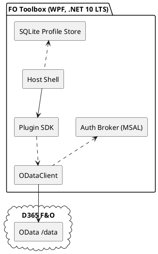

toolbAX

# SPEC-1-FO-Toolbox — “XrmToolBox-style desktop for Dynamics 365 Finance & Operations”

## Background

Consultants, admins, and DevOps engineers working with Dynamics 365 Finance & Operations (F&O) jump between multiple tools (LCS, Data Management, custom scripts, Postman) to handle everyday tasks such as exploring entities, crafting OData queries, and moving data. Dataverse has XrmToolBox; F&O lacks an equivalent, extensible desktop host with a consistent auth model and plugin ecosystem. **FO Toolbox** fills that gap with a Windows desktop app (WPF on .NET 10 LTS) and a plugin SDK. MVP centers on a **FetchXML-Builder-inspired “Query Builder”** for composing and running OData queries, plus CSV export.

---

## Requirements

### Must-have

* Entra ID (OAuth2) auth using MSAL (service principal by default); multiple environment profiles.
* OData client to F&O `/data`:

  * Discover entities and fields via `$metadata`.
  * Build queries with `$select,$filter,$orderby,$top,$skip,$count,$expand(1 level)` and `cross-company`.
  * Preview results with server-driven paging (`@odata.nextLink`).
* **Query Builder plugin** (MVP):

  * Visual designer (entities, fields, filter groups, ordering, paging, expand, cross-company).
  * “Preview” grid; **CSV export** (current page or full dataset).
* Secure profile storage (SQLite + DPAPI-encrypted secrets).
* Plugin model: discover/load/unload versioned plugins; capability-scoped service clients.

### Should-have

* Enum/date helpers and guardrails for unsupported operators.
* Telemetry-free crash logging; optional diagnostics toggle.
* Auto-update of host app.

### Could-have (post-MVP)

* DMF Package Manager (import/export packages).
* Recurring Integrations job helper.
* Database Movement (list/restore backups).
* Data compare across environments.

### Won’t-have (MVP)

* Code sample exports (curl/C#/PowerShell) from Query Builder.
* Deep LCS automation beyond DB movement APIs.

### Non-functional

* Windows 10/11 desktop; MSI installer.
* Memory-safe streaming for large exports; resilient HTTP (retry/timeout/circuit breaker).
* Signed binaries; plugin signature verification.

---

## Method

### Architecture (host + plugins)



**Key components**

* **Host Shell (WPF/MVVM):** plugin discovery, environment/profile management, logging, updates.
* **Plugin SDK (versioned):** narrow surface exposing `IODataClient`, logger, and current environment.
* **Auth Broker (MSAL):** client-credentials by default; interactive optional.
* **ODataClient:** typed calls to `/data`, paging, cross-company, metadata cache.
* **SQLite Profile Store:** environments, service principals, saved queries.

### Plugin SDK (minimal contract)

```csharp
public interface IFoToolPlugin {
  string Id { get; }
  Version Version { get; }
  FoPluginManifest Manifest { get; } // capabilities, minSdk
  Task InitializeAsync(IPluginContext ctx);
  System.Windows.Controls.UserControl CreateTool(); // WPF view
}

public interface IPluginContext {
  FoEnvironment CurrentEnv { get; set; } // baseUrl, tenantId, defaultCompany
  IODataClient OData { get; }
  ILogger Logger { get; }
}
```

**Plugin manifest (embedded)**

```json
{
  "id": "fo.querybuilder",
  "name": "Query Builder",
  "version": "0.1.0",
  "minSdk": "0.1.0",
  "capabilities": ["OData.Read"]
}
```

### Data & secrets

**SQLite schema**

```sql
CREATE TABLE Environments(
  Id TEXT PRIMARY KEY,
  Name TEXT NOT NULL,
  BaseUrl TEXT NOT NULL,         -- e.g., https://<env>.operations.dynamics.com
  TenantId TEXT NOT NULL,
  DefaultCompany TEXT NULL
);
CREATE TABLE ServicePrincipals(
  Id TEXT PRIMARY KEY,
  EnvId TEXT NOT NULL REFERENCES Environments(Id),
  ClientId TEXT NOT NULL,
  AuthMode TEXT NOT NULL,        -- "ClientSecret" | "Certificate"
  SecretRef TEXT NULL,           -- points to SecretVault row
  CertThumbprint TEXT NULL
);
CREATE TABLE SecretVault(
  Id TEXT PRIMARY KEY,
  Kind TEXT NOT NULL,            -- "ClientSecret" | "Pfx"
  Blob BLOB NOT NULL             -- DPAPI-encrypted JSON or PFX
);
CREATE TABLE SavedQuery(
  Id TEXT PRIMARY KEY,
  EnvId TEXT NOT NULL REFERENCES Environments(Id),
  Name TEXT NOT NULL,
  SpecJson TEXT NOT NULL,        -- serialized QuerySpec
  CrossCompany INTEGER NOT NULL, -- 1/0; default 1
  CreatedUtc TEXT NOT NULL,
  UpdatedUtc TEXT NOT NULL
);
```

### Priority plugin: Query Builder (MVP)

**UX**

* Left: **Entities & fields** (from `$metadata`, cached per environment).
* Center: **Filter builder** (AND/OR groups; eq, ne, gt, ge, lt, le, and, or, not; startswith/endswith; “contains” via wildcards).
* Right: **Options** ($select, $orderby, $top/$skip, $count, $expand one level, **cross-company ON by default**).
* Bottom: **Preview grid** (first page; “Load more” follows `@odata.nextLink`); **Export CSV** (page/all).

**Query AST & URL generation**

```csharp
public record QuerySpec(
  string Entity,
  bool CrossCompany,
  string? Company,                 // optional filter
  IReadOnlyList<string> Select,
  OrderBy? OrderBy,
  int? Top, int? Skip,
  Expand? Expand,                  // single level
  FilterNode? Where,
  bool Count
);
```

Algorithm:

1. Base = `$"{BaseUrl}/data/{Entity}"`.
2. Build parameters:

   * `$select` from `Select`.
   * `$filter` from `FilterNode` (with validation).
   * `$orderby`, `$top`, `$skip`, `$count`.
   * `$expand` for one navigation level with nested `$select`.
   * `cross-company=true` if `CrossCompany`; if not, inject company filter or honor `Company`.
3. URL = Base + `?` + `&`-joined parameters (URL-encoded).
4. Execute `GET` with `Authorization: Bearer <token>`; show page; follow `@odata.nextLink` for more.

**Validation rules**

* `$expand` limited to **1** level; show inline warning if user tries deeper.
* “Contains” translates to `'*text*'` wildcard semantics; show hint.
* Disallow unsupported `in/has` operators; provide guided alternatives.
* Ensure full key selection for updates (reserved for post-MVP).

**CSV export (MVP)**

* Current page or **Full result set** (iterate `@odata.nextLink`).
* RFC-4180 quoting; UTF-8 with BOM (Excel-friendly).
* Streamed write (FileStream + buffered writer) to cap memory.
* Large exports use back-pressure: fetch next page only when prior page flushes to disk.

**Resilience**

* HTTP retry with exponential backoff + jitter on 429/5xx.
* Per-call timeouts; circuit breaker for repeated transient failures.
* Respect server-driven paging (F&O caps page size; do not overspecify).

### Prior art (for inspiration & parity goals)

* **XrmToolBox**: plugin catalog, capability scoping, consistent UX patterns.
* **FetchXML Builder** (concept): visual query composition with immediate preview.
* **Recurring Integrations Scheduler**: pragmatic UX for long-running data operations.

FO Toolbox borrows their plugin ergonomics and discoverability while adapting to F&O’s OData capabilities and constraints.

---

## Implementation

### Tech choices

* **Runtime/UI:** .NET 10 LTS, WPF, MVVM (CommunityToolkit.Mvvm).
* **Auth:** MSAL.NET; client-credentials flow (default); optional interactive.
* **Storage:** SQLite (`Microsoft.Data.Sqlite`); DPAPI for secret encryption.
* **HTTP:** `HttpClient` with `ResponseHeadersRead`; resilience via Polly or `Microsoft.Extensions.Http.Resilience`.
* **Packaging:** MSI (WiX Toolset); background updater; signed binaries.

### Step-by-step

1. **Repo bootstrap**

   * Solutions: `FoToolbox.Host`, `FoToolbox.SDK`, `FoToolbox.Core`, `Plugins/QueryBuilder`.
   * Shared versioning (Nerdbank.GitVersioning or MinVer).

2. **Host shell & SDK**

   * Implement plugin discovery (folder + NuGet feed restore).
   * Collectible `AssemblyLoadContext` per plugin; manifest validation; capability checks.

3. **Auth & profiles**

   * Profile CRUD UI; test connection (acquire token → GET `/data`).
   * DPAPI encrypt/decrypt of secrets; export/import profiles (optional).

4. **OData client**

   * `$metadata` loader; cache to SQLite with ETag/version.
   * Request builder for `$select,$filter,$orderby,$top,$skip,$count,$expand(1)`.
   * Handle `@odata.nextLink` and `odata.count`.

5. **Query Builder plugin**

   * Entity/field explorer bound to metadata cache.
   * Filter designer (grouping UI) → AST → URL.
   * **Cross-company default ON**; prominent toggle; “Set as default” in settings.
   * Preview grid with virtualized rows; “Load more”.
   * **CSV export** (page/all) with streaming writer and cancel token.

6. **Resilience & diagnostics**

   * Retry/timeout/circuit breaker policies.
   * Non-PII crash dumps; user-toggle for sharing.

7. **Installer & updates**

   * WiX MSI; code signing; auto-update service with channel selection (stable/beta).

8. **Tests**

   * Unit tests for AST, URL generation, CSV writer (quote/escape cases).
   * Integration tests against a mock OData server + one real sandbox (if available).

### Example: CSV streaming writer (pseudo)

```csharp
await using var fs = new FileStream(path, FileMode.Create, FileAccess.Write, FileShare.None, 1<<20, useAsync:true);
await using var sw = new StreamWriter(fs, new UTF8Encoding(encoderShouldEmitUTF8Identifier:true));

void WriteCell(string s) {
  var needsQuote = s.Contains('"') || s.Contains(',') || s.Contains('\n') || s.Contains('\r');
  if (!needsQuote) { sw.Write(s); return; }
  sw.Write('"');
  sw.Write(s.Replace("\"", "\"\""));
  sw.Write('"');
}

await sw.WriteLineAsync(string.Join(",", columns));
foreach await (var page in odataClient.StreamPagesAsync(url, ct)) {
  foreach (var row in page.Rows) {
    bool first = true;
    foreach (var col in columns) {
      if (!first) sw.Write(',');
      WriteCell(row[col]?.ToString() ?? string.Empty);
      first = false;
    }
    await sw.WriteLineAsync();
  }
  await sw.FlushAsync(); // back-pressure: fetch next page after flush
}
```

---

## Milestones

* **M0 — Foundations locked** *(done)*
* **M1 — Host & SDK skeleton**

  * Hello-plugin loads/unloads; capability gating.
* **M2 — Auth & Profiles**

  * MSAL client-credentials; DPAPI secrets; connection test.
* **M3 — OData client + metadata cache**

  * `$metadata` parse/cache; basic query execution; paging.
* **M4 — Query Builder v1 (core)**

  * UI scaffold; AST; URL generation; cross-company toggle (default ON).
* **M5 — Preview, Paging & CSV export**

  * Virtualized grid; `@odata.nextLink` traversal; CSV (page/all).
* **M6 — Validation & UX polish**

  * Operator guardrails; enum/date helpers; contains/starts/ends hints.
* **M7 — Plugin lifecycle hardening**

  * Signatures; manifest minSdk gating; safe unload; isolation.
* **M8 — Packaging & updates**

  * MSI installer; auto-update; signed release.
* **M9 — Resilience & tests**

  * Retry/timeout/circuit; unit/integration tests; chaos tests.
* **M10 — Beta & docs**

  * Quickstart; admin guide; feedback loop; backlog for vNext plugins.

---

## Gathering Results

**Acceptance for MVP**

* Build a valid cross-company query via UI without reading docs.
* Preview returns first page < 20s on a typical entity.
* **CSV export (all rows)** completes for ≥100k rows with steady memory (< 500 MB).
* Upgrade preserves profiles and saved queries.

**KPIs**

* Time-to-first-result (connect → preview): median < 20s.
* Export throughput: ≥ 3k rows/sec on commodity laptop + sandbox.
* Query validity rate after validation hints: > 95%.
* Crash-free sessions: > 99% over beta.

**Validation plan**

1. Functional: three commonly used entities (e.g., Customers, Vendors, Sales orders); test `$expand` one level.
2. Edge cases: wildcards (“contains”), large `orderby`, `$count=true`, cross-company OFF, company-filtered runs.
3. Performance: 500k+ rows export with streaming; verify back-pressure and retries.
4. Upgrade: install new MSI over existing; ensure no data loss in SQLite.
5. Security: verify no secrets in plaintext; plugin capability enforcement works.